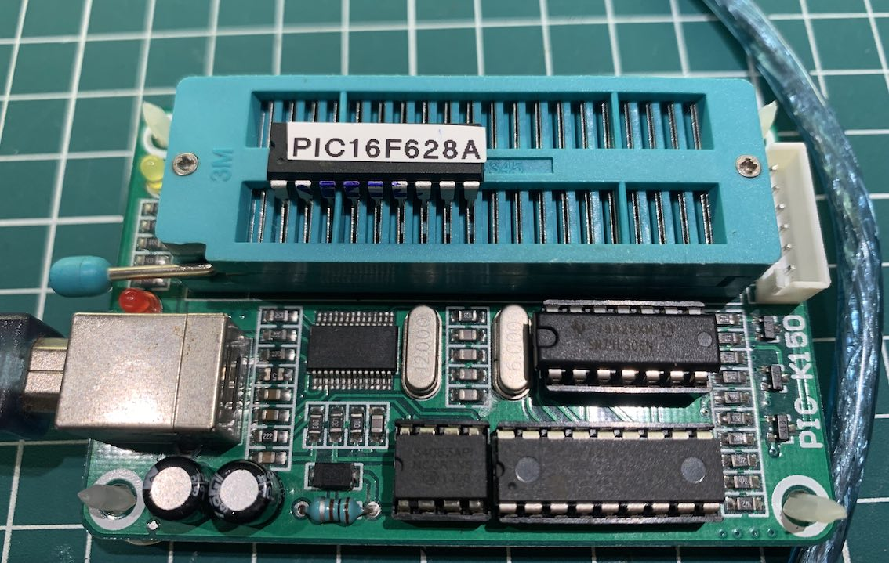
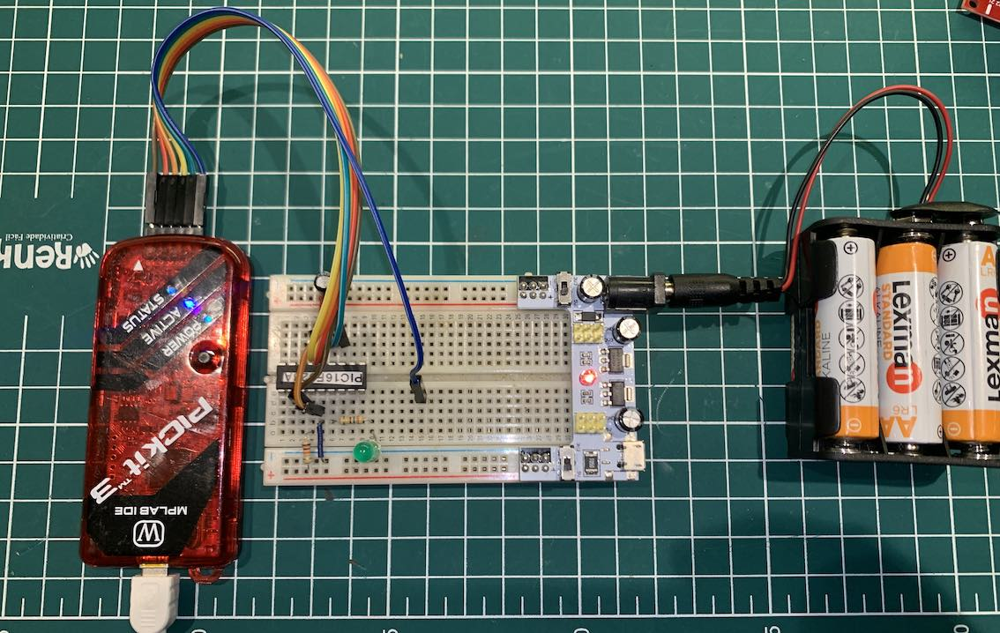
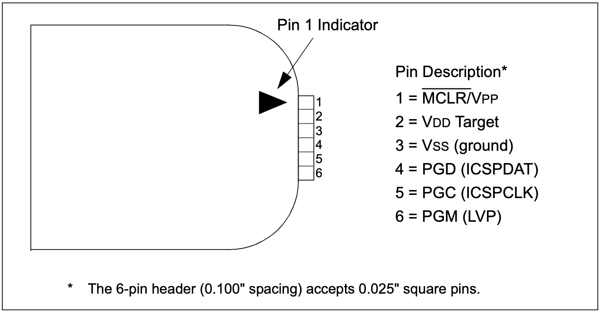
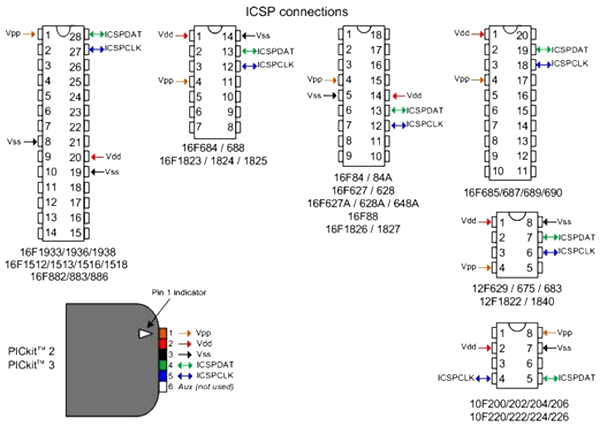

# PIC Journey: Navigating the World of Microchip's Microcontrollers

Welcome to "PIC Journey: Navigating the World of Microchip's Microcontrollers".

In this comprehensive learning series, we invite enthusiasts, students, and professionals alike to embark on an exciting voyage into the intricate world of PIC microcontrollers by Microchip Technology. Whether you're a beginner curious about the fundamentals or a seasoned tinkerer looking to expand your skillset, this journey is tailored for you.

The projects shared in this repository are educational in nature and aim to introduce beginners and hobbyists to C and Assembly programming for PIC10F, PIC12F, and PIC16F microcontrollers. I myself, at the time of writing these lines, fall into the category of a beginner in projects involving Microchip microcontrollers. However, I decided to document this journey. I believe this initiative may help other interested parties who wish to embark on a similar journey.

With that said, **if you find any errors or opportunities for improvement in the projects shared in this repository, please let me know**.

The __projects__ folder contains several projects involving circuits with the PIC16F628A, PIC16F887, PIC12F675, LEDs and sesors that may help beginners. Throughout my learning journey, I made a point of documenting every step of the development of each project, including the source codes. I believe that this detailed documentation can offer the target audience valuable shortcuts for developing more complex projects. The "Content" section below references each project, with links to the full documentation and source codes.

All content (including code and schematic) of this repository can be freely distributed using the MIT Free Software model. By using or installing Library you are agreeing to the terms of the MIT licence (see license.txt file).

Copyright (c) 2024 Ricardo Lima Caratti.

Contact: pu2clr@gmail.com.

## Content 
1. [Contribution](#contribution)
2. [About the author](#about-me)
3. [Projects](./projects/)
    * [Blink a LED - PIC10F200, PIC12F675 and PIC16F628A](./projects/01-Blink/)
    * [Controlling multiple LEDs - PIC12F675 and PIC16F628A](./projects/02-LED_CONTROL/)
    * [PIC microcontrollers with LCD 16x2 - PIC16F](./projects/03-PIC16F_LCD16x2/)
    * [Developing a library for 16x2 LCD - PIC16F](./projects/03-PIC16F_LCD16x2/lcd_library/)
    * [OLED I2C Display (Under construction..)](./projects/04-PIC16F_OLED_I2C/)
    * [DC motor and Cooler and PWM with PIC microcontrollers - PIC16F](./projects/05-PWM-SPEED-COOLER/)
    * [LED RGB PIC16F](./projects/06-LED_RGB/)     
    * [PIC microcontrollers and HC-S04 ultrasonic sensor - PIC10F200, PIC12F675 and PIC16FXXX](./projects/07-HC-S04-URTASONIC/)
    * [PIC microcontrollers and LM35 and TMP36 temperature sensors - PIC12F675 and PIC16F877](./projects/08-LM35_OR_TMP36/)
    * [PIC10F200 and 74HC595 Shift Register device](projects/10-74HC595) 
    * [1-Wire protocol with PIC and DS18B20](projects/12-ONE_WIRE_PROTOCOL)
    * [Single wire protocol](https://github.com/pu2clr/PIC16F/tree/main/projects/13-SINGLE_WIRE_WITH_DHT11)
    * [MQ series gas sensor](https://github.com/pu2clr/PIC16F/tree/main/projects/14-GAS_SENSOR)  
    * [UART and BLUETOOTH](./projects/15-BLUETOOTH_UART/)
    * [Controlling Servo with PIC microcontrollers (PWM)](./projects/16-SERVO/)
    * [Using PUSH BUTTONS with interrupt](./projects/18-PUSH_BUTTON_INTERRUPT/)
    * [PIC and 74HC151 Multiplexer](./projects/19-74HC151_DIGITAL_MULTIPLEXER/)
    * [PIC and 74HC4067 Analog Multiplexer](./projects/20-74HC4067_ANALOG_MULTIPLEXER/)
4. [PIC Microcontroller Programming Tools](https://github.com/pu2clr/PIC16F#pic-microcontroller-programming-tools)
5. [PICKit3 and ICSP](https://github.com/pu2clr/PIC16F#pickit3-and-icsp)
6. [Tips](./Tips/)
7. [References](#general-references)

## Contribution

If you've found value in this repository, please consider contributing. Your support will assist me in acquiring new components and equipment, as well as maintaining the essential infrastructure for the development of future projects. [Click here](https://www.paypal.com/donate/?business=LLV4PHKTXC4JW&no_recurring=0&item_name=Your+support+will+assist+me+in++maintaining+the+essential+infrastructure+for+the+development+of+future+projects.+&currency_code=BRL) to make a donation or scan the QR code provided below. 

## About Me

I hold a Master's degree in Educational Technology from the Federal University of Ceará, where I delved into the ways technology can enhance learning experiences. My passion for computer science led me to specialize in it, focusing on Distributed Systems Development with an Object-Oriented approach, at the University of Brasília. My academic journey began with a Bachelor's degree in Information Systems from the União Pioneira de Integração Social (UPIS-Brasília). Outside the classroom, my main hobbies are electronics and Amateur Radio. 

## PIC Microcontroller Programming Tools

### MPLAB X

MPLAB X is an integrated development environment (IDE) produced by Microchip Technology for the development of embedded applications on PIC microcontrollers. MPLAB X is based on the open-source NetBeans platform and runs on Windows, macOS, and Linux operating systems, offering a versatile and user-friendly interface for developers.

Key features of MPLAB X include:

1. **Cross-Platform Support**: Compatible with multiple operating systems, allowing for a flexible development environment.

2. **Advanced Editor**: Features like code completion, syntax highlighting, and a range of debugging tools aid in efficient code development.

3. **Debugger Integration**: Supports in-circuit debugging and emulation for Microchip's microcontrollers and digital signal controllers.

4. **Project Management Tools**: Simplifies the process of managing multiple project elements, including source files, libraries, and toolchains.

5. **Compiler Integration**: Compatible with Microchip's MPLAB XC Compilers as well as other third-party compilers.

6. **Version Control Support**: Offers support for popular version control systems for collaborative and organized development.

7. **Extensibility**: Users can add new functionality or support for new devices through plugins.

8. **Simulator**: Includes a simulator for virtual testing of code, which is useful for early stage development and troubleshooting.

MPLAB X is widely used by professionals, hobbyists, and students due to its comprehensive features and the broad range of Microchip devices it supports. It's a crucial tool for anyone working on projects involving Microchip's microcontrollers or digital signal controllers.

See [MPLAB® X Integrated Development Environment (IDE)](https://www.microchip.com/en-us/tools-resources/develop/mplab-x-ide)

### K150

The K150 is a low-cost, high-performance PIC programmer. It is designed to support a wide range of popular PIC microcontroller chips. The K150 allows for various operations such as reading, writing, and encryption of the microcontroller's memory. One of its key features is the use of high-speed USB communication, which facilitates faster programming compared to some other programmers like PICSTART. The device's programming speed and quality are reliable, making it a suitable choice for both hobbyists and professionals working with PIC microcontrollers.

To use the K150 PIC programmer, several key components and steps are required:

1. **K150 Programmer Hardware**: The primary device needed is the K150 programmer itself. It's a compact unit designed specifically for programming PIC microcontrollers.

2. **Computer with USB Port**: A computer (Windows-based, typically) with a USB port is required to connect the K150 programmer. The computer acts as the host for the programming software.

3. **Programming Software**: Software compatible with the K150 is needed to interface with the programmer. This software is used to write, read, and transfer the microcontroller code. Popular choices include "PICPgm Programmer" or "Microbrn".

4. **Device Drivers**: Appropriate drivers must be installed on the computer to ensure that the K150 programmer is recognized and can communicate effectively. These drivers are usually available on the website of the K150 manufacturer or from the software provider.

5. **USB Cable**: A USB cable is used to connect the K150 programmer to the computer. This cable is essential for data transfer and powering the device.

6. **PIC Microcontroller**: The specific PIC microcontroller that you intend to program. The K150 supports a wide range of PIC microcontrollers.

7. **Source Code for the PIC**: The actual program or code that you want to write into the PIC microcontroller. This code is written in a suitable programming language, usually Assembly or C.

8. **Basic Knowledge of PIC Programming**: A fundamental understanding of microcontroller programming and operation is necessary to effectively use the K150.

Once everything is set up, the programming process involves connecting the PIC microcontroller to the K150, using the software to load and transfer the code, and then writing the code to the microcontroller's memory. The K150 provides a cost-effective and user-friendly solution for programming PIC microcontrollers, making it a popular choice among hobbyists and educators.

### The image below show the K150 device

### K150 hardware and software external references

* [K150 PIC Programmer](https://www.sigmaelectronica.net/manuals/K150.pdf)
* [PIC K150 ICSP Programmer – PHI1072218](https://www.phippselectronics.com/support/pic-k150-icsp-programmer-phi1072218/)
* [Tutorial](https://youtu.be/CuJEQqz99IQ?si=BY09ux4ct4F9OVSA)

## PICKit3 and ICSP

The PICkit 3 is a programmer and debugger for Microchip's PIC microcontrollers and dsPIC digital signal controllers. It is part of Microchip's suite of tools for developing and debugging embedded systems applications using their microcontrollers. Here are some key features of the PICkit 3:

1. **Compatibility**: The PICkit 3 is compatible with a wide range of PIC microcontrollers and dsPIC digital signal controllers, making it a versatile tool for a broad array of development projects.

2. **USB Interface**: It connects to a PC via USB, providing an easy and convenient way to program and debug microcontrollers without needing an external power supply.

3. **In-Circuit Debugging**: The tool allows for in-circuit debugging, which means you can program, monitor, and debug your code directly on the target device while it is operating within your system. This feature is crucial for real-time testing and troubleshooting.

4. **MPLAB IDE Integration**: It integrates seamlessly with Microchip's MPLAB Integrated Development Environment (IDE), offering a full range of development tools within a single platform. This integration simplifies the programming and debugging process.

5. **Programming**: The PICkit 3 can be used to program microcontrollers with the user's application code. It supports a variety of programming modes and can program memory, EEPROM, and other components of the microcontroller.

6. **Portability**: Its compact size makes it portable and convenient for use in various settings, from development labs to educational environments.

7. **Advanced Features**: It supports advanced features like serial wire debugging and can provide power to the target board if needed.

8. **Target Voltage Range**: The PICkit 3 can support a target voltage range of 2.0V to 6.0V.

Overall, the PICkit 3 is a powerful and versatile tool for anyone working with Microchip's range of microcontrollers and digital signal controllers, from hobbyists and students to professional engineers.

### The image below shows the PICKit3 and ICSP setup

### The image below shows the PICKit3 pinout

Source: [PICkit™ 3 Programmer/Debugger User’s Guide](https://ww1.microchip.com/downloads/en/DeviceDoc/51795B.pdf)

### Other PICKit3 and PIC ICSP setup 

Source: [Pickit 3 Programmer/Debugger](https://components101.com/misc/pickit3-programmer-debugger-pinout-connections-datasheet)

### PICKit3 References

* [PICkit™ 3 Programmer/Debugger User’s Guide](https://ww1.microchip.com/downloads/en/DeviceDoc/51795B.pdf)
* [In-Circuit Serial Programming™ (ICSP™) Guide](https://ww1.microchip.com/downloads/en/DeviceDoc/30277d.pdf)
* [Diagram 01 - ICSP Wiring (PIC Series)](https://www.piccircuit.com/shop/pic-code/120-diagram-01-icsp-wiring-pic-series.html)
* [Pickit 3 Programmer/Debugger](https://components101.com/misc/pickit3-programmer-debugger-pinout-connections-datasheet)

### Other Tools

* [C Compiler Solution Suite](https://www.ccsinfo.com/compilers.php)
* [SourceBoost IDE](http://www.sourceboost.com/CommonDownload.html)
* [MikroElektronika MikroC](https://www.mikroe.com/mikroc-pic)

## Microchip references

* [PIC16F887 Data Sheet](http://ww1.microchip.com/downloads/en/devicedoc/41291d.pdf)
* [PIC16F87XA Data Sheet](https://ww1.microchip.com/downloads/en/devicedoc/39582b.pdf)
* [PIC16F627A/628A/648A Data Sheet](https://ww1.microchip.com/downloads/en/DeviceDoc/40044G.pdf)
* [PIC10F200 Data Sheet](https://ww1.microchip.com/downloads/en/DeviceDoc/40001239F.pdf) 
* [PIC12F675 Data Sheet](https://ww1.microchip.com/downloads/en/devicedoc/41190c.pdf)
* [PIC10F220/222 Data Sheet](https://ww1.microchip.com/downloads/en/DeviceDoc/41270E.pdf)
* [MPLAB® XC8 C Compiler User’s Guide](https://ww1.microchip.com/downloads/en/devicedoc/50002053g.pdf)
* [MPASMTM Assembler, MPLINKTM Object Linker, MPLIBTM Object Librarian User’s Guide](https://ww1.microchip.com/downloads/en/DeviceDoc/33014L.pdf)
* [MPLAB® XC8 PIC® Assembler User's Guide](https://ww1.microchip.com/downloads/en/DeviceDoc/MPLAB%20XC8%20PIC%20Assembler%20User%27s%20Guide%2050002974A.pdf)
* [Simulator](https://onlinedocs.microchip.com/pr/GUID-240F27AA-C615-4705-B68C-6E434B126B47-en-US-1/index.html?GUID-95DA81C7-47DF-4C86-BC12-0D9D018909C3)
* [PICSimLab means Programmable IC Simulator Laboratory ](https://lcgamboa.github.io/picsimlab_docs/stable/Introduction.html#x2-10001)
* [PICSimLab - Programmable IC Simulator Laboratory](https://github.com/lcgamboa/picsimlab)

## General References

* M. P. Bates, Interfacing PIC microcontrollers: Embedded design by interactive simulation. Newnes, 2013.
* F. Pereira, Microcontroladores PIC: programação em C. Saraiva Educação SA, 2007.
* [Experiments with PIC16F628A](http://electronicexperiments.blogspot.com/p/pic16f628a_01.html)
* [PIC®Microcontrollers with Enhanced Mid-Range Core Building Upon a Foundation of Success](https://ww1.microchip.com/downloads/en/DeviceDoc/41382a.pdf)
* [PICmicroTM Mid-Range MCU Family Reference Manual](https://ww1.microchip.com/downloads/en/devicedoc/33023a.pdf)
* [PIC Projects - Site with many nice projects using PIC microcontrollers](https://pic-microcontroller.com/pic-projects/)
* [PIC10F200 - Smallest and cheapest microcontroller - tutorial](https://youtu.be/300HMv6gOs8?si=MKiTwYgLA295LC7H)

## Assembly programming 

* [Assemblers for PIC® and AVR® Microcontrollers](https://microchipdeveloper.com/xwiki/bin/view/software-tools/assemblers/)
* [Assembler Overview](https://onlinedocs.microchip.com/pr/GUID-4DC87671-9D8E-428A-ADFE-98D694F9F089-en-US-3/index.html?GUID-735DF4BA-283D-4CC0-8F76-68482A7E1EC9)
* [MPLAB® XC8 PIC Assembler User's Guide for Embedded Engineers](https://ww1.microchip.com/downloads/en/DeviceDoc/50002994B.pdf)
* [PIC16C5X / PIC16CXXX Math Utility Routines](https://ww1.microchip.com/downloads/en/AppNotes/00526e.pdf)
* [Math Utility Routines](https://ww1.microchip.com/downloads/en/AppNotes/00544d.pdf)
* [Microcontroller Basics - With PIC10F200](https://www.circuitbread.com/tutorials/series/microcontroller-basics)

### Assembly video and tutorial

* [Introduction to the MPLAB® XC8 PIC® Assembler](https://youtu.be/milPwyw3RA8?si=9D5Cmk4DyH4ovw27)
* [PIC Microcontroller Programming - PIC AS Assembler using MPLAB X IDE, Blinking LED](https://youtu.be/b_SBranD1k4?si=3WbB18vzieU9XB75)
* [GNL Project - Youtube Channel with many PIC10F200 project and Assembly programming](https://www.youtube.com/@GNLProject-yp8po/videos)
* [How to Use a Simple Microcontroller Part 1 - An Introduction (PIC10F200)](https://youtu.be/TvsLWEJ4kNI?si=yGt3pLz6990fWD7K)
* [2Bit - PIC10F200 Programming](https://www.youtube.com/@2bit661/videos)
* [PIC assembly programming](https://www.youtube.com/playlist?list=PLJNF9dsTnBxkY6_qYvAMNt5ylCJCMyamE)

