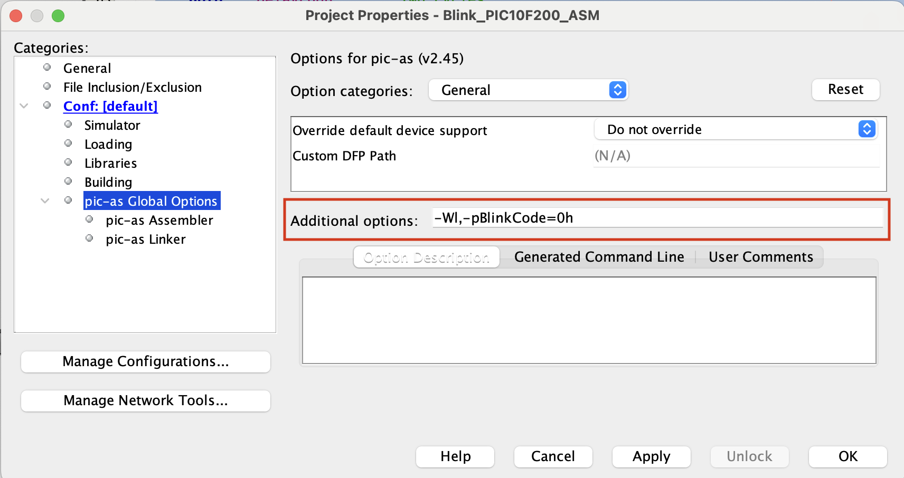

# Assembly Journey 

Although modern C compilers implement excellent optimization techniques (some of which are quite impressive), it's possible that in some very special situations, coding in Assembly language may be more advantageous. Below you have some pros in coding in Assembly. 

**Pros of Assembly:**

1. **Efficiency**: Assembly allows for more efficient use of memory and processing power, which is crucial in resource-constrained environments.
2. **Control**: Provides low-level control of hardware, offering precise manipulation of registers and memory.
3. **Timing**: Enables accurate timing and performance tuning, essential for time-critical applications.

**However, you can face with some cons.**

**Cons of Assembly:**
1. **Complexity**: Writing in Assembly is more complex and time-consuming, requiring detailed knowledge of the microcontroller's architecture.
2. **Maintenance**: Assembly code is harder to read, understand, and maintain, especially for larger projects.
3. **Portability**: Assembly code is processor-specific and not portable across different microcontrollers.

In summary, Assembly is beneficial for highly optimized, resource-constrained, or hardware-specific applications but poses challenges in complexity, maintenance, and portability. C offers a balance of efficiency and ease of use, making it suitable for a broader range of applications.

## Compilling assembly programs for PIC microcontrollers using MPLAB X

You can compile an assembly program for PIC devices using MPLAB X. The steps below show you the actions to do that

1. **Open MPLAB X IDE**: Start MPLAB X IDE on your computer.

2. **Create a New Project**:
   - Select `File` > `New Project`.
   - Choose `Microchip Embedded` under `Categories` and `Standalone Project` under `Projects`. Click `Next`.
   - Select the  PIC microcontroller you are using (for example: PIC16F628A) from the device list. Click `Next`.
   - Choose your connected programmer or debugger (if you have one). Click `Next`.
   - For the compiler toolchain, select `PIC-AS`. Click `Next`.
   - Name your project and choose a project location. Click `Finish`.

3. **Add Assembly File to the Project**:
   - Right-click on the `Source Files` in the `Project` window.
   - Choose `New` > `ASM File` to create a new assembly file or `Add Existing Item` to add an existing .asm file.
   - Write or paste your assembly code into this file.

4. **Build and Load the Project**:
   - Connect your PIC microcontroller to the programmer (for example PICKit3).
   - Click on the `Build Project` button (the hammer icon) in the toolbar, or right-click on your project and select `Build`.
   - CLick in Make and Program Device 


```asm

; PIC16F628A Configuration Bit Settings
; Assembly source line config statements
;    
; Author: Ricardo Lima Caratti - Jan/2024
;    
#include <xc.inc>
    
; CONFIG
  CONFIG  FOSC = INTOSCIO       ; Internal oscilator
  CONFIG  WDTE = OFF            ; Watchdog Timer Disable bit 
  CONFIG  PWRTE = OFF           ; Power-up Timer Enable bit (PWRT disabled)
  CONFIG  MCLRE = ON            ; RA5/MCLR/VPP Pin Function Select bit (RA5/MCLR/VPP pin function is MCLR)
  CONFIG  BOREN = ON            ; Brown-out Detect Enable bit (BOD enabled)
  CONFIG  LVP = OFF             ; Low-Voltage Programming Disable bit (RB4/PGM 
  CONFIG  CPD = OFF             ; Data EE Memory Code Protection bit (Data memory code protection off)
  CONFIG  CP = OFF              ; Flash Program Memory Code Protection bit (Code protection off)

; declare your variables here
var1 equ 0x20       ; Memory position (check the memory organization of your PIC device datasheet)
var2 equ 0x21       ;
    
PSECT resetVector, class=CODE, delta=2
resetVect:
    PAGESEL main
    goto main
PSECT code, delta=2
main:
    bsf STATUS, 5	; Select the Bank 1 - See PIC16F627A/628A/648A Data Sheet, page 20 and 21 (MEMORY ORGANIZATION)
    clrf PORTB		; Initialize PORTB by setting output data latches
    bcf STATUS, 5	; Return to Bank 0  

    ; example of using var 
    movlw 10
    movwf var1
    movlw 250
    movlw var2
    ;

loop:			    ; Endless loop
    ;
    ; Your application
    ;
    goto loop
     
    ;
    ; Your subroutines
    ;  

END resetVect

```

## Example - BLINK a LED with the PIC16F628A

```cpp


; PIC16F628A Configuration Bit Settings
; Assembly source line config statements
;    
; Author: Ricardo Lima Caratti - Jan/2024
;    
#include <xc.inc>
    
; CONFIG
  CONFIG  FOSC = INTOSCIO       ; Oscillator Selection bits (INTOSC oscillator: I/O function on RA6/OSC2/CLKOUT pin, I/O function on RA7/OSC1/CLKIN)
  CONFIG  WDTE = OFF            ; Watchdog Timer disable bit 
  CONFIG  PWRTE = OFF           ; Power-up Timer Enable bit (PWRT disabled)
  CONFIG  MCLRE = ON            ; RA5/MCLR/VPP Pin Function Select bit (RA5/MCLR/VPP pin function is MCLR)
  CONFIG  BOREN = ON            ; Brown-out Detect Enable bit (BOD enabled)
  CONFIG  LVP = OFF             ; Low-Voltage Programming disble
  CONFIG  CPD = OFF             ; Data EE Memory Code Protection bit (Data memory code protection off)
  CONFIG  CP = OFF              ; Flash Program Memory Code Protection bit (Code protection off)

// config statements should precede project file includes.

dummy1 equ 0x20
dummy2 equ 0x21
dummy3 equ 0x22 
  
PSECT resetVector, class=CODE, delta=2
resetVect:
    PAGESEL main
    goto main
PSECT code, delta=2
main:
    bsf STATUS, 5	; Select the Bank 1 - See PIC16F627A/628A/648A Data Sheet, page 20 and 21 (MEMORY ORGANIZATION)
    clrf PORTB		; Initialize PORTB by setting output data latches
    clrf TRISB
    bcf STATUS, 5	; Return to Bank 0
    CLRW		    ; Clear W register
    movwf PORTB		; Turn all pins of the PORTB low    
loop:			; Loop without a stopping condition - here is your application code
    bsf PORTB, 3    ; Sets RB3 to high (turn the LED on)
    call Delay
    bcf PORTB, 3    ; Sets RB3 to low (turn the LED off) 
    call Delay
    goto loop


; ******************
; Delay function
;
; For an oscillator of 4MHz a regular instructions takes 1us (See pic16f628a Datasheet, page 117).      
; So, at 4MHz, it takes about: (5 cycles) * 255 * 255 * 3 * 0.000001 (second)  
; It is about 1s (0.975 s)    
Delay:  
    movlw   255
    movwf   dummy1
    movwf   dummy2
    movlw   3
    movwf   dummy3
DelayLoop:    
    nop
    nop
    decfsz dummy1, f		; dummy1 = dumm1 - 1; if dummy1 = 0 then dummy1 = 255
    goto DelayLoop
    decfsz dummy2, f		; dummy2 = dummy2 - 1; if dummy2 = 0 then dummy2 = 255
    goto DelayLoop
    decfsz dummy3, f        ; dummy3 = dummy3 - 1; if dummy3 = 0 return		 
    goto DelayLoop
    return 
    
END resetVect
    


```


## PIC10F200 - Basic Assembly code


### Main PIC10F200 instructions set

| Mnemonic | Description                                          | Operands | Affects |
|----------|------------------------------------------------------|----------|---------|
| `ADDWF`  | Add W and file register                              | f, d     | Z, C, DC|
| `ANDWF`  | AND W with file register                             | f, d     | Z       |
| `ANDLW`  | AND literal with W                                   | -        | Z       | 
| `CLRF`   | Clear file register                                  | f        | Z       |
| `CLRW`   | Clear W                                              | -        | Z       |
| `COMF`   | Complement file register                             | f, d     | Z       |
| `DECF`   | Decrement file register                              | f, d     | Z       |
| `DECFSZ` | Decrement file register, skip if 0                   | f, d     | -       |
| `INCF`   | Increment file register                              | f, d     | Z       |
| `INCFSZ` | Increment file register, skip if 0                   | f, d     | -       |
| `IORWF`  | Inclusive OR W with file register                    | f, d     | Z       |
| `MOVF`   | Move file register                                   | f, d     | Z       |
| `MOVWF`  | Move W to file register                              | f        | -       |
| `NOP`    | No operation                                         | -        | -       |
| `RLF`    | Rotate left file register through Carry              | f, d     | C       |
| `RRF`    | Rotate right file register through Carry             | f, d     | C       |
| `SUBWF`  | Subtract W from file register                        | f, d     | Z, C, DC|
| `SWAPF`  | Swap nibbles in file register                        | f, d     | -       |
| `XORWF`  | Exclusive OR W with file register                    | f, d     | Z       |
| `BCF`    | Bit clear file register                              | f, b     | -       |
| `BSF`    | Bit set file register                                | f, b     | -       |
| `BTFSC`  | Bit test file register, skip if clear                | f, b     | -       |
| `BTFSS`  | Bit test file register, skip if set                  | f, b     | -       |
| `CALL`   | Call subroutine                                      | k        | -       |
| `GOTO`   | Go to address                                        | k        | -       |
| `RETLW`  | Return from subroutine with literal in W             | k        | -       |
| `OPTION` | Load OPTION register                                 | -        | -       |
| `SLEEP`  | Go into Standby mode                                 | -        | -       |  
| `TRIS`   | Load TRIS register                                   | -        | -       |


- **f** represents the file register address to which the operation is applied.
- **d** is the destination of the operation result; can be 0 (the result is stored in W) or 1 (the result is stored back in f).
- **b** is the bit number within the file register f to which the bit operation is applied.
- **k** is a literal value or address used in jump and call operations.
- **Affects** indicates which Status Register bits are affected: Z (Zero), C (Carry), DC (Digit Carry).


**IMPORTANT:** To assemble this code correctly, please follow the steps below:

1. Go to "Project Properties" in MPLAB X.
2. Select "Global Options" for the pic-as assembler/compiler.
3. In the "Additional Options" box, enter the following parameters: **-Wl,-pBlinkCode=0h**



```asm
;
; IMPORTANT: To assemble this code correctly, please follow the steps below:
; 1. Go to "Project Properties" in MPLAB X.
; 2. Select "Global Options" for the pic-as assembler/compiler.
; 3. In the "Additional Options" box, enter the following parameters:
; -Wl,-pBlinkCode=0h
    
#include <xc.inc>

; CONFIG
  CONFIG  WDTE = OFF           ; Watchdog Timer (WDT disabled)
  CONFIG  CP = OFF             ; Code Protect (Code protection off)
  CONFIG  MCLRE = ON	       ; Master Clear Enable (GP3/MCLR pin function  is MCLR)

  
; Declare your variables here

workValue1  equ	0x10    
workValue2  equ 0x11		

 
PSECT BlinkCode, class=CODE, delta=2

MAIN:
    ; GPIO and registers setup
    clrf   GPIO		    ; Sets all GPIO pins as output
    clrw
    TRIS   GPIO
    
MainLoop:		    ; Endless loop
 
    movlw   10
    movwf   workValue1
    call    funcX
 
    goto    MainLoop
    
    
; *********** Divide ***************
; Divides workValue1 by workValue2 
; Returns the result in workValue2    
;     
Func: 
    movlw   5
    addwf   workValue, f
    retlw   0    
    
END MAIN

```


##  PIC10F200 - Indirect Addressing with INDF and FSR Registers


```asm
; PIC10F200
;
; IMPORTANT: To assemble this code correctly, please follow the steps below:
; 1. Go to "Project Properties" in MPLAB X.
; 2. Select "Global Options" for the pic-as assembler/compiler.
; 3. In the "Additional Options" box, enter the following parameters:
; -Wl,-pBlinkCode=0h
    
#include <xc.inc>

; CONFIG
  CONFIG  WDTE = OFF           ; Watchdog Timer (WDT disabled)
  CONFIG  CP = OFF             ; Code Protect (Code protection off)
  CONFIG  MCLRE = ON	       ; Master Clear Enable (GP3/MCLR pin function  is MCLR)

  
; Declare your variables here

AA1 equ 0x10
AA2 equ 0X11
AA3 equ 0x12 
AA4 equ	0x13
i   equ	0x14 

 
PSECT BlinkCode, class=CODE, delta=2

MAIN:
    clrf   GPIO		    ; Sets all GPIO pins as output
    clrw
    TRIS   GPIO
   
MainLoop:		        ; Endless loop
    movlw   4
    movwf   i
    movlw   AA1       
    movwf   FSR         ; FSR register has now the point to AA1 (0x10) 
    movlw   255         ; Will store 255 in AA1, AA2, AA3 and AA4
INIT_ARRAY:
    movwf   INDF        ; stores 255 in AAx where x is the current point stored in FSR    	    
    incf    FSR         ; Points to the next memory position 
    bcf	    STATUS, 0   ; 
    decfsz  i,f
    goto    INIT_ARRAY
    nop                 ; Check AA1, AA2, AA3 and AA4 content here
    goto    MainLoop
 
   
END MAIN

```


### PICF10200 - Multiply two 8 bits integers.


```asm 

; PIC10F200
; Very basic multiplication example
; IMPORTANT: To assemble this code correctly, please follow the steps below:
; 1. Go to "Project Properties" in MPLAB X.
; 2. Select "Global Options" for the pic-as assembler/compiler.
; 3. In the "Additional Options" box, enter the following parameters:
; -Wl,-pBlinkCode=0h
    
#include <xc.inc>

; CONFIG
  CONFIG  WDTE = OFF           ; Watchdog Timer (WDT disabled)
  CONFIG  CP = OFF             ; Code Protect (Code protection off)
  CONFIG  MCLRE = ON	       ; Master Clear Enable (GP3/MCLR pin function  is MCLR)

  
; Declare your variables here

op1 equ	0x10
op2 equ	0x11 
 
PSECT BlinkCode, class=CODE, delta=2

MAIN:
    clrf   GPIO		    ; Sets all GPIO pins as output
    clrw
    TRIS   GPIO
MainLoop:		    ; Endless loop
  
    movlw   3
    movwf   op1
    movlw   29
    movwf   op2
    call    MULTIPLAY8
    nop                 ; Check the op2 value here. Shoud have 87. 
    goto    MainLoop
 
; Multiply op1 (8 bits) by op2 (8 bis)
; The result is stored in op2.
; It does not check overflow. So, it does not work when the result is greater than 255.     
MULTIPLAY8:
    movf    op2,w
    decf    op1
MULTIPLAY8_LOOP: 
    addwf   op2,f
    decfsz  op1,f 
    goto    MULTIPLAY8_LOOP
    retlw   0
    
END MAIN


```


### Divider example

UNDER CONSTRUCTION...


## References

* [MPLAB® XC8 PIC® Assembler User's Guide](https://ww1.microchip.com/downloads/en/DeviceDoc/MPLAB%20XC8%20PIC%20Assembler%20User%27s%20Guide%2050002974A.pdf)
* [PIC Assembler Tips](http://picprojects.org.uk/projects/pictips.htm)
* [Multibyte Arithmetic Assembly Library for PIC Microcontrollers - Code Generator](http://avtanski.net/projects/math/#det_m_div)
* [PIC Microcontoller Basic Math Methods](http://www.piclist.com/techref/microchip/math/basic.htm)
* [PIC Microcontroller Comparison Math Methods ](http://www.piclist.com/techref/microchip/compcon.htm)
* [PIC Microcontroller Tutorial / Good Programming Techniques](https://www.hobbyprojects.com/pic_tutorials/tutorial1.html)
* [PIC16C5X / PIC16CXXX Math Utility Routines](https://ww1.microchip.com/downloads/en/AppNotes/00526e.pdf)
* [Multi-byte Math on the 16Fxxx PIC chips](http://robotics.mcmanis.com/articles/20130117_pic_math.html)


### Videos

* [Arithmetic Instructions in PIC microcontrollers](https://youtu.be/8MlblPanBkM?si=IrNt-micQv_Jx01z)
* [PIC16F877 Arithmetic and Logical Operations](https://youtu.be/qFKnzxdRy2s?si=KYq55EuB7RzuePws)
* [Arithmetic Operations using PIC16F877A (Addition and Subtraction)](https://youtu.be/j5A6LC_kk20?si=RFDxYFWGeiH1amwl)

