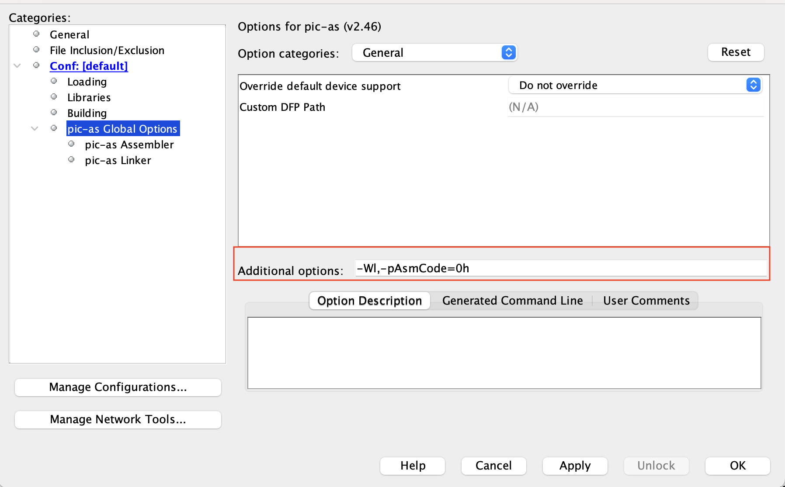

# Assembly Journey 

Although modern C compilers implement excellent optimization techniques (some of which are quite impressive), it's possible that in some very special situations, coding in Assembly language may be more advantageous. Below you have some pros in coding in Assembly. 

**Pros of Assembly:**

1. **Efficiency**: Assembly allows for more efficient use of memory and processing power, which is crucial in resource-constrained environments.
2. **Control**: Provides low-level control of hardware, offering precise manipulation of registers and memory.
3. **Timing**: Enables accurate timing and performance tuning, essential for time-critical applications.

**However, you can face with some cons.**

**Cons of Assembly:**
1. **Complexity**: Writing in Assembly is more complex and time-consuming, requiring detailed knowledge of the microcontroller's architecture.
2. **Maintenance**: Assembly code is harder to read, understand, and maintain, especially for larger projects.
3. **Portability**: Assembly code is processor-specific and not portable across different microcontrollers.

In summary, Assembly is beneficial for highly optimized, resource-constrained, or hardware-specific applications but poses challenges in complexity, maintenance, and portability. C offers a balance of efficiency and ease of use, making it suitable for a broader range of applications.


## Content

1. [Compilling assembly programs for PIC microcontrollers using MPLAB X](#compilling-assembly-programs-for-pic-microcontrollers-using-mplab-x)
2. [Screenshots showing the Assembly Project Setup sequence for the PIC10F200 microcontroller.](#screenshots-showing-the-assembly-project-setup-sequence-for-the-pic10f200-microcontroller)
3. [PIC10F200 - Basic Assembly](#pic10f200---basic-assembly)
4. [Main PIC10F200 instructions set](#main-pic10f200-instructions-set)
5. [PIC10F200 Assembly code template](#pic10f200-assembly-code-template)
6. [PIC10F200 - Indirect Addressing with INDF and FSR Registers](#pic10f200---indirect-addressing-with-indf-and-fsr-registers)
7. [Multiplication and Division](#multiplication-and-division)
8. [Interrupt - PIC12F675 and interrupt setup ](#pic12f675-and-interrupt-setup)
8. [References](#references)

## Compilling assembly programs for PIC microcontrollers using MPLAB X

You can compile an assembly program for PIC devices using MPLAB X. The steps below show you the actions to do that

1. **Open MPLAB X IDE**: Start MPLAB X IDE on your computer.

2. **Create a New Project**:
   - Select `File` > `New Project`.
   - Choose `Microchip Embedded` under `Categories` and `Standalone Project` under `Projects`. Click `Next`.
   - Select the  PIC microcontroller you are using (for example: PIC16F628A) from the device list. Click `Next`.
   - Choose your connected programmer or debugger (if you have one). Click `Next`.
   - For the compiler toolchain, select `PIC-AS`. Click `Next`.
   - Name your project and choose a project location. Click `Finish`.

3. **Add Assembly File to the Project**:
   - Right-click on the `Source Files` in the `Project` window.
   - Choose `New` > `ASM File` to create a new assembly file or `Add Existing Item` to add an existing .asm file.
   - Write or paste your assembly code into this file.

4. **Build and Load the Project**:
   - Connect your PIC microcontroller to the programmer (for example PICKit3).
   - Click on the `Build Project` button (the hammer icon) in the toolbar, or right-click on your project and select `Build`.
   - CLick in Make and Program Device 


## Screenshots showing the Assembly Project Setup sequence for the PIC10F200 microcontroller.





## PIC10F200 - Basic Assembly 

Learning assembly language for the PIC10F200 might seem old-fashioned, but it's a valuable way to boost your programming skills. This microcontroller has limited space and resources: just 256 words of program memory, 16 bytes of SRAM data memory, and a two-level hardware stack. These limits push you to think outside the box and come up with smart, efficient ways to code.

This challenge helps you really understand how microcontrollers work. You learn to make applications that do a lot with a little, which is a key skill. Plus, knowing assembly language gives you direct control over the hardware. This can make your code run faster and respond quicker, which is very important for projects that need to get the most out of their limited resources.

Also, being good at assembly language helps you with higher-level programming too. It gives you a strong base for understanding how software and hardware interact. This knowledge is useful across many different programming tasks, making your code better no matter what language you're using.

In short, learning assembly language for the PIC10F200 is more than just learning an old programming style. It's about becoming a better programmer by understanding the basics of how computers work, finding creative solutions within limits, and writing efficient, effective code.


### Main PIC10F200 instructions set

| Mnemonic | Description                                          | Operands | Affects |
|----------|------------------------------------------------------|----------|---------|
| `ADDWF`  | Add W and file register                              | f, d     | Z, C, DC|
| `ANDWF`  | AND W with file register                             | f, d     | Z       |
| `ANDLW`  | AND literal with W                                   | -        | Z       | 
| `CLRF`   | Clear file register                                  | f        | Z       |
| `CLRW`   | Clear W                                              | -        | Z       |
| `COMF`   | Complement file register                             | f, d     | Z       |
| `DECF`   | Decrement file register                              | f, d     | Z       |
| `DECFSZ` | Decrement file register, skip if 0                   | f, d     | -       |
| `INCF`   | Increment file register                              | f, d     | Z       |
| `INCFSZ` | Increment file register, skip if 0                   | f, d     | -       |
| `IORWF`  | Inclusive OR W with file register                    | f, d     | Z       |
| `MOVF`   | Move file register                                   | f, d     | Z       |
| `MOVWF`  | Move W to file register                              | f        | -       |
| `NOP`    | No operation                                         | -        | -       |
| `RLF`    | Rotate left file register through Carry              | f, d     | C       |
| `RRF`    | Rotate right file register through Carry             | f, d     | C       |
| `SUBWF`  | Subtract W from file register                        | f, d     | Z, C, DC|
| `SWAPF`  | Swap nibbles in file register                        | f, d     | -       |
| `XORWF`  | Exclusive OR W with file register                    | f, d     | Z       |
| `BCF`    | Bit clear file register                              | f, b     | -       |
| `BSF`    | Bit set file register                                | f, b     | -       |
| `BTFSC`  | Bit test file register, skip if clear                | f, b     | -       |
| `BTFSS`  | Bit test file register, skip if set                  | f, b     | -       |
| `CALL`   | Call subroutine                                      | k        | -       |
| `GOTO`   | Go to address                                        | k        | -       |
| `RETLW`  | Return from subroutine with literal in W             | k        | -       |
| `OPTION` | Load OPTION register                                 | -        | -       |
| `SLEEP`  | Go into Standby mode                                 | -        | -       |  
| `TRIS`   | Load TRIS register                                   | -        | -       |


- **f** represents the file register address to which the operation is applied.
- **d** is the destination of the operation result; can be 0 (the result is stored in W) or 1 (the result is stored back in f).
- **b** is the bit number within the file register f to which the bit operation is applied.
- **k** is a literal value or address used in jump and call operations.
- **Affects** indicates which Status Register bits are affected: Z (Zero), C (Carry), DC (Digit Carry).


**IMPORTANT:** To assemble code correctly using MPLAB-X and the PIC10F200, please follow the steps below:

1. Go to "Project Properties" in MPLAB X.
2. Select "Global Options" for the pic-as assembler/compiler.
3. In the "Additional Options" box, enter the following parameters: **-Wl,-pAsmCode=0h**


### PIC10F200 Assembly code template


```asm
;
; IMPORTANT: If you are using the PIC10F200, to assemble this code correctly, please follow the steps below:
; 1. Go to "Project Properties" in MPLAB X.
; 2. Select "Global Options" for the pic-as assembler/compiler.
; 3. In the "Additional Options" box, enter the following parameters:
; -Wl,-pAsmCode=0h
    
#include <xc.inc>

; CONFIG
  CONFIG  WDTE = OFF           ; Watchdog Timer (WDT disabled)
  CONFIG  CP = OFF             ; Code Protect (Code protection off)
  CONFIG  MCLRE = ON	       ; Master Clear Enable (GP3/MCLR pin function  is MCLR)

  
; Declare your variables here

workValue1  equ	0x10    
workValue2  equ 0x11		

 
PSECT AsmCode, class=CODE, delta=2

MAIN:
    ; GPIO and registers setup
    clrf   GPIO		    ; Sets all GPIO pins as output
    clrw
    TRIS   GPIO
    
MainLoop:		    ; Endless loop
 
    movlw   10
    movwf   workValue1
    call    Func
 
    goto    MainLoop
    
    
; *********** Divide ***************
; Divides workValue1 by workValue2 
; Returns the result in workValue2    
;     
Func: 
    movlw   5
    addwf   workValue1, f
    retlw   0    
    
END MAIN


```


##  PIC10F200 - Indirect Addressing with INDF and FSR Registers


```asm
; PIC10F200
;
; IMPORTANT: If you are using the PIC10F200, to assemble this code correctly, please follow the steps below:
; 1. Go to "Project Properties" in MPLAB X.
; 2. Select "Global Options" for the pic-as assembler/compiler.
; 3. In the "Additional Options" box, enter the following parameters:
; -Wl,-pAsmCode=0h
    
#include <xc.inc>

; CONFIG
  CONFIG  WDTE = OFF           ; Watchdog Timer (WDT disabled)
  CONFIG  CP = OFF             ; Code Protect (Code protection off)
  CONFIG  MCLRE = ON	       ; Master Clear Enable (GP3/MCLR pin function  is MCLR)

  
; Declare your variables here

AA1 equ 0x10
AA2 equ 0X11
AA3 equ 0x12 
AA4 equ	0x13
i   equ	0x14 

 
PSECT AsmCode, class=CODE, delta=2

MAIN:
    clrf   GPIO		    ; Sets all GPIO pins as output
    clrw
    TRIS   GPIO
   
MainLoop:		        ; Endless loop
    movlw   4
    movwf   i
    movlw   AA1       
    movwf   FSR         ; FSR register has now the point to AA1 (0x10) 
    movlw   255         ; Will store 255 in AA1, AA2, AA3 and AA4
INIT_ARRAY:
    movwf   INDF        ; stores 255 in AAx where x is the current point stored in FSR    	    
    incf    FSR         ; Points to the next memory position 
    bcf	    STATUS, 0   ; 
    decfsz  i,f
    goto    INIT_ARRAY
    nop                 ; Check AA1, AA2, AA3 and AA4 content here
    goto    MainLoop
 
   
END MAIN

```

## Multiplication and Division 


Multiplication and division by 2 can be solved very efficiently (with only one machine cycle) using the instructions RLF (multiplication by 2) and RRL (division by 2). Of course, multiplication and division operations with 4, 8, 16, etc., can be constructed using the same approach.


#### Multiplication by 2

```asm

bcf     STATUS, 0
rlf     op1         ; op1 = op1 * 2

```

#### Division by 2 

```asm

bcf     STATUS,0
rrl     op1         ; op1 = op1 / 2   

```


For multiplications and divisions involving a multiplier and denominator, respectively, other than 2, 4, 8, 16, etc., it will be necessary to use other approaches. The following are very basic examples of multiplication and division.


### PIC10F200 - Very basic multiplication of two 8 bits integers.


Remember, if the multiplication is by 2, 4, 8, 16, etc., use the RLF instruction instead of calling this or another function to divide.


```asm 

; PIC10F200
; Very basic multiplication example
; IMPORTANT: If you are using the PIC10F200, To assemble this code correctly, please follow the steps below:
; 1. Go to "Project Properties" in MPLAB X.
; 2. Select "Global Options" for the pic-as assembler/compiler.
; 3. In the "Additional Options" box, enter the following parameters:
; -Wl,-pAsmCode=0h
    
#include <xc.inc>

; CONFIG
  CONFIG  WDTE = OFF           ; Watchdog Timer (WDT disabled)
  CONFIG  CP = OFF             ; Code Protect (Code protection off)
  CONFIG  MCLRE = ON	       ; Master Clear Enable (GP3/MCLR pin function  is MCLR)

  
; Declare your variables here

op1 equ	0x10
op2 equ	0x11 
 
PSECT AsmCode, class=CODE, delta=2

MAIN:
    clrf   GPIO		    ; Sets all GPIO pins as output
    clrw
    TRIS   GPIO
MainLoop:		    ; Endless loop
  
    movlw   3
    movwf   op1
    movlw   29
    movwf   op2
    call    MULTIPLAY8
    nop                 ; Check the op2 value here. Should have 87. 
    goto    MainLoop
 
; Multiply op1 (8 bits) by op2 (8 bits)
; The result is stored in op2.
; It does not check overflow. So, it does not work when the result is greater than 255.     
MULTIPLAY8:
    movf    op2,w
    decf    op1
MULTIPLAY8_LOOP: 
    addwf   op2,f
    decfsz  op1,f 
    goto    MULTIPLAY8_LOOP
    retlw   0
    
END MAIN


```


### PIC10F200 - Very basic division of two 8 bits integers.

Remember, if the division is by 2, 4, 8, 16, etc., use the RRF instruction instead of calling this or another function to divide. 


```asm 

;
; IMPORTANT: If you are using the PIC10F200, to assemble this code correctly, please follow the steps below:
; 1. Go to "Project Properties" in MPLAB X.
; 2. Select "Global Options" for the pic-as assembler/compiler.
; 3. In the "Additional Options" box, enter the following parameters:
; -Wl,-pAsmCode=0h
    
#include <xc.inc>

; CONFIG
  CONFIG  WDTE = OFF           ; Watchdog Timer (WDT disabled)
  CONFIG  CP = OFF             ; Code Protect (Code protection off)
  CONFIG  MCLRE = ON	       ; Master Clear Enable (GP3/MCLR pin function  is MCLR)

  
; Declare your variables here

op1	equ    0x10    
op2	equ    0x11
result  equ    0x12	

 
PSECT AsmCode, class=CODE, delta=2

MAIN:
    ; GPIO and registers setup
    clrf   GPIO		    ; Sets all GPIO pins as output
    clrw
    TRIS   GPIO
    
MainLoop:		    ; Endless loop
 
    movlw   35
    movwf   op1
    movlw   3
    movwf   op2
    call    DIVIDE8
    nop     ; check result and op1 registers here 
 
    goto    MainLoop
    
    
; *********** Divide ***************
; Divides op1 by op2 (8 bits integers)
;     
; Returns 
;     result  - integer part of op1 / op2 
;     op1     - rest of division	  
;     
DIVIDE8: 
    clrf    result
    movf    op2, w
DIVIDE8_LOOP: 
    incf    result
    subwf   op1,f
    btfsc   STATUS, 0 
    goto    DIVIDE8_LOOP
    decf    result
    addwf   op1
    retlw   0
 
END MAIN


```


## PIC12F675 and interrupt setup 


I couldn't find clear documentation on how to configure the interrupt service using "pic-as". Therefore, I attempted various configurations so that the occurrence of a desired interrupt would redirect the program flow to address 4h (as described in the PIC12F675 Data Sheet). I didn't find an Assembly directive that would instruct the assembler to start the interrupt code at address 4h (the ORG directive didn't seem to work). However, this was made possible by adding special parameters in the project settings/properties, as shown below. Go to properties and set the pic-as **Additional Options: -Wl,-PresetVec=0x0,-PisrVec=0x04**.  Where **resetVec** and **isrVec** are indentifiers declared in Assembly code.   The image below shows that setup. 
 


```asm


; Interrupt setup example in PIC-AS
; Author: Ricardo Lima Caratti
; Jan/2024
    
#include <xc.inc>
 
; CONFIG
  CONFIG  FOSC = INTRCIO        ; Oscillator Selection bits (INTOSC oscillator: I/O function on GP4/OSC2/CLKOUT pin, I/O function on GP5/OSC1/CLKIN)
  CONFIG  WDTE = OFF            ; Watchdog Timer Enable bit (WDT disabled)
  CONFIG  PWRTE = OFF           ; Power-Up Timer Enable bit (PWRT disabled)
  CONFIG  MCLRE = ON            ; GP3/MCLR pin function select (GP3/MCLR pin function is MCLR)
  CONFIG  BOREN = ON            ; Brown-out Detect Enable bit (BOD enabled)
  CONFIG  CP = OFF              ; Code Protection bit (Program Memory code protection is disabled)
  CONFIG  CPD = OFF             ; Data Code Protection bit (Data memory code protection is disabled) 
  
; declare your variables here

auxValue    equ 0x20		; counter 1
adcValueL   equ 0x21		; 8 bits less significant value of the adc
adcValueH   equ 0x22		; 8 bits most significant value of the adc
pwm	    equ	0x23   
   	    
PSECT resetVec, class=CODE, delta=2 
ORG 0x0000	    
resetVect:
    PAGESEL main
    goto main
;
; INTERRUPT IMPLEMENTATION 
; THIS FUNCTION WILL BE CALLED EVERY TMR0 Overflow
; pic-as Additiontal Options: -Wl,-PresetVec=0x0,-PisrVec=0x04    
PSECT isrVec, class=CODE, delta=2
ORG 0x0004     
isrVec:  
    PAGESEL interrupt
    goto interrupt
  
interrupt: 
   
    bcf	    STATUS, 5
    
    bcf	    INTCON, 7	; Disables GIE
    
    ; check if the interrupt was trigged by Timer0	
    btfss   INTCON, 2	; INTCON - T0IF: TMR0 Overflow Interrupt Flag 
    goto    PWM_FINISH
    btfss   GPIO, 5	; 
    goto    PWM_LOW 
    goto    PWM_HIGH
PWM_LOW: 
    movlw   255
    movwf   auxValue
    movf    pwm, w
    subwf   auxValue, w
    movwf   TMR0
    bsf	    GPIO, 5	    ; GP5 = 1
    goto    PWM_T0IF_CLR
PWM_HIGH: 
    movf    pwm, w
    movwf   TMR0 
    bcf	    GPIO, 5	    ; GP5 = 0   
PWM_T0IF_CLR:
    bcf	    INTCON, 2  
PWM_FINISH:
    bsf	    INTCON, 7		    ; Enables GIE
   
    retfie    
      
; PSECT code, delta=2
main: 
    ; Bank 1
    bsf	    STATUS,5	    ; Selects Bank 1  
    movlw   0B00000001	    ; GP0 as input and GP1, GP2, GP4 and GP5 as digital output
    movwf   TRISIO	    ; Sets all GPIO as output    
    movlw   0B00010001	    ; AN0 as analog 
    movwf   ANSEL	    ; Sets GP0 as analog and Clock / 8    

    ; OPTION_REG setup
    ; bit 5 = 0 -> Internal instruction cycle clock;
    ; bit 3 =  0 -> Prescaler is assigned to the TIMER0 module
    ; bits 0,1,2 = 101 -> TMR0 prescaler = 64 
    movlw   0B01000101	
    movwf   OPTION_REG	    
    ; Bank 0
    bcf	    STATUS,5 
    clrf    GPIO	; Turn all GPIO pins low
    ; movlw   0x07	;   
    ; movwf   CMCON	; digital IO  
    movlw   0B10000001	; Right justified; VDD;  01 = Channel 00 (AN0); A/D converter module is 
    movwf   ADCON0	; Enable ADC   
    
    ; INTCON setup
    ; bit 7 (GIE) = 1 => Enables all unmasked interrupts
    ; bit 5 (T0IE) =  1 => Enables the TMR0 interrupt
    movlw   0B10100000
    iorwf   INTCON
    
    movlw   50
    movwf   pwm
    
MainLoopBegin:		; Endless loop
    call    AdcRead
    
    ; Divide 10-bit integer adc value  by 4 and stores the resul in pwm
    rrf	    adcValueL
    rrf	    adcValueL
    movf    adcValueL, w
    andlw   0B00111111
    movwf   adcValueL
    
    swapf   adcValueH
    rlf	    adcValueH	
    rlf	    adcValueH	     
    movf    adcValueH, w
    andlw   0B11000000
    iorwf   adcValueL, w  

    movwf   pwm		    ;  pwm has now the 10-bit integer adc value divided by 4.      
      
    goto    MainLoopBegin
     
;
; Read the analog value from GP0 (PIN 7 OF THE PIC12F675)
AdcRead: 
    
    bcf	  STATUS, 5		; Select bank 0 to deal with ADCON0 register
    bsf	  ADCON0, 1		; Start convertion  (set bit 1 to high)

WaitConvertionFinish:		; do while the bit 1 of ADCON0 is 1 
    btfsc  ADCON0, 1		; Bit Test, Skip if Clear - If bit 1 in ADCON0 is '1', the next instruction is executed.
    goto   WaitConvertionFinish 

    movf  ADRESH, w		; BANK 0
    movwf adcValueH   
    
    bsf	  STATUS, 5		; Select BANK 1 to access ADRESL register
    movf  ADRESL, w		
    movwf adcValueL		; 

    bcf	  STATUS, 5		; Select bank 0 
    
    return          
    
END resetVect


```


## References

* [MPLAB® XC8 PIC® Assembler User's Guide](https://ww1.microchip.com/downloads/en/DeviceDoc/MPLAB%20XC8%20PIC%20Assembler%20User%27s%20Guide%2050002974A.pdf)
* [PIC Assembler Tips](http://picprojects.org.uk/projects/pictips.htm)
* [Multibyte Arithmetic Assembly Library for PIC Microcontrollers - Code Generator](http://avtanski.net/projects/math/#det_m_div)
* [PIC Microcontoller Basic Math Methods](http://www.piclist.com/techref/microchip/math/basic.htm)
* [PIC Microcontroller Comparison Math Methods ](http://www.piclist.com/techref/microchip/compcon.htm)
* [PIC Microcontroller Tutorial / Good Programming Techniques](https://www.hobbyprojects.com/pic_tutorials/tutorial1.html)
* [PIC16C5X / PIC16CXXX Math Utility Routines](https://ww1.microchip.com/downloads/en/AppNotes/00526e.pdf)
* [Multi-byte Math on the 16Fxxx PIC chips](http://robotics.mcmanis.com/articles/20130117_pic_math.html)


### Videos

* [Arithmetic Instructions in PIC microcontrollers](https://youtu.be/8MlblPanBkM?si=IrNt-micQv_Jx01z)
* [PIC16F877 Arithmetic and Logical Operations](https://youtu.be/qFKnzxdRy2s?si=KYq55EuB7RzuePws)
* [Arithmetic Operations using PIC16F877A (Addition and Subtraction)](https://youtu.be/j5A6LC_kk20?si=RFDxYFWGeiH1amwl)

