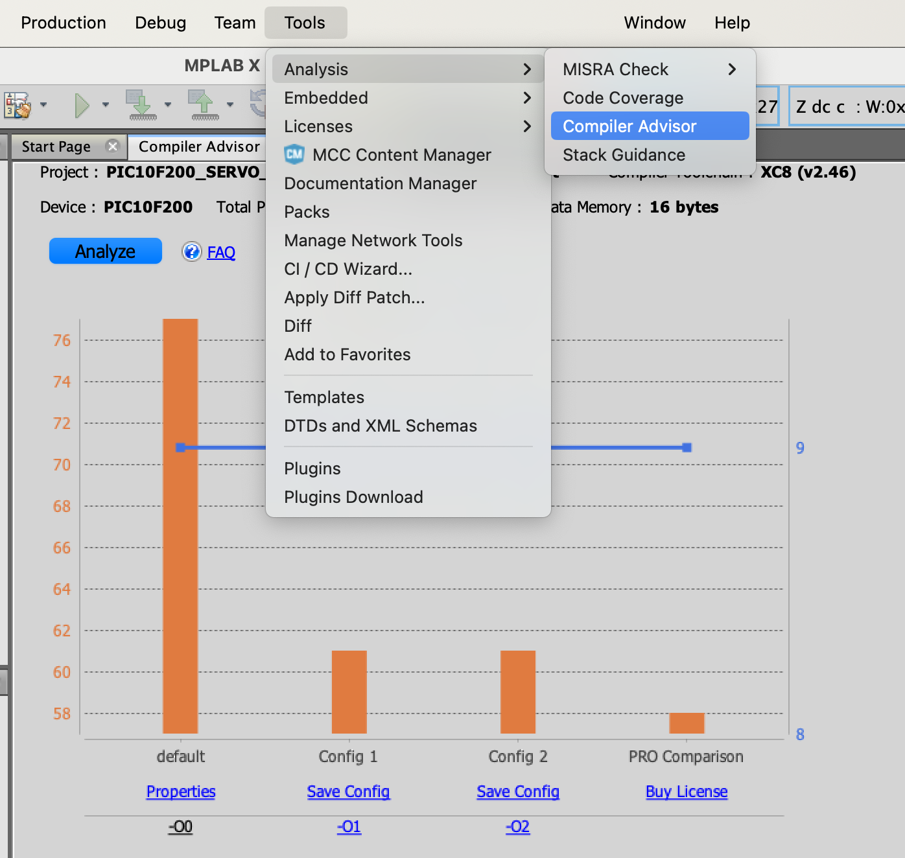

# PIC C Journey

## Content 

1. [About C PIC for microcontroller projects](#about-c-pic-for-microcontroller-projects)
2. [From C to final executable file (HEX) process](#from-c-to-final-executable-file-hex-process)
3. [XC8 - C optimization levels](#xc8---c-optimization-levels)
4. [Compiler Advisor](#compiler-advisor)
5. [C Overview](#c-overview)


## About C PIC for microcontroller projects

Developing in C instead of assembly offers several compelling advantages for PIC microcontroller projects:

1. **Ease of Use**: C is more straightforward to learn and use. Its higher-level abstractions make it easier to write, read, and maintain code.

2. **Portability**: Code written in C can often be used across different types of microcontrollers with minimal changes. This is not the case with assembly, which is specific to each processor.

3. **Development Speed**: Writing in C is generally faster than in assembly, allowing for quicker prototyping and project completion.

4. **Advanced Features**: Modern C compilers for PIC microcontrollers include optimizations that rival assembly in efficiency, reducing the performance gap.

5. **Rich Libraries and Tools**: C has a vast ecosystem of libraries and development tools, which can significantly speed up development and add functionality.

6. **Maintainability**: C code is easier to understand and modify, making it preferable for larger or longer-term projects.

In essence, while assembly offers precision control, the benefits of C—such as its portability, ease of use, and development speed—make it a strong choice for a wide range of applications.


## From C to final executable file (HEX) process

The process of transforming C source code into a final executable file (often a hex file for embedded systems) involves several steps, typically managed by a compiler and a linker. Here's an overview of these steps:

### 1. Preprocessing
* **Preprocessing** is the first phase, where the preprocessor takes a C source code file and processes directives (lines starting with `#`), such as `#include` (to include header files), `#define` (to define macros), and conditional compilation directives (`#ifdef`, `#ifndef`, `#endif`). The output of this stage is a "pure" C code without these directives, ready for compilation.

### 2. Compilation
* **Compilation** is the process where the compiler converts the preprocessed C code into assembly code specific to the target architecture. This involves parsing the C code to understand its structure and semantics, optimizing the code according to the optimization level specified (such as `-O0`, `-O1`, `-O2`, `-O3` in GCC), and then generating assembly code. The output is an assembly source file, usually not seen by the developer when using automated build tools.

### 3. Assembly
* **Assembly** is the step where an assembler converts the assembly code generated in the compilation phase into machine code (binary format). Each line of assembly corresponds to a specific operation in the processor's instruction set. The output is an object file, which contains machine code but is not yet ready to be executed because it might depend on other object files or libraries.

### 4. Linking
* **Linking** is the final phase, where a linker combines one or more object files with libraries (if needed) into a single executable file. During this phase, the linker resolves references to external functions or variables. For instance, if your code calls a function defined in a library or another source file, the linker finds the corresponding function code and ensures that the call in your program points to the correct location. The output can be an executable binary, a library, or, in the context of embedded systems, a hex file ready to be loaded onto a microcontroller.

### Additional Steps for Embedded Systems
* **Conversion to Hex**: In embedded systems, the executable binary file generated by the linker is often converted into a hex file (or similar format like `.bin` or `.srec`). This hex file is a representation of the binary code in a hexadecimal format that is easier to load onto a microcontroller or an embedded device.

* **Loading to Device**: The final step involves transferring the hex file to the target device through a programmer or a bootloader. This process is specific to the device and the development tools being used.

### Tools Involved
* **Compiler**: Such as `gcc` for GNU Compiler Collection, which can also invoke the preprocessor and the assembler internally.
* **Assembler**: Converts assembly code to object files; sometimes integrated into the compiler toolchain.
* **Linker**: Such as `ld` in the GNU toolchain, which performs the linking of object files.
* **Utility Programs**: Such as `objcopy` for converting binary files into hex files.

This entire process, from source code to a hex file, is typically managed by build systems and development environments, which automate the invocation of these tools with the correct options for the target platform.


## XC8 - C optimization levels


In the MPLAB X environment by Microchip, used for developing applications for PIC microcontrollers among others, the C compiler offers different optimization levels that adjust how code is compiled to enhance performance or reduce code size. These optimization levels are specified by numbers (0, 1, 2, 3) and a letter ('s'), each with its own characteristics and purposes. Here's a summary of each optimization level:

### Level 0 (O0)
* **Description**: This is the default optimization level when optimization is turned off.
* **Characteristics**: The compiler performs a quick compilation without focusing on optimization, resulting in code that is easier to debug because the structure of the generated code closely matches the source code.

### Level 1 (O1)
* **Description**: This level seeks a balance between compilation time and optimization, applying optimizations that do not require significant compilation time.
* **Characteristics**: It carries out basic code optimizations to improve speed and/or reduce code size without significantly increasing compilation time. This level may include optimizations such as dead code elimination and loop optimization.

### Level 2 (O2)
* **Description**: At this level, the compiler applies more aggressive optimizations that can increase compilation time but aim for better code performance at the expense of compilation time.
* **Characteristics**: Includes all optimizations from level O1, plus more advanced ones like function call optimizations, better register allocation, and pipeline optimizations, aiming for faster program execution.

### Level 3 (O3)
* **Description**: O3 is the highest level of optimization, focused on maximizing program speed.
* **Characteristics**: Besides the optimizations from level O2, this level may restructure loops, unroll loops, and use more complex algorithms for optimizations. Code size may increase as a result of these optimizations.

### Level 's' (Os)
* **Description**: This level is specific to size optimization, aiming to reduce the code size as much as possible.
* **Characteristics**: The focus is on minimizing the final code size, which can be crucial for devices with limited memory. This might include aggressive dead code elimination, merging of similar functions, and other size reduction techniques.

Each optimization level serves a specific purpose, and the choice of the appropriate level depends on the project goals, whether to maximize speed, minimize code size, or find a balance between both. Adjusting the optimization level can significantly impact the performance and size of the code generated by the compiler.


### IMPORTANT: 

In most of the C implementations carried out in this repository, the optimization option used was 's' (Os). The following figure illustrates how to configure this option in MPLAB X. It is important to note that, in rare situations, the optimization option may improperly alter the program's behavior, leading to an unexpected result. However, the 's' (Os)  option proved to be stable in all experiments in this repository.


### Compiler Advisor


The "Compiler Advisor" in MPLAB X IDE is a tool designed to assist developers in optimizing code for Microchip's PIC and dsPIC microcontrollers. It provides recommendations on how to improve code efficiency in terms of speed and size by analyzing the source code and compilation settings. This is particularly useful in embedded systems where resources like memory and processing speed are limited.

#### When can the "Compiler Advisor" be useful?

1. **Performance Optimization:** If you're trying to speed up a critical section of the code, the "Compiler Advisor" can suggest changes in how you've written the code or in the compilation options to enhance execution speed.

2. **Code Size Reduction:** For applications where memory is scarce, reducing the binary code size is crucial. The "Compiler Advisor" can recommend techniques and changes in code or compilation options to decrease the space your program occupies.

3. **Identification of Potential Code Issues:** Beyond optimization, this tool can help identify coding practices that may lead to errors or undesired behavior, allowing for proactive correction.

4. **Exploring Compiler Features:** The "Compiler Advisor" can introduce compilation options and compiler features that you might not be aware of but can significantly benefit your project.

5. **Learning and Code Improvement:** By providing specific recommendations, the tool serves as a learning medium, teaching best programming practices for microcontrollers.

#### How to Use It?

To use the "Compiler Advisor," you typically need to have a project open in MPLAB X IDE. From there, you can access the tool through the menu or tool panel, select the section of code you wish to analyze, and then run the analysis. The IDE will then present a list of suggestions and insights on how to improve the code.

In summary, the "Compiler Advisor" is a valuable tool for developers looking to optimize their microcontroller projects in terms of both performance and memory efficiency while also improving the overall quality of the code.

The image below shows how you can use this tool. 




**In the image above, notice that the C compiler option that produces a more optimized code is the PRO version (which is paid). Depending on the reliability and robustness of the project, as well as the need to use the C language, acquiring the PRO version can be an excellent alternative.**


## C Overview

Overview emphasizing keywords related to basic structures, decision making, and loops in C (C99):

### Keywords for Basic Structures, Decision Making, and Loops

* **auto**: Suggests automatic storage duration for variables.
* **break**: Exits from a loop or switch statement.
* **case**: Defines a branch in a switch statement.
* **char**: Defines a character type variable.
* **const**: Makes any variable or pointer unmodifiable.
* **continue**: Skips the remaining loop body and proceeds with the next iteration.
* **default**: Specifies the default branch in a switch statement.
* **do**: Used with while to create a do-while loop.
* **double**: Defines a variable with double precision floating-point type.
* **else**: Specifies an alternative path in an if-else statement.
* **enum**: Defines an enumeration, a way to group named integer constants.
* **float**: Defines a variable with single precision floating-point type.
* **for**: Initiates a for loop.
* **goto**: Jumps to a labeled statement in the program.
* **if**: Starts an if statement for decision making.
* **int**: Declares an integer type variable.
* **long**: Defines a long integer type variable.
* **register**: Suggests that the variable be stored in a CPU register.
* **return**: Exits a function and optionally returns a value.
* **short**: Defines a short integer type variable.
* **signed**: Specifies a variable can hold negative and positive values (default for integer types).
* **sizeof**: Determines the size, in bytes, of a type or variable.
* **static**: Preserves variable value even after the scope is exited.
* **struct**: Defines a structure, a custom data type that groups variables.
* **switch**: Initiates a switch statement for multi-path decision making.
* **typedef**: Creates a new name (alias) for an existing type.
* **union**: Defines a union, a special data type enabling you to store different data types in the same memory space.
* **unsigned**: Specifies that a variable can only hold non-negative values.
* **void**: Specifies that a function returns no value or to declare generic pointers.
* **volatile**: Indicates that a variable may be changed in ways not explicitly specified by the program.
* **while**: Starts a while loop.

These keywords are fundamental to programming in C, enabling you to define variables, control flow with loops and decision-making structures, and more.


### Brief examples of how each listed keyword can be used in C programming.

```cpp 
// auto
void function() {
    auto int localVar = 0; // localVar has automatic storage duration, typical for local variables.
}

// break
for(int i = 0; i < 10; i++) {
    if(i == 5) break; // Exits the loop when i equals 5.
}

// case, default, switch
int num = 2;
switch(num) {
    case 1: 
        // Code for case 1
        break;
    case 2: 
        // Code for case 2
        break;
    default: 
        // Code if no case matches
        break;
}

// char
char letter = 'A'; // Declares a character variable.

// const
const int MAX = 100; // MAX is a constant, its value cannot be changed.

// continue
for(int i = 0; i < 10; i++) {
    if(i % 2 == 0) continue; // Skips the rest of the loop body for even numbers.
    // Odd numbers code here
}

// do, while
int count = 0;
do {
    // Code to execute
    count++;
} while(count < 5); // Loops until count is less than 5.

// double
double pi = 3.14159; // Declares a double-precision floating-point variable.

// else, if
int a = 5;
if(a > 10) {
    // Code if condition is true
} else {
    // Code if condition is false
}

// enum
enum colors {red, green, blue};
enum colors shirt = red; // Assigns the first value of enum colors to shirt.

// float
float temperature = 36.6f; // Declares a single-precision floating-point variable.

// for
for(int i = 0; i < 10; i++) {
    // Loop code here
}

// goto
label:
    // Code to jump to
goto label; // Jumps to the label.

// int
int age = 30; // Declares an integer variable.

// long
long distance = 1234567890L; // Declares a long integer variable.

// register
register int fastVar = 5; // Suggests that fastVar should be stored in a register for faster access.

// return
int add(int x, int y) {
    return x + y; // Returns the sum of x and y.
}

// short
short height = 170; // Declares a short integer variable.

// signed
signed int temperature = -20; // Explicitly declares a signed integer.

// sizeof
int size = sizeof(int); // Gets the size of int type in bytes.

// static
void counter() {
    static int count = 0; // count retains its value between function calls.
    count++;
}

// struct
struct Person {
    char name[50];
    int age;
};
struct Person person1; // Declares a variable of type Person.

// typedef
typedef unsigned int uint;
uint counter = 100; // Uses uint as an alias for unsigned int.

// union
union Data {
    int i;
    float f;
    char str[20];
};
union Data data; // Declares a variable of type Data, which can hold an int, a float, or a char array.

// unsigned
unsigned int positive = 300; // Declares an unsigned integer, ensuring it's non-negative.

// void
void myFunction() {
    // A function that returns no value.
}

// volatile
volatile int shared = 0; // Tells the compiler that the value of shared can be changed unexpectedly.

// while
int i = 0;
while(i < 5) {
    // Code to execute while i is less than 5.
    i++;
}

```
