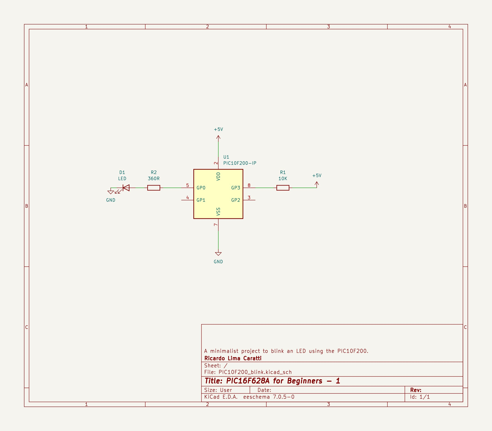

# PIC10F200 BLINK LED example

## Content

1. [About PIC10F200](#about-pic10f200)
2. [KiCad Schematic](./KiCad/)
3. [PIC10F200 and LED Schematic](#pic10f200-and-led-schematic)
4. [PIC10F200 PINOUT](#pic10f200-pinout)
4. [Example in Assembly](#pic10f200-blink-asm-example) 
5. [Example in C](#pic10f200-blink-c-example)
6. [MPLAB X IDE projects](./MPLAB_EXAMPLE/)
7. [References](#references)

## About PIC10F200 

The PIC10F200 is a small, low-cost, and low-power microcontroller that is ideal for a variety of applications, including:

* **Simple digital devices**
* **Sensors**
* **Wireless devices**
* **IoT devices**

### Features:

* **Flash memory:** The PIC10F200 has 384 bytes of Flash memory, which is enough to store a small program.
* **RAM:** The PIC10F200 has 16 bytes of RAM, which is enough to store a few variables.
* **I/O pins:** The PIC10F200 has 4 I/O pins, which can be used to connect to sensors, actuators, and other devices.
* **Internal oscillator:** The PIC10F200 has an internal oscillator, which eliminates the need for an external crystal or resonator.
* **Low power consumption:** The PIC10F200 consumes very little power, making it ideal for battery-powered applications.


## PIC10F200 and LED Schematic 





## PIC10F200 PINOUT


**Before assembling or generating the HEX file using MPLAB X, please follow these instructions:**

1. **Access Project Properties:**
   - In MPLAB X, navigate to **Project Properties**. This can typically be found under the **Project** menu.

2. **Locate Global Options:**
   - Within the Project Properties window, find the section for **Global Options**. This may be under a category related to the specific assembler/compiler you're using, such as **XC8 Linker** or **pic-as**.

3. **Specify Additional Options:**
   - Within the Global Options section, locate the box or field labeled **Additional Options**. This is where you'll enter the required parameters.

4. **Enter the Parameter:**
   - Carefully type the following parameter into the Additional Options box:

     ```
     -Wl,-pAsmCode=0h
     ```

5. **Save Changes:**
   - Ensure you save the changes made to the Project Properties before proceeding with the assembly or HEX file generation process.


#### The image below shows that setup. 


**ATTENTION:** The identifier **AsmCode** must be referenced in the PSECT directive in your Assembly code. Carefully analyze the following code.


### PIC10F200 Blink C Example

```cpp 
/*
 * Blink a LED with the PIC10F200
 * File:   main.c
 * Author: Ricardo Lima Caratti
 *
 * Created on January 28
 */


#include <xc.h>

// CONFIG
#pragma config WDTE = OFF       // Watchdog Timer (WDT disabled)
#pragma config CP = OFF         // Code Protect (Code protection off)
#pragma config MCLRE = OFF      // Master Clear Enable (GP3/MCLR pin fuction is digital I/O, MCLR internally tied to VDD)

#define _XTAL_FREQ  4000000


/**
 * Due to the PIC10F200's limited memory, it may be more efficient to develop your 
 * own delay function instead of using the "__delay_ms()" function. 
 * This is an approach to consider if timing is not critical for your application.
 */
void myDelay() {
    for (unsigned char i = 0; i < 255; i++) {
        for (unsigned char j = 0; j < 255; j++ ) {
            asm("nop");
            asm("nop");
        }
    }  
}

void main(void) {
    TRIS = 0B00000000;          // All GPIO (GP0:GP3) pins as output
       
    do {
        GP0 = 1;                // Turn the LED on
        // __delay_ms(1000);
        myDelay();
        GP0 = 0;                // Turn the LED off
        // __delay_ms(1000); 
        myDelay();
    } while(1);
}


```

### PIC10F200 Blink ASM Example

The first time I tried to program for the PIC10F200 I had problems with subroutine calls. After the execution of the RETLW instruction, the program flow returned to the beginning (as if the system was restarted or as if a goto instruction led the program to the first instruction). After some searches on the internet, I managed to find the instructions to work around this problem. See [this link for more details](https://www.circuitbread.com/tutorials/christmas-lights-special-microcontroller-basics-pic10f200).


**IMPORTANT:** 

To assemble this code correctly, please follow the steps below:

1. Go to "Project Properties" in MPLAB X.
2. Select "Global Options" for the pic-as assembler/compiler.
3. In the "Additional Options" box, enter the following parameters: **-Wl,-pAsmCode=0h**


```asm

; BLINK LEDS with PIC10F200
; My PIC Journey
; Author: Ricardo Lima Caratti
; Jan/2024
;
; IMPORTANT: To assemble this code correctly, please follow the steps below:
; 1. Go to "Project Properties" in MPLAB X.
; 2. Select "Global Options" for the pic-as assembler/compiler.
; 3. In the "Additional Options" box, enter the following parameters:
; -Wl,-pAsmCode=0h
;
; Please check the AsmCode reference in the "PSECT" directive below.
;
; You will find good tips about the PIC10F200 here:
; https://www.circuitbread.com/tutorials/christmas-lights-special-microcontroller-basics-pic10f200

    
#include <xc.inc>

; CONFIG
  CONFIG  WDTE = OFF           ; Watchdog Timer (WDT disabled)
  CONFIG  CP = OFF             ; Code Protect (Code protection off)
  CONFIG  MCLRE = ON	       ; Master Clear Enable (GP3/MCLR pin function  is MCLR)

  
; Declare your variables here

dummy1 equ 0x10
dummy2 equ 0x11
dummy3 equ 0x12 

; Do not forget the additional parameters: -Wl,-pAsmCode=0h 
; See instruction in comment above
PSECT AsmCode, class=CODE, delta=2 

MAIN:
    clrf   GPIO		    ; Sets all GPIO pins as output
    TRIS   GPIO
    
MainLoop:		    ; Endless loop
    call    Delay
    bsf	    GPIO,0	    ; Turn the LED on	
    call    Delay
    bcf	    GPIO,0	    ; Turn the LED off	
    goto    MainLoop
     
; ******************
; Delay function
;
; For an oscillator of 4MHz a regular instructions takes 1us (See pic16f628a Datasheet, page 117).      
; So, at 4MHz, this Delay subroutine takes about: (5 cycles) * 255 * 255 * delayParam * 0.000001 (second)  
; It is about 1s (0.975 s)  - One second  if delayParam is 3
Delay:  
    movlw   3
    movwf   dummy3
    movlw   255
    movwf   dummy1      ; 255 times
    movwf   dummy2      ; 255 times (255 * 255)
			; 255 * 255 * delayParam loaded before calling Delay    
DelayLoop:    
    nop                 ; One cycle
    nop                 ; One cycle
    decfsz  dummy1, f   ; One cycle* (dummy1 = dumm1 - 1) => if dummy1 is 0, after decfsz, it will be 255
    goto    DelayLoop      ; Two cycles
    decfsz  dummy2, f   ; dummy2 = dumm2 - 1; if dummy2 = 0, after decfsz, it will be 255
    goto    DelayLoop
    decfsz  dummy3,f	; Runs 3 times (255 * 255)		 
    goto    DelayLoop
    retlw   0
    
END MAIN

```


## REFERENCES 

* [PIC10F200 - blinking LED (pic-as) - Assembly](https://electronics.stackexchange.com/questions/550331/pic10f200-blinking-led-pic-as-assembly)
* [Blinking LED with PIC10F200 using pic-as](https://copyprogramming.com/howto/pic10f200-blinking-led-pic-as)
* [Using PicKit4 to program PIC10F200 chip (using Assembly language)- Basic Part 1](https://coding-engineer.com/2020/06/22/using-pickit4-to-program-pic10f200-chip/)