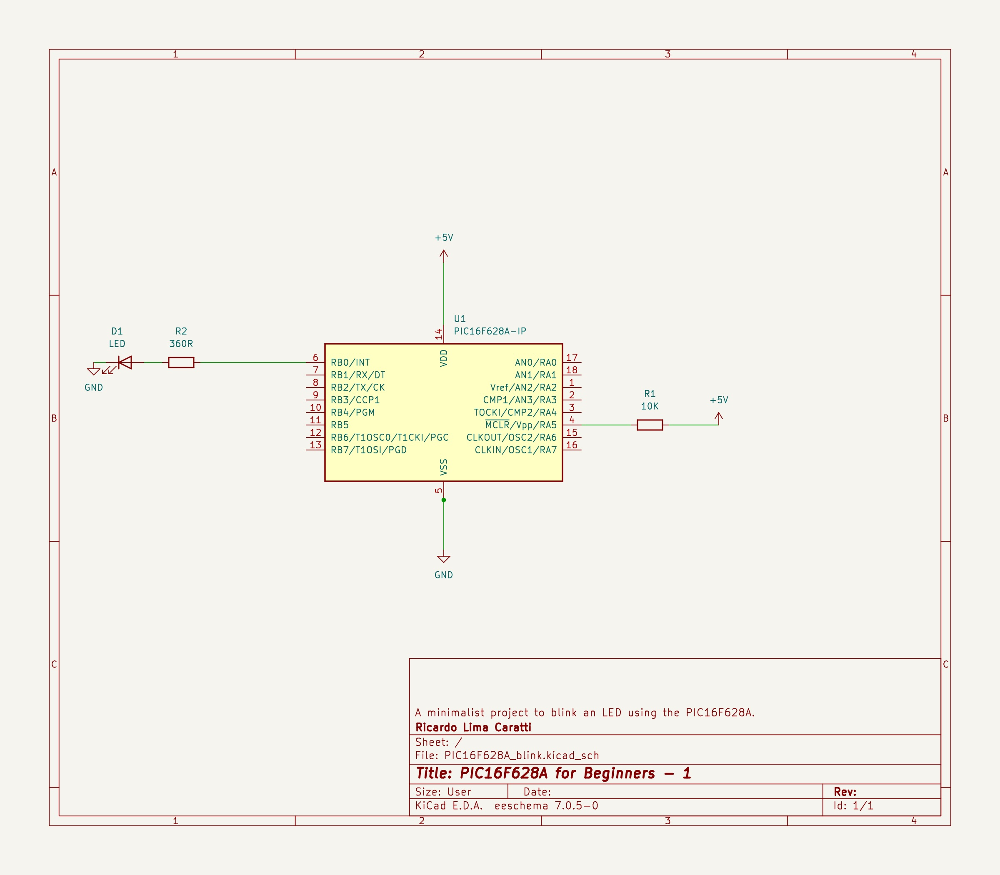
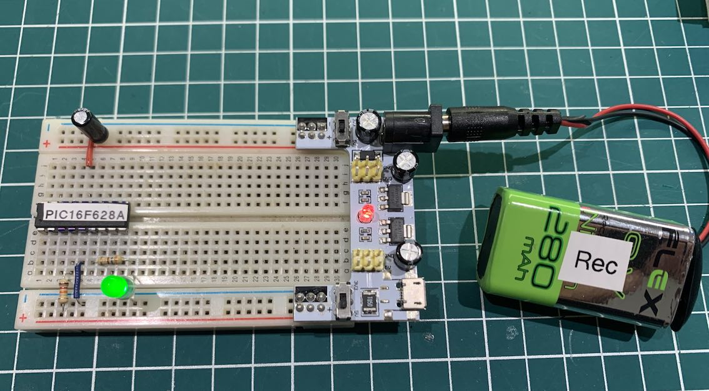

# PIC16F628A

## About PIC16F628A


The PIC16F628A, developed by Microchip Technology, is a versatile and widely used 8-bit microcontroller. It belongs to Microchip's PIC16F series, known for its efficiency and suitability for a wide range of applications. Below are its key features:

1. **Core and Memory**:
   - The PIC16F628A features a mid-range 8-bit architecture.
   - It comes with 3.5 KB of flash program memory and 128 bytes of EEPROM data memory.
   - It also includes 224 bytes of RAM, providing adequate space for variables and data stacks.

2. **I/O and Peripherals**:
   - The microcontroller offers 16 I/O pins which are highly versatile and configurable.
   - It includes two Capture/Compare/PWM (CCP) modules, making it suitable for tasks involving timing and pulse-width modulation.
   - There are also two 8-bit timers and a 16-bit timer, enhancing its capability for time-sensitive operations.

3. **Communication Protocols**:
   - PIC16F628A supports serial communication protocols such as USART, providing easy integration with serial devices and facilitating data transmission.

4. **Analog Features**:
   - The device features an integrated 10-bit Analog-to-Digital Converter (ADC) with up to 8 channels, allowing it to interface with various analog sensors and devices.

5. **Oscillator Options**:
   - It provides flexibility in terms of clock sources with an internal oscillator block, and support for external oscillators. The internal oscillator feature reduces the need for external clock components.

6. **Power Management**:
   - With its Power-saving Sleep mode, the PIC16F628A is efficient in power management, making it suitable for battery-operated applications.

7. **Programming and Debugging**:
   - It supports In-Circuit Serial Programming (ICSP) for easy programming and re-programming of the device, even after it is placed in a circuit.

8. **Applications**:
   - The PIC16F628A is versatile for various applications, including industrial automation, consumer electronics, automotive systems, and more, due to its robust feature set.


## PIC628A Schematic




<BR>


## BLINK PIC16F628A Prototype





## PIC16F628A C Example


```cpp
#include <xc.h>

// 
#pragma config FOSC = INTOSCIO  // Internal oscillator.
#pragma config WDTE = OFF       // Watchdog Timer disabled 
#pragma config PWRTE = OFF      // Power-up Timer disable
#pragma config MCLRE = ON       // MCLR pin function is digital input
#pragma config BOREN = OFF      // Brown-out Reset enabled
#pragma config LVP = OFF        // Low Voltage Programming disabled
#pragma config CPD = OFF        // Data EEPROM Memory Code Protection disabled
#pragma config CP = OFF         // Flash Program Memory Code Protection disabled

#define _XTAL_FREQ 4000000      // internal clock

void main() {
    TRISB = 0x00; // 
    PORTB =  0x0; // turn all PORTB pins low

    while (1) {
        PORTB = 0x01;
        __delay_ms(1000); 
        PORTB = 0x0;
        __delay_ms(1000); 
    }
}

```


## PIC16F628A Assembly Example


```cpp

; PIC16F628A Configuration Bit Settings
; Assembly source line config statements
;    
; Author: Ricardo Lima Caratti - Jan/2024
;    
#include <xc.inc>
    
; CONFIG
  CONFIG  FOSC = INTOSCIO       ; Oscillator Selection bits (INTOSC oscillator: I/O function on RA6/OSC2/CLKOUT pin, I/O function on RA7/OSC1/CLKIN)
  CONFIG  WDTE = OFF            ; Watchdog Timer disable bit 
  CONFIG  PWRTE = OFF           ; Power-up Timer Enable bit (PWRT disabled)
  CONFIG  MCLRE = ON            ; RA5/MCLR/VPP Pin Function Select bit (RA5/MCLR/VPP pin function is MCLR)
  CONFIG  BOREN = ON            ; Brown-out Detect Enable bit (BOD enabled)
  CONFIG  LVP = OFF             ; Low-Voltage Programming disble
  CONFIG  CPD = OFF             ; Data EE Memory Code Protection bit (Data memory code protection off)
  CONFIG  CP = OFF              ; Flash Program Memory Code Protection bit (Code protection off)

// config statements should precede project file includes.

dummy1 equ 0x20
dummy2 equ 0x21
dummy3 equ 0x22 
  
PSECT resetVector, class=CODE, delta=2
resetVect:
    PAGESEL main
    goto main
PSECT code, delta=2
main:
    bsf STATUS, 5	; Select the Bank 1 - See PIC16F627A/628A/648A Data Sheet, page 20 and 21 (MEMORY ORGANIZATION)
    clrf PORTB		; Initialize PORTB by setting output data latches
    clrf TRISB
    bcf STATUS, 5	; Return to Bank 0
    CLRW		; Clear W register
    movwf PORTB		; Turn all pins of the PORTB low    
loop:			; Loop without a stopping condition - here is your application code
    bsf PORTB, 3        ; Sets RB3 to high (turn the LED on)
    call Delay
    bcf PORTB, 3        ; Sets RB3 to low (turn the LED off) 
    call Delay
    goto loop


; ******************
; Delay function
;
; For an oscillator of 4MHz a regular instructions takes 1us (See pic16f628a Datasheet, page 117).      
; So, at 4MHz, this Delay subroutine takes about: (5 cycles) * 255 * 255 * 3 * 0.000001 (second)  
; It is about 1s (0.975 s)    
Delay:  
    movlw   255
    movwf   dummy1
    movwf   dummy2
    movlw   3
    movwf   dummy3
DelayLoop:    
    nop
    nop
    decfsz dummy1, f		; dummy1 = dumm1 - 1; if dummy1 = 0 then dummy1 = 255
    goto DelayLoop
    decfsz dummy2, f		; dummy2 = dumm2 - 1; if dummy2 = 0 then dummy2 = 255
    goto DelayLoop
    decfsz dummy3, f		 
    goto DelayLoop
    return 
    
END resetVect
    

```


## REFERENCES

