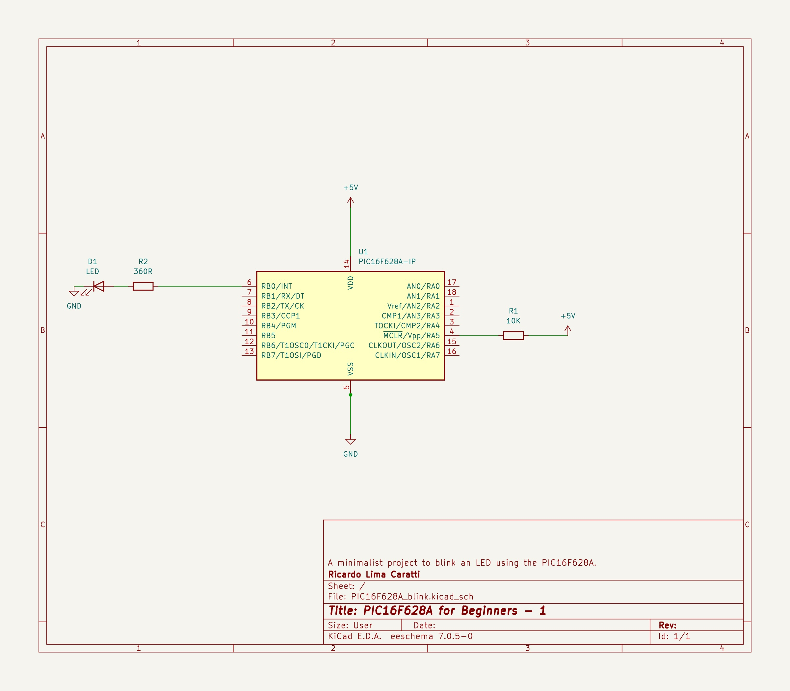
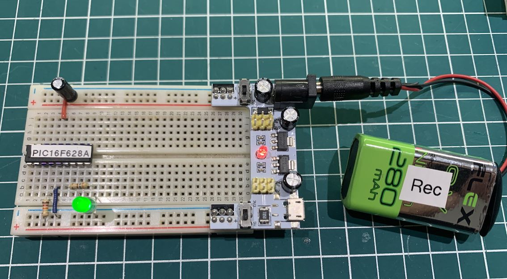
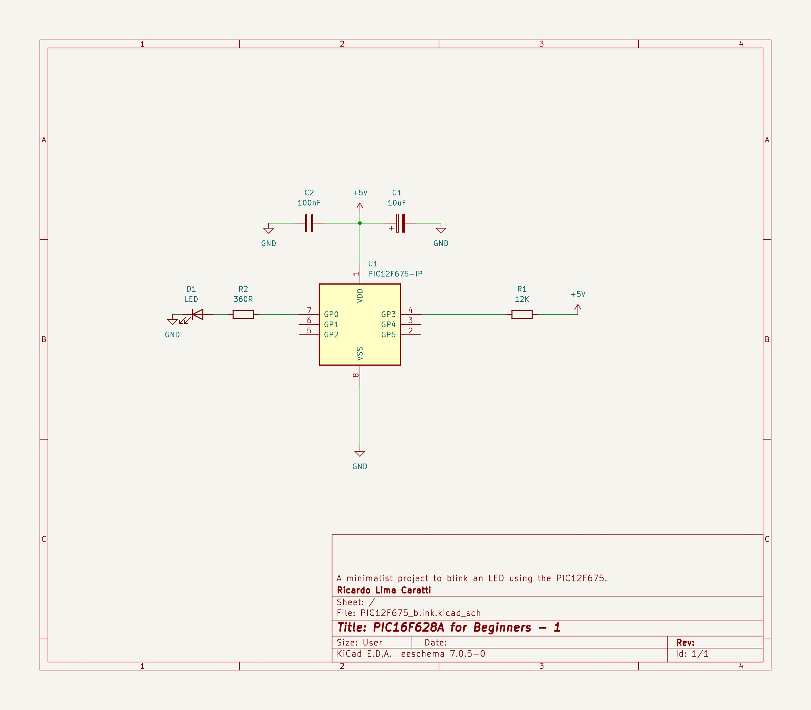
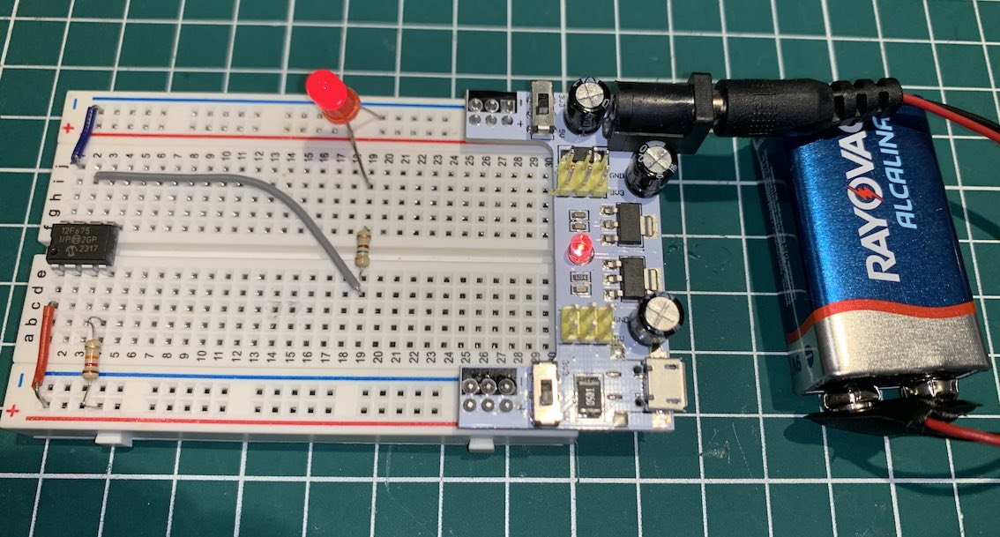
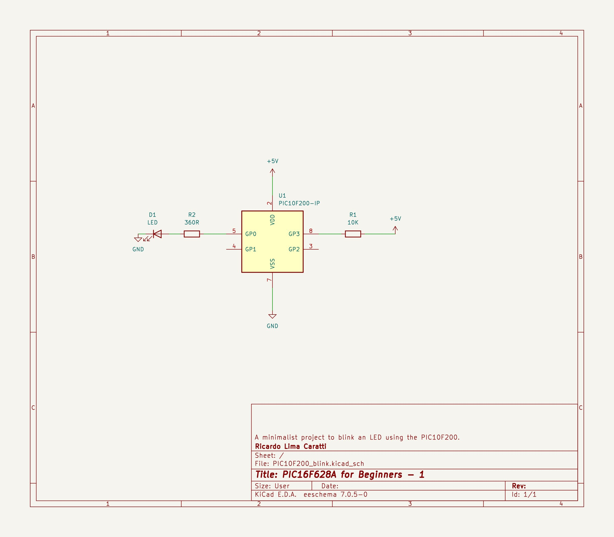

# BLINK with PIC10F, PIC12F and PIC16F

LEDs, or Light Emitting Diodes, are efficient light sources that work by passing an electrical current through a semiconductor material. Key features include:

1. **Energy Efficiency**: LEDs consume significantly less power compared to traditional incandescent bulbs.
2. **Longevity**: They have a much longer lifespan, often lasting tens of thousands of hours.
3. **Compact Size**: LEDs can be very small and are easily integrated into various designs.
4. **Low Heat Output**: Unlike incandescent bulbs, LEDs produce minimal heat.
5. **Durability**: They are more resistant to shock and vibrations.

Applications:
- **General Lighting**: Used in homes, offices, and outdoor settings.
- **Displays and Signage**: In TVs, computer monitors, digital signs, and billboards.
- **Indicator Lights**: On electronic devices, machinery, and vehicles.
- **Medical Devices**: For specialized lighting in medical equipment.
- **Automotive Lighting**: In headlights, brake lights, and interior lighting.
- **Smart Lighting Systems**: Integrated with IoT for smart home and city applications.


The use of LEDs (Light Emitting Diodes) in learning to program PIC (Peripheral Interface Controller) microcontrollers is highly beneficial for several reasons. Here's a detailed description of their importance:

1. **Visual Feedback**:
   - LEDs provide immediate visual feedback. This is crucial for beginners as it helps them see the results of their code in real-time, making the learning process more engaging and intuitive.

2. **Simplicity**:
   - LEDs are simple to use and understand. They can be easily integrated into a circuit with minimal components, making them ideal for initial learning and experimentation.

3. **Debugging Tool**:
   - LEDs can be used as a debugging tool. By toggling LEDs in specific parts of the code, learners can understand the flow of the program and identify issues.

4. **Learning Basic Concepts**:
   - Programming LEDs allows learners to grasp fundamental concepts such as GPIO (General-Purpose Input/Output) control, bit manipulation, and timing. These are essential skills in microcontroller programming.

5. **Versatility in Projects**:
   - LEDs are versatile and can be used in a wide range of projects from simple 'Hello World!' type programs (like blinking an LED) to complex applications (like creating patterns or LED matrices).

6. **Incremental Learning**:
   - Starting with basic LED projects, learners can progressively tackle more complex tasks, building confidence and understanding of the microcontroller's capabilities.

7. **Cost-Effective**:
   - LEDs are inexpensive and readily available, making them a cost-effective tool for learning electronics and programming.

8. **Encourages Creativity**:
   - With LEDs, there's a lot of room for creative projects, which can be very motivating for learners. It allows them to experiment and bring their ideas to life.

In conclusion, incorporating LEDs into PIC microcontroller learning projects is an effective way to introduce foundational concepts, provide engaging feedback, and foster a deeper understanding of electronics and programming.


This folder contains a basic example demonstrating how to blink a LED using a PIC16F628A microcontroller. It's a minimalistic application designed to provide a foundation for developing a wide range of more complex projects. This simple yet instructive example can be a starting point for various applications, offering insights into basic microcontroller programming and hardware interaction.


## PIC16F286A Schematic




<BR>


## BLINK PIC16F628A Prototype





## PIC16F628A C Example


```cpp
#include <xc.h>

// 
#pragma config FOSC = INTOSCIO  // Internal oscillator.
#pragma config WDTE = OFF       // Watchdog Timer disabled 
#pragma config PWRTE = OFF      // Power-up Timer disable
#pragma config MCLRE = ON       // MCLR pin function is digital input
#pragma config BOREN = OFF      // Brown-out Reset enabled
#pragma config LVP = OFF        // Low Voltage Programming disabled
#pragma config CPD = OFF        // Data EEPROM Memory Code Protection disabled
#pragma config CP = OFF         // Flash Program Memory Code Protection disabled

#define _XTAL_FREQ 4000000      // internal clock

void main() {
    TRISB = 0x00; // 
    PORTB =  0x0; // turn all PORTB pins low

    while (1) {
        PORTB = 0x01;
        __delay_ms(1000); 
        PORTB = 0x0;
        __delay_ms(1000); 
    }
}

```


## PIC16F628A Assembly Example


```cpp

; PIC16F628A Configuration Bit Settings
; Assembly source line config statements
;    
; Author: Ricardo Lima Caratti - Jan/2024
;    
#include <xc.inc>
    
; CONFIG
  CONFIG  FOSC = INTOSCIO       ; Oscillator Selection bits (INTOSC oscillator: I/O function on RA6/OSC2/CLKOUT pin, I/O function on RA7/OSC1/CLKIN)
  CONFIG  WDTE = OFF            ; Watchdog Timer disable bit 
  CONFIG  PWRTE = OFF           ; Power-up Timer Enable bit (PWRT disabled)
  CONFIG  MCLRE = ON            ; RA5/MCLR/VPP Pin Function Select bit (RA5/MCLR/VPP pin function is MCLR)
  CONFIG  BOREN = ON            ; Brown-out Detect Enable bit (BOD enabled)
  CONFIG  LVP = OFF             ; Low-Voltage Programming disble
  CONFIG  CPD = OFF             ; Data EE Memory Code Protection bit (Data memory code protection off)
  CONFIG  CP = OFF              ; Flash Program Memory Code Protection bit (Code protection off)

// config statements should precede project file includes.

dummy1 equ 0x20
dummy2 equ 0x21
dummy3 equ 0x22 
  
PSECT resetVector, class=CODE, delta=2
resetVect:
    PAGESEL main
    goto main
PSECT code, delta=2
main:
    bsf STATUS, 5	; Select the Bank 1 - See PIC16F627A/628A/648A Data Sheet, page 20 and 21 (MEMORY ORGANIZATION)
    clrf PORTB		; Initialize PORTB by setting output data latches
    clrf TRISB
    bcf STATUS, 5	; Return to Bank 0
    CLRW		; Clear W register
    movwf PORTB		; Turn all pins of the PORTB low    
loop:			; Loop without a stopping condition - here is your application code
    bsf PORTB, 3        ; Sets RB3 to high (turn the LED on)
    call Delay
    bcf PORTB, 3        ; Sets RB3 to low (turn the LED off) 
    call Delay
    goto loop


; ******************
; Delay function
;
; For an oscillator of 4MHz a regular instructions takes 1us (See pic16f628a Datasheet, page 117).      
; So, at 4MHz, this Delay subroutine takes about: (5 cycles) * 255 * 255 * 3 * 0.000001 (second)  
; It is about 1s (0.975 s)    
Delay:  
    movlw   255
    movwf   dummy1
    movwf   dummy2
    movlw   3
    movwf   dummy3
DelayLoop:    
    nop
    nop
    decfsz dummy1, f		; dummy1 = dumm1 - 1; if dummy1 = 0 then dummy1 = 255
    goto DelayLoop
    decfsz dummy2, f		; dummy2 = dumm2 - 1; if dummy2 = 0 then dummy2 = 255
    goto DelayLoop
    decfsz dummy3, f		 
    goto DelayLoop
    return 
    
END resetVect
    

```


## PIC12F675


The PIC12F675 is a small, low-cost, and low-power microcontroller that is ideal for a variety of applications, including:

* **Simple digital devices**
* **Sensors**
* **Wireless devices**
* **IoT devices**

### Features:

* **Flash memory:** The PIC12F675 has 1.75KB of Flash memory, which is enough to store a small program.
* **RAM:** The PIC12F675 has 64 bytes of RAM, which is enough to store a few variables.
* **I/O pins:** The PIC12F675 has 6 I/O pins, which can be used to connect to sensors, actuators, and other devices.
* **Internal oscillator:** The PIC12F675 has an internal oscillator, which eliminates the need for an external crystal or resonator.
* **Low power consumption:** The PIC12F675 consumes very little power, making it ideal for battery-powered applications.


### PIC12F675 Schematic




<BR>


### PIC12F675 C Example


```cpp
#include <xc.h>

#pragma config FOSC = INTRCIO   // Oscillator Selection bits (INTOSC oscillator: I/O function on GP4/OSC2/CLKOUT pin, I/O function on GP5/OSC1/CLKIN)
#pragma config WDTE = OFF       // Watchdog Timer Enable bit (WDT disabled)
#pragma config PWRTE = OFF      // Power-Up Timer Enable bit (PWRT disabled)
#pragma config MCLRE = ON       // GP3/MCLR pin function select (GP3/MCLR pin function is MCLR)
#pragma config BOREN = ON       // Brown-out Detect Enable bit (BOD enabled)
#pragma config CP = OFF         // Code Protection bit (Program Memory code protection is disabled)
#pragma config CPD = OFF        // Data Code Protection bit (Data memory code protection is disabled)

#define _XTAL_FREQ 4000000      // internal clock

void main() {
    TRISIO = 0x00;  // Sets All GPIO as output 
    GPIO =  0x0;    // Turns all GPIO pins low

    while (1) {
        GP0 = 1;    // Turn GP0 HIGH
        __delay_ms(1000); 
        GP0 = 0;    // Turn GP0 LOW
        __delay_ms(1000); 
    }
}

```

### PIC12F675 ASM Example

```asm

; BLINK
; My PIC Journey   
; Author: Ricardo Lima Caratti
; Jan/2024
    
#include <xc.inc>

; CONFIG
  CONFIG  FOSC = INTRCIO        ; Oscillator Selection bits (INTOSC oscillator: I/O function on GP4/OSC2/CLKOUT pin, I/O function on GP5/OSC1/CLKIN)
  CONFIG  WDTE = OFF            ; Watchdog Timer Enable bit (WDT disabled)
  CONFIG  PWRTE = OFF           ; Power-Up Timer Enable bit (PWRT disabled)
  CONFIG  MCLRE = ON            ; GP3/MCLR pin function select (GP3/MCLR pin function is MCLR)
  CONFIG  BOREN = ON            ; Brown-out Detect Enable bit (BOD enabled)
  CONFIG  CP = OFF              ; Code Protection bit (Program Memory code protection is disabled)
  CONFIG  CPD = OFF             ; Data Code Protection bit (Data memory code protection is disabled) 
  
; declare your variables here
dummy1	    equ 0x22 
dummy2	    equ 0x23 
delayParam  equ 0x24 
    
PSECT resetVector, class=CODE, delta=2
resetVect:
    PAGESEL main
    goto main
PSECT code, delta=2
main:
    ; INITIALIZING GPIO - See page 19 of the PIC12F675 Data Sheet
    bcf STATUS,5  ; Selects Bank 0
    clrf GPIO     ; Init GPIO  
    movlw 01h     ; Set GP0 to 
    movwf CMCON   ; digital IO  
    bsf STATUS,5  ; Selects Bank 1  
    clrf ANSEL    ; Digital IO  
    clrw
    movwf TRISIO  ; Sets all GPIO as output   
    bcf STATUS,5 
    clrf GPIO	  ; Turn all GPIO pins low
    
MainLoopBegin:		    ; Endless loop
   ; BlinkLED  
    bsf	    GPIO, 0
    call    Delay
    bcf	    GPIO, 0
    call    Delay
    goto MainLoopBegin
     
; ******************
; Delay function
;
; For an oscillator of 4MHz a regular instructions takes 1us (See pic16f628a Datasheet, page 117).      
; So, at 4MHz, this Delay subroutine takes about: (5 cycles) * 255 * 255 * delayParam * 0.000001 (second)  
; It is about 1s (0.975 s)  - One second  if delayParam is 3
Delay:  
    movlw   3
    movwf   delayParam
    movlw   255
    movwf   dummy1      ; 255 times
    movwf   dummy2      ; 255 times (255 * 255)
			; 255 * 255 * delayParam loaded before calling Delay    
DelayLoop:    
    nop                 ; One cycle
    nop                 ; One cycle
    decfsz dummy1, f    ; One cycle* (dummy1 = dumm1 - 1) => if dummy1 is 0, after decfsz, it will be 255
    goto DelayLoop      ; Two cycles
    decfsz dummy2, f    ; dummy2 = dumm2 - 1; if dummy2 = 0, after decfsz, it will be 255
    goto DelayLoop
    decfsz delayParam,f ; Runs 3 times (255 * 255)		 
    goto DelayLoop
    
    return 
    
END resetVect


```


### BLINK PIC12F675 Prototype





<BR>
<BR>


## PIC10F200 


The PIC10F200 is a small, low-cost, and low-power microcontroller that is ideal for a variety of applications, including:

* **Simple digital devices**
* **Sensors**
* **Wireless devices**
* **IoT devices**

### Features:

* **Flash memory:** The PIC10F200 has 384 bytes of Flash memory, which is enough to store a small program.
* **RAM:** The PIC10F200 has 16 bytes of RAM, which is enough to store a few variables.
* **I/O pins:** The PIC10F200 has 4 I/O pins, which can be used to connect to sensors, actuators, and other devices.
* **Internal oscillator:** The PIC10F200 has an internal oscillator, which eliminates the need for an external crystal or resonator.
* **Low power consumption:** The PIC10F200 consumes very little power, making it ideal for battery-powered applications.


## PIC10F200 Schematic 





<BR>


**Before assembling or generating the HEX file using MPLAB X, please follow these instructions:**

1. **Access Project Properties:**
   - In MPLAB X, navigate to **Project Properties**. This can typically be found under the **Project** menu.

2. **Locate Global Options:**
   - Within the Project Properties window, find the section for **Global Options**. This may be under a category related to the specific assembler/compiler you're using, such as **XC8 Linker** or **pic-as**.

3. **Specify Additional Options:**
   - Within the Global Options section, locate the box or field labeled **Additional Options**. This is where you'll enter the required parameters.

4. **Enter the Parameter:**
   - Carefully type the following parameter into the Additional Options box:

     ```
     -Wl,-pBlinkCode=0h
     ```

5. **Save Changes:**
   - Ensure you save the changes made to the Project Properties before proceeding with the assembly or HEX file generation process.


#### The image below shows that setup. 


**ATTENTION:** The identifier **BlinkCode** must be referenced in the PSECT directive in your Assembly code. Carefully analyze the following code.


## PIC10F200 ASM Example

The first time I tried to program for the PIC10F200 I had problems with subroutine calls. After the execution of the RETLW instruction, the program flow returned to the beginning (as if the system was restarted or as if a goto instruction led the program to the first instruction). After some searches on the internet, I managed to find the instructions to work around this problem. See [this link for more details](https://www.circuitbread.com/tutorials/christmas-lights-special-microcontroller-basics-pic10f200).


```asm

; BLINK LEDS with PIC10F200
; My PIC Journey
; Author: Ricardo Lima Caratti
; Jan/2024
;
; IMPORTANT: To assemble this code correctly, please follow the steps below:
; 1. Go to "Project Properties" in MPLAB X.
; 2. Select "Global Options" for the pic-as assembler/compiler.
; 3. In the "Additional Options" box, enter the following parameters:
; -Wl,-pBlinkCode=0h
;
; Please check the BlinkCode reference in the "PSECT" directive below.
;
; You will find good tips about the PIC10F200 here:
; https://www.circuitbread.com/tutorials/christmas-lights-special-microcontroller-basics-pic10f200

 
    
#include <xc.inc>

; CONFIG
  CONFIG  WDTE = OFF           ; Watchdog Timer (WDT disabled)
  CONFIG  CP = OFF             ; Code Protect (Code protection off)
  CONFIG  MCLRE = ON	       ; Master Clear Enable (GP3/MCLR pin function  is MCLR)

  
; Declare your variables here

dummy1 equ 0x10
dummy2 equ 0x11
dummy3 equ 0x12 

; Do not forget the additional parameters: -Wl,-pBlinkCode=0h 
; See instruction in comment above
PSECT BlinkCode, class=CODE, delta=2 

MAIN:
    clrf   GPIO		    ; Sets all GPIO pins as output
    TRIS   GPIO
    
MainLoop:		    ; Endless loop
    call    Delay
    bsf	    GPIO,0	    ; Turn the LED on	
    call    Delay
    bcf	    GPIO,0	    ; Turn the LED off	
    goto    MainLoop
     
; ******************
; Delay function
;
; For an oscillator of 4MHz a regular instructions takes 1us (See pic16f628a Datasheet, page 117).      
; So, at 4MHz, this Delay subroutine takes about: (5 cycles) * 255 * 255 * delayParam * 0.000001 (second)  
; It is about 1s (0.975 s)  - One second  if delayParam is 3
Delay:  
    movlw   3
    movwf   dummy3
    movlw   255
    movwf   dummy1      ; 255 times
    movwf   dummy2      ; 255 times (255 * 255)
			; 255 * 255 * delayParam loaded before calling Delay    
DelayLoop:    
    nop                 ; One cycle
    nop                 ; One cycle
    decfsz  dummy1, f   ; One cycle* (dummy1 = dumm1 - 1) => if dummy1 is 0, after decfsz, it will be 255
    goto    DelayLoop      ; Two cycles
    decfsz  dummy2, f   ; dummy2 = dumm2 - 1; if dummy2 = 0, after decfsz, it will be 255
    goto    DelayLoop
    decfsz  dummy3,f	; Runs 3 times (255 * 255)		 
    goto    DelayLoop
    retlw   0
    
END MAIN

```


## REFERENCES 


* [PIC10F200 - blinking LED (pic-as) - Assembly](https://electronics.stackexchange.com/questions/550331/pic10f200-blinking-led-pic-as-assembly)
* [Blinking LED with PIC10F200 using pic-as](https://copyprogramming.com/howto/pic10f200-blinking-led-pic-as)
* [Using PicKit4 to program PIC10F200 chip (using Assembly language)- Basic Part 1](https://coding-engineer.com/2020/06/22/using-pickit4-to-program-pic10f200-chip/)