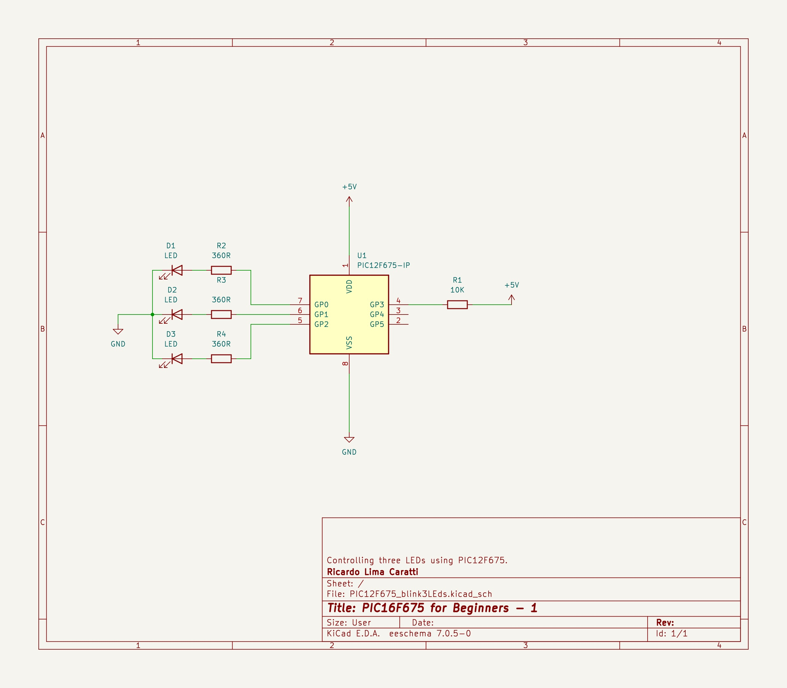
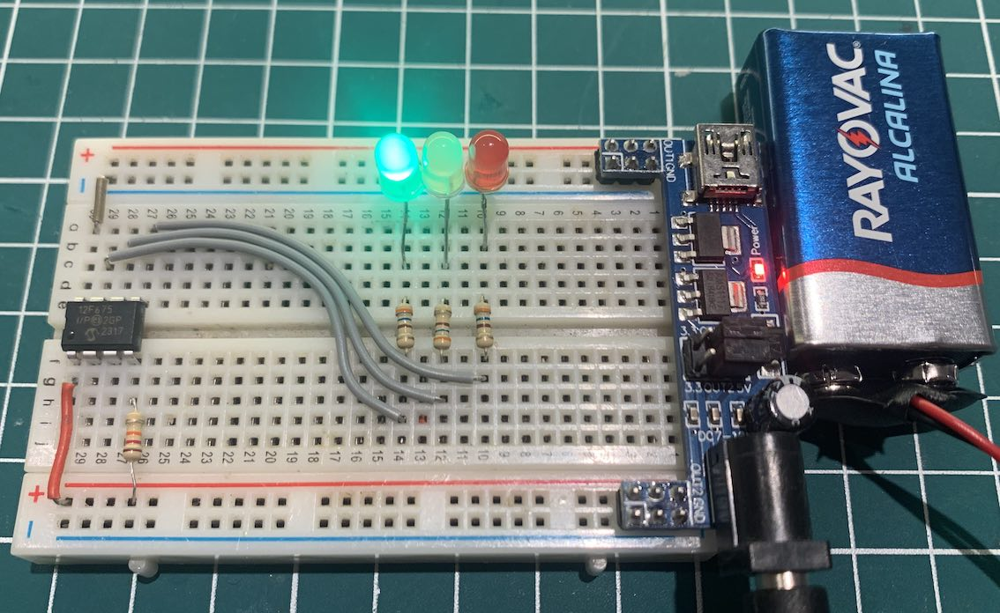

# Controlling more than one LED with PIC12F675 


## Content

1. [PIC12F675 and Three LEDs Schematic](#pic12f675-and-three-leds-schematic)
2. [](./KiCad/)
3. [PIC12F675 PINOUT](#pic12f675-pinout)
4. [PIC12F675 and Three LEDs prototype](#pic12f675-prototype)
5. [PIC12F675 controlling three LEDs in C](#pic12f675-controlling-three-leds-in-c)
6. [PIC12F675 controlling three LEDs in Assembly](#pic12f675-controlling-three-leds-in-assembly)
7. [MPLAB X IDE Projects](./MPLAB_EXAMPLES/)
8. [References](#references)


## PIC12F675 and Three LEDs Schematic




## PIC12F675 PINOUT


## PIC12F675 Prototype




## PIC12F675 controlling three LEDs in C 

```cpp

#include <xc.h>

#pragma config FOSC = INTRCIO   // Oscillator Selection bits (INTOSC oscillator: I/O function on GP4/OSC2/CLKOUT pin, I/O function on GP5/OSC1/CLKIN)
#pragma config WDTE = OFF       // Watchdog Timer Enable bit (WDT disabled)
#pragma config PWRTE = OFF      // Power-Up Timer Enable bit (PWRT disabled)
#pragma config MCLRE = ON       // GP3/MCLR pin function select (GP3/MCLR pin function is MCLR)
#pragma config BOREN = ON       // Brown-out Detect Enable bit (BOD enabled)
#pragma config CP = OFF         // Code Protection bit (Program Memory code protection is disabled)
#pragma config CPD = OFF        // Data Code Protection bit (Data memory code protection is disabled)

#define _XTAL_FREQ 4000000      // internal clock

void main() {
    TRISIO = 0x00;  // Sets All GPIO as output 
    GPIO =  0x0;    // Turns all GPIO pins low
    while (1) {
        __delay_ms(1000);
        if (GPIO > 4 ) GPIO =  0x0;
        GPIO = (unsigned char) (GPIO << 1);
    }
}

```


## PIC12F675 controlling three LEDs in Assembly 

```asm

; BLINK three LEDS in sequency with PIC12F675
; My PIC Journey   
; Author: Ricardo Lima Caratti
; Jan/2024
    
#include <xc.inc>

; CONFIG
  CONFIG  FOSC = INTRCIO        ; Oscillator Selection bits (INTOSC oscillator: I/O function on GP4/OSC2/CLKOUT pin, I/O function on GP5/OSC1/CLKIN)
  CONFIG  WDTE = OFF            ; Watchdog Timer Enable bit (WDT disabled)
  CONFIG  PWRTE = OFF           ; Power-Up Timer Enable bit (PWRT disabled)
  CONFIG  MCLRE = ON            ; GP3/MCLR pin function select (GP3/MCLR pin function is MCLR)
  CONFIG  BOREN = ON            ; Brown-out Detect Enable bit (BOD enabled)
  CONFIG  CP = OFF              ; Code Protection bit (Program Memory code protection is disabled)
  CONFIG  CPD = OFF             ; Data Code Protection bit (Data memory code protection is disabled) 
  
; declare your variables here
dummy1	    equ 0x22 
dummy2	    equ 0x23 
delayParam  equ 0x24 
ledNumber   equ 0x25  
    
PSECT resetVector, class=CODE, delta=2
resetVect:
    PAGESEL main
    goto main
PSECT code, delta=2
main:
    ; INITIALIZING GPIO - See page 19 of the PIC12F675 Data Sheet
    bcf STATUS,5	        ; Selects Bank 0
    clrf GPIO		        ; Init GPIO  
    clrf CMCON		        ; COMPARATOR Register setup
    bsf STATUS,5	        ; Selects Bank 1  
    clrf ANSEL		        ; Digital IO  
    clrw
    movwf   TRISIO	        ; Sets all GPIO as output   
    bcf	    STATUS,5	    ; Selects the Bank 0		
    clrf    ledNumber	    ; ledNumber = 0
MainLoopBegin:		        ; Endless loop
    movf    ledNumber,w	    ; All LEDs off at first time
    movwf   GPIO	    
    call    Delay
    bsf	    STATUS, 0	    ; Sets 1 to carry flag	
    rlf	    ledNumber	    ; Sets ledNumber to turn the next LED on    
    btfss   ledNumber,3	    ; Check if the end of LED cycle 
    goto    MainLoopBegin
    ; Restart the LED sequency
    clrf ledNumber	        ;  
    bsf  ledNumber,0	    ; ledNumber = 1 (first LED again) 
    goto MainLoopBegin
     
; ******************
; Delay function
;
; For an oscillator of 4MHz a regular instructions takes 1us (See pic16f628a Datasheet, page 117).      
; So, at 4MHz, this Delay subroutine takes about: (5 cycles) * 255 * 255 * delayParam * 0.000001 (second)  
; It is about 1s (0.975 s)  - One second  if delayParam is 3
Delay:  
    movlw   3
    movwf   delayParam
    movlw   255
    movwf   dummy1      ; 255 times
    movwf   dummy2      ; 255 times (255 * 255)
			; 255 * 255 * delayParam loaded before calling Delay    
DelayLoop:    
    nop                 ; One cycle
    nop                 ; One cycle
    decfsz dummy1, f    ; One cycle* (dummy1 = dumm1 - 1) => if dummy1 is 0, after decfsz, it will be 255
    goto DelayLoop      ; Two cycles
    decfsz dummy2, f    ; dummy2 = dumm2 - 1; if dummy2 = 0, after decfsz, it will be 255
    goto DelayLoop
    decfsz delayParam,f ; Runs 3 times (255 * 255)		 
    goto DelayLoop
    
    return 
    
END resetVect


```

## References

* [PIC12F629/675 Data Sheet](https://ww1.microchip.com/downloads/en/devicedoc/41190c.pdf)
* [MPLAB® XC8 C Compiler User’s Guide](https://ww1.microchip.com/downloads/en/devicedoc/50002053g.pdf)
* [MPASMTM Assembler, MPLINKTM Object Linker, MPLIBTM Object Librarian User’s Guide](https://ww1.microchip.com/downloads/en/DeviceDoc/33014L.pdf)
* [MPLAB® XC8 PIC® Assembler User's Guide](https://ww1.microchip.com/downloads/en/DeviceDoc/MPLAB%20XC8%20PIC%20Assembler%20User%27s%20Guide%2050002974A.pdf)
* [Simulator](https://onlinedocs.microchip.com/pr/GUID-240F27AA-C615-4705-B68C-6E434B126B47-en-US-1/index.html?GUID-95DA81C7-47DF-4C86-BC12-0D9D018909C3)


