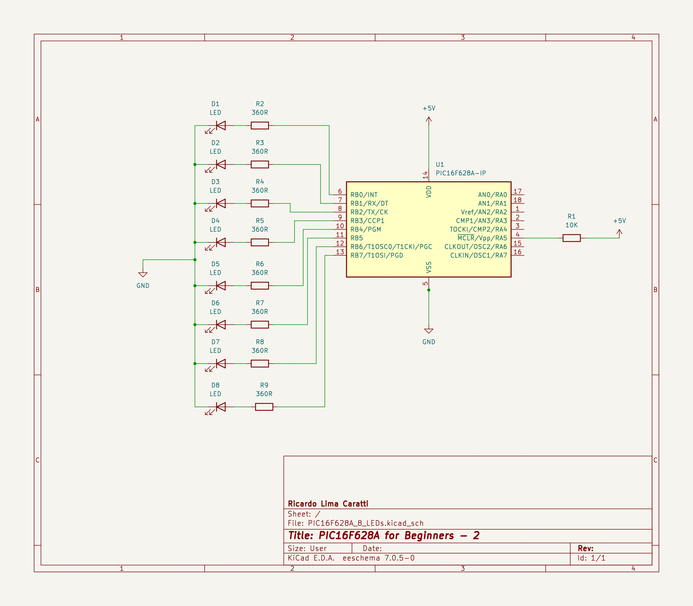
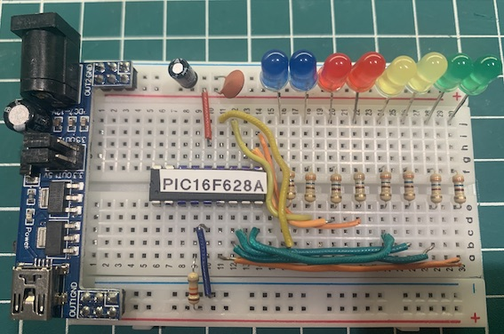

# Controlling more than one LED with PIC

This project presents the circuit that uses the PIC16F628A with LEDs that can be controlled in various ways.


## Content

1. [PIC16F286A and 8 LEDs Schematic](#pic16f286a-and-8-leds-schematic)
2. [KiCad Schematic](./KiCad/)
3. [PIC16F628A PINOUT](#pic16f286a-pinout)
4. [PIC16F286A with 8 LEDs Prototype](#pic16f286a-with-8-leds-prototype)
5. [C Example 1](#c-example-1)
6. [C Example 2](#c-example-2)
7. [MPLAB X IDE Projects](./MPLAB_EXAMPLES/)
8. [References](#references)


## PIC16F286A and 8 LEDs Schematic





## PIC16F286A PINOUT


## PIC16F286A with 8 LEDs Prototype




## C Example 1

This project uses a PIC16F628A microcontroller to count time for 1 minute (60s). The system starts with 8 LEDs lit, and every 7.5 seconds, one LED turns off. After all the LEDs have turned off, the system waits for 15 seconds and then restarts the process.


```cpp

#include <xc.h>

#pragma config FOSC = INTOSCIO  // Internal Oscillator
#pragma config WDTE = OFF       // Watchdog Timer disabled
#pragma config PWRTE = OFF      // Power-up Timer disabled
#pragma config MCLRE = ON       // MCLR pin function is digital input
#pragma config BOREN = OFF       // Brown-out Reset enabled
#pragma config LVP = OFF        // Low Voltage Programming disabled
#pragma config CPD = OFF        // Data EEPROM Memory Code Protection disabled
#pragma config CP = OFF         // Flash Program Memory Code Protection disabled

#define _XTAL_FREQ 4000000      // Internal Oscillator Frequency

void main() {
    TRISB = 0x00; // Sets PORTB as output

    while (1) {
        PORTB =  0xFF; // Turn all LEDs on
        // Sequentially turns off each LED at intervals of 7.5 seconds.
        do { 
            __delay_ms(7500);
        } while ( (PORTB = (unsigned char) (PORTB <<  1)) ); 
        __delay_ms(15000); 
    }
}

````


## C Example 2

This example uses the same [previous circuit](#pic16f286a-and-8-leds-schematic). Two LEDs will be activated at a time in half-second intervals.

```cpp

#include <xc.h>

#pragma config FOSC = INTOSCIO  // Internal Oscillator
#pragma config WDTE = OFF       // Watchdog Timer disabled
#pragma config PWRTE = OFF      // Power-up Timer disabled
#pragma config MCLRE = ON       // MCLR pin function is digital input
#pragma config BOREN = OFF       // Brown-out Reset enabled
#pragma config LVP = OFF        // Low Voltage Programming disabled
#pragma config CPD = OFF        // Data EEPROM Memory Code Protection disabled
#pragma config CP = OFF         // Flash Program Memory Code Protection disabled

#define _XTAL_FREQ 4000000      // Internal Oscillator Frequency

void main() {
    TRISB = 0x00; // Sets PORT B as output

    while (1) {
        PORTB =  0x03; // turn the first two LEDs on
        do {
            __delay_ms(500);
        } while ( (PORTB = (unsigned char) (PORTB <<  1)) ); 
        __delay_ms(1000);
    }
}

```


## Assembly example

This example uses the same [circuit](#pic16f286a-and-8-leds-schematic) above.

```asm

; PIC16F628A and LED control
; Assembly source 
;    
; Author: Ricardo Lima Caratti - Jan/2024
;    
#include <xc.inc>
    
; CONFIG
CONFIG  FOSC = INTOSCIO       ; Oscillator Selection bits (INTOSC oscillator: I/O function on RA6/OSC2/CLKOUT pin, I/O function on RA7/OSC1/CLKIN)
CONFIG  WDTE = OFF            ; Watchdog Timer disable bit (WDT enabled)
CONFIG  PWRTE = OFF           ; Power-up Timer Enable bit (PWRT disabled)
CONFIG  MCLRE = ON            ; RA5/MCLR/VPP Pin Function Select bit (RA5/MCLR/VPP pin function is MCLR)
CONFIG  BOREN = ON            ; Brown-out Detect Enable bit (BOD enabled)
CONFIG  LVP = OFF             ; Low-Voltage Programming disable bit (This application needs the RB4)

; Variables 
dummy1   equ 0x20
dummy2	 equ 0x21
dummy3   equ 0x22 
led      equ 0x23    
  
PSECT resetVector, class=CODE, delta=2, split=1, group=0
resetVect:
    PAGESEL main
    goto main
PSECT code, delta=2
main:
    bsf	    STATUS, 5	; Select the Bank 1 - See PIC16F627A/628A/648A Data Sheet, page 20 and 21 (MEMORY ORGANIZATION)
    clrf    PORTB	; Initialize PORTB 
    clrf    TRISB	; 
    bcf	    STATUS, 5	; Return to Bank 0
    movlw   0
    movwf   led
    movwf   PORTB     
loop:			; endelss loop
    rlf     led, w	; Rotate Left f through Carry
    movwf   led
    movwf   PORTB 
    call    Delay
    nop			; Must be removed - Just for debugging purpose 
    goto loop

; ******************
; Delay function
;
; For an oscillator of 4MHz a regular instructions takes 1us (See pic16f628a Datasheet, page 117).      
; So, at 4MHz, this Delay subroutine takes about: (5 cycles) * 255 * 255 * 3 * 0.000001 (second)  
; It is about 1s (0.975 s)  - One second  
Delay:  
    movlw   255
    movwf   dummy1      ; 255 times
    movwf   dummy2      ; 255 times (255 * 255)
    movlw   3			
    movwf   dummy3      ; 3 times  ( 255 * 255 * 3) 
DelayLoop:    
    nop                 ; One cycle
    nop                 ; One cycle
    decfsz dummy1, f    ; One cycle* (dummy1 = dumm1 - 1) => if dummy1 is 0, after decfsz, it will be 255
    goto DelayLoop      ; Two cycles
    decfsz dummy2, f    ; dummy2 = dumm2 - 1; if dummy2 = 0, after decfsz, it will be 255
    goto DelayLoop
    decfsz dummy3, f    ; Runs 3 times (255 * 255)		 
    goto DelayLoop
    return 
    
    
END resetVect
    
``` 


## References

1. [PIC16F87XA Data Sheet](https://ww1.microchip.com/downloads/en/devicedoc/39582b.pdf)
2. [PIC16F87XA Data Sheet](https://ww1.microchip.com/downloads/en/devicedoc/39582b.pdf)
3. [PIC16F627A/628A/648A Data Sheet](https://ww1.microchip.com/downloads/en/DeviceDoc/40044G.pdf)
4. [LED - Light-emitting diode](https://en.wikipedia.org/wiki/Light-emitting_diode)


