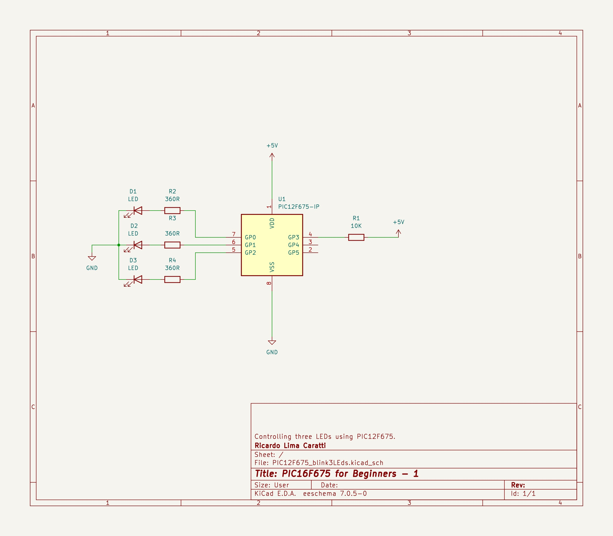

# Time Counter. 

This project presents the circuit that uses the PIC16F628A with LEDs that can be controlled in various ways.


## PIC16F286A Schematic


<BR>


## PIC16F286A Prototype


## Example 1

This project uses a PIC16F628A microcontroller to count time for 1 minute (60s). The system starts with 8 LEDs lit, and every 7.5 seconds, one LED turns off. After all the LEDs have turned off, the system waits for 15 seconds and then restarts the process.


```cpp
#include <xc.h>

#pragma config FOSC = INTOSCIO  // Internal Oscillator
#pragma config WDTE = OFF       // Watchdog Timer disabled
#pragma config PWRTE = OFF      // Power-up Timer disabled
#pragma config MCLRE = ON       // MCLR pin function is digital input
#pragma config BOREN = OFF       // Brown-out Reset enabled
#pragma config LVP = OFF        // Low Voltage Programming disabled
#pragma config CPD = OFF        // Data EEPROM Memory Code Protection disabled
#pragma config CP = OFF         // Flash Program Memory Code Protection disabled

#define _XTAL_FREQ 4000000      // Internal Oscillator Frequency

void main() {
    TRISB = 0x00; // Sets PORTB as output

    while (1) {
        PORTB =  0xFF; // Turn all LEDs on
        // Sequentially turns off each LED at intervals of 7.5 seconds.
        do { 
            __delay_ms(7500);
        } while ( (PORTB = (unsigned char) (PORTB <<  1)) ); 
        __delay_ms(15000); 
    }
}

````


## Example 2

This example uses the same previous circuit. Two LEDs will be activated at a time in half-second intervals.

```cpp
#include <xc.h>

#pragma config FOSC = INTOSCIO  // Internal Oscillator
#pragma config WDTE = OFF       // Watchdog Timer disabled
#pragma config PWRTE = OFF      // Power-up Timer disabled
#pragma config MCLRE = ON       // MCLR pin function is digital input
#pragma config BOREN = OFF       // Brown-out Reset enabled
#pragma config LVP = OFF        // Low Voltage Programming disabled
#pragma config CPD = OFF        // Data EEPROM Memory Code Protection disabled
#pragma config CP = OFF         // Flash Program Memory Code Protection disabled

#define _XTAL_FREQ 4000000      // Internal Oscillator Frequency

void main() {
    TRISB = 0x00; // Sets PORT B as output

    while (1) {
        PORTB =  0x03; // turn the first two LEDs on
        do {
            __delay_ms(500);
        } while ( (PORTB = (unsigned char) (PORTB <<  1)) ); 
        __delay_ms(1000);
    }
}


## PIC12F675 Schematic




<BR>


## PIC12F675 Prototype


``asm
; BLINK three LEDS in sequency
; My PIC Journey   
; Author: Ricardo Lima Caratti
; Jan/2024
    
#include <xc.inc>

; CONFIG
  CONFIG  FOSC = INTRCIO        ; Oscillator Selection bits (INTOSC oscillator: I/O function on GP4/OSC2/CLKOUT pin, I/O function on GP5/OSC1/CLKIN)
  CONFIG  WDTE = OFF            ; Watchdog Timer Enable bit (WDT disabled)
  CONFIG  PWRTE = OFF           ; Power-Up Timer Enable bit (PWRT disabled)
  CONFIG  MCLRE = ON            ; GP3/MCLR pin function select (GP3/MCLR pin function is MCLR)
  CONFIG  BOREN = ON            ; Brown-out Detect Enable bit (BOD enabled)
  CONFIG  CP = OFF              ; Code Protection bit (Program Memory code protection is disabled)
  CONFIG  CPD = OFF             ; Data Code Protection bit (Data memory code protection is disabled) 
  
; declare your variables here
dummy1	    equ 0x22 
dummy2	    equ 0x23 
delayParam  equ 0x24 
ledNumber   equ 0x25  
    
PSECT resetVector, class=CODE, delta=2
resetVect:
    PAGESEL main
    goto main
PSECT code, delta=2
main:
    ; INITIALIZING GPIO - See page 19 of the PIC12F675 Data Sheet
    bcf STATUS,5	    ; Selects Bank 0
    clrf GPIO		    ; Init GPIO  
    movlw 0B00000111	    ; Set GP0 to 
    movwf CMCON		    ; digital IO  
    bsf STATUS,5	    ; Selects Bank 1  
    clrf ANSEL		    ; Digital IO  
    clrw
    movwf   TRISIO	    ; Sets all GPIO as output   
    bcf	    STATUS,5	    ; Selects the Bank 0		
    clrf    GPIO	    ; Turn all GPIO pins low
    clrf    ledNumber	    ; ledNumber = 0
MainLoopBegin:		    ; Endless loop
    movf    ledNumber,w	    ; All LEDs off at first time
    movwf   GPIO
    call    Delay	
    rlf	    ledNumber	    ; Sets ledNumber to turn the next LED on    
    btfss   ledNumber,3	    ; Check if the end of LED cycle 
    goto    MainLoopBegin
    ; Restart the LED sequency
    clrf ledNumber	    ;  
    bsf  ledNumber,0	    ; ledNumber = 1 (first LED again) 
    goto MainLoopBegin
     
; ******************
; Delay function
;
; For an oscillator of 4MHz a regular instructions takes 1us (See pic16f628a Datasheet, page 117).      
; So, at 4MHz, this Delay subroutine takes about: (5 cycles) * 255 * 255 * delayParam * 0.000001 (second)  
; It is about 1s (0.975 s)  - One second  if delayParam is 3
Delay:  
    movlw   3
    movwf   delayParam
    movlw   255
    movwf   dummy1      ; 255 times
    movwf   dummy2      ; 255 times (255 * 255)
			; 255 * 255 * delayParam loaded before calling Delay    
DelayLoop:    
    nop                 ; One cycle
    nop                 ; One cycle
    decfsz dummy1, f    ; One cycle* (dummy1 = dumm1 - 1) => if dummy1 is 0, after decfsz, it will be 255
    goto DelayLoop      ; Two cycles
    decfsz dummy2, f    ; dummy2 = dumm2 - 1; if dummy2 = 0, after decfsz, it will be 255
    goto DelayLoop
    decfsz delayParam,f ; Runs 3 times (255 * 255)		 
    goto DelayLoop
    
    return 
    
END resetVect

```


```


