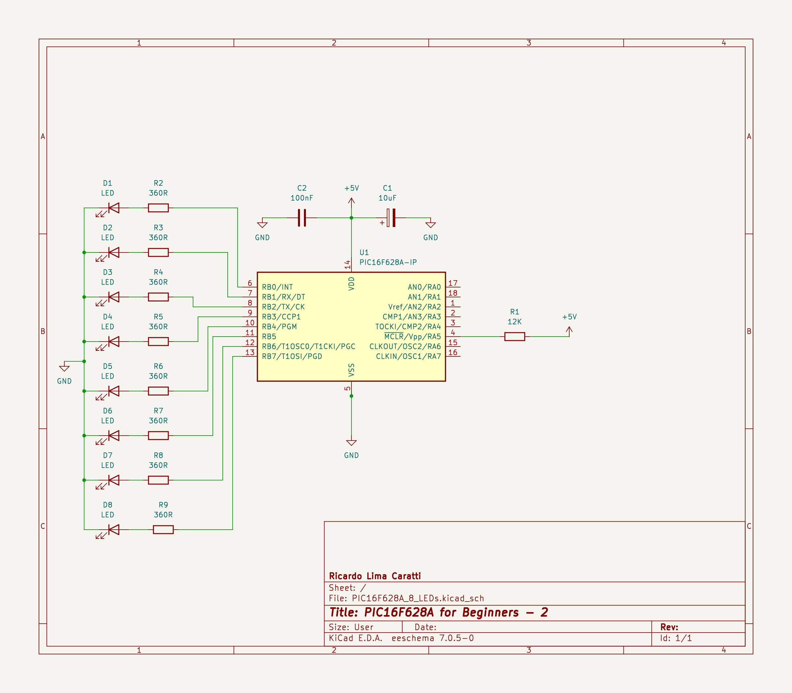

# Time Counter. 

This project presents the circuit that uses the PIC16F628A with LEDs that can be controlled in various ways.


## Schematic




<BR>


## Prototype


## Example 1

This project uses a PIC16F628A microcontroller to count time for 1 minute (60s). The system starts with 8 LEDs lit, and every 7.5 seconds, one LED turns off. After all the LEDs have turned off, the system waits for 15 seconds and then restarts the process.


```cpp
#include <xc.h>

#pragma config FOSC = INTOSCIO  // Internal Oscillator
#pragma config WDTE = OFF       // Watchdog Timer disabled
#pragma config PWRTE = OFF      // Power-up Timer disabled
#pragma config MCLRE = ON       // MCLR pin function is digital input
#pragma config BOREN = OFF       // Brown-out Reset enabled
#pragma config LVP = OFF        // Low Voltage Programming disabled
#pragma config CPD = OFF        // Data EEPROM Memory Code Protection disabled
#pragma config CP = OFF         // Flash Program Memory Code Protection disabled

#define _XTAL_FREQ 4000000      // Internal Oscillator Frequency

void main() {
    TRISB = 0x00; // Sets PORTB as output

    while (1) {
        PORTB =  0xFF; // Turn all LEDs on
        // Sequentially turns off each LED at intervals of 7.5 seconds.
        do { 
            __delay_ms(7500);
        } while ( (PORTB = (unsigned char) (PORTB <<  1)) ); 
        __delay_ms(15000); 
    }
}

````


## Example 2

This example uses the same previous circuit. Two LEDs will be activated at a time in half-second intervals.

```cpp
#include <xc.h>

#pragma config FOSC = INTOSCIO  // Internal Oscillator
#pragma config WDTE = OFF       // Watchdog Timer disabled
#pragma config PWRTE = OFF      // Power-up Timer disabled
#pragma config MCLRE = ON       // MCLR pin function is digital input
#pragma config BOREN = OFF       // Brown-out Reset enabled
#pragma config LVP = OFF        // Low Voltage Programming disabled
#pragma config CPD = OFF        // Data EEPROM Memory Code Protection disabled
#pragma config CP = OFF         // Flash Program Memory Code Protection disabled

#define _XTAL_FREQ 4000000      // Internal Oscillator Frequency

void main() {
    TRISB = 0x00; // Sets PORT B as output

    while (1) {
        PORTB =  0x03; // turn the first two LEDs on
        do {
            __delay_ms(500);
        } while ( (PORTB = (unsigned char) (PORTB <<  1)) ); 
        __delay_ms(1000);
    }
}


```


