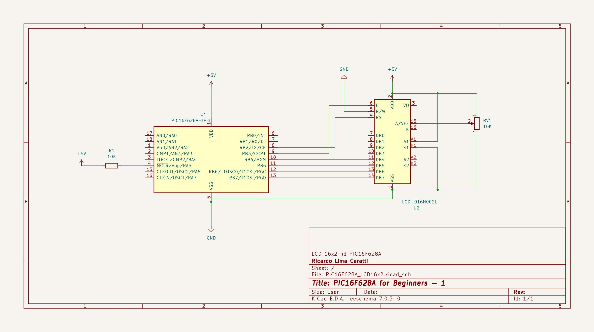
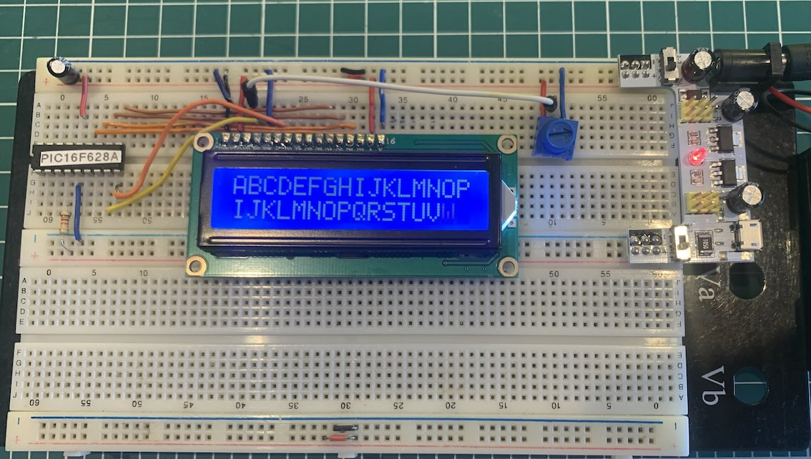

# PIC16F628A and LCD16x2 example

## Content 

1. [LCD 16x2 and PIC16F628A Interface (schematic)](#lcd-16x2-and-pic16f628a-interface-schematic)
    * [KiCad Schematic](./KiCad/)
2. [PIC16F628A PINOUT](#pic16f628a-pinout)
3. [PIC16F628A and LC16x2 prototype](#pic16f628a-and-lc16x2-prototype)
4. [LCD16x2 library implementation](../lcd_library/)
5. [MPLAB X IDE examples](./MPLAB_EXAMPLES/)
6. [References](#references)

# LCD 16x2 and PIC16F628A Interface (schematic)

## PIC16F628A PINOUT

## PIC16F628A and LC16x2 prototype 

## References

