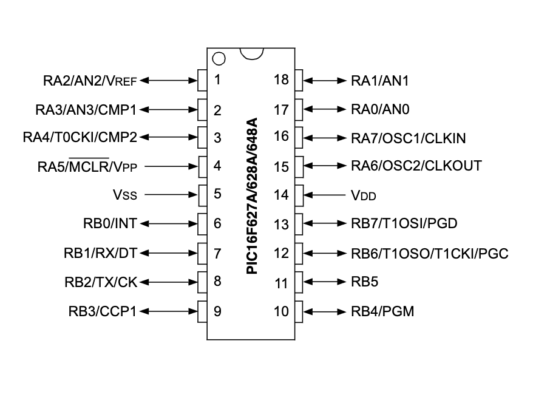

# PIC16F628A and LCD16x2 example

## Content 

1. [LCD 16x2 and PIC16F628A Interface (schematic)](#lcd-16x2-and-pic16f628a-interface-schematic)
    * [KiCad Schematic](./KiCad/)
2. [PIC16F628A PINOUT](#pic16f628a-pinout)
3. [PIC16F628A and LC16x2 prototype](#pic16f628a-and-lc16x2-prototype)
4. [LCD16x2 library implementation](../lcd_library/)
5. [MPLAB X IDE examples](./MPLAB_EXAMPLES/)
6. [References](#references)

# LCD 16x2 and PIC16F628A Interface (schematic)

## PIC16F628A PINOUT

## PIC16F628A and LC16x2 prototype 

## References

* [LCD16x2 implementation](../lcd_library/)
* [PIC16F627A/628A/648A Data Sheet](https://ww1.microchip.com/downloads/en/DeviceDoc/40044G.pdf)
* [MPLAB® XC8 C Compiler User’s Guide](https://ww1.microchip.com/downloads/en/devicedoc/50002053g.pdf)
* [MPASMTM Assembler, MPLINKTM Object Linker, MPLIBTM Object Librarian User’s Guide](https://ww1.microchip.com/downloads/en/DeviceDoc/33014L.pdf)
* [MPLAB® XC8 PIC® Assembler User's Guide](https://ww1.microchip.com/downloads/en/DeviceDoc/MPLAB%20XC8%20PIC%20Assembler%20User%27s%20Guide%2050002974A.pdf)
* [Simulator](https://onlinedocs.microchip.com/pr/GUID-240F27AA-C615-4705-B68C-6E434B126B47-en-US-1/index.html?GUID-95DA81C7-47DF-4C86-BC12-0D9D018909C3)

