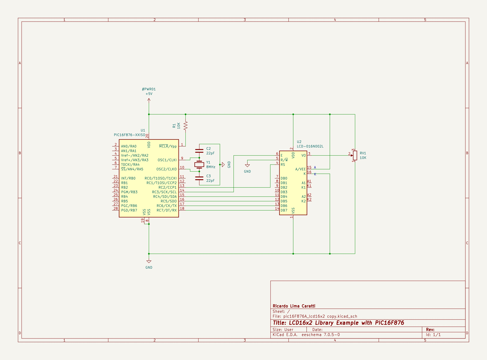
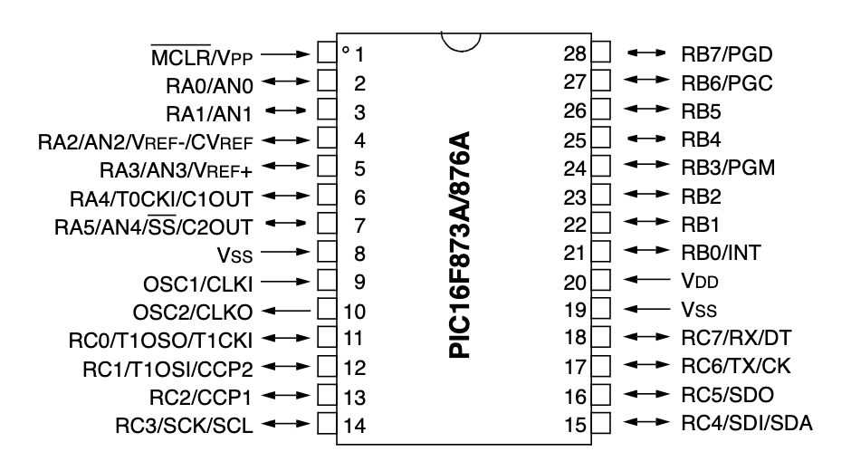

# PIC16F876A and LCD 16x2 Interface

## Content 

1. [LCD 16x2 and PIC16F876A Interface (schematic)](#lcd-16x2-and-pic16f876a-interface-schematic)
    * [KiCad Schematic](./KiCad/)
2. [PIC16F876A PINOUT](#pic16f876a-pinout)
4. [LCD16x2 library implementation](../lcd_library/)
5. [MPLAB X IDE examples](./MPLAB_EXAMPLES/)
6. [References](#references)

## LCD 16x2 and PIC16F876A Interface (schematic)

## PIC16F876A PINOUT

## References

* [PIC16F87XA Data Sheet 28/40/44-Pin Enhanced Flash Microcontrollers](https://ww1.microchip.com/downloads/en/devicedoc/39582b.pdf)
* [LCD 16x2 library implementation](../lcd_library/)

