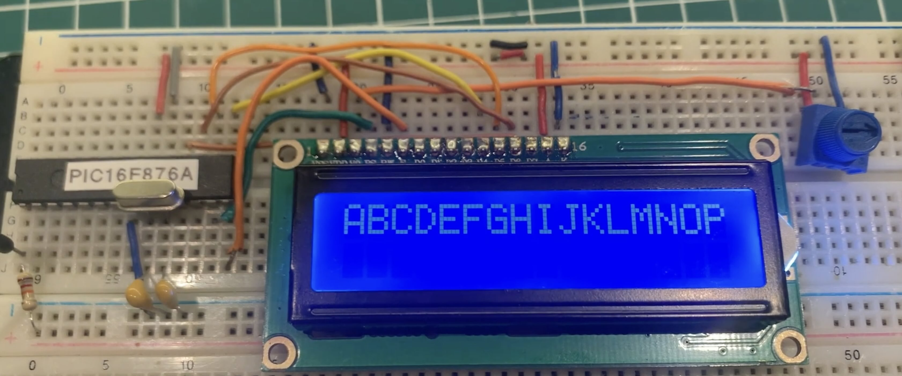

# PIC16F876A and LCD 16x2 Interface

## Content 

1. [LCD 16x2 and PIC16F876A Interface (schematic)](#lcd-16x2-and-pic16f876a-interface-schematic)
    * [KiCad Schematic](./KiCad/)
2. [PIC16F876A PINOUT](#pic16f876a-pinout)
3. [ LCD 16x2 and PIC16F876A Interface  prototype](#lcd-16x2-and-pic16f876a-interface-prototype)
4. [LCD16x2 library implementation](../lcd_library/)
5. [MPLAB X IDE examples](./MPLAB_EXAMPLES/)
6. [References](#references)

## LCD 16x2 and PIC16F876A Interface (schematic)

## PIC16F876A PINOUT

## LCD 16x2 and PIC16F876A Interface  prototype

If you've found value in this repository, please consider contributing. Your support will assist me in acquiring new components and equipment, as well as maintaining the essential infrastructure for the development of future projects. [Click here](https://www.paypal.com/donate/?business=LLV4PHKTXC4JW&no_recurring=0&item_name=Your+support+will+assist+me+in++maintaining+the+essential+infrastructure+for+the+development+of+future+projects.+&currency_code=BRL) to make a donation or scan the QR code provided below. 

## References

* [PIC16F87XA Data Sheet 28/40/44-Pin Enhanced Flash Microcontrollers](https://ww1.microchip.com/downloads/en/devicedoc/39582b.pdf)
* [LCD 16x2 library implementation](../lcd_library/)

