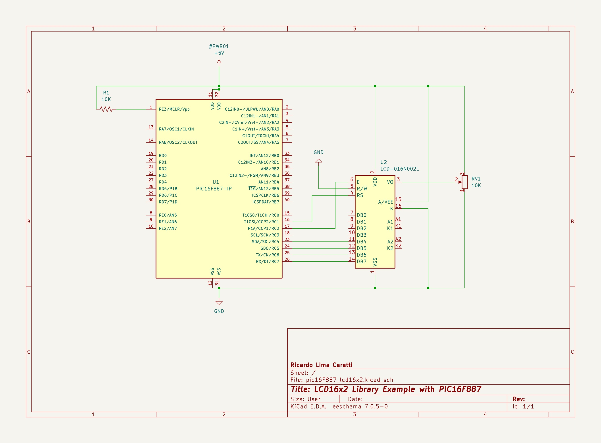
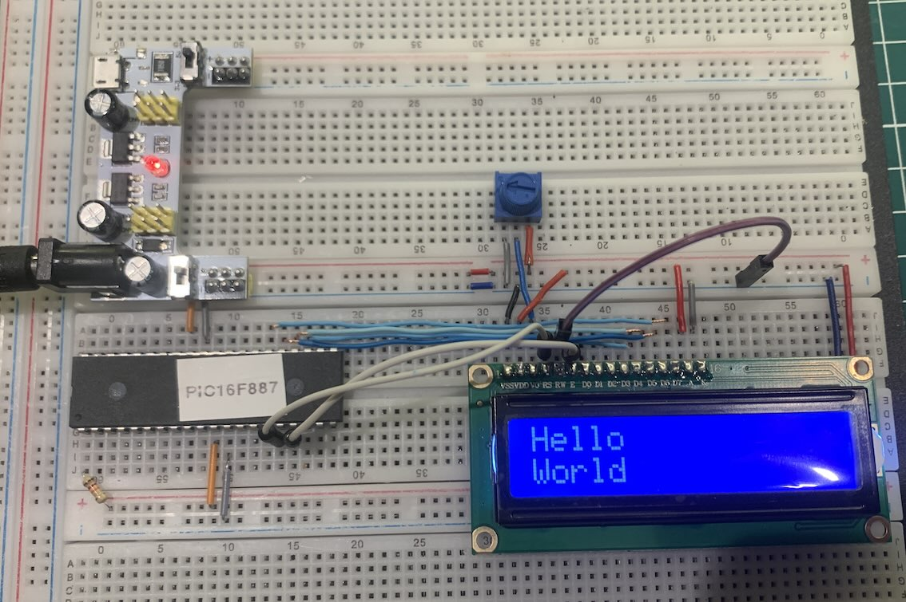

# PIC16F887 and LCD16x2 Interface

## Content

1. [LCD 16x2 and PIC16F887 Interface (schematic)](#lcd-16x2-and-pic16f887-interface-schematic)
    [KiCad Schematic](./KiCad/)
2. [PIC16F887 PINOUT](#pic16f887-pinout)
3. [LCD 16x2 and PIC16F887 prototype](#lcd-16x2-and-pic16f887-prototype)
4. [MPLAB X IDE EXample](./MPLAB_EXAMPLES/)
5. [References](#references)

## LCD 16x2 and PIC16F887 Interface (schematic)

## PIC16F887 PINOUT

## LCD 16x2 and PIC16F887 prototype

## References

1. [LCD 16x2 library implementation](../lcd_library/)
2. [PIC16F882/883/884/886/887 Data Sheet](http://ww1.microchip.com/downloads/en/devicedoc/41291d.pdf)

