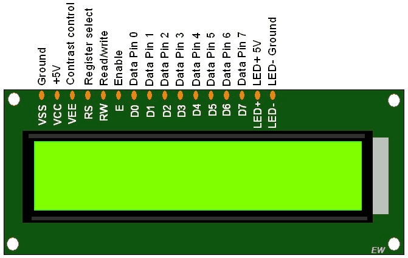
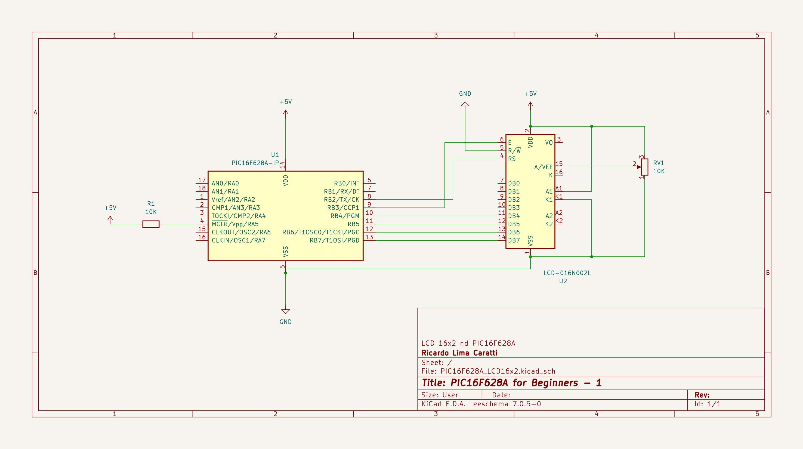
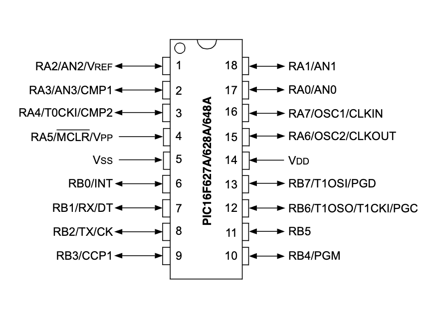
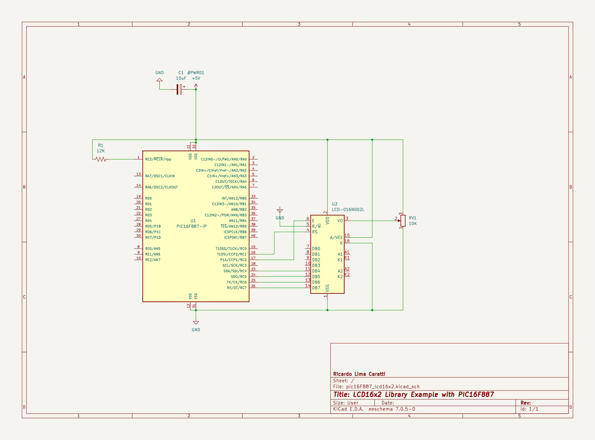

# PIC16F628A and LCD 16 x 2

This project includes, in addition to basic information for controlling the 16x2 LCD, a library that has been specially developed to work with microcontrollers from the PIC16F line. See the [lcd_library](./lcd_library)  folder for more details.

The main goal here is to reduce the developer's effort in searching for or adapting an existing solution.

## LCD 16x2 PINOUT

| Pin No. | Name | Description                                         |
|---------|------|-----------------------------------------------------|
| 1       | VSS  | Ground                                              |
| 2       | VDD  | Power supply, typically +5V                         |
| 3       | VE   | Contrast adjustment, often connected to a potentiometer |
| 4       | RS   | Register Select - low for command, high for data    |
| 5       | R/W  | Read/Write - low for write, high for read           |
| 6       | E    | Enable - activates the display at the rising edge   |
| 7-14    | D0-D7| Data pins - 8-bit mode uses all, 4-bit mode uses D4-D7 |
| 15      | A    | Anode for backlight LED (if present)                |
| 16      | K    | Cathode for backlight LED (if present)              |

## LCD 16x02 library for PIC16F family

This folder contains an implementation of a C library for controlling the 16x2 LCD. See the [lcd_library](./lcd_library) folder .

## LCD 16x2 and PIC16F628A Interface (schematic)

### PIC16F628A PINOUT

## LCD 16x2 and PIC16F887 Interface (schematic)

### PIC16F887 PINOUT

## References

* [PIC - 16F628A - LCD16x2/20x4 (HD44780) Caractere Personalizado - MPLAB - XC8](https://www.youtube.com/watch?v=cSilHqW9k3U)
* [Interfacing an LCD Display | MPLAB XC8 for Beginners Tutorial](https://youtu.be/u2VPLtELzZ4?si=RauXd0Ug4RccfLn9)
* [Interfacing I2C LCD 16×2 Tutorial With PIC Microcontrollers | MPLAB XC8](https://deepbluembedded.com/interfacing-i2c-lcd-16x2-tutorial-with-pic-microcontrollers-mplab-xc8/)
[16×2 LCD Interfacing with PIC Microcontroller – Examples](https://microcontrollerslab.com/lcd-interfacing-pic16f877a-microcontroller/)
* [16*2 LCD Interfacing with PIC Microcontroller in 8-bit Mode](https://aticleworld.com/162-lcd-interfacing-with-pic-microcontroller-in-8-bit-mode/)
* [TEMPORIZADOR DE 4 CANAIS INDEPENDENTES – C/ PIC 16F628A E LCD 16X2 (REF264)](http://picsource.com.br/archives/10215)
* [Ligando Display LCD 16×2 ao PIC 16F628A](https://www.makerhero.com/blog/display-lcd-16x2-pic-16f628a/)
