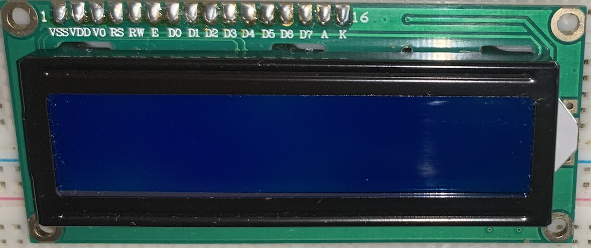
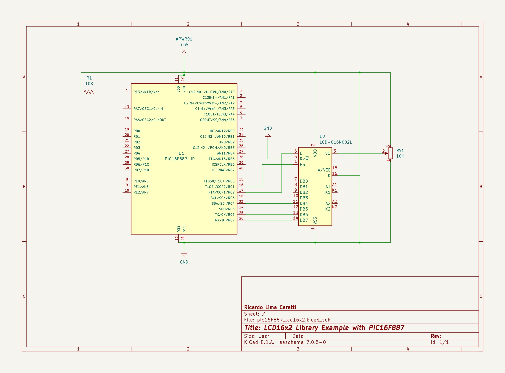

# PIC16F628A and LCD 16 x 2

This project includes, in addition to basic information for controlling the 16x2 LCD, a library that has been specially developed to work with microcontrollers from the PIC16F line. See the [lcd_library](./lcd_library)  folder for more details.

The main goal here is to reduce the developer's effort in searching for or adapting an existing solution.

## LCD 16x2 PINOUT

| Pin No. | Name   | Description                                         |
|---------|------  |-----------------------------------------------------|
| 1       | VSS    | Ground                                              |
| 2       | VDD    | Power supply, typically +5V                         |
| 3       | VEE/VO | Contrast adjustment, often connected to a potentiometer |
| 4       | RS     | Register Select - low for command, high for data    |
| 5       | R/W    | Read/Write - low for write, high for read  - Conected to the GND  |
| 6       | E      | Enable - activates the display at the rising edge   |
| 7-14    | D0-D7  | Data pins - 8-bit mode uses all, 4-bit mode uses D4-D7 |
| 15      | A      | Anode for backlight LED (if present)    - Connected to VCC      |
| 16      | K      | Cathode for backlight LED (if present)  - Connected to the GND  |

### HD44780 LCD Controller Description

This LCD is based on the HD44780 controller. The HD44780 or its compatible variants are the most commonly used controllers in 16x2 LCD modules. Originally developed by Hitachi, the HD44780 has become the "de facto" standard for alphanumeric LCD controllers due to its ease of use, versatility, and widespread availability.

**Features of the HD44780:**

1. **Communication Interface**: The HD44780 allows for both 4-bit and 8-bit communication modes, meaning you can use either 4 or 8 data lines to send commands and data to the display. 

2. **Character Support**: Typically supports the display of a range of ASCII, Japanese, and European characters.

3. **Display Control**: Provides functionalities for cursor control, display clearing and controlling text, among other useful features for manipulating the display.

4. **Custom Character Creation**: Allows the creation of custom characters in CGRAM (Character Generator RAM) locations.

5. **Standard Commands**: Includes a set of standard commands for controlling various LCD functions, such as initialization, display mode setting, cursor positioning, etc.

### HD44780 Command Set Table 

| Command | Hex Code | Description                                      |
|---------|----------|--------------------------------------------------|
| Clear Display | 0x01 | Clears the display and returns cursor to the home position. |
| Return Home | 0x02 | Returns cursor to home position (upper left corner). |
| Entry Mode Set | 0x04 | Sets the cursor move direction and specifies display shift. |
| Display On/Off Control | 0x08 | Controls the display, cursor, and blinking. |
| Cursor or Display Shift | 0x10 | Moves the cursor and shifts display without changing DDRAM contents. |
| Function Set | 0x20 | Sets interface data length (4 or 8 bits), number of display lines, and character font. |
| Set CGRAM Address | 0x40 | Sets the CGRAM address for custom character creation. |
| Set DDRAM Address | 0x80 | Sets the DDRAM address for cursor position. |

The HD44780's command set allows for comprehensive control over the LCD's behavior, making it suitable for a wide range of applications.

#### More information about HD44780
[Hitachi HD44780 LCD controller](https://en.wikipedia.org/wiki/Hitachi_HD44780_LCD_controller)
[HD44780U (LCD-II) Datasheet](https://www.sparkfun.com/datasheets/LCD/HD44780.pdf)

## LCD 16x02 library for PIC16F family

This folder contains an implementation of a C library for controlling the 16x2 LCD. See the [lcd_library](./lcd_library) folder .

## LCD 16x2 and PIC16F628A Interface (schematic)

### PIC16F628A PINOUT

## LCD 16x2 and PIC16F887 Interface (schematic)

### PIC16F887 PINOUT

## References

* [PIC - 16F628A - LCD16x2/20x4 (HD44780) Caractere Personalizado - MPLAB - XC8](https://www.youtube.com/watch?v=cSilHqW9k3U)
* [Interfacing an LCD Display | MPLAB XC8 for Beginners Tutorial](https://youtu.be/u2VPLtELzZ4?si=RauXd0Ug4RccfLn9)
* [Interfacing I2C LCD 16×2 Tutorial With PIC Microcontrollers | MPLAB XC8](https://deepbluembedded.com/interfacing-i2c-lcd-16x2-tutorial-with-pic-microcontrollers-mplab-xc8/)
[16×2 LCD Interfacing with PIC Microcontroller – Examples](https://microcontrollerslab.com/lcd-interfacing-pic16f877a-microcontroller/)
* [16*2 LCD Interfacing with PIC Microcontroller in 8-bit Mode](https://aticleworld.com/162-lcd-interfacing-with-pic-microcontroller-in-8-bit-mode/)
* [TEMPORIZADOR DE 4 CANAIS INDEPENDENTES – C/ PIC 16F628A E LCD 16X2 (REF264)](http://picsource.com.br/archives/10215)
* [Ligando Display LCD 16×2 ao PIC 16F628A](https://www.makerhero.com/blog/display-lcd-16x2-pic-16f628a/)
