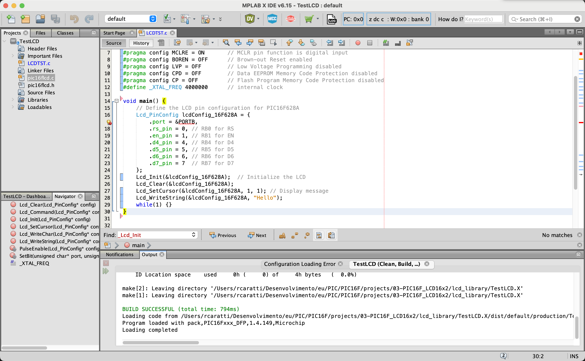

# LCD 16 x 2 PIC16F Library

This small 16x2 LCD library is intended to support the entire PIC16F line. However, the tests conducted covered only three microcontrollers: [PIC16F628A](../PIC16F628A/), [PIC16F876A](../PIC16F876A/), and [PIC16F887](../PIC16F887/).


This library can be freely distributed using the MIT Free Software model. By using or installing Library you are agreeing to the terms of the MIT licence.


## About LCD16x2 Library for PIC Microcontrollers

**1. Compatibility with HD44780 Controller:**
   - The library is designed to interface with LCDs based on the popular HD44780 controller, which is widely used in 16x2 character displays.

**2. Customizable Pin Configuration:**
   - Users can define which pins of the PIC microcontroller are connected to the LCD's control and data lines. This flexibility allows the library to be adapted to different hardware setups.

**3. 4-Bit Mode Operation:**
   - The library operates the LCD in 4-bit mode, reducing the number of I/O pins required from the microcontroller. This mode sends data to the LCD in two halves (nibbles), making efficient use of limited I/O resources.

**4. Basic Text Display Functions:**
   - Includes functions for essential operations like initializing the display (`Lcd_Init`), clearing the screen (`Lcd_Clear`), and setting the cursor position (`Lcd_SetCursor`).

**5. String Display Capability:**
   - Users can easily display strings of text on the LCD using the `Lcd_WriteString` function. This function automates the process of displaying each character in a string.

**6. Custom Character Support:**
   - The library supports the creation and display of custom characters. Users can define up to 8 custom characters (5x8 pixel matrix) and display them on the screen using `Lcd_CreateChar` and `Lcd_Char` functions.

**7. Simple and Modular API:**
   - The API design of the library is straightforward and modular, making it easy to understand and integrate into various projects.

**8. Developed for PIC Microcontrollers:**
   - Specifically tailored for use with PIC microcontrollers, making it suitable for a wide range of applications, from hobby projects to more complex embedded systems.

**9. Efficient Use of Resources:**
   - The library is designed with efficiency in mind, making it suitable for resource-constrained environments typical of microcontroller applications.

**10. Clear and Documented Code:**
   - The source code is well-documented and easy to read, facilitating modifications, upgrades, or debugging by users.

This LCD library offers a versatile and user-friendly way to incorporate text and custom character display functionalities into projects using 16x2 LCD screens and PIC microcontrollers. Whether for educational purposes, hobbyist projects, or professional applications, this library provides a solid foundation for developing LCD-based interfaces.


## About the library developed here

The primary purpose of this library is to provide flexible use of the 16x2 LCD across various microcontrollers in the PIC16F series without binding the connections to predetermined ports and pins. This allows users to select the port and pins as per their project's convenience. However, although the developer has endeavored to optimize the code, it is possible that this library may significantly increase the size of the final code (hex), potentially making it unsuitable for smaller microcontrollers.

## Function summary

| Function Name | Description | 
| ------------- | ------------|
| void Lcd_Init(Lcd_PinConfig *config) | Initiates the LCD device |
| void Lcd_Command(Lcd_PinConfig *config, unsigned char cmd) | Sends a command to the HD44780 controller|
| void Lcd_Clear(Lcd_PinConfig *config) | Clear the Display |
| void Lcd_SetCursor(Lcd_PinConfig *config, unsigned char row, unsigned char column) | Sets the cursor position |
| void Lcd_WriteChar(Lcd_PinConfig *config, unsigned char data) | Writes a char |
| void Lcd_WriteString(Lcd_PinConfig *config, char *str) | Writes a String | 
| void Lcd_CreateCustomChar(Lcd_PinConfig *config, unsigned char location, unsigned char *charmap) | Defines a custom char |
| void inline Lcd_WriteCustomChar(Lcd_PinConfig *config, unsigned char location) | Writes a custom char |

**OBS: *config is a point declaration to the PORT that will be used to controll the display**


## PIC16F628A example

```cpp
#include <xc.h>
#include "pic16flcd.h"

#pragma config FOSC = INTOSCIO  // Internal oscillator.
#pragma config WDTE = OFF       // Watchdog Timer disabled 
#pragma config PWRTE = OFF      // Power-up Timer disable
#pragma config MCLRE = ON       // MCLR pin function is digital input
#pragma config BOREN = OFF      // Brown-out Reset enabled
#pragma config LVP = OFF        // Low Voltage Programming disabled
#pragma config CPD = OFF        // Data EEPROM Memory Code Protection disabled
#pragma config CP = OFF         // Flash Program Memory Code Protection disabled
#define _XTAL_FREQ 4000000      // internal clock

void main() {
    char i;
    TRISB = 0x00; // You need to set this register to output
    // Define the LCD pin configuration for PIC16F628A
    Lcd_PinConfig lcd = {
        .port = &PORTB,  // Port to be used to control the LCD 
        .rs_pin = 2,     // RB2 for RS
        .en_pin = 3,     // RB3 for EN
        .d4_pin = 4,     // RB4 for D4
        .d5_pin = 5,     // RB5 for D5
        .d6_pin = 6,     // RB6 for D6
        .d7_pin = 7      // RB7 for D7
    };
    Lcd_Init(&lcd);  // Initialize the LCD
    Lcd_Clear(&lcd); 
    Lcd_SetCursor(&lcd, 1, 1); // Display message (Line 1 and Column 1)
    Lcd_WriteString(&lcd, "Hello");
    Lcd_SetCursor(&lcd, 2, 1); // Display message (Line 2 and Column 2)
    Lcd_WriteString(&lcd, "World");
    __delay_ms(10000); 
    while(1) {
        Lcd_Clear(&lcd); 
        for (i = 1; i <= 16; i++) {
            Lcd_SetCursor(&lcd, 1, i); 
            Lcd_WriteChar(&lcd,'A' + (i-1));
            __delay_ms(500);
        }
        __delay_ms(5000); 

        for (i = 1; i <= 16; i++) {
            Lcd_SetCursor(&lcd, 2, i); 
            Lcd_WriteChar(&lcd,'I' + (i-1));
            __delay_ms(500);
        }  
        __delay_ms(5000);
    }
}
```


## PIC16F876A example

```cpp
#include <xc.h>
#include "pic16flcd.h"


#pragma config FOSC = HS      // 
#pragma config WDTE = OFF       // Watchdog Timer disabled 
#pragma config PWRTE = OFF      // Power-up Timer disabled
#pragma config BOREN = OFF      // Brown-out Reset disabled
#pragma config LVP = OFF        // Low Voltage Programming disabled
#pragma config CPD = OFF        // Data EEPROM Memory Code Protection disabled
#pragma config CP = OFF         // Flash Program Memory Code Protection disabled


#define _XTAL_FREQ 8000000      // internal clock


/**
 Custom Char (Smile / happy face)
 */
unsigned char smiley[8] = {
    0b00000,
    0b01010,
    0b01010,
    0b00000,
    0b10001,
    0b01110,
    0b00000,
    0b00000
};

/**
 Custom char (sad face)
 */
unsigned char sad[8] = {
    0b00000,
    0b01010,
    0b01010,
    0b00000,
    0b00000,
    0b01110,
    0b10001,
    0b00000
};

void main() {
    char i;


    // Define the LCD pin configuration for PIC16F887
    TRISC = 0; // You need to set this register to output
    Lcd_PinConfig lcd = {
        .port = &PORTC, // Assuming you're using PORTC for LCD on PIC16F887
        .rs_pin = 2, // RD0 for RS
        .en_pin = 3, // RD1 for EN
        .d4_pin = 4, // RD4 for D4
        .d5_pin = 5, // RD5 for D5
        .d6_pin = 6, // RD6 for D6
        .d7_pin = 7 // RD7 for D7
    };

    // Initialize the LCD
    Lcd_Init(&lcd);
    Lcd_Clear(&lcd);

    // Display message
    Lcd_SetCursor(&lcd, 1, 1);
    Lcd_WriteString(&lcd, "Hello");
    Lcd_SetCursor(&lcd, 2, 1);
    Lcd_WriteString(&lcd, "World");
    __delay_ms(5000);

    Lcd_Clear(&lcd);
    // Creating the character
    Lcd_CreateCustomChar(&lcd, 0, smiley);
    Lcd_CreateCustomChar(&lcd, 1, sad);    
    // Displaying the character
    Lcd_SetCursor(&lcd, 1, 1);
    Lcd_WriteCustomChar(&lcd, 0);
    __delay_ms(5000);

    while (1) {
        Lcd_Clear(&lcd);
        for (i = 1; i <= 16; i++) {
            Lcd_SetCursor(&lcd, 1, i);
            Lcd_WriteChar(&lcd, 'A' + (i - 1));
            __delay_ms(150);
        }
        __delay_ms(2000);

        for (i = 1; i <= 16; i++) {
            Lcd_SetCursor(&lcd, 2, i);
            Lcd_WriteChar(&lcd, 'Q' + (i - 1));
            __delay_ms(150);
        }
        __delay_ms(2000);
        for (i = 1; i <= 16; i++) {
            Lcd_SetCursor(&lcd, 1, i);
            Lcd_WriteCustomChar(&lcd, 0); // Happy face
            __delay_ms(150);
            Lcd_SetCursor(&lcd, 2, i);
            Lcd_WriteCustomChar(&lcd, 1); // Sad face
            __delay_ms(200);
        }
        __delay_ms(2000);
    }
}

```

## PIC16F887 example

```cpp
#include <xc.h>
#include "pic16flcd.h"

#pragma config FOSC = INTRC_NOCLKOUT
#pragma config WDTE = OFF       // Watchdog Timer disabled 
#pragma config PWRTE = OFF      // Power-up Timer disable
#pragma config MCLRE = ON       // MCLR pin function is digital input
#pragma config BOREN = OFF      // Brown-out Reset enabled
#pragma config LVP = OFF        // Low Voltage Programming disabled
#pragma config CPD = OFF        // Data EEPROM Memory Code Protection disabled
#pragma config CP = OFF         // Flash Program Memory Code Protection disabled

#define _XTAL_FREQ 4000000      // internal clock

void main() {
    // Define the LCD pin configuration for PIC16F887
    TRISC = 0; // You need to set this register as output
    Lcd_PinConfig lcd = {
        .port = &PORTC, // Assuming you're using PORTC for LCD on PIC16F887
        .rs_pin = 1, // RC0 for RS
        .en_pin = 2, // RC1 for EN
        .d4_pin = 4, // RC4 for D4
        .d5_pin = 5, // RC5 for D5
        .d6_pin = 6, // RC6 for D6
        .d7_pin = 7  // RC7 for D7
    };

    // Initialize the LCD
    Lcd_Init(&lcd);
    Lcd_Clear(&lcd);

    // Display message
    Lcd_SetCursor(&lcd, 1, 1);
    Lcd_WriteString(&lcd, "Hello");
    Lcd_SetCursor(&lcd, 2, 1);
    Lcd_WriteString(&lcd, "World");

    while(1) {
        // Main loop
    }
}
```


#### PIC16F628A and LCD16x2 Prototype


## PIC16F887 example

```cpp
#include <xc.h>
#include "pic16flcd.h"

#pragma config FOSC = INTRC_NOCLKOUT
#pragma config WDTE = OFF       // Watchdog Timer disabled 
#pragma config PWRTE = OFF      // Power-up Timer disable
#pragma config MCLRE = ON       // MCLR pin function is digital input
#pragma config BOREN = OFF      // Brown-out Reset enabled
#pragma config LVP = OFF        // Low Voltage Programming disabled
#pragma config CPD = OFF        // Data EEPROM Memory Code Protection disabled
#pragma config CP = OFF         // Flash Program Memory Code Protection disabled

#define _XTAL_FREQ 4000000      // internal clock

void main() {
    // Define the LCD pin configuration for PIC16F887
    TRISC = 0; // You need to set this register to output
    Lcd_PinConfig lcd = {
        .port = &PORTC, // Assuming you're using PORTC for LCD on PIC16F887
        .rs_pin = 1, // RC0 for RS
        .en_pin = 2, // RC1 for EN
        .d4_pin = 4, // RC4 for D4
        .d5_pin = 5, // RC5 for D5
        .d6_pin = 6, // RC6 for D6
        .d7_pin = 7  // RC7 for D7
    };

    // Initialize the LCD
    Lcd_Init(&lcd);
    Lcd_Clear(&lcd);

    // Display message
    Lcd_SetCursor(&lcdConfig_16F887, 1, 1);
    Lcd_WriteString(&lcdConfig_16F887, "Hello");
    Lcd_SetCursor(&lcdConfig_16F887, 2, 1);
    Lcd_WriteString(&lcdConfig_16F887, "World");

    while(1) {
        // Main loop
    }
}

```

#### PIC16F887 and LCD16x2 Prototype


# Compiling and Linking a Library with the `main` C File in MPLAB X using XC8

#### 1. Organize Your Files

Ensure that all your source (`.c`) and header (`.h`) files are properly organized in your project. This includes:

- The LCD library files (e.g., `pic16flcd.c` and `pic16flcd.h`).
- The main file (e.g., `main.c`) that contains the `main()` function.

#### 2. Include the Header Files

In your `main.c` file, include the header file for your LCD library:

```c
#include "pic16flcd.h"
```

This allows `main.c` to recognize the functions and types defined in your LCD library.

#### 3. Add Files to the MPLAB X Project

In the MPLAB X IDE:

- Right-click on your project name in the "Projects" window.
- Choose "Add Existing Item" and select your `.c` and `.h` files.

This adds your files to the project and ensures they are compiled and linked correctly.

#### 4. Compile the Project

Use the build tool in MPLAB X to compile your project:

- Click on the "Build Main Project" button (hammer icon) in the toolbar, or go to "Run" → "Build Main Project" from the top menu.

MPLAB X will compile all `.c` files in the project and link them together. If your LCD library and `main.c` are correctly written and configured, the compilation should complete without errors.

#### 5. Load and Run on the Microcontroller

After successful compilation, you can load the program onto your PIC microcontroller:

- Connect your programmer/debugger (like PICkit, ICD, MPLAB Snap) to your computer and microcontroller.
- Use MPLAB X to upload the compiled program to the microcontroller.

#### Additional Tips

- Ensure all project settings (like the correct microcontroller selection and clock settings) are correct.
- If you encounter compilation errors, carefully review the error messages to understand what needs to be fixed.
- If you are using external or custom libraries like the LCD library, make sure dependencies (like header files) are accessible and correctly referenced in your code.


#### The image below shows the MPLAB X IDE setup





## Video

* [My PIC Journey: LCD 16x2  LIBRARY FOR PIC16F FAMILY](https://youtu.be/S3VwKLk5j5g)


