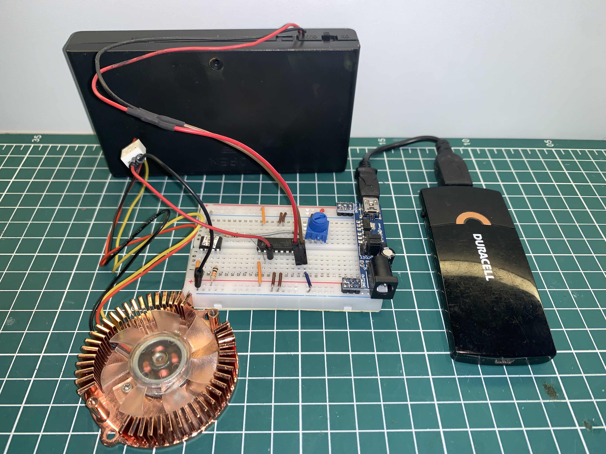

# Generating PWM with PIC12F675 and interrupt resource.

## Content

- [About this experiment](#about-this-experiment)
- [Schematic](#schematics)
  * [KiCad schematic](./KiCad/)
- [About the PIC12675](#about-the-pic12675)
- [Prototype](#prototype)
- [MPLAB X Example](./MPLAB_EXAMPLE/)      
- [References](#references)

## About this experiment

In this experiment, a fan speed (or PWM signal) will be controlled by the analog value obtained from one of the ADC interfaces of the PIC12F675 microcontroller. This analog value can be acquired from a potentiometer, a photoresistor, or even a sensor like the LM35. For example: based on the analog value read, the fan speed can be adjusted proportionally to the increase in temperature measured by the sensor. Minimum and maximum limits for the fan speed can be defined. Thus, if the temperature is below 20°C, the fan will not operate, and if the temperature is above 60°C, the fan will reach its maximum speed.

The key aspect of this experiment is that regardless of what is connected to the analog input of the microcontroller, the generated PWM signal will be able to vary in real time according to the value of the received analog signal.
Again, if you use a temperature sensor, you can configure it for temperatures below 20°C, the cooler will not run and for temperatures above 60°C, the cooler will reach its maximum speed.

To control the fan speed (or PWM signal) effectively, the interrupt feature of the PIC12F675 microcontroller can be utilized in conjunction with the internal timer function. In this setup, whenever the internal counter (Timer0) overflows, a function responsible for controlling the signal level of a digital output pin on the PIC12F675 will be executed. This method allows for a more accurate simulation of a PWM output on a digital output pin of the PIC12F675.

The pulse width (PWM) will vary according to the voltage input value, enabling real-time adjustment of the fan speed.

## Schematics 

### PWM General example schematic

### Schematic - L293D H-bridge with DC MOTOR controlled by PIC12F675 via PWM

### PWM and 4-wires Cooler and PIC12F675 schematic

### About the PIC12675

The PIC12F675 is a compact and versatile 8-bit microcontroller from Microchip Technology, belonging to the popular PIC12F series. It's known for its small size and low power consumption, making it ideal for space-constrained and power-sensitive applications. The PIC12F675 features 1 KB of flash memory, 64 bytes of EEPROM, and 128 bytes of RAM, along with an onboard 10-bit Analog-to-Digital Converter (ADC), Interrupt capability, 8-level deep hardware stack, which is quite impressive for its size.

## Prototype

## Contribution

If you've found value in this repository, please consider contributing. Your support will assist me in acquiring new components and equipment, as well as maintaining the essential infrastructure for the development of future projects. [Click here](https://www.paypal.com/donate/?business=LLV4PHKTXC4JW&no_recurring=0&item_name=Your+support+will+assist+me+in++maintaining+the+essential+infrastructure+for+the+development+of+future+projects.+&currency_code=BRL) to make a donation or scan the QR code provided below. 

## References

* [PWM pulse generation using PIC12F675 micro-controller](https://labprojectsbd.com/2021/03/31/pwm-pulse-generation-using-pic12f675-micro-controller/)
* [PIC12F675 PWM Code + Proteus Simulation](https://saeedsolutions.blogspot.com/2012/07/pic12f675-pwm-code-proteus-simulation.html)
* [PIC Microcontroller Assembly PIC16F877A](https://github.com/Devilbinder/PIC_Microcontroller_Assembly_PIC16F877A/tree/main)
* [Interrupts](https://picguides.com/beginner/interrupts.php)

