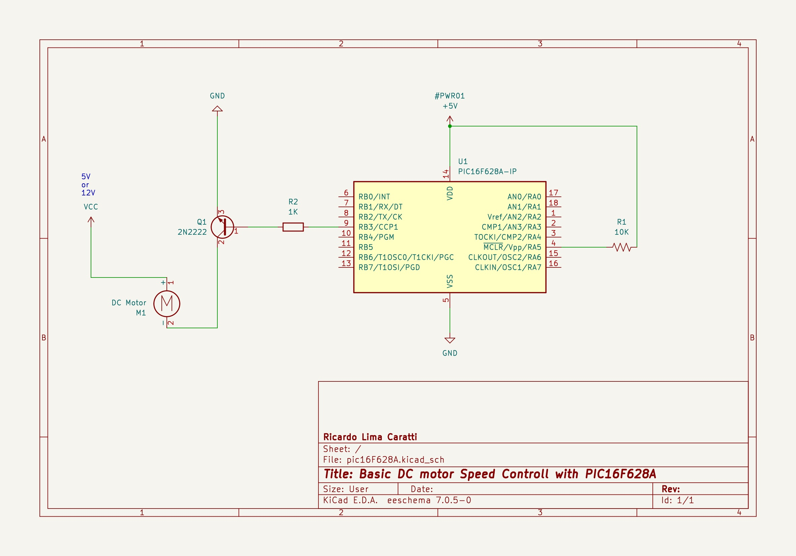

# Controlling a DC Motor/Cooler speed with PWM with PIC16FXXXX

To control a motor using PWM you will need to set up a circuit with a transistor as the motor driver. 

This page demonstrates how to control a DC Motor using both [PIC16F628A](./PIC16F628A/) and [PIC16F887](./PIC16F887/) microcontrollers. The examples provided will guide you through setting up the circuit and writing the code in C. In the case of the PIC16F887, the example leverages the microcontroller's ADC capabilities with a potentiometer to control the motor speed.

## Content

1. [Circuit setting up](#circuit-setting-up)
2. [NPN Transistor Configuration as Motor Driver](#npn-transistor-configuration-as-motor-driver)
3. [Example schematic using PIC16F628A](#example-schematic-using-pic16f628a)
3. [PIC16F628A project](./PIC16F628A/)
4. [PIC16F887 project](./PIC16F887/)
5. [References](#references)

## Circuit setting up

**Microcontrollers in general do not provide the necessary power to drive a motor.** Therefore, to make a system controlled by a PIC16F drive a motor, it is necessary to introduce other components to the circuit so that the motor receives the necessary power to operate. **For this project, a small NPN transistor (2N2222), a resistor, and a battery were added to power the DC motor.** More details about this configuration can be seen below.

## NPN Transistor Configuration as Motor Driver

   To control a DC motor, you can use an NPN transistor as a switch to control the motor current.

   - **NPN Transistor**: For example, a 2N2222.
   - **Motor**: A small DC motor.
   - **Recomended Flyback Diode**: For example, a 1N4001, connected in parallel with the motor to protect against voltage spikes.
   - **Base Resistor**: A resistor (for example, 1kΩ) between the PIC's output pin and the transistor's base to limit the current.

   **Connections**:
   
   - **Collector**: Connect to the motor's negative terminal.
   - **Emitter**: Connect to ground (GND).
   - **Base**: Connect to the PIC's output pin (through the base resistor).
   - **Motor**: Connect the motor's positive terminal to the motor's power supply, and the negative terminal to the transistor's collector.
   - **Optional Flyback Diode**: Connect the anode to the transistor's collector and the cathode to the motor's power supply (positive).

The schematic below shows details about the motor driver setup

### Example schematic using PIC16F628A

## Videos

* [DC motor/Cooler Speed Control with PIC16F628A and PIC16F887 (PWM and ADC)](https://youtu.be/RM2rGSNFbnE?si=7IPWDkQ1TA2Rkbl3)  
* [Controlling a 4-wire Cooler speed with PIC16F887 and LM35](https://youtu.be/syesvTctcGU?si=Fy1Pn-VaLknk3b1a)
* [PIC16F887 and 4-wires Cooler (RPM and PWM)](https://youtu.be/wtlIkMznqZs?si=gURe0sVEsNo2-0Rt)
* [PIC16F887 4-wires cooler and lm35 (speed control)](https://youtu.be/tcfnGvOMjok?si=n8i5ELgjX5F_GZrF)

## References

* [How to Drive a DC Motor with a BJT Transistor](https://www.techzorro.com/en/blog/how-to-drive-a-dc-motor-with-a-bjt-transistor/)
* [Driving DC Motors with Microcontrollers](https://dronebotworkshop.com/dc-motor-drivers/)
* [Introduction to Bipolar Junction Transistors (BJTs) | Basic Electronics](https://youtu.be/lMmJenzKYS8?si=ZfMs-jVsEGGM33go)
* [How do PWMs work? A theoretical and practical overview](https://youtu.be/Il78FZweSFw?si=--nt46471nfmHWov)
* [Using PWM for DC Motor Control](https://blog.upverter.com/2019/11/21/using-pwm-for-dc-motor-control/)
* [What is a PWM signal?](https://www.circuitbread.com/ee-faq/what-is-a-pwm-signal)
* [Oscilloscopes 101 - How to use an o-scope! | Basic Electronics](https://youtu.be/hKMCVdzuMXQ?si=7gQO-4m5PNUtripk)
