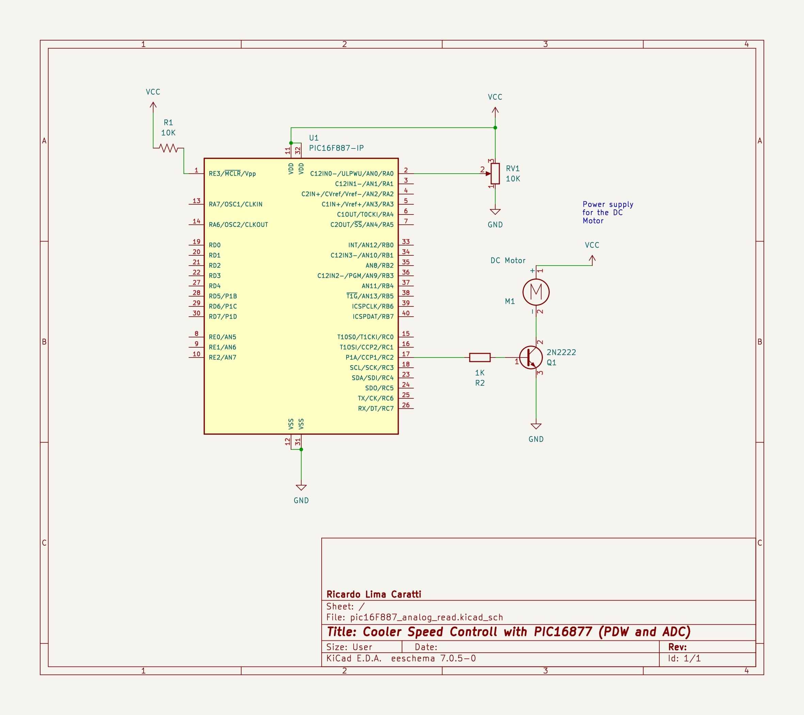

# Controlling a DC Motor/Cooler speed with PWM

## PIC16F628A example


### Schematic 


### PIC16F628A PINOUT


### PIC16F628A source code

```cpp
#include <xc.h>

#pragma config FOSC = INTOSCCLK // Internal OSC
#pragma config WDTE = OFF       // Disable Watchdog Timer
#pragma config PWRTE = OFF      // Disable Timer  Power-up
#pragma config MCLRE = ON       // 
#pragma config BOREN = ON       // 
#pragma config LVP = OFF        // 
#pragma config CPD = OFF        // 
#pragma config CP = OFF         // 

#define _XTAL_FREQ 4000000 // Internal Clock 4MHz

void main()
{
    TRISB = 0;            // Sets PORTB - output
    CCP1CON = 0b00001100; // Sets PWM
    T2CON = 0b00000111;   // Sets Timer2 prescaler of 16
    PR2 = 255;             // Sets PWM period

 
    TMR2 = 0;   // Resets Timer2 
    TMR2ON = 1; // Sets Timer2 ON 

    while (1)
    {
        // Minimum Speed
        CCPR1L = 27;
        __delay_ms(5000);
        
        // Average Speed
        CCPR1L = 33;
        __delay_ms(5000);

        // Maximum Speed
        CCPR1L = 55;
        __delay_ms(5000);
    }
}

```


## PIC16F887 example

### Schematic 




### PIC16F628A PINOUT


### PIC16F628A source code

```cpp
#include <xc.h>


// Configuration Bits
#pragma config FOSC = INTRC_NOCLKOUT  // Internal Oscillator, no clock out
#pragma config WDTE = OFF             // Watchdog Timer disabled
#pragma config PWRTE = OFF            // Power-up Timer disabled
#pragma config MCLRE = ON             // MCLR pin function is digital input
#pragma config BOREN = ON             // Brown-out Reset enabled
#pragma config LVP = OFF              // Low Voltage Programming disabled
#pragma config CPD = OFF              // Data EEPROM Memory Code Protection disabled
#pragma config CP = OFF               // Flash Program Memory Code Protection disabled

#define _XTAL_FREQ 4000000  // 4 MHz Crystal Frequency

void initPWM() {
    OSCCON = 0x60;
    TRISC = 0;                   // Set port to output   
    T2CON = 0x07;
    PR2 = 0xFF;                  // Set PWM period
    CCP1CON = 0x0C;              // Set PWM mode and duty cycle to 0
    CCPR1L = 0x00;
    T2CON = 0x04;                // Timer2 ON, Prescaler set to 1
}

void initADC() {
    ANSEL = 0x01;                // RA0/AN0 is analog input
    ADCON0 = 0x01;               // Enable ADC, channel 0
    ADCON1 = 0x80;               // Right justified, Fosc/32
}

unsigned int readADC() {
    ADCON0bits.GO = 1;           // Start conversion
    while (ADCON0bits.GO_nDONE); // Wait for conversion to finish
    return ((ADRESH << 8) + ADRESL); // Combine result into a single word
}

void main() {   
    initPWM();
    initADC();

    CCPR1L = 31;
    __delay_ms(5000);
    
    while(1) {
        unsigned int adcResult = readADC();
        CCPR1L = adcResult >> 2;  // Scale ADC result to fit PWM duty cycle register
        __delay_ms(10);           // Small delay for stability
    }
}


```