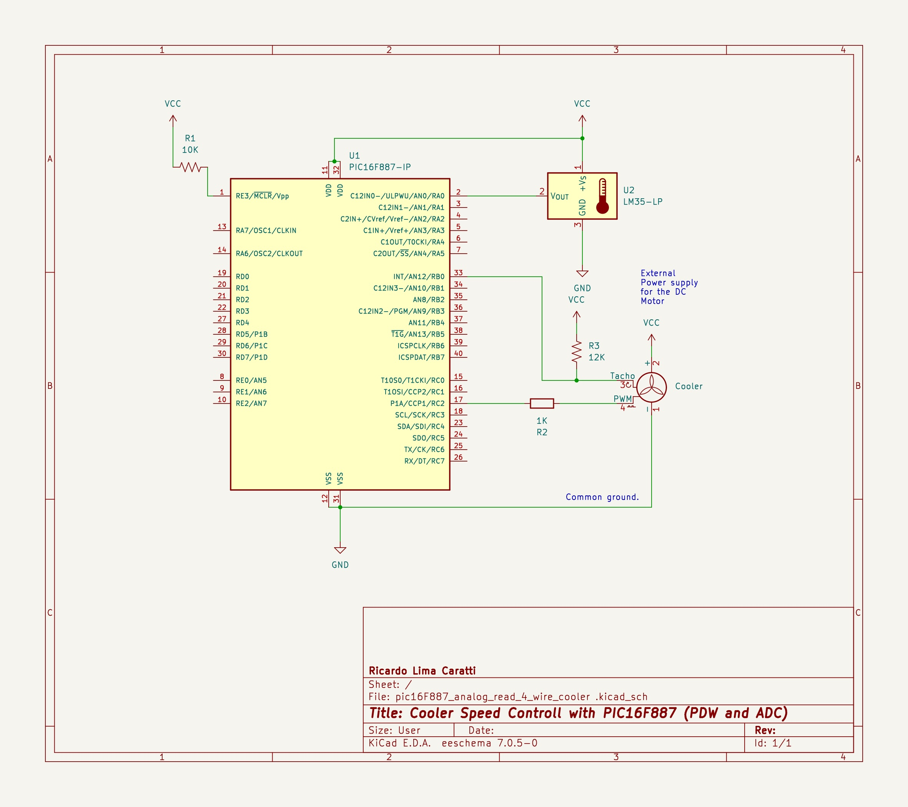

# Controlling a DC Motor/Cooler speed with PWM with PIC16FXXXX

To control a motor using PWM you will need to set up a circuit with a transistor as the motor driver. 

This page demonstrates how to control a DC Motor using both PIC16F628A and PIC16F887 microcontrollers. The examples provided will guide you through setting up the circuit and writing the code in C. In the case of the PIC16F887, the example leverages the microcontroller's ADC capabilities with a potentiometer to control the motor speed.

## Circuit setting up

1. **Transistor Configuration as Motor Driver**
   To control a DC motor, you can use an NPN transistor as a switch to control the motor current.

   - **NPN Transistor**: For example, a 2N2222.
   - **Motor**: A small DC motor.
   - **Recomended Flyback Diode**: For example, a 1N4001, connected in parallel with the motor to protect against voltage spikes.
   - **Base Resistor**: A resistor (for example, 1kΩ) between the PIC's output pin and the transistor's base to limit the current.

   **Connections**:
   
   - **Collector**: Connect to the motor's negative terminal.
   - **Emitter**: Connect to ground (GND).
   - **Base**: Connect to the PIC's output pin (through the base resistor).
   - **Motor**: Connect the motor's positive terminal to the motor's power supply, and the negative terminal to the transistor's collector.
   - **Optional Flyback Diode**: Connect the anode to the transistor's collector and the cathode to the motor's power supply (positive).

#### The sections below will show you details about circuit and programming.


## PIC16F628A example

### Schematic 


### PIC16F628A PINOUT


### PIC16F628A source code

```cpp
#include <xc.h>

#pragma config FOSC = INTOSCCLK // Internal OSC
#pragma config WDTE = OFF       // Disable Watchdog Timer
#pragma config PWRTE = OFF      // Disable Timer  Power-up
#pragma config MCLRE = ON       // 
#pragma config BOREN = ON       // 
#pragma config LVP = OFF        // 
#pragma config CPD = OFF        // 
#pragma config CP = OFF         // 

#define _XTAL_FREQ 4000000 // Internal Clock 4MHz

void main()
{
    TRISB = 0;            // Sets PORTB - output
    CCP1CON = 0b00001100; // Sets PWM
    T2CON = 0b00000111;   // Sets Timer2 prescaler of 16
    PR2 = 255;             // Sets PWM period

 
    TMR2 = 0;   // Resets Timer2 
    TMR2ON = 1; // Sets Timer2 ON 

    while (1)
    {
        // Minimum Speed
        CCPR1L = 27;
        __delay_ms(5000);
        
        // Average Speed
        CCPR1L = 33;
        __delay_ms(5000);

        // Maximum Speed
        CCPR1L = 55;
        __delay_ms(5000);
    }
}

```

### PIC16F628A and cooler control prototype


## PIC16F887 example

### Circuit and Code Description for PIC16F877:

#### Circuit Description:
- **DC Motor Control**: Similar to the PIC16F628A setup, a transistor is used for motor control.  A flyback diode for protection is recomendeed but is is not used here.
- **Potentiometer for Speed Control**: The potentiometer is connected to one of the ADC-capable pins of the PIC16F877 (e.g., AN0). The other two terminals of the potentiometer are connected to VDD and GND.
- **PWM Signal Generation**: The PWM signal is generated by the PIC16F877 to control the motor speed.


### Schematic 


### PIC16F628A PINOUT


### PIC16F628A source code

#### Code Description:
- **PWM Setup**: The CCP module is configured for PWM operation. The PWM signal's duty cycle controls the motor speed.
- **ADC Setup**: The ADC module of the PIC16F877 is configured to read the voltage at the potentiometer's wiper (connected to an ADC-capable pin).
- **Reading Potentiometer**: The ADC reads the potentiometer's position and converts it into a digital value.
- **Motor Speed Control**: Based on the ADC reading, the PWM duty cycle is adjusted, changing the motor speed.


```cpp
#include <xc.h>


// Configuration Bits
#pragma config FOSC = INTRC_NOCLKOUT  // Internal Oscillator, no clock out
#pragma config WDTE = OFF             // Watchdog Timer disabled
#pragma config PWRTE = OFF            // Power-up Timer disabled
#pragma config MCLRE = ON             // MCLR pin function is digital input
#pragma config BOREN = ON             // Brown-out Reset enabled
#pragma config LVP = OFF              // Low Voltage Programming disabled
#pragma config CPD = OFF              // Data EEPROM Memory Code Protection disabled
#pragma config CP = OFF               // Flash Program Memory Code Protection disabled

#define _XTAL_FREQ 4000000  // 4 MHz Crystal Frequency

void initPWM() {
    OSCCON = 0x60;
    TRISC = 0;                   // Set port to output   
    T2CON = 0x07;
    PR2 = 0xFF;                  // Set PWM period
    CCP1CON = 0x0C;              // Set PWM mode and duty cycle to 0
    CCPR1L = 0x00;
    T2CON = 0x04;                // Timer2 ON, Prescaler set to 1
}

void initADC() {
    ANSEL = 0x01;                // RA0/AN0 is analog input
    ADCON0 = 0x01;               // Enable ADC, channel 0
    ADCON1 = 0x80;               // Right justified, Fosc/32
}

unsigned int readADC() {
    ADCON0bits.GO = 1;           // Start conversion
    while (ADCON0bits.GO_nDONE); // Wait for conversion to finish
    return ((ADRESH << 8) + ADRESL); // Combine result into a single word
}

void main() {   
    initPWM();
    initADC();

    CCPR1L = 31;
    __delay_ms(5000);
    
    while(1) {
        unsigned int adcResult = readADC();
        CCPR1L = adcResult >> 2;  // Scale ADC result to fit PWM duty cycle register
        __delay_ms(10);           // Small delay for stability
    }
}


```

### PIC16F887, cooler, and potentiometer with adc reader prototype


## PIC16F887 example with a four wires Coller.

A four-wire cooler (or fan) typically used in computer systems offers more sophisticated control over the fan speed compared to two and three-wire coolers. Here's a detailed explanation of the function of each wire:


1. **Red Wire - Power (VCC)**
   - This wire supplies the positive voltage to the fan. The voltage level is typically 5V or 12V in computer fans, but it can vary depending on the fan's specifications.
   - It provides the necessary power for the fan motor to operate.

2. **Black Wire - Ground (GND)**
   - This is the ground wire and is connected to the negative side of the power supply.
   - It completes the electrical circuit for the fan motor.

3. **Yellow Wire - Tachometer Signal**
   - This wire outputs a tachometer signal that can be used to measure the fan's rotational speed (RPM - Revolutions Per Minute).
   - The signal is typically a pulse train, where the number of pulses per minute corresponds to the fan's RPM. Usually, two pulses per revolution are standard, but this can vary.
   - By measuring the frequency of these pulses or counting the number of pulses over a set period, the fan's speed can be determined.

4. **Blue or White Wire - PWM Control Signal**
   - This wire is used to control the speed of the fan via Pulse Width Modulation (PWM).
   - By varying the duty cycle of the PWM signal sent to this wire, you can control the speed of the fan without changing the supply voltage.
   - A higher duty cycle means higher fan speed, and vice versa. For instance, a 100% duty cycle runs the fan at full speed, while a 50% duty cycle cuts the speed in half.
   - This allows for precise control of the fan speed, which can be used for thermal management, noise reduction, or power saving.

### Application in Thermal Management
In computer systems or other electronic applications, these fans are often used for cooling purposes. The four-wire configuration allows the system to dynamically adjust the fan speed based on thermal requirements, which can be more energy-efficient and quieter compared to running the fan at full speed all the time.

The PWM control also enables the system to respond quickly to temperature changes, increasing the fan speed when necessary (e.g., when the CPU is under heavy load) and slowing it down when the demand for cooling decreases.

### Safety and Power Considerations
When working with four-wire coolers, it's important to ensure that the power requirements of the fan match your power supply's capabilities. Overloading the power supply or misconnecting the wires can lead to damage to the fan or other components in the system.


### Application

This type of cooler is versatile and can be utilized in numerous applications. The schematic and prototype presented below demonstrate a method for controlling the cooler's speed in response to environmental temperature changes. As the temperature increases, the pulse width correspondingly increases, thereby adjusting the cooler's speed accordingly."


### Schematic 




### Prototype 


### Code

```cpp
#include <xc.h>
#include <stdio.h>
#include "pic16flcd.h"

// Configuration Bits
#pragma config FOSC = INTRC_NOCLKOUT  // Internal Oscillator, no clock out
#pragma config WDTE = OFF             // Watchdog Timer disabled
#pragma config PWRTE = OFF            // Power-up Timer disabled
#pragma config MCLRE = ON             // MCLR pin function is digital input
#pragma config BOREN = ON             // Brown-out Reset enabled
#pragma config LVP = OFF              // Low Voltage Programming disabled
#pragma config CPD = OFF              // Data EEPROM Memory Code Protection disabled
#pragma config CP = OFF               // Flash Program Memory Code Protection disabled

#define _XTAL_FREQ 4000000  // 4 MHz Crystal Frequency

void initPWM() {
    OSCCON = 0x60;
    TRISC = 0; // Set port to output   
    T2CON = 0x07;
    PR2 = 0xFF; // Set PWM period
    CCP1CON = 0x0C; // Set PWM mode and duty cycle to 0
    CCPR1L = 0x00;
    T2CON = 0x04; // Timer2 ON, Prescaler set to 1
}

void initADC() {
    ANSEL = 0x01; // RA0/AN0 is analog input
    ADCON0 = 0x01; // Enable ADC, channel 0
    ADCON1 = 0x80; // Right justified, Fosc/32
}

unsigned int readADC() {
    ADCON0bits.GO = 1; // Start conversion
    while (ADCON0bits.GO_nDONE); // Wait for conversion to finish
    return (unsigned int) ((ADRESH << 8) + ADRESL); // Combine result into a single word
}

double readTemperature() {
    unsigned int adcValue = readADC();
    double voltage = (float) ((float) adcValue / 1024.0) * 5.0; // Convert ADC value to voltage
    return(float) voltage / (float) 0.01; // Convert voltage to temperature in Celsius.   
}

void main() {
    initPWM();
    initADC();

    Lcd_PinConfig lcd = {
        .port = &PORTD, // Assuming you're using PORTD for LCD on PIC16F887
        .rs_pin = 2, // RD2 for RS
        .en_pin = 3, // RD3 for EN
        .d4_pin = 4, // RD4 for D4
        .d5_pin = 5, // RD5 for D5
        .d6_pin = 6, // RD6 for D6
        .d7_pin = 7 // RD7 for D7
    };

    // Initialize the LCD
    TRISD = 0;
    Lcd_Init(&lcd);
    Lcd_Clear(&lcd);

    // Display message
    Lcd_SetCursor(&lcd, 1, 1);
    Lcd_WriteString(&lcd, "Cooler & LM35");
    Lcd_SetCursor(&lcd, 2, 1);
    Lcd_WriteString(&lcd, "Temp:");


    while (1) {
        char strTemp[6];
        double temperature;
        double sum = 0;
        
        // Calculate the 
        for (unsigned char i =0; i < 10; i++ ) {
            sum +=  readTemperature();
            __delay_ms(100);
        }
        temperature = sum / 10.0;

        sprintf(strTemp, "%4u", (int) temperature);
        Lcd_SetCursor(&lcd, 2, 7);
        Lcd_WriteString(&lcd, strTemp );

        if (temperature > 37.0)
            CCPR1L = 200;
        else if (temperature > 30.0)
            CCPR1L = 50;
        else if (temperature > 26.0)
            CCPR1L = 30;
        else if (temperature > 23.0)
            CCPR1L = 15;
        else 
            CCPR1L = 0;
        __delay_ms(2000);
    }
}

```


