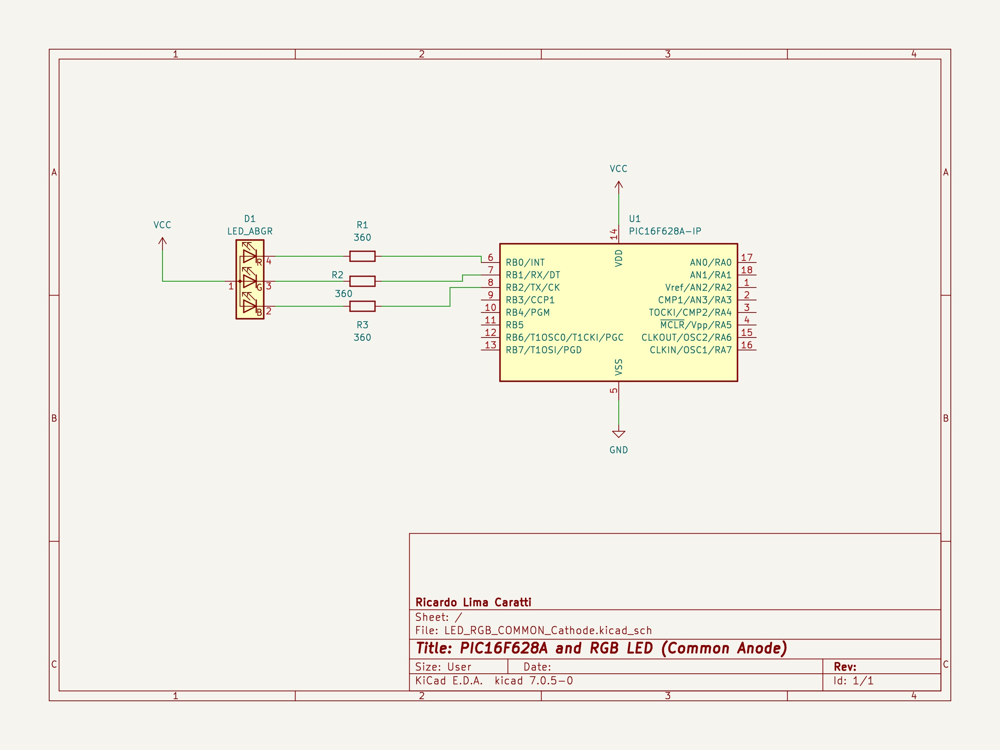
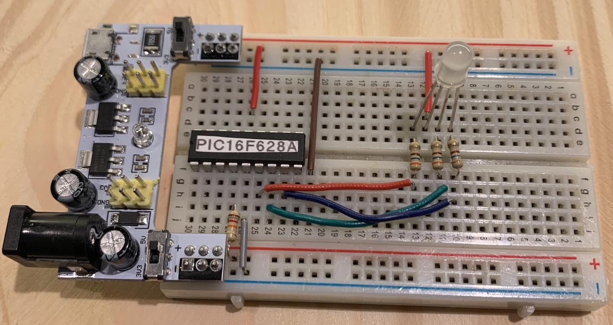
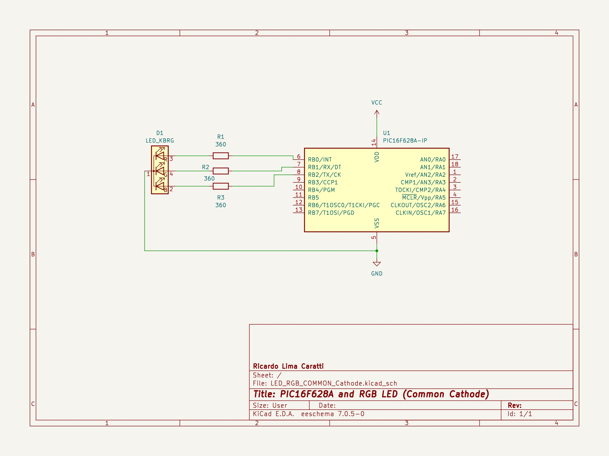
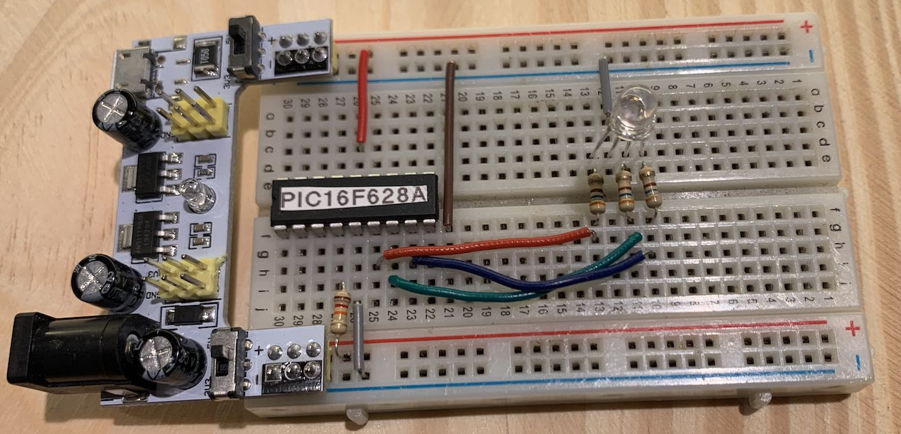

# PIC16F628A RGB LED (Anode and Cathode setup)

RGB LEDs are a type of LED that can emit multiple colors. They come in two main types: Common Anode and Common Cathode. 

1. **Common Anode RGB LED**: All the anodes of the RGB LEDs are connected together to the power supply. The individual colors are controlled by connecting the cathodes to ground through a current-limiting resistor. Turning a color on requires pulling its cathode low.

2. **Common Cathode RGB LED**: All the cathodes are connected to ground. The individual colors are controlled by supplying power to their anodes. Turning a color on involves applying voltage to its anode.

Compared to regular single-color LEDs, RGB LEDs combine red, green, and blue light to create a wide range of colors. The type of RGB LED (anode or cathode) affects how you control it in a circuit, particularly in terms of how you connect and switch the individual colors. The sections below will show you how to setp Anode and Cathode LEDs.


### How to identify if a RGB LED is Anode or Cathode? 

To determine whether an RGB LED is common anode or cathode, you can perform a simple test using a multimeter:

1. **Using a Multimeter**, set it to the diode testing mode.

2. **Identify the Longest Pin** - Usually, the longest pin is either the common anode or common cathode. 

3. **Test Each Pin**:
   - Connect the positive lead of the multimeter to the longest pin.
   - Touch the negative lead (black) to each of the other pins sequentially.
   - If the LED lights up when the black lead touches a pin, it's likely a common anode LED. In this case, the longest pin is the anode, and it should be connected to the positive voltage.
   - If the LED does not light up, switch the leads. Connect the black lead to the longest pin, and the red lead to the other pins. If the LED lights up now, it’s a common cathode LED.

4. **Observe the Colors**: When testing each of the other pins, observe the color that lights up. Each pin corresponds to a different color (red, green, or blue).


## RGB LED Common Anode

In RGB LEDs with a common anode configuration, all the anodes are interconnected and should be connected to the positive power supply (VCC). The anode is typically identified as the longest pin on the LED and must be connected to VCC for the LED to function correctly. Check the schematic and C code  below. 


### Schematic (A)





### Source Code (Common Anode) 

```cpp
#include <xc.h>

// Chip settings
#pragma config FOSC = INTOSCCLK // Internal oscillator, CLKOUT on RA6
#pragma config WDTE = OFF       // Disables Watchdog Timer
#pragma config PWRTE = OFF      // Disables Power-up Timer
#pragma config MCLRE = ON       // MCLR pin function is digital input
#pragma config BOREN = ON       // Enables Brown-out Reset
#pragma config LVP = OFF        // Low voltage programming disabled
#pragma config CPD = OFF        // Data EE memory code protection disabled
#pragma config CP = OFF         // Flash program memory code protection disabled

#define _XTAL_FREQ 4000000 // Internal oscillator frequency set to 4MHz

void main() {
    TRISB = 0; // Sets PORTB as output
    unsigned char dutyCycle;
    
    PORTB = 0xFF; // Turn all LEDs off.
    __delay_ms(5000);
    while(1) {
        for(dutyCycle = 0; dutyCycle < 255; dutyCycle++) {
            RB0 = (dutyCycle < 128)? 1:0;
            RB1 = (dutyCycle < 64 || (dutyCycle > 192))? 1:0;
            RB2 = (dutyCycle > 128)? 1:0;
            __delay_ms(50); 
        }
    }
} 
```

### Prototype (Common Anode) 




## RGB LED Common Cathode 

In RGB LEDs with a common cathode configuration, all the cathodes are interconnected and should be connected to the ground (GND). The cathode is often identified as the longest pin on the LED, which must be connected to GND. This setup allows each color (red, green, blue) to be controlled by applying voltage to their respective anodes. Check the schematic and C code below. 


### Schematic (K)




### Source Code (Common Cathode) 

```cpp
#include <xc.h>

// Chip settings
#pragma config FOSC = INTOSCCLK // Internal oscillator, CLKOUT on RA6
#pragma config WDTE = OFF       // Disables Watchdog Timer
#pragma config PWRTE = OFF      // Disables Power-up Timer
#pragma config MCLRE = ON       // MCLR pin function is digital input
#pragma config BOREN = ON       // Enables Brown-out Reset
#pragma config LVP = OFF        // Low voltage programming disabled
#pragma config CPD = OFF        // Data EE memory code protection disabled
#pragma config CP = OFF         // Flash program memory code protection disabled

#define _XTAL_FREQ 4000000 // 4 MHz

void main() {
    TRISB = 0; // Sets PORTB as output
    unsigned char dutyCycle;
    
    PORTB = 0x00; // Turn all LEDs off.
    __delay_ms(5000);
    while(1) {
        for(dutyCycle = 0; dutyCycle < 255; dutyCycle++) {
            RB0 = (dutyCycle < 128)? 0:1;
            RB1 = (dutyCycle < 64 || (dutyCycle > 192))? 0:1;
            RB2 = (dutyCycle > 128)? 0:1;
            __delay_ms(50); 
        }
    }
}

```

### Prototype (Common Cathode) 




## PIC16F628A PINOUT


## References

* [How an RGB LED works and how to use one! | Basic Electronics](https://youtu.be/wqzfbImsrPE?si=yCqwkObdSCyHY1Gn)
* [How do RGB LEDs work](https://randomnerdtutorials.com/electronics-basics-how-do-rgb-leds-work/)
* [Working with RGB LEDs – All You Need To Know](https://moonpreneur.com/tech-corner/working-with-rgb-leds/)
* [LED RGB -ALTERANDO CORES POR MEIO DA APROXIMAÇÃO DE OBJETOS – C/ PIC 16F628A (REF295)](http://picsource.com.br/archives/11199)
* [PIC16F628 4 RGB LED PWM Controller](https://www.next.gr/circuits/PIC16F628-4-RGB-LED-PWM-Controller-l52521.html)
* [Lighting up RGB LED Strip with a PIC Microcontroller](https://blog.kubovy.eu/2019/03/30/lighting-up-rgb-led-strip-with-a-pic-microcontroller/)

