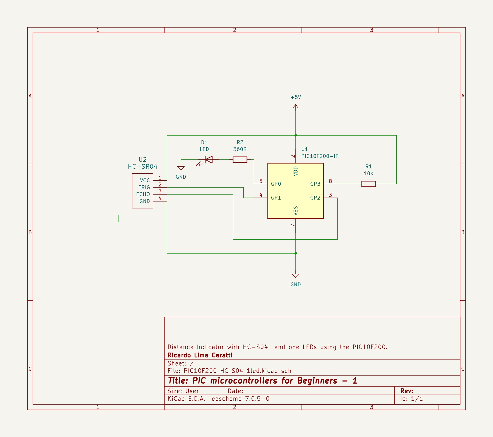

# PIC10F200 and HC-S04 example


## Content

1. [Challenges of Implementing an Application with the PIC10F200 and HC-SR04 ](#challenges-of-implementing-an-application-with-the-pic10f200-and-hc-sr04-distance-sensor)
2. [PIC10F200 and HC-S04 schematic](#pic10f200-and-hc-s04-schematic)
    * [KiCad schematic](./KiCad/)
2. [PIC10F200 PINOUT](#pic10f200-pinout)
3. [PIC10F200 with HC-S04 C code example](#pic10f200-with-hc-s04-c-code-example)
4. [PIC10F200 with HC-S04 Assembly code example](#pic10f200-with-hc-s04-asm-code-example)
5. [MPLAB IDE projects](./MPLAB_EXAMPLE/)
6. [References](#references)


## Challenges of Implementing an Application with the PIC10F200 and HC-SR04 (Distance Sensor):

**Limited Resources:**

* The PIC10F200 has limited memory and I/O pins. This requires code optimization and efficient use of available resources.
* The HC-SR04 requires 2 I/O pins to operate (Trigger and Echo). This can be a challenge if you need to use other devices in your project.

**Accuracy:**

* The HC-SR04 has an accuracy of ±3mm. This may not be sufficient for some applications.
* Sensor readings can be affected by external factors such as temperature, humidity, and electromagnetic interference.

**Timing:**

* The HC-SR04 requires a 10µs pulse on the Trigger pin to start the measurement. Generating this precise pulse can be challenging on some microcontrollers.
* The time between sending the pulse and receiving the echo needs to be measured accurately to calculate the distance.

**Software Complexity:**

* Implementing sensor communication, data reading, and distance calculation requires more complex software than simple projects with LEDs or buttons.

**Debugging:**

* Debugging problems in applications with sensors can be more complex than in applications with simple devices.

**Solutions:**

* **Code optimization:** Use optimization techniques to reduce code size and free up memory for other functions.
* **Efficient pin usage:** Pin multiplexing can be used to connect more devices with the limited number of available pins.
* **Sensor calibration:** Sensor calibration can improve measurement accuracy.
* **Data filtering:** Sensor data filtering can reduce the effect of noise and interference.

The PIC10F200 may be a good option for simple applications with the HC-SR04, but it may be limiting for more complex applications.


## PIC10F200 and HC-S04 schematic





### PIC10F200 PINOUT


### PIC10F200 with HC-S04 C code example

```cpp

/*
 * This experiment uses the PIC10F200 and the HC-S04 ultrasonic distance sensor. 
 * It utilizes one LEDs to indicate, a distance  * of less than 10 cm. 
 * Author: Ricardo Lima Caratti
 * Jan/2024
 */

// CONFIG
#pragma config WDTE = OFF       // Watchdog Timer (WDT disabled)
#pragma config CP = OFF         // Code Protect (Code protection off)
#pragma config MCLRE = OFF      // Master Clear Enable (GP3/MCLR pin fuction is digital I/O, MCLR internally tied to VDD)

#define _XTAL_FREQ  4000000

#include <xc.h>


void main(void) {

    // TIMER0 AND PRESCALER SETUP
    // TOCS = 0 => INTERNAL INSTRUCTION CYCLE; 
    // PSA = 0 => TIMER0; and
    // PRESCALER (PS2,PS1 AND PS0 => 1:128)
    OPTION = 0B11010110;     
    //GPIO SETUP
    // GP0 -> LED/output; 
    // GP1 -> Trigger/output; and 
    // GP2 = Echo/input 
    TRIS = 0B00000100;           

    while (1) {
        // Using the trigger pin to sen Send 10uS signal 
        GP1 = 1;
        __delay_us(10);
        GP1 = 0;

        // Wait for echo
        do {
        } while (!GP2);
        TMR0 = 0; // It will increment every 128 cycles (at 4MHz one cycle is 1us).
        do {
        } while (GP2);
    
        // TRM0 * 128 represents the number of cycles. Therefore, a value of 1 
        // equates to 128 cycles. Based on this, 128 cycles correspond to 2 cm. 
        // However, calibration may be necessary for accurate measurements.
        // See: https://www.circuitbread.com/tutorials/obstacle-avoidance-robot-part-14-microcontroller-basics-pic10f200
        if (TMR0 < 2 ) //  
            GP0 = 1;
        else
            GP0 = 0;
        __delay_ms(100);

    }
}


```


### PIC10F200 with HC-S04 ASM code example


**IMPORTANT:** 

To assemble this code correctly, please follow the steps below:

1. Go to "Project Properties" in MPLAB X.
2. Select "Global Options" for the pic-as assembler/compiler.
3. In the "Additional Options" box, enter the following parameters: **-Wl,-pAsmCode=0h**


```asm 

; HC-S04 with PIC10F200
; My PIC Journey
; Author: Ricardo Lima Caratti
; Jan/2024
;
; IMPORTANT: To assemble this code correctly, please follow the steps below:
; 1. Go to "Project Properties" in MPLAB X.
; 2. Select "Global Options" for the pic-as assembler/compiler.
; 3. In the "Additional Options" box, enter the following parameters:
; -Wl,-pAsmCode=0h
;
; Please check the AsmCode reference in the "PSECT" directive below.
;
; You will find good tips about the PIC10F200 here:
; https://www.circuitbread.com/tutorials/christmas-lights-special-microcontroller-basics-pic10f200

 
    
#include <xc.inc>

; CONFIG
  CONFIG  WDTE = OFF           ; Watchdog Timer (WDT disabled)
  CONFIG  CP = OFF             ; Code Protect (Code protection off)
  CONFIG  MCLRE = ON	       ; Master Clear Enable (GP3/MCLR pin function  is MCLR)

  
; Declare your variables here

dummy1 equ 0x10
 
PSECT AsmCode, class=CODE, delta=2

MAIN:
    
    ; TIMER0 AND PRESCALER SETUP
    ; TOCS = 0 => INTERNAL INSTRUCTION CYCLE; 
    ; PSA = 0 => TIMER0; and
    ; PRESCALER (PS2,PS1 AND PS0 => 1:128)
    movlw  0B11010110	    ;   
    option
    ; GPIO SETUP
    ; GP0 -> LED/output; 
    ; GP1 -> Trigger/output; and 
    ; GP2 = Echo/input 
    movlw   0B00000100
    tris    GPIO
MainLoop:		    ; Endless loop
    bsf	    GPIO,1	    ; Send 10us signal via GP1
    call    Delay10us
    bcf	    GPIO,1
    
    movlw   2
    ; Wait for echo
    btfss   GPIO, 2
    goto $-1		    ; back to previous instruction  if GP2 is not high
    clrf    TMR0 
    btfsc   GPIO, 2
    goto $-1		    ; back to previous instruction  if GP2 is high
    
    subwf   TMR0, w
    btfss   STATUS, 0	    ; If grater than 1
    goto    VeryClose 
    bcf	    GPIO,0	    ; Turn the LED off
    goto    MainLoopEnd
VeryClose:   
    bsf	    GPIO,0	    ; Turn the LED on    
MainLoopEnd:
    call    Delay2ms;
    
    goto    MainLoop
     
; ******************
; Delay function

; At 4 MHz, one instruction takes 1?s
; So, this soubroutine should take about 10?s 
; This time is used by the HC-S04 ultrasonic sensor 
; to determine the distance. 	
Delay10us:
    nop		;  2 cycles (CALL) + 6 cycles (NOP)
    nop
    nop
    nop
    nop
    nop	    
    retlw 0	; + 2 cycles (retlw) => 10 cycles =~ 10us at 4MHz frequency clock    

; It takes about 2ms
Delay2ms: 
    movlw  200
    movwf  dummy1
LoopDelay2ms: 
    call Delay10us    
    decfsz dummy1, f
    goto LoopDelay2ms
    retlw   0
    
END MAIN


```

## Contribution

If you've found value in this repository, please consider contributing. Your support will assist me in acquiring new components and equipment, as well as maintaining the essential infrastructure for the development of future projects. [Click here](https://www.paypal.com/donate/?business=LLV4PHKTXC4JW&no_recurring=0&item_name=Your+support+will+assist+me+in++maintaining+the+essential+infrastructure+for+the+development+of+future+projects.+&currency_code=BRL) to make a donation or scan the QR code provided below. 


## References

* [Ultrasonic sensor with Microchip's PIC - Part 14 Microcontroller Basics (PIC10F200)](https://youtu.be/_k5f_zpP2lg?si=B3KbHLU_tqzUIZ7E)
* [Ultrasonic Sensor HC-SR04 With PIC Microcontroller](https://www.trionprojects.org/2020/03/ultrasonic-sensor-hc-sr04-with-pic.html)
* [Ultrasonic Sensor HC-SR04 Code for PIC18F4550](https://www.electronicwings.com/pic/ultrasonic-module-hc-sr04-interfacing-with-pic18f4550)
* [Distance Measurement Using HC-SR04 Via NodeMCU](https://www.instructables.com/Distance-Measurement-Using-HC-SR04-Via-NodeMCU/)
* [Obstacle Avoidance Robot - Part 14 Microcontroller Basics (PIC10F200)](https://www.circuitbread.com/tutorials/obstacle-avoidance-robot-part-14-microcontroller-basics-pic10f200)