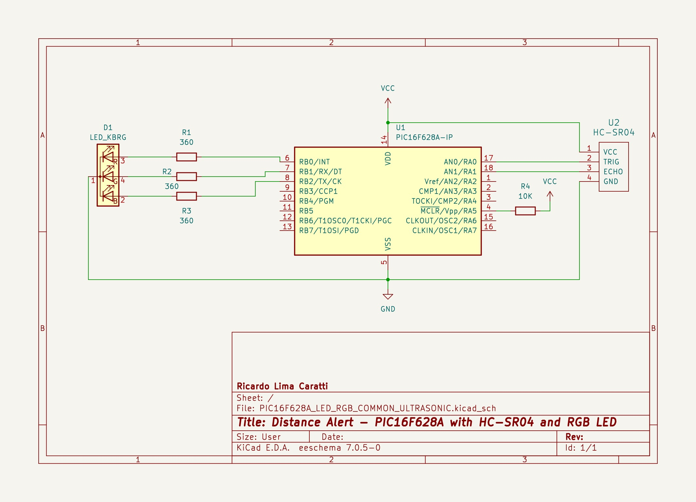
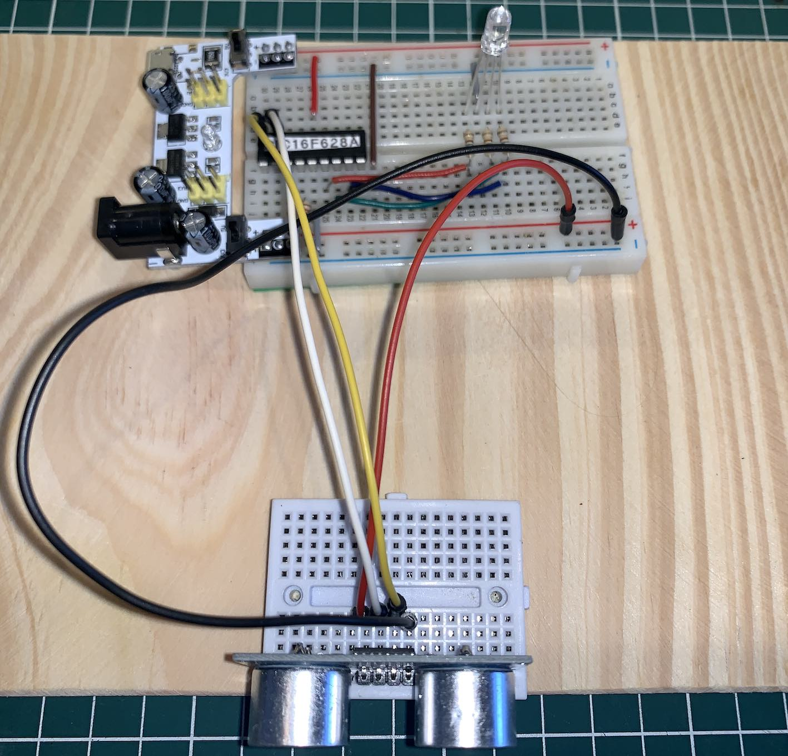

# PIC16F628A and HC-S04 Ultrasonic Sensor


## Content

1. [PIC16F628A and HC-S04 Ultrasonic Sensor schematic](#pic16f628a-and-hc-s04-ultrasonic-sensor-schematic)
    * [KiCad Schematic](./KiCad/)
2. [PIC16F628 example in C](#pic16f628-example-in-c)
3. [PIC16F628A and HC-S04 Ultrasonic Sensor prototype](#pic16f628a-and-hc-s04-ultrasonic-sensor-prototype)
4. [MPLAB X IDE projects](./MPLAB_EXAMPLE/)
5. [Referencesw](./MPLAB_EXAMPLE/)


## PIC16F628A and HC-S04 Ultrasonic Sensor schematic 




## PIC16F628A PINOUT 


## PIC16F628 example in C


```cpp
#include <xc.h>

// Chip settings
#pragma config FOSC = INTOSCCLK // Internal oscillator, CLKOUT on RA6
#pragma config WDTE = OFF       // Disables Watchdog Timer
#pragma config PWRTE = OFF      // Disables Power-up Timer
#pragma config MCLRE = ON       // MCLR pin function is digital input
#pragma config BOREN = ON       // Enables Brown-out Reset
#pragma config LVP = OFF        // Low voltage programming disabled
#pragma config CPD = OFF        // Data EE memory code protection disabled
#pragma config CP = OFF         // Flash program memory code protection disabled

#define _XTAL_FREQ 4000000 // Internal oscillator frequency set to 4MHz


void inline set_red_light() {
    PORTB = 0b00000001;
}

void inline set_green_light() {
    PORTB = 0b00000010;
}

void inline set_blue_light() {
    PORTB = 0b00000100;

}

void inline turn_led_off() {
    PORTB = 0b00000000;
}

void main() {
    
    // Turns off the comparator and converts its pins in digital I/O. 
    CMCONbits.CM = 0x07; 

    // Sets the PORT A and B    
    TRISB = 0;; // Sets PORTB as output (RGB LED Control)
    TRISA0 = 0;  // TRIG pin  (HC-S04 TRIGGER output)
    TRISA1 = 1;  // ECHO pin  (HC-S04 ECHO input)
     

    // Checking the RGB LED - Playing with RGB LED before starting the real application.
    for (int i = 0; i < 6; i++) {
        set_red_light();
        __delay_ms(200);
        set_green_light();
        __delay_ms(200);
        set_blue_light();
        __delay_ms(200);
        turn_led_off();
        __delay_ms(200);
    } 
    while (1) {
        TMR1H = 0;  // sets the high byte of the Timer1 counter to 0
        TMR1L = 0;  // sets the low byte of the Timer1 counter to 0
        RA0 = 1;
        __delay_us(10);
        RA0 = 0;
        while(!RA1); // Wait for ECHO/RA1 pin becomes HIGH
        TMR1ON = 1;  // Turns TIMER1 on
        while(RA1);  // Wait for ECHO/RA1 pin becomes LOW
        TMR1ON = 0;  // Turns TIMER1 off        
        unsigned int duration = (unsigned int) (TMR1H << 8) | TMR1L;
        unsigned int distance = duration *0.034/2;
        if ( distance <= 10) 
            set_red_light();
        else if (distance <= 30 )
            set_blue_light();
        else
            set_green_light();
    }
}

```

### PIC16F628A and HC-S04 Ultrasonic Sensor prototype




## References

* [Ultrasonic sensor with Microchip's PIC - Part 14 Microcontroller Basics (PIC10F200)](https://youtu.be/_k5f_zpP2lg?si=B3KbHLU_tqzUIZ7E)
* [Ultrasonic Sensor HC-SR04 With PIC Microcontroller](https://www.trionprojects.org/2020/03/ultrasonic-sensor-hc-sr04-with-pic.html)
* [Ultrasonic Sensor HC-SR04 Code for PIC18F4550](https://www.electronicwings.com/pic/ultrasonic-module-hc-sr04-interfacing-with-pic18f4550)
* [Distance Measurement Using HC-SR04 Via NodeMCU](https://www.instructables.com/Distance-Measurement-Using-HC-SR04-Via-NodeMCU/)
* [Obstacle Avoidance Robot - Part 14 Microcontroller Basics (PIC10F200)](https://www.circuitbread.com/tutorials/obstacle-avoidance-robot-part-14-microcontroller-basics-pic10f200)