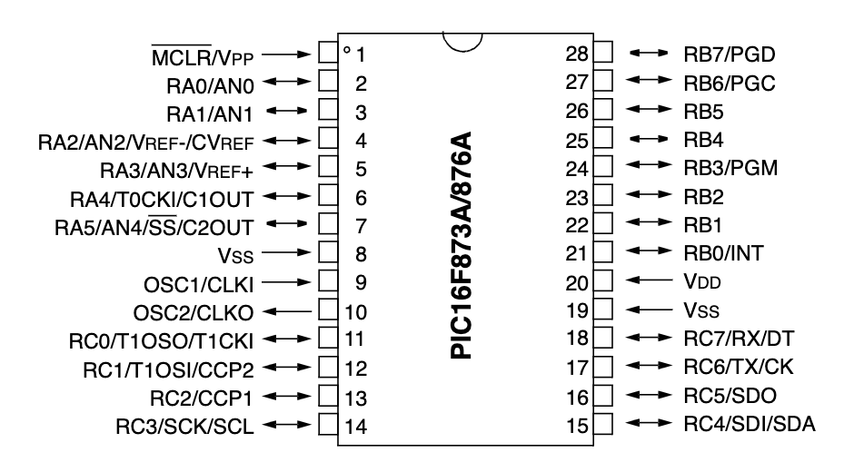

# PIC16F876A with LCD and HC-S04 Ultrasonic sensor

The following application demonstrates the use of the HC-S04 ultrasonic sensor with the PIC16F876A and a 16x2 LCD. The system is relatively accurate and can be used in many applications.


## Content

1. [PIC16F876A with HC-S04 and LCD 16x2 schematic ](#pic16f876a-with-hc-s04-and-lcd-16x2-schematic)
    * [KiCad schematic](./KiCad/)
2. [PIC16F876A PINOUT](#pic16f876a-pinout)
3. [PIC16F876A programming](#pic16f876a-programming)
4. [PIC16F876A with HC-S04 and LCD 16x2 prototype](#pic16f876a-with-hc-s04-and-lcd-16x2-prototype)
5. [MPLAB X IDE projects](./MPLAB_EXAMPLE/)
6. [References](#references)


## PIC16F876A with HC-S04 and LCD 16x2 schematic 


## PIC16F876A PINOUT




### PIC16F876A programming

```cpp
/**
 * This example works with PIC16F628A
 * UNDER CONSTRUCTION...
 */

#include <xc.h>
#include "pic16flcd.h"

#pragma config FOSC = HS        // 
#pragma config WDTE = OFF       // Watchdog Timer disabled 
#pragma config PWRTE = OFF      // Power-up Timer disabled
#pragma config BOREN = OFF      // Brown-out Reset disabled
#pragma config LVP = OFF        // Low Voltage Programming disabled
#pragma config CPD = OFF        // Data EEPROM Memory Code Protection disabled
#pragma config CP = OFF         // Flash Program Memory Code Protection disabled

#define _XTAL_FREQ 4000000      // 

// Coverts integer numbers to char array
void convertToChar(uint16_t value, char *strValue, uint8_t len)
{
    char d;
    for (int i = (len - 1); i >= 0; i--)
    {
        d = value % 10;
        value = value / 10;
        strValue[i] = d + 48;
    }
    strValue[len] = '\0';
}

void main() {
    char strDistance[10];
  
    ADCON1 = 0x06; // Sets the pins of PORTA as digital  
    TRISA0 = 0;    // Sets RA0 as output (HC-S04 - trigger)
    TRISA1 = 1;    // Sets RA1 as input (HC-S04 - echo)
   
    T1CON = 0x00; // Configure Timer1: prescaler, modo, etc.
    
    // LCD 16x2 library setup 

    TRISC = 0; // You need to set this register to output
    Lcd_PinConfig lcd = {
        .port = &PORTC, // Assuming you're using PORTC for LCD on PIC16F876A
        .rs_pin = 2, // RC2 for RS
        .en_pin = 3, // RC3 for EN
        .d4_pin = 4, // RC4 for D4
        .d5_pin = 5, // RC5 for D5
        .d6_pin = 6, // RC6 for D6
        .d7_pin = 7 //  RC7 for D7
    };
    
    Lcd_Init(&lcd);  // Initialize the LCD
    Lcd_Clear(&lcd); 
    Lcd_SetCursor(&lcd, 1, 1); // Display message (Line 1 and Column 1)
    Lcd_WriteString(&lcd, "PIC16F876A-HCS04");
    Lcd_SetCursor(&lcd, 2, 1); // Display message (Line 2 and Column 1)
    Lcd_WriteString(&lcd, "Dist.: ");
    Lcd_SetCursor(&lcd, 2, 11); // Display message (Line 2 and Column 12)
    Lcd_WriteString(&lcd, "cm");
    
    __delay_ms(1000); 
    
    while(1) {
        TMR1H = 0;  // sets the high byte of the Timer1 counter to 0
        TMR1L = 0;  // sets the low byte of the Timer1 counter to 0
        
        RA0 = 1;
        __delay_us(10);
        RA0 = 0;
        while(!RA1); // Wait for ECHO/RA1 pin becomes HIGH
        TMR1ON = 1;  // Turns TIMER1 on
        while(RA1);  // Wait for ECHO/RA1 pin becomes LOW
        TMR1ON = 0;  // Turns TIMER1 off  
        
        unsigned int duration = (unsigned int) (TMR1H << 8) | TMR1L;
        unsigned int distance = duration *0.034 / 2;        
        

        Lcd_SetCursor(&lcd, 2, 7);
        convertToChar(distance,strDistance,3);
        Lcd_WriteString(&lcd,strDistance);
            
        __delay_ms(100);
    }
}


```


## PIC16F876A with HC-S04 and LCD 16x2 prototype


## References

* [Ultrasonic sensor with Microchip's PIC - Part 14 Microcontroller Basics (PIC10F200)](https://youtu.be/_k5f_zpP2lg?si=B3KbHLU_tqzUIZ7E)
* [Ultrasonic Sensor HC-SR04 With PIC Microcontroller](https://www.trionprojects.org/2020/03/ultrasonic-sensor-hc-sr04-with-pic.html)
* [Ultrasonic Sensor HC-SR04 Code for PIC18F4550](https://www.electronicwings.com/pic/ultrasonic-module-hc-sr04-interfacing-with-pic18f4550)
* [Distance Measurement Using HC-SR04 Via NodeMCU](https://www.instructables.com/Distance-Measurement-Using-HC-SR04-Via-NodeMCU/)
* [Obstacle Avoidance Robot - Part 14 Microcontroller Basics (PIC10F200)](https://www.circuitbread.com/tutorials/obstacle-avoidance-robot-part-14-microcontroller-basics-pic10f200)