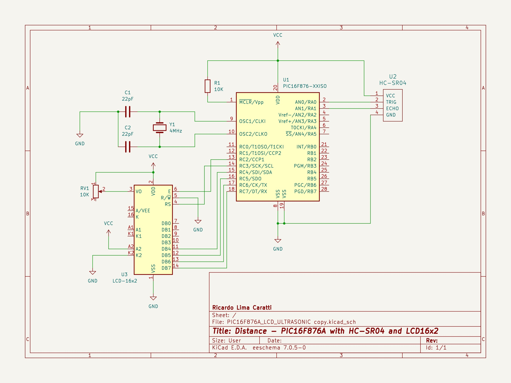

# PIC16F628A and HC-S04 Ultrasonic Sensor

The HC-SR04 Ultrasonic Sensor is a popular sensor used for measuring distance with high accuracy and stable readings. It operates by emitting an ultrasonic sound pulse and then measuring the time it takes for the echo to return. Features include:

- Range: Typically 2cm to 400cm.
- Accuracy: Can detect objects with precision, often around 3mm.
- Operating Voltage: Generally 5V.
- Interface: Consists of four pins - VCC, Trig (trigger), Echo, and GND.

Applications:
- Robotics for obstacle avoidance.
- Distance measurement in industrial environments.
- Proximity and level sensing applications.
- Parking sensors in vehicles.
- Projects requiring non-contact distance measurement.

The HC-SR04 is valued for its ease of use, affordability, and integration with microcontrollers like Arduino and PIC.


## Accuracy of this System

In applications based on PIC microcontrollers configured with its internal oscillator for operations such as distance measurement with the HC-S04 ultrasonic sensor, achieving optimal accuracy often requires careful calibration and fine-tuning. The internal oscillator of the PIC12F675, for example, while convenient and cost-effective, may not offer the same level of stability and precision as external crystal oscillators. This variance can impact the timing accuracy critical for distance measurements with the HC-S04, which relies on precise timing to calculate distances based on ultrasonic wave reflections.

Factors that can influence the precision of this system include:

1. **Oscillator Stability**: The internal oscillator's frequency can vary with temperature and voltage fluctuations, affecting the timing measurements used for calculating distance.

2. **Sensor Variations**: Individual HC-S04 sensors might exhibit slight differences in performance or sensitivity, necessitating calibration to ensure consistent readings.

3. **Environmental Conditions**: Temperature, humidity, and air composition can affect the speed of sound, and consequently, the distance calculations based on ultrasonic waves.

4. **Electrical Noise**: Other components in the circuit or external electromagnetic interference can introduce noise, impacting the sensor's ability to accurately detect ultrasonic signals.

For these reasons, implementing a calibration routine in the software can significantly enhance measurement accuracy. This routine could involve comparing readings from the HC-S04 with known distance values under controlled conditions and adjusting the software algorithm accordingly. Additionally, using stable power supplies and incorporating noise-reduction techniques in the circuit design can further improve the system's reliability and precision."


## Distance measurement example 

This application below utilizes the HC-SR04 sensor to measure the distance of an object and adjusts the color of an RGB LED based on the object's proximity. When an object is less than 10 cm away, the LED turns red, signaling close proximity. For distances between 10 and 30 cm, the LED changes to blue, indicating a medium range. At distances greater than 30 cm, the LED turns green, denoting a more distant object. This setup allows for an intuitive and visual representation of object distance.


### PIC16F628A and HC-S04 Ultrasonic Sensor schematic 


## PIC16F628 program 

```cpp
#include <xc.h>

// Chip settings
#pragma config FOSC = INTOSCCLK // Internal oscillator, CLKOUT on RA6
#pragma config WDTE = OFF       // Disables Watchdog Timer
#pragma config PWRTE = OFF      // Disables Power-up Timer
#pragma config MCLRE = ON       // MCLR pin function is digital input
#pragma config BOREN = ON       // Enables Brown-out Reset
#pragma config LVP = OFF        // Low voltage programming disabled
#pragma config CPD = OFF        // Data EE memory code protection disabled
#pragma config CP = OFF         // Flash program memory code protection disabled

#define _XTAL_FREQ 4000000 // Internal oscillator frequency set to 4MHz


void inline set_red_light() {
    PORTB = 0b00000001;
}

void inline set_green_light() {
    PORTB = 0b00000010;
}

void inline set_blue_light() {
    PORTB = 0b00000100;

}

void inline turn_led_off() {
    PORTB = 0b00000000;
}

void main() {
    
    // Turns off the comparator and converts its pins in digital I/O. 
    CMCONbits.CM = 0x07; 

    // Sets the PORT A and B    
    TRISB = 0;; // Sets PORTB as output (RGB LED Control)
    TRISA0 = 0;  // TRIG pin  (HC-S04 TRIGGER output)
    TRISA1 = 1;  // ECHO pin  (HC-S04 ECHO input)
     

    // Checking the RGB LED - Playing with RGB LED before starting the real application.
    for (int i = 0; i < 6; i++) {
        set_red_light();
        __delay_ms(200);
        set_green_light();
        __delay_ms(200);
        set_blue_light();
        __delay_ms(200);
        turn_led_off();
        __delay_ms(200);
    } 
    while (1) {
        TMR1H = 0;  // sets the high byte of the Timer1 counter to 0
        TMR1L = 0;  // sets the low byte of the Timer1 counter to 0
        RA0 = 1;
        __delay_us(10);
        RA0 = 0;
        while(!RA1); // Wait for ECHO/RA1 pin becomes HIGH
        TMR1ON = 1;  // Turns TIMER1 on
        while(RA1);  // Wait for ECHO/RA1 pin becomes LOW
        TMR1ON = 0;  // Turns TIMER1 off        
        unsigned int duration = (unsigned int) (TMR1H << 8) | TMR1L;
        unsigned int distance = duration *0.034/2;
        if ( distance <= 10) 
            set_red_light();
        else if (distance <= 30 )
            set_blue_light();
        else
            set_green_light();
    }
}

```

### PIC16F628A and HC-S04 Ultrasonic Sensor prototype


## PIC16F876A with LCD and HC-S04 Ultrasonic sensor


The following application demonstrates the use of the HC-S04 ultrasonic sensor with the PIC16F876A and a 16x2 LCD. The system is relatively accurate and can be used in many applications.


### PIC16F876A with HC-S04 and LCD 16x2 schematic 




### PIC16F876A programming

```cpp
/**
 * This example works with PIC16F628A
 * UNDER CONSTRUCTION...
 */

#include <xc.h>
#include "pic16flcd.h"

#pragma config FOSC = HS        // 
#pragma config WDTE = OFF       // Watchdog Timer disabled 
#pragma config PWRTE = OFF      // Power-up Timer disabled
#pragma config BOREN = OFF      // Brown-out Reset disabled
#pragma config LVP = OFF        // Low Voltage Programming disabled
#pragma config CPD = OFF        // Data EEPROM Memory Code Protection disabled
#pragma config CP = OFF         // Flash Program Memory Code Protection disabled

#define _XTAL_FREQ 4000000      // 

// Coverts integer numbers to char array
void convertToChar(uint16_t value, char *strValue, uint8_t len)
{
    char d;
    for (int i = (len - 1); i >= 0; i--)
    {
        d = value % 10;
        value = value / 10;
        strValue[i] = d + 48;
    }
    strValue[len] = '\0';
}

void main() {
    char strDistance[10];
  
    ADCON1 = 0x06; // Sets the pins of PORTA as digital  
    TRISA0 = 0;    // Sets RA0 as output (HC-S04 - trigger)
    TRISA1 = 1;    // Sets RA1 as input (HC-S04 - echo)
   
    T1CON = 0x00; // Configure Timer1: prescaler, modo, etc.
    
    // LCD 16x2 library setup 

    TRISC = 0; // You need to set this register to output
    Lcd_PinConfig lcd = {
        .port = &PORTC, // Assuming you're using PORTC for LCD on PIC16F876A
        .rs_pin = 2, // RC2 for RS
        .en_pin = 3, // RC3 for EN
        .d4_pin = 4, // RC4 for D4
        .d5_pin = 5, // RC5 for D5
        .d6_pin = 6, // RC6 for D6
        .d7_pin = 7 //  RC7 for D7
    };
    
    Lcd_Init(&lcd);  // Initialize the LCD
    Lcd_Clear(&lcd); 
    Lcd_SetCursor(&lcd, 1, 1); // Display message (Line 1 and Column 1)
    Lcd_WriteString(&lcd, "PIC16F876A-HCS04");
    Lcd_SetCursor(&lcd, 2, 1); // Display message (Line 2 and Column 1)
    Lcd_WriteString(&lcd, "Dist.: ");
    Lcd_SetCursor(&lcd, 2, 11); // Display message (Line 2 and Column 12)
    Lcd_WriteString(&lcd, "cm");
    
    __delay_ms(1000); 
    
    while(1) {
        TMR1H = 0;  // sets the high byte of the Timer1 counter to 0
        TMR1L = 0;  // sets the low byte of the Timer1 counter to 0
        
        RA0 = 1;
        __delay_us(10);
        RA0 = 0;
        while(!RA1); // Wait for ECHO/RA1 pin becomes HIGH
        TMR1ON = 1;  // Turns TIMER1 on
        while(RA1);  // Wait for ECHO/RA1 pin becomes LOW
        TMR1ON = 0;  // Turns TIMER1 off  
        
        unsigned int duration = (unsigned int) (TMR1H << 8) | TMR1L;
        unsigned int distance = duration *0.034 / 2;        
        

        Lcd_SetCursor(&lcd, 2, 7);
        convertToChar(distance,strDistance,3);
        Lcd_WriteString(&lcd,strDistance);
            
        __delay_ms(100);
    }
}


```


### PIC16F876A with HC-S04 and LCD 16x2 prototype


## PIC12F675 HC-S04 Version

The experiment below uses the PIC12F675 and the HC-S04 ultrasonic distance sensor utilizing three LEDs (Red, Yellow, and Green) to indicate, respectively, a distance of less than 10 cm, between 10 and 30 cm, and more than 30 cm.  In this case, there is no requirement to compute the exact distance to determine if it falls within specific ranges, such as being greater than 10, less than 30, or exceeding these values. Instead, you simply need to measure and compare the elapsed time corresponding to each of these distance thresholds.


### PIC12F675 pinout


### PIC12F675 and HC-S04 schematic


### PIC12F675 and HC-S04 source code in C

```cpp
/*
 * Distance Sensor with PIC12F675 and HC-S04
 * Author: Ricardo Lima Caratti
 * Jan/2024
 */

#pragma config FOSC = INTRCIO   // Oscillator Selection bits (INTOSC oscillator: I/O function on GP4/OSC2/CLKOUT pin, I/O function on GP5/OSC1/CLKIN)
#pragma config WDTE = OFF       // Watchdog Timer Enable bit (WDT disabled)
#pragma config PWRTE = OFF      // Power-Up Timer Enable bit (PWRT disabled)
#pragma config MCLRE = ON       // GP3/MCLR pin function select (GP3/MCLR pin function is MCLR)
#pragma config BOREN = ON       // Brown-out Detect Enable bit (BOD enabled)
#pragma config CP = OFF         // Code Protection bit (Program Memory code protection is disabled)
#pragma config CPD = OFF        // Data Code Protection bit (Data memory code protection is disabled)

// 4Mhz internal oscillator
#define _XTAL_FREQ 4000000
#include <xc.h>


/**
 * Turns Green LED On
 */
void inline GreenOn() {
    GPIO =  1;
}

/**
 * Turns Yellow LED On
 */
void inline YellowOn() {
    GPIO =  2;
}

/**
 * Turns Red LED On
 */
void inline RedOn() {
    GPIO =  4;
}


void main(void)
{   
    TRISIO = 0;        // Trigger (GP5), and GP0, GP1 and GP2 (LEDs) are output   
    TRISIO4 = 1;       // Echo
    ANSEL = 0;         // Digital input setup          
    
    while (1)
    {
        TMR1H = 0;      // Reset TMR1
        TMR1L = 0;

        GP5 = 1;        // Send 10uS signal to the Trigger pin
        __delay_us(10);
        GP5 = 0;

        while (!GP4);   // Wait for echo
        TMR1ON = 1;
        while (GP4);
        TMR1ON = 0;    
        // Now you have the elapsed time stored in TMR1H and TMR1L
        unsigned int duration = (unsigned int) (TMR1H << 8) | TMR1L;
        if ( duration < 830)        // this time is equivalent to 10 cm
            RedOn();
        else if (duration <= 2450 ) // this time is equivalent to 30 cm 
            YellowOn();
        else
            GreenOn();
        __delay_ms(100); 
    }

}

```


### PIC12F675 and HC-S04 Assembly version

```asm
; Distance Sensor with PIC12F675 and HC-S04.  
; This experiment uses the PIC12F675 and the HC-S04 ultrasonic distance sensor. 
; It utilizes three LEDs (Red, Yellow, and Green) to indicate, respectively, a distance 
; of less than 10 cm, between 10 and 30 cm, and more than 30 cm. 
; In this case, there is no requirement to compute the exact current distance 
; to determine if it falls within specific ranges, such as being greater than 10, 
; less than 30, or exceeding these values. Instead, you simply need to measure and 
; compare the elapsed time corresponding to each of these distance thresholds.
;    
; Author: Ricardo Lima Caratti
; Jan/2024
    
#include <xc.inc>

; CONFIG
  CONFIG  FOSC = INTRCIO        ; Oscillator Selection bits (INTOSC oscillator: I/O function on GP4/OSC2/CLKOUT pin, I/O function on GP5/OSC1/CLKIN)
  CONFIG  WDTE = OFF            ; Watchdog Timer Enable bit (WDT disabled)
  CONFIG  PWRTE = OFF           ; Power-Up Timer Enable bit (PWRT disabled)
  CONFIG  MCLRE = ON            ; GP3/MCLR pin function select (GP3/MCLR pin function is MCLR)
  CONFIG  BOREN = ON            ; Brown-out Detect Enable bit (BOD enabled)
  CONFIG  CP = OFF              ; Code Protection bit (Program Memory code protection is disabled)
  CONFIG  CPD = OFF             ; Data Code Protection bit (Data memory code protection is disabled) 
  
; declare your variables here
dummy1	    equ 0x20    
durationL   equ 0x21  
durationH   equ 0x22 
value1L	    equ 0x23		; Used by the subroutine to  
value1H	    equ 0x24		; compare tow 16 bits    
value2L	    equ 0x25		; values.
value2H	    equ 0x26		; They will represent two 16 bits values to be compered (if valor1 is equal, less or greter than valor2)  
   
PSECT resetVector, class=CODE, delta=2
resetVect:
    PAGESEL main
    goto main
PSECT code, delta=2
main:
    ; Analog and Digital pins setup
    bcf	    STATUS, 5		; Selects Bank 0
    clrf    GPIO		; Init GPIO
    clrf    CMCON		; COMPARATOR Register setup 
    bsf	    STATUS, 5		; Selects Bank 1
    movlw   0b00010000		; GP4 as input
    movwf   TRISIO		 
    clrf    ANSEL	 	; Digital
    bcf	    STATUS, 5		; Selects bank 0
MainLoopBegin:			; Endless loop
    ; Under construction
    call    ReadHCS04		; returns duration in value1
    movlw   LOW(830)		; Checks if it is <= 830 (it means 10 cm less)  
    movwf   value2L		;
    movlw   HIGH(830)		;
    movwf   value2H
    call    Compare16		; compare value1 with value2 
    btfsc   STATUS, 0		; It is <= 830? So the object is very close ( <= 10 cm)
    goto    ReallyClose		; indicates really close
    movlw   LOW(2450)		; Checks if it is >= 2450 (it means 30 cm or more)     
    movwf   value2L
    movlw   HIGH(2450)
    movwf   value2H
    call    Compare16		; compare value1 with value2 
    btfsc   STATUS, 0		; Is it <= 2450?  (<= 30 cm)
    goto    Close		; Not too close and not so far away
    goto    Distant		; Far away       
            
    goto    MainLoopEnd    
Close:				; Between 10 and 30 cm
    call YellowOn
    goto MainLoopEnd
ReallyClose:			; Less than 10 cm
    call RedOn
    goto MainLoopEnd
Distant:			; 30 cm or more
    call GreenOn
  
MainLoopEnd:    
    call Delay2ms
    
    goto MainLoopBegin

; ******************************      
; Turn Green LED On
GreenOn:
    call AllOff
    bsf	 GPIO,0
    return

; ******************************    
; Turn Yellow LED ON    
YellowOn: 
    call AllOff
    bsf  GPIO,1
    return  
    
; ******************************    
RedOn: 
    call AllOff
    bsf	  GPIO,2  
    return        

; ******************************
; Turn all LEDs off
AllOff: 
    clrw 
    bcf  GPIO,0
    bcf  GPIO,1
    bcf	 GPIO,2
    return
    
; ******** HC-S04 ****************
; Read and process the HC-S04 data
; There is no requirement to compute the exact distance to determine if it falls within specific ranges, 
; such as being greater than 10, less than 30, or exceeding these values. Instead, you simply need to 
; measure and compare the elapsed time corresponding to each of these distance thresholds.
; Thus, an elapsed time of 830 µs means that the distance traveled was approximately 10 cm (you may need calibrate it).   
; An elapsed time of 2450 µs means that the distance traveled was approximately 30 cm (you may need calibrate it).
ReadHCS04: 
    
    bcf	    STATUS, 5		; Selects Bank 0
    clrf    TMR1H		; Reset TMR1
    clrf    TMR1L

    ; Send 10uS signal to the Trigger pin
    bsf     GPIO,5
    call    Delay10us
    bcf	    GPIO,5
    ; Wait for echo
WaitEcho1: 
    btfss   GPIO,4		; Bit Test f, Skip if Set (do while GP4 is 0)
    goto    WaitEcho1
    bsf	    T1CON,0		; Sets TMR1ON -> TMR1ON = 1
WaitEcho2: 
    btfsc   GPIO,4		; Bit Test f, Skip if Clear  (do while GP4 is 1
    goto    WaitEcho2   
    bcf	    T1CON,0		; Clear TMR1ON -> TMR1ON = 0
    ; Now you have the elapsed time stored in TMR1H and TMR1L
    
    movf  TMR1L, w
    movwf value1L
    movf  TMR1H, w
    movwf value1H  
    
    return

; ************************* Compare function ***********************************    
; Signed and unsigned 16 bit comparison routine: by David Cary 2001-03-30 
; This function was extracted from http://www.piclist.com/techref/microchip/compcon.htm#16_bit 
; It was adapted by me to run in a PIC12F675 microcontroller    
; Does not modify value2 or value2.
; After calling this subroutine, you can use the STATUS flags (Z and C) like the 8 bit compares 
; I would like to thank David Cary for sharing it.     
Compare16: ; 7
	; uses a "dummy1" register.
	movf	value2H,w
	xorlw	0x80
	movwf	dummy1
	movf	value1H,w
	xorlw	0x80
	subwf	dummy1,w	; subtract Y-X
	goto	AreTheyEqual
CompareUnsigned16: ; 7
	movf	value1H,w
	subwf	value2H,w ; subtract Y-X
AreTheyEqual:
	; Are they equal ?
	btfss	STATUS, 2
	goto	Results16
	; yes, they are equal -- compare lo
	movf	value1L,w
	subwf	value2L,w	; subtract Y-X
Results16:
	; if X=Y then now Z=1.
	; if Y<X then now C=0.
	; if X<=Y then now C=1.
	return
    
;************** Delay functions *************      
; At 4 MHz, one instruction takes 1µs
; So, this soubroutine should take about 10µs 
; This time is used by the HC-S04 ultrasonic sensor 
; to determine the distance. 	
Delay10us:
    nop		; 8 cycle
    nop
    nop
    nop
    nop
    nop
    nop
    nop	    
    return	; 2 cycles

;
; It takes about 2ms
Delay2ms: 
    movlw  200
    movwf  dummy1
LoopDelay2ms: 
    call Delay10us 
    decfsz dummy1, f
    goto LoopDelay2ms
    return
        
END resetVect

```


### PIC12F675 and HC-S04 prototype 


## References

* [Ultrasonic Sensor HC-SR04 With PIC Microcontroller](https://www.trionprojects.org/2020/03/ultrasonic-sensor-hc-sr04-with-pic.html)
* [Ultrasonic Sensor HC-SR04 Code for PIC18F4550](https://www.electronicwings.com/pic/ultrasonic-module-hc-sr04-interfacing-with-pic18f4550)
* [Distance Measurement Using HC-SR04 Via NodeMCU](https://www.instructables.com/Distance-Measurement-Using-HC-SR04-Via-NodeMCU/)
