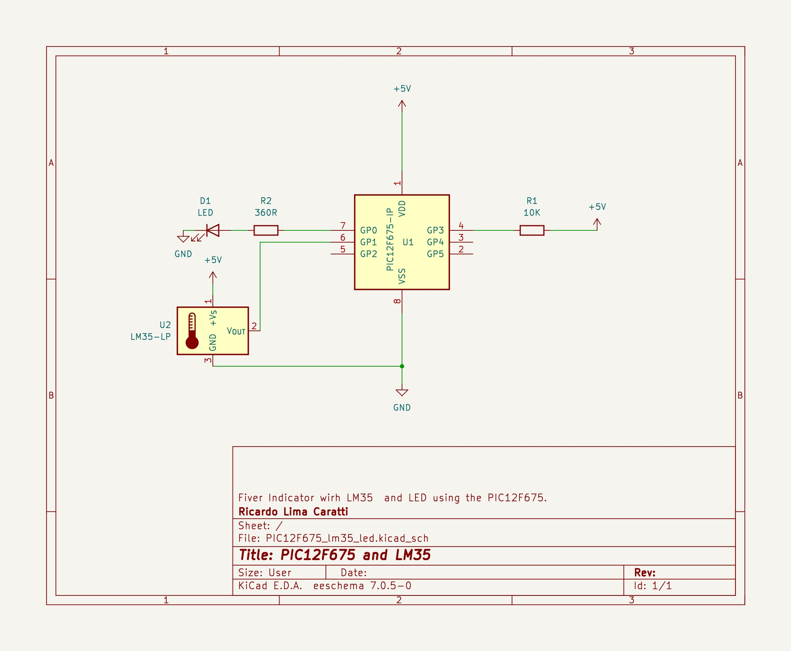

# Termometer with LM35 or TMP36 sensor and PIC12F and PIC16F with ADC support

In this folder, you will find some projects with the PIC12F and PIC16F series for processing analog signals, particularly for reading voltage outputs produced by temperature sensors like the LM35 or TMP36

## Fever indicator with the small PIC12F675

The PIC12F675 is a compact and versatile 8-bit microcontroller from Microchip Technology, belonging to the popular PIC12F series. It's known for its small size and low power consumption, making it ideal for space-constrained and power-sensitive applications. The PIC12F675 features 1 KB of flash memory, 64 bytes of EEPROM, and 128 bytes of RAM, along with an onboard 10-bit Analog-to-Digital Converter (ADC), which is quite impressive for its size.


## Simplifying Complex Calculations in Temperature Sensing with PIC12F675 projects

Some projects utilize either an LM35 or TMP36 temperature sensor to determine if a body's temperature is below, equal to, or above 37 degrees Celsius. The approach is streamlined to improve efficiency: there's no conversion of the sensor's analog signal to a Celsius temperature reading, as the actual temperature value isn't displayed.

The key lies in understanding the digital equivalent of 37 degrees Celsius in the sensor's readings. For instance, an analog reading of 77, when converted to digital through the Analog-to-Digital Converter (ADC), corresponds precisely to 37 degrees Celsius. This can be calculated as follows:

Let's see: **ADC Value * 5 / 1024 * 100 = Temperature in Degrees Celsius**.

Thus: **77 * 5 / 1024 * 100 = 37.59°C**

Therefore, the process involves simply reading the analog value and comparing it with 77. This method significantly conserves memory and processing power, optimizing the project's overall efficiency.

Based on the previous formula, you will be able to find other values you wish to monitor or alert


### Calibration 

It is likely that you will need to calibrate your system to find a more precise value. It's probable that ADC converters from different series of microcontrollers will produce varying results for the same output from the LM35 or TMP36. Additionally, the LM35 or TMP36 themselves may produce significant variations in response to the monitored body temperature.


## Schematic - Fiver Indicator with PIC12F675, LM35 and LED





## C code to demostrate that approach 

The following C code is designed for compilation and execution on the PIC12F675 microcontroller.

```cpp
#include <xc.h>

// 
#pragma config FOSC = INTRCIO   // Oscillator Selection bits (INTOSC oscillator: I/O function on GP4/OSC2/CLKOUT pin, I/O function on GP5/OSC1/CLKIN)
#pragma config WDTE = OFF       // Watchdog Timer Enable bit (WDT disabled)
#pragma config PWRTE = OFF      // Power-Up Timer Enable bit (PWRT disabled)
#pragma config MCLRE = ON       // GP3/MCLR pin function select (GP3/MCLR pin function is MCLR)
#pragma config BOREN = ON       // Brown-out Detect Enable bit (BOD enabled)
#pragma config CP = OFF         // Code Protection bit (Program Memory code protection is disabled)
#pragma config CPD = OFF        // Data Code Protection bit (Data memory code protection is disabled)

#define _XTAL_FREQ 4000000      // internal clock


void initADC() {
    TRISIO = 0b00000010;
    ANSEL =  0b00000010;          // AN1 is analog input
    ADCON0 = 0b10000101;          // Right justified; VDD;  01 = Channel 01 (AN1); A/D converter module is operating
}

unsigned int readADC() {
    ADCON0bits.GO = 1;           // Start conversion
    while (ADCON0bits.GO_nDONE); // Wait for conversion to finish
    return ADRESL; // 
}

void main() {
    TRISIO = 0x00;  // Sets All GPIO as output 
    GPIO =  0x0;    // Turns all GPIO pins low
    
    initADC();
    
    while (1) {
        unsigned int value = readADC();
        // To optimize accuracy, it might be necessary to perform calibration in order to 
        // determine a more precise value. the ADC vales 77 is near to 37 degree Celsius in my experiment
        if ( value >= 77)   
            GP0 = 1;        // Turn GP0 HIGH (LED ON))
        else
            GP0 = 0;        // Turn GP0 LOW (LED OFF)
        __delay_ms(1000); 
    }
}

```


## Assembly code version 

```asm 

; Fever Indicator with PIC12F675 with LM35 or TMP36
;
; Author: Ricardo Lima Caratti
; Jan/2024
    
#include <xc.inc>

; CONFIG
  CONFIG  FOSC = INTRCIO        ; Oscillator Selection bits (INTOSC oscillator: I/O function on GP4/OSC2/CLKOUT pin, I/O function on GP5/OSC1/CLKIN)
  CONFIG  WDTE = OFF            ; Watchdog Timer Enable bit (WDT disabled)
  CONFIG  PWRTE = OFF           ; Power-Up Timer Enable bit (PWRT disabled)
  CONFIG  MCLRE = ON            ; GP3/MCLR pin function select (GP3/MCLR pin function is MCLR)
  CONFIG  BOREN = ON            ; Brown-out Detect Enable bit (BOD enabled)
  CONFIG  CP = OFF              ; Code Protection bit (Program Memory code protection is disabled)
  CONFIG  CPD = OFF             ; Data Code Protection bit (Data memory code protection is disabled) 
  
; declare your variables here
dummy1	    equ 0x20 
dummy2	    equ 0x21 
delayParam  equ 0x22 
count	    equ 0x23
temp	    equ 0x24
divider	    equ 0x25
    
PSECT resetVector, class=CODE, delta=2
resetVect:
    PAGESEL main
    goto main
PSECT code, delta=2
main:
    ; Analog and Digital pins setup
    bcf	    STATUS, 5		; Selects Bank 0
    clrf    GPIO		; Init GPIO	
    bcf	    CMCON, 0		; Sets GP0 as output 
    movlw   0b10000101 		; Right justified; VDD;  01 = Channel 01 (AN1); A/D converter module is 
    movwf   ADCON0		; Enable ADC   
    bsf	    STATUS, 5		; Selects Bank 1
    
    movlw   0b00000010		
    movwf   TRISIO		; AN1 - input
    movlw   0b00000010		; AN1 as analog 
    movwf   ANSEL	 	; Sets GP1 as analog and Clock / 8
    bcf	    STATUS, 5		; Selects bank 0
    
;  See PIC Assembler Tips: http://picprojects.org.uk/projects/pictips.htm 
    
MainLoopBegin:		    ; Endless loop
    call AdcRead	    ; read the temperature value
    ; Checks if the temperature is lower, equal to, or higher than 37. Considering that 37 degrees Celsius is the threshold or transition value for fever.
    movlw 77		    ; 77 is the equivalent ADC value to 37 degree Celsius  
    subwf temp,w	    ; subtract W from the temp 
    btfsc STATUS, 2	    ; if Z flag  = 0; temp == wreg ?  
    goto  AlmostFever	    ; temp = wreg
    btfss STATUS, 0	    ; if C flag = 1; temp < wreg?   
    goto  Normal	    ; temp < wreg
    btfsc STATUS, 0         ; if C flag = 0 
    goto  Fever		    ; temp >= wreg  (iqual was tested before, so just > is available here)
    goto MainLoopEnd
    
AlmostFever:		    ; Temperature is 37
    ; BlinkLED
    call Delay
    bsf GPIO,0
    call Delay
    bcf GPIO,0        
    goto MainLoopEnd
Fever:			    ; Temperature is greater than 37
    ; Turn the  LED ON
    bsf GPIO,0
    goto MainLoopEnd

Normal: 
    ; Turn the LED off
    bcf GPIO,0  
    goto MainLoopEnd
    
ReadError: 
    ; BlinkLED faster
    movlw 1
    movwf delayParam
    call Delay
    bsf GPIO,0
    call Delay
    bcf GPIO,0        
  
MainLoopEnd:     
  
    
    goto MainLoopBegin
     
;
; Your subroutines
;  

;
; Read the analog value from GP1
AdcRead: 
    bcf	  STATUS, 5		; Select bank 0 to deal with ADCON0 register
    bsf	  ADCON0, 1		; Start convertion  (set bit 1 to high)

WaitConvertionFinish:		; do while the bit 1 of ADCON0 is 1 
    btfsc  ADCON0, 1		; Bit Test, Skip if Clear - If bit 1 in ADCON0 is '1', the next instruction is executed.
    goto   WaitConvertionFinish 
    
    bsf	  STATUS, 5		; Select bank1 to deal with ADRESL register
    movf  ADRESL, w		
    movwf temp			; If temp => 77 the temperature is about 37 degree Celsius
    bcf	  STATUS, 5		; Select to bank 0
    return
   
; ******************
; Delay function
;
; For an oscillator of 4MHz a regular instructions takes 1us (See pic16f628a Datasheet, page 117).      
; So, at 4MHz, this Delay subroutine takes about: (5 cycles) * 255 * 255 * delayParam * 0.000001 (second)  
; It is about 1s (0.975 s)  - One second  if delayParam is 3
Delay:  
    movlw   3
    movwf   delayParam    
    movlw   255
    movwf   dummy1      ; 255 times
    movwf   dummy2      ; 255 times (255 * 255)
			; 255 * 255 * delayParam loaded before calling Delay    
DelayLoop:    
    nop                 ; One cycle
    nop                 ; One cycle
    decfsz dummy1, f    ; One cycle* (dummy1 = dumm1 - 1) => if dummy1 is 0, after decfsz, it will be 255
    goto DelayLoop      ; Two cycles
    decfsz dummy2, f    ; dummy2 = dumm2 - 1; if dummy2 = 0, after decfsz, it will be 255
    goto DelayLoop
    decfsz delayParam,f ; Runs 3 times (255 * 255)		 
    goto DelayLoop
    
    return 
   
END resetVect


```


## References


