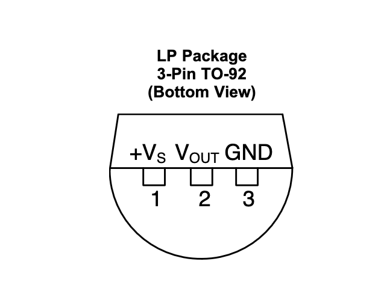
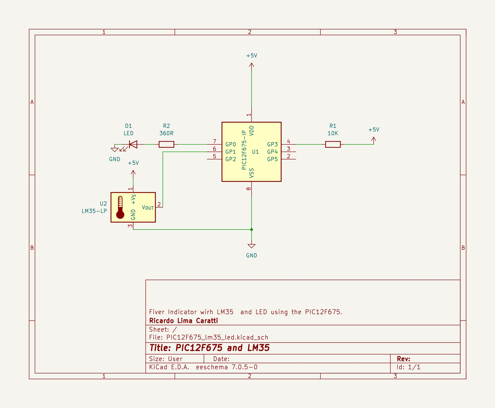

# Termometer with LM35 or TMP36 sensor and PIC with ADC support

In this folder, you will find some LM35 or TMP36 projects with the PIC10F and PIC12F with ADC support. You can find applications that use PIC16 and LM35 or TMP36 in [05-PWM-SPEED-COOLER](../05-PWM-SPEED-COOLER/) folder. 


## Fever indicator with the small PIC12F675

**Fever Indicator Project Using PIC12F675, LM35 Sensor, and an LED**

**Project Overview**:
The Fever Indicator is a simple yet effective device designed to monitor body temperature and indicate the presence of fever. Utilizing the PIC12F675 microcontroller, a reliable LM35 temperature sensor, and an LED, this project is well-suited for basic health monitoring and educational purposes. The indicator is set to light up the LED when the body temperature reaches or exceeds 37°C, a common threshold for fever.

**Components**:
1. **PIC12F675 Microcontroller**: The core of the project, responsible for processing the signal from the LM35 sensor and controlling the LED based on the temperature reading.
2. **LM35 Temperature Sensor**: This analog sensor will be used to measure the body temperature. It provides an output voltage linearly proportional to the Celsius temperature.
3. **LED**: Serves as a visual indicator for fever. Lights up when the temperature is 37°C or higher.
4. **Resistors**: Necessary for the LED and may be required for the LM35 depending on the setup.
5. **Power Supply**: Suitable for the microcontroller and sensor.


**Circuit Design**:
- The LM35 sensor is connected to one of the analog input pins of the PIC12F675 (e.g., GP1, which is configured as an ADC input).
- The LED is connected to a digital output pin of the PIC12F675 (e.g., GP0) with a current-limiting resistor.
- The PIC12F675 is powered as per its operating specifications, ensuring stable operation for accurate readings.
- See schematic below

**Operation**:
- The LM35 sensor continuously monitors the body temperature. Its output voltage is fed to the ADC pin of the PIC12F675.
- The microcontroller reads this analog input, converts it to a digital value, and calculates the corresponding temperature.
- The program running on the PIC12F675 checks the temperature reading. If the temperature is 37°C or higher, it activates the LED.
- The LED being on indicates a fever state.

**Software Logic**:
- The software written for the PIC12F675 includes ADC initialization and reading routines, a calculation to convert the ADC value to a temperature reading (considering the LM35's 10mV/°C output), and a control statement to check for the fever condition.
- The temperature threshold for triggering the LED can be adjusted in the software as needed.

**Applications and Use Cases**:
- This Fever Indicator can be used in homes, schools, or offices as a basic health monitoring tool.
- It’s particularly beneficial in educational settings, where students can learn about embedded systems, sensor integration, and basic health technology.

**Conclusion**:
This Fever Indicator project demonstrates a practical application of microcontrollers and sensors. It combines hardware interfacing with software programming to create a functional device, providing a platform for learning and a tool for basic health monitoring.


### About the PIC12675

The PIC12F675 is a compact and versatile 8-bit microcontroller from Microchip Technology, belonging to the popular PIC12F series. It's known for its small size and low power consumption, making it ideal for space-constrained and power-sensitive applications. The PIC12F675 features 1 KB of flash memory, 64 bytes of EEPROM, and 128 bytes of RAM, along with an onboard 10-bit Analog-to-Digital Converter (ADC), which is quite impressive for its size.


### About the LM35 

The LM35 is a precision integrated-circuit temperature sensor, widely used for its ease of use, low cost, and straightforward analog output that corresponds to the temperature it measures. Here are its key technical features and specifications:

1. **Temperature Sensing Range**:
   - Typically, the LM35 has a temperature range of -55°C to +150°C. There are variants like the LM35CZ which are optimized for colder temperatures, and the LM35DZ for near-freezing temperatures.

2. **Output**:
   - The LM35 provides an analog output voltage that is linearly proportional to the Celsius temperature. The scale factor is typically 10 mV/°C, meaning the output voltage increases by 10 mV for each degree Celsius rise in temperature.

3. **Accuracy**:
   - The accuracy of the LM35 is generally ±0.5°C at room temperature and ±0.75°C over the full -55°C to 150°C temperature range. Certain calibrated versions offer improved accuracies.

4. **Operating Voltage**:
   - It typically operates over a range of 4V to 30V. Some versions can operate on lower voltages, which makes the sensor suitable for battery-operated devices.

5. **Low Self-Heating**:
   - The LM35 has a very low self-heating effect, typically less than 0.1°C in still air, because of its low power consumption.

6. **No Need for External Calibration**:
   - The sensor does not require any external calibration or trimming to provide typical accuracies of ±0.25°C at room temperature and ±0.75°C over a full -55°C to 150°C temperature range.

7. **Linear Output**:
   - The output of the LM35 is linear, which means the output voltage rises and falls linearly with temperature. This linear output makes interfacing with reading circuitry (like an ADC on a microcontroller) straightforward.

8. **Analog Nature**:
   - Being an analog sensor, it requires an Analog-to-Digital Converter (ADC) if the reading needs to be processed by digital electronics, such as a microcontroller.

9. **Variants**:
   - The LM35 is available in several different packages, including TO-92 plastic transistors, plastic SOIC, and metal TO-CAN. This variety allows it to be used in a wide range of applications.

10. **Applications**:
    - It’s commonly used in a variety of applications including environmental controls, HVAC systems, temperature monitoring systems in electronic equipment, and anywhere where temperature monitoring is necessary.

The LM35's straightforward and linear output, combined with its inherent accuracy and reliability, makes it a go-to choice for many temperature sensing requirements. It is especially favored in educational, hobbyist, and prototyping projects due to its ease of use and interfacing simplicity.





## Schematic - Fiver Indicator with PIC12F675, LM35 and LED





## Simplifying Complex Calculations in Temperature Sensing with PIC12F675 projects

Some projects utilize either an LM35 or TMP36 temperature sensor to determine if a body's temperature is below, equal to, or above 37 degrees Celsius. The approach is streamlined to improve efficiency: there's no conversion of the sensor's analog signal to a Celsius temperature reading, as the actual temperature value isn't displayed.

The key lies in understanding the digital equivalent of 37 degrees Celsius in the sensor's readings. For instance, an analog reading of 77, when converted to digital through the Analog-to-Digital Converter (ADC), corresponds precisely to 37 degrees Celsius. This can be calculated as follows:

Let's see: **ADC Value * 5 / 1024 * 100 = Temperature in Degrees Celsius**.

Thus: **77 * 5 / 1024 * 100 = 37.59°C**

Therefore, the process involves simply reading the analog value and comparing it with 77. This method significantly conserves memory and processing power, optimizing the project's overall efficiency.

Based on the previous formula, you will be able to find other values you wish to monitor or alert


### Calibration 

It is likely that you will need to calibrate your system to find a more precise value. It's probable that ADC converters from different series of microcontrollers will produce varying results for the same output from the LM35 or TMP36. Additionally, the LM35 or TMP36 themselves may produce significant variations in response to the monitored body temperature.


## C code to demostrate that approach  - Fiver Indicator with PIC12F675, LM35 and one LED

The following C code is designed for compilation and execution on the PIC12F675 microcontroller.

```cpp
#include <xc.h>

// 
#pragma config FOSC = INTRCIO   // Oscillator Selection bits (INTOSC oscillator: I/O function on GP4/OSC2/CLKOUT pin, I/O function on GP5/OSC1/CLKIN)
#pragma config WDTE = OFF       // Watchdog Timer Enable bit (WDT disabled)
#pragma config PWRTE = OFF      // Power-Up Timer Enable bit (PWRT disabled)
#pragma config MCLRE = ON       // GP3/MCLR pin function select (GP3/MCLR pin function is MCLR)
#pragma config BOREN = ON       // Brown-out Detect Enable bit (BOD enabled)
#pragma config CP = OFF         // Code Protection bit (Program Memory code protection is disabled)
#pragma config CPD = OFF        // Data Code Protection bit (Data memory code protection is disabled)

#define _XTAL_FREQ 4000000      // internal clock


void initADC() {
    TRISIO = 0b00000010;
    ANSEL =  0b00000010;          // AN1 is analog input
    ADCON0 = 0b10000101;          // Right justified; VDD;  01 = Channel 01 (AN1); A/D converter module is operating
}

unsigned int readADC() {
    ADCON0bits.GO = 1;           // Start conversion
    while (ADCON0bits.GO_nDONE); // Wait for conversion to finish
    return ADRESL; // 
}

void main() {
    TRISIO = 0x00;  // Sets All GPIO as output 
    GPIO =  0x0;    // Turns all GPIO pins low
    
    initADC();
    
    while (1) {
        unsigned int value = readADC();
        // To optimize accuracy, it might be necessary to perform calibration in order to 
        // determine a more precise value. the ADC vales 77 is near to 37 degree Celsius in my experiment
        if ( value >= 77)   
            GP0 = 1;        // Turn GP0 HIGH (LED ON))
        else
            GP0 = 0;        // Turn GP0 LOW (LED OFF)
        __delay_ms(1000); 
    }
}

```


## Assembly code - Fiver Indicator with PIC12F675, LM35 and one LED

```asm 

; Fever Indicator with PIC12F675 with LM35 or TMP36
;
; This projects utilizes either an LM35 or TMP36 temperature sensor to determine if a body's temperature is below, 
; equal to, or above 37 degrees Celsius. The approach is streamlined to improve efficiency: there's no conversion 
; of the sensor's analog signal to a Celsius temperature reading, as the actual temperature value isn't displayed.
; The key lies in understanding the digital equivalent of 37 degrees Celsius in the sensor's readings. 
; For instance, an analog reading of 77, when converted to digital through the Analog-to-Digital Converter (ADC), 
; corresponds to 37 degrees Celsius. This can be calculated as follows:
; 
; Let's see: ADC Value * 5 / 1024 * 100 = Temperature in Degrees Celsius.
; 
; Thus: 77 * 5 / 1024 * 100 = 37.59�C
;
; Calibration 
;
; It is likely that you will need to calibrate your system to find a more precise value. 
; It's probable that ADC converters from different series of microcontrollers will produce 
; varying results for the same output from the LM35 or TMP36. Additionally, the LM35 or TMP36 
; themselves may produce significant variations in response to the monitored body temperature.
;    
; Author: Ricardo Lima Caratti
; Jan/2024
    
#include <xc.inc>

; CONFIG
  CONFIG  FOSC = INTRCIO        ; Oscillator Selection bits (INTOSC oscillator: I/O function on GP4/OSC2/CLKOUT pin, I/O function on GP5/OSC1/CLKIN)
  CONFIG  WDTE = OFF            ; Watchdog Timer Enable bit (WDT disabled)
  CONFIG  PWRTE = OFF           ; Power-Up Timer Enable bit (PWRT disabled)
  CONFIG  MCLRE = ON            ; GP3/MCLR pin function select (GP3/MCLR pin function is MCLR)
  CONFIG  BOREN = ON            ; Brown-out Detect Enable bit (BOD enabled)
  CONFIG  CP = OFF              ; Code Protection bit (Program Memory code protection is disabled)
  CONFIG  CPD = OFF             ; Data Code Protection bit (Data memory code protection is disabled) 
  
; declare your variables here
dummy1	    equ 0x20 
dummy2	    equ 0x21 
delayParam  equ 0x22 
temp	    equ 0x23

    
PSECT resetVector, class=CODE, delta=2
resetVect:
    PAGESEL main
    goto main
PSECT code, delta=2
main:
    ; Analog and Digital pins setup
    bcf	    STATUS, 5		; Selects Bank 0
    clrf    GPIO		; Init GPIO	
    clrf    CMCON		; COMPARATOR Register Setup
    movlw   0b10000101 		; Right justified; VDD;  01 = Channel 01 (AN1); A/D converter module is 
    movwf   ADCON0		; Enable ADC   
    bsf	    STATUS, 5		; Selects Bank 1
    
    movlw   0b00000010		
    movwf   TRISIO		; AN1 - input
    movlw   0b00000010		; AN1 as analog 
    movwf   ANSEL	 	; Sets GP1 as analog and Clock / 8
    bcf	    STATUS, 5		; Selects bank 0
    
;  See PIC Assembler Tips: http://picprojects.org.uk/projects/pictips.htm 
    
MainLoopBegin:		    ; Endless loop
    call AdcRead	    ; read the temperature value
    ; Checks if the temperature is lower, equal to, or higher than 37. Considering that 37 degrees Celsius is the threshold or transition value for fever.
    movlw 77		    ; 77 is the equivalent ADC value to 37 degree Celsius  
    subwf temp,w	    ; subtract W from the temp 
    btfsc STATUS, 2	    ; if Z flag  = 0; temp == wreg ?  
    goto  AlmostFever	    ; temp = wreg
    btfss STATUS, 0	    ; if C flag = 1; temp < wreg?   
    goto  Normal	    ; temp < wreg
    btfsc STATUS, 0         ; if C flag = 0 
    goto  Fever		    ; temp >= wreg  (iqual was tested before, so just > is available here)
    goto MainLoopEnd
    
AlmostFever:		    ; Temperature is 37
    ; BlinkLED
    call Delay
    bsf GPIO,0
    call Delay
    bcf GPIO,0        
    goto MainLoopEnd
Fever:			    ; Temperature is greater than 37
    ; Turn the  LED ON
    bsf GPIO,0
    goto MainLoopEnd

Normal: 
    ; Turn the LED off
    bcf GPIO,0  
    goto MainLoopEnd
    
ReadError: 
    ; BlinkLED faster
    movlw 1
    movwf delayParam
    call Delay
    bsf GPIO,0
    call Delay
    bcf GPIO,0        
  
MainLoopEnd:     
  
    
    goto MainLoopBegin
     
;
; Your subroutines
;  

;
; Read the analog value from GP1
AdcRead: 
    bcf	  STATUS, 5		; Select bank 0 to deal with ADCON0 register
    bsf	  ADCON0, 1		; Start convertion  (set bit 1 to high)

WaitConvertionFinish:		; do while the bit 1 of ADCON0 is 1 
    btfsc  ADCON0, 1		; Bit Test, Skip if Clear - If bit 1 in ADCON0 is '1', the next instruction is executed.
    goto   WaitConvertionFinish 
    
    bsf	  STATUS, 5		; Select bank1 to deal with ADRESL register
    movf  ADRESL, w		
    movwf temp			; If temp => 77 the temperature is about 37 degree Celsius
    bcf	  STATUS, 5		; Select to bank 0
    return
   
; ******************
; Delay function
;
; For an oscillator of 4MHz a regular instructions takes 1us (See pic16f628a Datasheet, page 117).      
; So, at 4MHz, this Delay subroutine takes about: (5 cycles) * 255 * 255 * delayParam * 0.000001 (second)  
; It is about 1s (0.975 s)  - One second  if delayParam is 3
Delay:  
    movlw   3
    movwf   delayParam    
    movlw   255
    movwf   dummy1      ; 255 times
    movwf   dummy2      ; 255 times (255 * 255)
			; 255 * 255 * delayParam loaded before calling Delay    
DelayLoop:    
    nop                 ; One cycle
    nop                 ; One cycle
    decfsz dummy1, f    ; One cycle* (dummy1 = dumm1 - 1) => if dummy1 is 0, after decfsz, it will be 255
    goto DelayLoop      ; Two cycles
    decfsz dummy2, f    ; dummy2 = dumm2 - 1; if dummy2 = 0, after decfsz, it will be 255
    goto DelayLoop
    decfsz delayParam,f ; Runs 3 times (255 * 255)		 
    goto DelayLoop
    
    return 
   
END resetVect


```


## Schematic - Fiver Indicator with PIC12F675, LM35 and Three LEDs

This version of the "Fever Indicator" uses multiple LEDs instead of one. The green LED indicates normal body temperature, the yellow LED indicates a warning or point of attention, and the red LED indicates fever. Note that the connections for the LM35 have changed. In this version, GP4 - (AN3) is used for analog reading.


## C code - Fiver Indicator with PIC12F675, LM35 and Three LEDs

```cpp
#include <xc.h>

// 
#pragma config FOSC = INTRCIO   // Oscillator Selection bits (INTOSC oscillator: I/O function on GP4/OSC2/CLKOUT pin, I/O function on GP5/OSC1/CLKIN)
#pragma config WDTE = OFF       // Watchdog Timer Enable bit (WDT disabled)
#pragma config PWRTE = OFF      // Power-Up Timer Enable bit (PWRT disabled)
#pragma config MCLRE = ON       // GP3/MCLR pin function select (GP3/MCLR pin function is MCLR)
#pragma config BOREN = ON       // Brown-out Detect Enable bit (BOD enabled)
#pragma config CP = OFF         // Code Protection bit (Program Memory code protection is disabled)
#pragma config CPD = OFF        // Data Code Protection bit (Data memory code protection is disabled)

#define _XTAL_FREQ 4000000      // internal clock

void initADC() {
    TRISIO = 0b00011000;          // input setup - GP4/AN3  
    ANSEL =  0b00011000;          // AN3 as analog input
    ADCON0 = 0b10001101;          // Right justified; VDD;  01 = Channel 03 (AN3); A/D converter module is 
}

unsigned int readADC() {
    ADCON0bits.GO = 1;           // Start conversion
    while (ADCON0bits.GO_nDONE); // Wait for conversion to finish
    // Assuming that the body's maximum temperature will not exceed 127 (about 62 degrees Celsius).
    return ADRESL; // In this case, ADRESL was ignored.  
}

/**
 * Turns All LEDS Off 
 */
void AllOff() {
    GPIO =  0;
}

/**
 * Turns Green LED On
 */
void GreenOn() {
    AllOff();
    GPIO =  0;
}

/**
 * Turns Yellow LED On
 */
void YellowOn() {
    AllOff();
    GPIO =  1;
}

/**
 * Turns Red LED On
 */
void RedOn() {
    AllOff();
    GPIO =  2;
}

void main() {
    GPIO =  0x0;    // Turns all GPIO pins low
    initADC();
    while (1) {
        unsigned int value = readADC();
         // To optimize accuracy, it might be necessary to perform calibration in order to 
        // determine a more precise value. the ADC vales 77 is near to 37 degree Celsius in my experiment
        if ( value == 77) 
            YellowOn();
        else if ( value > 77 )
            RedOn();
        else
            GreenOn();
        __delay_ms(500); 
    }
}


```


## Assembly code - Fiver Indicator with PIC12F675, LM35 and Three LEDs 

```asm
; BLINK three LEDS in sequency
; My PIC Journey   
; Author: Ricardo Lima Caratti
; Jan/2024
    
#include <xc.inc>

; CONFIG
  CONFIG  FOSC = INTRCIO        ; Oscillator Selection bits (INTOSC oscillator: I/O function on GP4/OSC2/CLKOUT pin, I/O function on GP5/OSC1/CLKIN)
  CONFIG  WDTE = OFF            ; Watchdog Timer Enable bit (WDT disabled)
  CONFIG  PWRTE = OFF           ; Power-Up Timer Enable bit (PWRT disabled)
  CONFIG  MCLRE = ON            ; GP3/MCLR pin function select (GP3/MCLR pin function is MCLR)
  CONFIG  BOREN = ON            ; Brown-out Detect Enable bit (BOD enabled)
  CONFIG  CP = OFF              ; Code Protection bit (Program Memory code protection is disabled)
  CONFIG  CPD = OFF             ; Data Code Protection bit (Data memory code protection is disabled) 
  
; declare your variables here
dummy1	    equ 0x20 
dummy2	    equ 0x21 
delayParam  equ 0x22 
temp	    equ 0x23  
    
PSECT resetVector, class=CODE, delta=2
resetVect:
    PAGESEL main
    goto main
PSECT code, delta=2
main:
    ; Analog and Digital pins setup
    bcf	    STATUS, 5		; Selects Bank 0
    clrf    GPIO		; Init GPIO
    clrf    CMCON		; COMPARATOR Register setup
    movlw   0b10001101 		; Right justified; VDD;  01 = Channel 01 (AN1); A/D converter module is 
    movwf   ADCON0		; Enable ADC   
    bsf	    STATUS, 5		; Selects Bank 1
    movlw   0b00010000		; GP4/AN3 as input
    movwf   TRISIO		 
    movlw   0b00011000		; AN3 as analog 
    movwf   ANSEL	 	; Sets GP4 as analog and Clock / 8
    bcf	    STATUS, 5		; Selects bank 0
MainLoopBegin:		    ; Endless loop
    call AdcRead	    ; read the temperature value
    ; Checks if the temperature is lower, equal to, or higher than 37. Considering that 37 degrees Celsius is the threshold or transition value for fever.
    movlw 77		    ; 77 is the equivalent ADC value to 37 degree Celsius  
    subwf temp,w	    ; subtract W from the temp 
    btfsc STATUS, 2	    ; if Z flag  = 0; temp == wreg ?  
    goto  AlmostFever	    ; temp = wreg
    btfss STATUS, 0	    ; if C flag = 1; temp < wreg?   
    goto  Normal	    ; temp < wreg
    btfsc STATUS, 0         ; if C flag = 0 
    goto  Fever		    ; temp >= wreg  (iqual was tested before, so just > is available here)
    goto MainLoopEnd
    
AlmostFever:		    ; Temperature is 37
    call YellowOn
    goto MainLoopEnd
Fever:			    ; Temperature is greater than 37
    call RedOn
    goto MainLoopEnd
Normal: 
    call GreenOn
    goto MainLoopEnd
  
MainLoopEnd:    
    call Delay
    goto MainLoopBegin

; ******************************      
; Turn Green LED On
GreenOn:
    call AllOff
    movlw 1	  ; 0B00000001  
    movwf GPIO
    return

; ******************************    
; Turn Yellow LED ON    
YellowOn: 
    call AllOff
    movlw 2	   ; 0B00000010
    movwf GPIO
    return  
    
; ******************************    
RedOn: 
    call AllOff
    movlw 4	   ; 0B00000100
    movwf GPIO
    return        

; ******************************
; Turn all LEDs off
AllOff: 
    clrw 
    movwf GPIO
    return
    
; ******** ADC Read ************
; Read the analog value from GP1
AdcRead: 
    bcf	  STATUS, 5		; Select bank 0 to deal with ADCON0 register
    bsf	  ADCON0, 1		; Start convertion  (set bit 1 to high)

WaitConvertionFinish:		; do while the bit 1 of ADCON0 is 1 
    btfsc  ADCON0, 1		; Bit Test, Skip if Clear - If bit 1 in ADCON0 is '1', the next instruction is executed.
    goto   WaitConvertionFinish 
    
    bsf	  STATUS, 5		; Select bank1 to deal with ADRESL register
    movf  ADRESL, w		
    movwf temp			; If temp => 77 the temperature is about 37 degree Celsius
    bcf	  STATUS, 5		; Select to bank 0

    return
    
    
; ******************
; Delay function
;
; For an oscillator of 4MHz a regular instructions takes 1us (See pic16f628a Datasheet, page 117).      
; So, at 4MHz, this Delay subroutine takes about: (5 cycles) * 255 * 255 * delayParam * 0.000001 (second)  
; It is about 1s (0.975 s)  - One second  if delayParam is 3
Delay:  
    movlw   3
    movwf   delayParam
    movlw   255
    movwf   dummy1      ; 255 times
    movwf   dummy2      ; 255 times (255 * 255)
			; 255 * 255 * delayParam loaded before calling Delay    
DelayLoop:    
    nop                 ; One cycle
    nop                 ; One cycle
    decfsz dummy1, f    ; One cycle* (dummy1 = dumm1 - 1) => if dummy1 is 0, after decfsz, it will be 255
    goto DelayLoop      ; Two cycles
    decfsz dummy2, f    ; dummy2 = dumm2 - 1; if dummy2 = 0, after decfsz, it will be 255
    goto DelayLoop
    decfsz delayParam,f ; Runs 3 times (255 * 255)		 
    goto DelayLoop
    
    return 
    
END resetVect

```

## References


