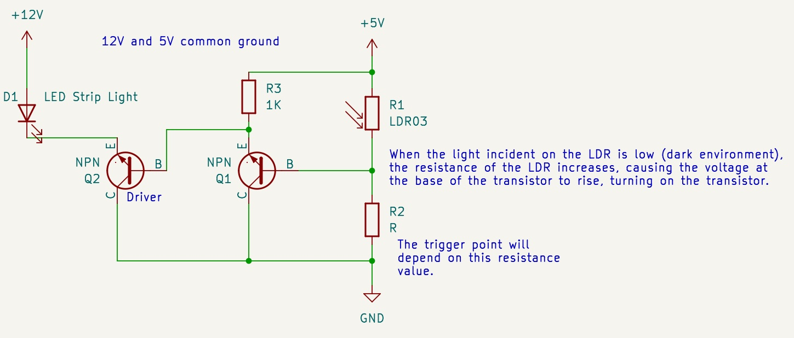
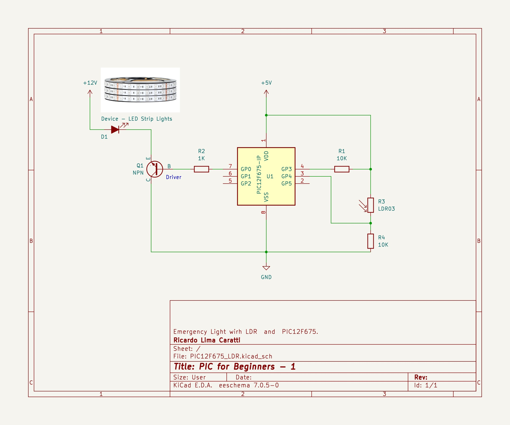

# LDR (photocell) with PIC and ADC


To emphasize the use of Analog-to-Digital Converters (ADC) found in some PIC microcontrollers, this small project introduces an emergency light system based on an LDR (also popularly known as a photoresistor or photocell).

It's important to note that for a simple emergency light system like the one presented here, the use of a microcontroller and programming isn't strictly necessary. With just a few passive components, an LDR, and a transistor, it's possible to implement an emergency light system at a much lower cost. The schematic below shows a simple emergency light system using transistors, a LDR and resistors. 




However, this project with PIC microcontroller shown below is educational in nature and serves as a foundation for developing more complex systems, which would be significantly more challenging without the use of microcontrollers. For instance, it could be used to log the times when the emergency system (emergency light) is activated for later analysis or to record the average light intensity over a specific period.

In this project, an aditional  transistor is also used to assist in activating a strong light that could not be directly driven by the microcontroller (as is commonly done with LEDs). This approach allows for the activation of higher power systems.

Below is the circuit for our Emergency Light project with LDR and the PIC12F675.


## Schematic

The photoresistor used in this project varies its resistance depending on the intensity of light, ranging from values close to 50Ω to those near 1MΩ. In other words, in a very dark environment, the resistance of this device is quite high, around 1MΩ, whereas in brightly lit areas or in direct sunlight, the resistance can drop to less than 100Ω. To some extent, this device can be likened to a potentiometer. The key difference is that a potentiometer changes its resistance through mechanical action (like a human hand), while a photoresistor varies its resistance with light intensity.

Given these characteristics, this device can be used to develop various products such as alarms, emergency lights, and energy-saving systems in public spaces, among other applications. The strategy for developing the Emergency Light involves creating a voltage divider by placing a fixed 10K resistor in series with the variable photoresistor (LDR). The voltage across the 10K resistor will be read by the microcontroller's analog input and converted into a 10-bit number (ranging from 0 to 1024, with 1024 corresponding to 5V - considering 5V as the reference voltage set in the microcontroller). The circuit below shows the emergency lights and the PIC12F675 setup. 





## PIC12F675 pinout


## Source code in C lenguage 


```cpp

/**
 * Emergency Light with LDR and PIC12F675
 * My PIC Journey   
 * Author: Ricardo Lima Caratti
 * Jan/2024 
 */
#include <xc.h>

#pragma config FOSC = INTRCIO   // Oscillator Selection bits (INTOSC oscillator: I/O function on GP4/OSC2/CLKOUT pin, I/O function on GP5/OSC1/CLKIN)
#pragma config WDTE = OFF       // Watchdog Timer Enable bit (WDT disabled)
#pragma config PWRTE = OFF      // Power-Up Timer Enable bit (PWRT disabled)
#pragma config MCLRE = ON       // GP3/MCLR pin function select (GP3/MCLR pin function is MCLR)
#pragma config BOREN = ON       // Brown-out Detect Enable bit (BOD enabled)
#pragma config CP = OFF         // Code Protection bit (Program Memory code protection is disabled)
#pragma config CPD = OFF        // Data Code Protection bit (Data memory code protection is disabled)

#define _XTAL_FREQ 4000000      // internal clock

void inline initADC() {
    TRISIO = 0b00011000;          // input setup - GP4/AN3  
    ANSEL =  0b00011000;          // AN3 as analog input
    ADCON0 = 0b10001101;          // Right justified; VDD;  01 = Channel 03 (AN3); A/D converter module is 
}

unsigned inline int readADC() {
    ADCON0bits.GO = 1;              // Start conversion
    while (ADCON0bits.GO_nDONE);    // Wait for conversion to finish
    return ((unsigned int) ADRESH << 8) + (unsigned int) ADRESL;  // return the ADC 10 bit integer value 1024 ~= 5V, 512 ~= 2.5V, ... 0 = 0V
}


/**
 * Turns Emergency Light ON
 */
void inline EmergencyLightOn() {
    GP0 =  1;
}

/**
 * Turns Emergency Light OFF
 */
void inline EmergencyLightOff() {
    GP0 =  0;
}

void main() {
    GPIO =  0x0;    // Turns all GPIO pins low
    initADC();
    while (1) {
        unsigned int value = readADC();
         // To optimize accuracy, it might be necessary to perform calibration in order to 
        // determine a more precise value. 
        if ( value <= 200 ) 
           EmergencyLightOn();
        else 
           EmergencyLightOff(); 

        __delay_ms(100); 
    }
}


```


## Source code in Assembly 

```asm

; Emergency Light with LDR and PIC12F675
; My PIC Journey   
; Author: Ricardo Lima Caratti
; Jan/2024
    
#include <xc.inc>

; CONFIG
  CONFIG  FOSC = INTRCIO        ; Oscillator Selection bits (INTOSC oscillator: I/O function on GP4/OSC2/CLKOUT pin, I/O function on GP5/OSC1/CLKIN)
  CONFIG  WDTE = OFF            ; Watchdog Timer Enable bit (WDT disabled)
  CONFIG  PWRTE = OFF           ; Power-Up Timer Enable bit (PWRT disabled)
  CONFIG  MCLRE = ON            ; GP3/MCLR pin function select (GP3/MCLR pin function is MCLR)
  CONFIG  BOREN = ON            ; Brown-out Detect Enable bit (BOD enabled)
  CONFIG  CP = OFF              ; Code Protection bit (Program Memory code protection is disabled)
  CONFIG  CPD = OFF             ; Data Code Protection bit (Data memory code protection is disabled) 
 
    
; declare your variables here
dummy1	    equ 0x20 
dummy2	    equ 0x21 
delayParam  equ 0x22 
value1L	    equ 0x23		; Used by the subroutine to  
value1H	    equ 0x24		; compare tow 16 bits    
value2L	    equ 0x25		; values.
value2H	    equ 0x26		; They will represent two 16 bits values to be compered (if valor1 is equal, less or greter than valor2)  
	    
    
PSECT resetVector, class=CODE, delta=2
resetVect:
    PAGESEL main
    goto main
PSECT code, delta=2
main:
    ; Analog and Digital pins setup
    bcf	    STATUS, 5		; Selects Bank 0
    clrf    GPIO		    ; Init GPIO
    clrf    CMCON		    ; COMPARATOR Register setup
    movlw   0b10001101 	    ; Right justified; VDD;  01 = Channel 3 (AN3); A/D converter module is 
    movwf   ADCON0		    ; Enable ADC   
    bsf	    STATUS, 5		; Selects Bank 1
    movlw   0b00010000		; GP4/AN3 as input
    movwf   TRISIO		 
    movlw   0b00011000		; AN3 as analog 
    movwf   ANSEL	 	    ; Sets GP4 as analog and Clock / 8
    bcf	    STATUS, 5		; Selects bank 0
MainLoopBegin:			    ; Endless loop
    call AdcRead		    ; read the temperature value
    ; Checks the value of the voltage coverted to digital number by the ADC (1024 is about 5V, 512 is 2.5V etc) 
    movlw LOW(200)		    ; Constant value to be compared to the ADC value read from AN3
    movwf value2L		    ; 
    movlw HIGH(200)		    ;
    movwf value2H		    ;        
    call  Compare16		    ; Compare value1 with the constant stored in value2 
    btfsc STATUS, 0		    ; It is <= 200, then skip next line (bcf GPIO, 0) 
    goto  LightOn		    ; 
    bcf GPIO, 0			    ; Turn the Light OFF
    goto MainLoopEnd
LightOn: 
    bsf GPIO, 0             ; Turn the Light ON
 MainLoopEnd: 
    call Delay
    goto MainLoopBegin

   
    
; ******** ADC Read ************
; Read the analog value from GP4/AN3
; Return the value in value1L and value1H    
AdcRead: 
    bcf	  STATUS, 5		; Select bank 0 to deal with ADCON0 register
    bsf	  ADCON0, 1		; Start convertion  (set bit 1 to high)

WaitConvertionFinish:		; do while the bit 1 of ADCON0 is 1 
    btfsc  ADCON0, 1		; Bit Test, Skip if Clear - If bit 1 in ADCON0 is '1', the next instruction is executed.
    goto   WaitConvertionFinish 
    
    bsf	  STATUS, 5		; Select bank1 to deal with ADRESL register
    movf  ADRESL, w		
    movwf value1L		; 
    bcf	  STATUS, 5		; Select to bank 0
    movf  ADRESH, w		
    movwf value1H       
    return
    

; ************************* Compare function ***********************************    
; Signed and unsigned 16 bit comparison routine: by David Cary 2001-03-30 
; This function was extracted from http://www.piclist.com/techref/microchip/compcon.htm#16_bit 
; It was adapted by me to run in a PIC12F675 microcontroller    
; Does not modify value2 or value2.
; After calling this subroutine, you can use the STATUS flags (Z and C) like the 8 bit compares 
; I would like to thank David Cary for sharing it.     
Compare16: ; 7
	; uses a "dummy1" register.
	movf	value2H,w
	xorlw	0x80
	movwf	dummy1
	movf	value1H,w
	xorlw	0x80
	subwf	dummy1,w	; subtract Y-X
	goto	AreTheyEqual
CompareUnsigned16: ; 7
	movf	value1H,w
	subwf	value2H,w ; subtract Y-X
AreTheyEqual:
	; Are they equal ?
	btfss	STATUS, 2
	goto	Results16
	; yes, they are equal -- compare lo
	movf	value1L,w
	subwf	value2L,w	; subtract Y-X
Results16:
	; if X=Y then now Z=1.
	; if Y<X then now C=0.
	; if X<=Y then now C=1.
	return
    
    
; ******************
; Delay function
;
; For an oscillator of 4MHz a regular instructions takes 1us (See pic16f628a Datasheet, page 117).      
; So, at 4MHz, this Delay subroutine takes about: (5 cycles) * 255 * 255 * delayParam * 0.000001 (second)  
; It is about 1s (0.975 s)  - One second  if delayParam is 3
Delay:  
    movlw   1
    movwf   delayParam
    movlw   255
    movwf   dummy1      ; 255 times
    movwf   dummy2      ; 255 times (255 * 255)
			; 255 * 255 * delayParam loaded before calling Delay    
DelayLoop:    
    nop                 ; One cycle
    nop                 ; One cycle
    decfsz dummy1, f    ; One cycle* (dummy1 = dumm1 - 1) => if dummy1 is 0, after decfsz, it will be 255
    goto DelayLoop      ; Two cycles
    decfsz dummy2, f    ; dummy2 = dumm2 - 1; if dummy2 = 0, after decfsz, it will be 255
    goto DelayLoop
    decfsz delayParam,f ; Runs 3 times (255 * 255)		 
    goto DelayLoop
    
    return 
    
END resetVect


```


## Prototype


## Vídeo

[My PIC Journey: Simple Emergency Light System with PIC12F675 and LDR](https://youtu.be/_9lFHrltPUI?si=JZHcgnU-lP213zYr)