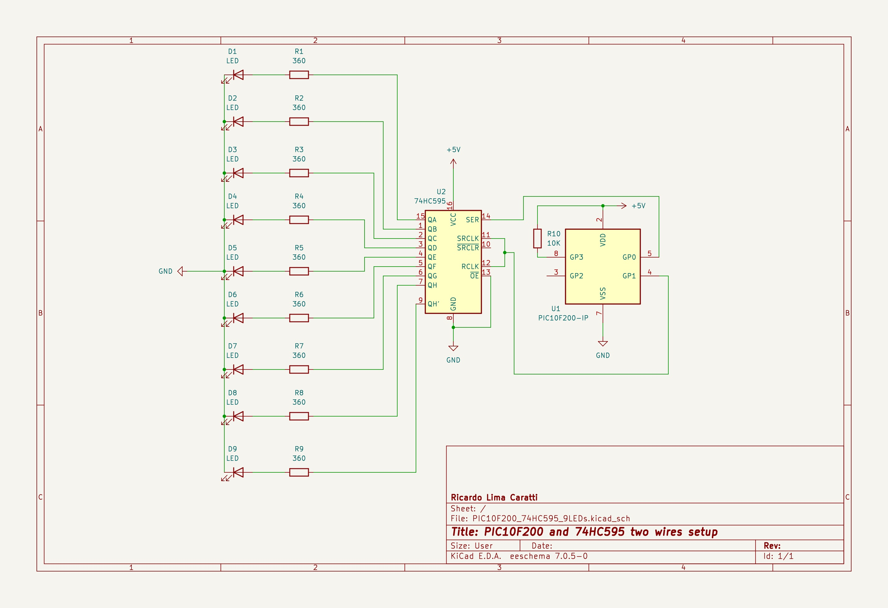

# PIC and HC74595 device

The 74HC595 is a widely-used integrated circuit in digital electronics, known as a Serial-in, Parallel-out Shift Register. This device is essential for expanding the output capabilities of microcontrollers while minimizing the number of required I/O pins. Here's a detailed description of the 74HC595:

1. **Functionality**:
   - The 74HC595 receives data serially and outputs it in parallel. This means it can take input from a microcontroller through a single pin and then control multiple outputs.

2. **Pin Configuration**:
   - The device typically has 16 pins, including 8 output pins, 3 pins for data input and shifting control (Serial Data Input, Shift Register Clock, and Storage Register Clock), a latch pin, an output enable pin, a master reset pin, and power supply pins (Vcc and GND).

3. **Data Transfer Process**:
   - Data is sent to the 74HC595 serially through the Serial Data Input pin. Each bit of data is then shifted into the shift register on the rising edge of the Shift Register Clock.
   - Once all data bits are shifted in, they can be latched to the storage register, making them available at the output pins. The latching occurs on the rising edge of the Storage Register Clock (also known as the Latch Clock).

4. **Cascading Capability**:
   - Multiple 74HC595 chips can be cascaded or daisy-chained together. This means that the Serial Data Output of one chip can be connected to the Serial Data Input of the next, allowing for the control of an even larger number of outputs with the same number of microcontroller pins.

5. **Applications**:
   - The 74HC595 is commonly used in applications requiring control over multiple outputs, such as driving LEDs, seven-segment displays, and other digital indicators. It's also useful in situations where microcontroller pins are limited, as it significantly expands the output capabilities.

6. **Voltage and Current Specifications**:
   - The device operates at standard logic levels and can be powered by a typical 5V power supply, making it compatible with most microcontrollers.

The 74HC595 is appreciated for its ease of use, efficiency in saving microcontroller pins, and its ability to handle multiple outputs simultaneously. Its versatility makes it a staple component in many electronic projects and commercial products.

## PIC10F200 and 74HC595 cotrolling 8 LEDs

### PIC10F200 and 74HC595 schematic

## UNDER CONSTRUCTRION... 

