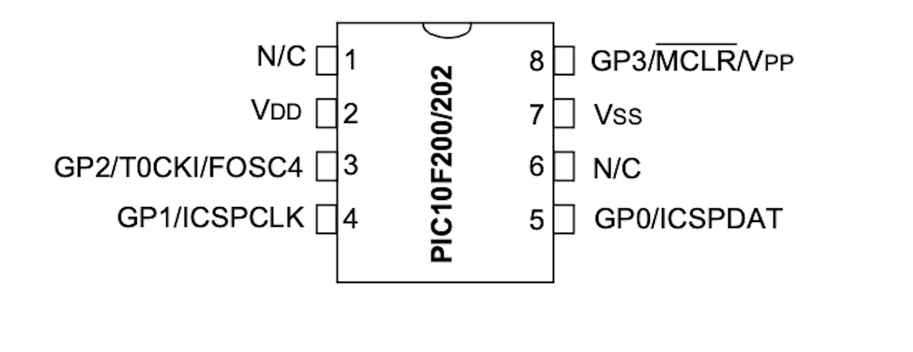
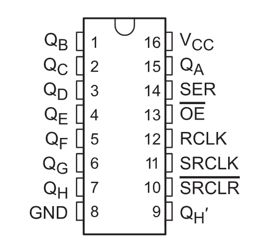

# PIC and HC74595 device


The 74HC595 is a widely-used integrated circuit in digital electronics, known as a Serial-in, Parallel-out Shift Register. This device is essential for expanding the output capabilities of microcontrollers while minimizing the number of required I/O pins. Here's a detailed description of the 74HC595:

1. **Functionality**:
   - The 74HC595 receives data serially and outputs it in parallel. This means it can take input from a microcontroller through a single pin and then control multiple outputs.

2. **Pin Configuration**:
   - The device typically has 16 pins, including 8 output pins, 3 pins for data input and shifting control (Serial Data Input, Shift Register Clock, and Storage Register Clock), a latch pin, an output enable pin, a master reset pin, and power supply pins (Vcc and GND).

3. **Data Transfer Process**:
   - Data is sent to the 74HC595 serially through the Serial Data Input pin. Each bit of data is then shifted into the shift register on the rising edge of the Shift Register Clock.
   - Once all data bits are shifted in, they can be latched to the storage register, making them available at the output pins. The latching occurs on the rising edge of the Storage Register Clock (also known as the Latch Clock).

4. **Cascading Capability**:
   - Multiple 74HC595 chips can be cascaded or daisy-chained together. This means that the Serial Data Output of one chip can be connected to the Serial Data Input of the next, allowing for the control of an even larger number of outputs with the same number of microcontroller pins.

5. **Applications**:
   - The 74HC595 is commonly used in applications requiring control over multiple outputs, such as driving LEDs, seven-segment displays, and other digital indicators. It's also useful in situations where microcontroller pins are limited, as it significantly expands the output capabilities.

6. **Voltage and Current Specifications**:
   - The device operates at standard logic levels and can be powered by a typical 5V power supply, making it compatible with most microcontrollers.

The 74HC595 is appreciated for its ease of use, efficiency in saving microcontroller pins, and its ability to handle multiple outputs simultaneously. Its versatility makes it a staple component in many electronic projects and commercial products.


## PIC10F200 and 74HC595 cotrolling 8 LEDs


### PIC10F200 and 74HC595 schematic


### PIC10F200 PINOUT




### 74HC595 PINOUT




## PIC10F200 and 74HC595 C Example

In this example, the LEDs are controlled according to the following sequence: first, all of them are lit for a duration of 5 seconds, then they are all turned off for another 5 seconds. Finally, in an infinite cycle, each LED is lit one at a time, shifting from left to right.


```cpp

/*
 * PIC10F200 and 74HC595 with 8 LEDs
 * File:   main.c
 * Author: Ricardo Lima Caratti
 *
 * Created on January 30
 */


#include <xc.h>

// CONFIG
#pragma config WDTE = OFF       // Watchdog Timer (WDT disabled)
#pragma config CP = OFF         // Code Protect (Code protection off)
#pragma config MCLRE = ON      // Master Clear Enable (GP3/MCLR pin fuction is digital I/O, MCLR internally tied to VDD)

#define _XTAL_FREQ  4000000


void inline doClock() { 
    GP1 = 1; 
    __delay_us(100);
    GP1 = 0;
    __delay_us(100);
}

void inline doEnable() {
    GP2 = 1;
    __delay_us(100); 
    GP2 = 0;
}

void inline sendData(unsigned char data) {
    for (unsigned char i = 0; i < 8; i++) { 
        GP0 = ( data >> i & 0B00000001);
        doClock();
    }
    doEnable();
}

void main(void) {
    TRIS = 0B00000000;          // All GPIO (GP0:GP3) pins as output
    GPIO = 0;
    
    sendData(0B11111111);
    __delay_ms(5000);
    sendData(0);
    __delay_ms(5000);   
    
    unsigned char data = 1;
    while(1) {
        __delay_ms(1000);
        sendData(data);
        data = (unsigned char) (data <<  1);
        if (data == 0) {
            sendData(0);
            data = 1;
        }
    }
    
}


```


## PIC10F200 and 74HC595 ASM Example

This example controls 8 LEDs using the 74HC595 device in such a way that, with each cycle of approximately 1 second, the LEDs alternate between being lit and turned off.


```asm

; Controlling 8 LEDs with PIC10F200 and the Shift Register 74HC595
; This example controls 8 LEDs using the 74HC595 device in such a way that, 
; with each cycle of approximately 1 second, the LEDs alternate between being 
; lit and turned off.    
; My PIC Journey
; Author: Ricardo Lima Caratti
; Jan/2024
;
; IMPORTANT: To assemble this code correctly, please follow the steps below:
; 1. Go to "Project Properties" in MPLAB X.
; 2. Select "Global Options" for the pic-as assembler/compiler.
; 3. In the "Additional Options" box, enter the following parameters:
; -Wl,-pAsmCode=0h
;
; Please check the AsmCode reference in the "PSECT" directive below.
;
; You will find good tips about the PIC10F200 here:
; https://www.circuitbread.com/tutorials/christmas-lights-special-microcontroller-basics-pic10f200

 
    
#include <xc.inc>

; CONFIG
  CONFIG  WDTE = OFF           ; Watchdog Timer (WDT disabled)
  CONFIG  CP = OFF             ; Code Protect (Code protection off)
  CONFIG  MCLRE = ON	       ; Master Clear Enable (GP3/MCLR pin function  is MCLR)

  
; Declare your variables here

dummy1	    equ 0x10
dummy2	    equ 0x11 
startValue  equ 0x12		; Initial value to be sent	
valueToSend equ 0x13		; Current value to be sent
counter	    equ 0x14		
	
 
PSECT AsmCode, class=CODE, delta=2

MAIN:   
    ; 74HC595 and PIC10F200 GPIO SETUP 
    ; GP0 -> Data		-> 74HC595 PIN 14 (SER); 
    ; GP1 -> Clock		-> 74HC595 PINs 11 and 12 (SRCLR and RCLK);   
    ; GP2 -> Output Enable/OE	-> 74HC595 PIN 13
    movlw   0B00000000	    ; All GPIO Pins as output		
    tris    GPIO
    movlw   0B10101010	    ; An alternating sequence of lit LEDs 
    movwf   startValue	    ; The initial value to be sent to the 74HC595
MainLoop:		    ; Endless loop
    movlw   7
    movwf   counter
    movf    startValue, w
    movwf   valueToSend	    ;  
    ; Start sending  
PrepereToSend:  
    btfss   valueToSend, 0  ; Check if less significant bit is 1
    goto    Send0	    ; if 0 turn GP0 low	
    goto    Send1	    ; if 1 turn GP0 high
Send0:
    bcf	    GPIO, 0	    ; turn the current 74HC595 pin off 
    goto    NextBit
Send1:     
    bsf	    GPIO, 0	    ; turn the current 74HC595 pin on
NextBit:    
    ; Clock 
    call doClock
    ; Shift all bits of the valueToSend to the right and prepend a 0 to the most significant bit
    
    bcf	    STATUS, 0	    ; Clear cary flag before rotating 
    rrf	    valueToSend, f
    
    decfsz counter, f	    ; Decrement the counter and check if it becomes zero.
    goto PrepereToSend	    ; if not, keep prepering to send
    
    ; The data has been queued and can now be sent to the 74HC595 port
    call doClock
    call doEnableOutput
      
MainLoopEnd:
    ; Delays about 1 second ( You can not use more than two stack levels )
    movlw   255
    movwf   dummy2
Delay1s:
    call    Delay2ms
    call    Delay2ms
    decfsz  dummy2, f
    goto    Delay1s
    
    comf    startValue, f   ; Inverts the startValue bits. Alternating its value with each iteration 
    
    goto    MainLoop

; 74HC595 Clock processing
; ATTENTION: Due to the two-level stack limit of the PIC10F200, avoid calling this  
;            subroutine from within another subroutine to prevent stack overflow issues.    
doClock:
    ; Clock 
    bsf	    GPIO, 1	    ; Turn GP1 HIGH
    call    Delay100us	    ;
    bcf	    GPIO, 1	    ; Turn GP1 LOW
    call    Delay100us
    retlw   0

; Tells to the 74HC595 that the data is ready
; ATTENTION: Due to the two-level stack limit of the PIC10F200, avoid calling this  
;            subroutine from within another subroutine to prevent stack overflow issues.     
doEnableOutput: 
    ; Enable Output 
    bsf	    GPIO, 2	    ; Turn GP2 HIGH
    call    Delay100us
    bcf	    GPIO, 2	    ; Turn GP2 LOW
    retlw   0
    
; ******************
; Delay function

; At 4 MHz, one instruction takes 1us
; So, this soubroutine should take about 10 x 10 us 

; It takes 100 us    
Delay100us:
    movlw   10
    movwf   dummy1    
LoopDelay100us:   
    goto $+1		    ; 2 cycles
    goto $+1		    ; 2 cycles
    goto $+1		    ; 2 cycles
    nop
    decfsz  dummy1, f	    ; 1 cycles (2 if dummy = 0)
    goto    LoopDelay100us  ; 2 cycles
    retlw   0
    
; It takes about 2ms
Delay2ms: 
    movlw  200
    movwf  dummy1
LoopDelay2ms: 
    goto $+1		    ; 2 cycles
    goto $+1		    ; 2 cycles
    goto $+1		    ; 2 cycles
    nop			    ; 1 cycle
    decfsz  dummy1, f	    ; 1 cycles (2 if dummy = 0)
    goto LoopDelay2ms	    ; 2 cycles
    retlw   0
    
END MAIN


```


## References

* [74HC595 Serial Shift Register Interfacing with Pic Microcontroller](https://microcontrollerslab.com/74hc595-shift-register-interfacing-pic-microcontroller/)
* [Smallest and cheapest microcontroller - tutorial](https://youtu.be/300HMv6gOs8?si=MKiTwYgLA295LC7H)
* [How 74HC595 Shift Register Works ? | 3D animated](https://youtu.be/Rftc7yEGfKU?si=b_ajpwzWRA0hUGYd)
* [16-Bit Bargraph Control Using Two 74HC595 Shift Registers](https://youtu.be/voV1z9RaINI?si=Hz-5AWeL9Oy1fCpq)


