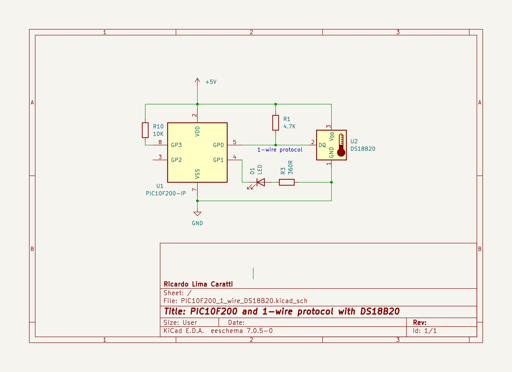
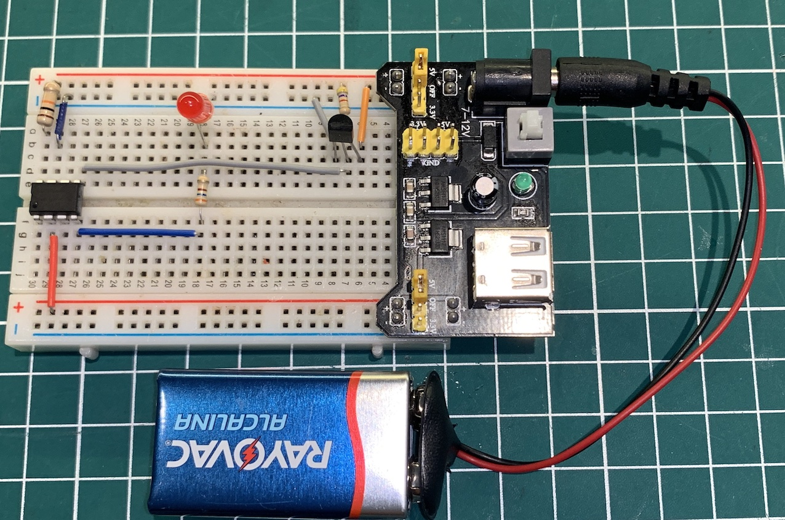

# PIC10F200 and 1-wire communication protocol with DS18B20


## Content

1. [PIC10F200 Limitations for 1-Wire Protocol and DS18B20 Application](#pic10f200-limitations-for-1-wire-protocol-and-ds18b20-application)
2. [PIC10F200 and DS18B20 schematic](#pic10f200-and-ds18b20-schematic)
    * [KiCad Schematic](./KiCad/)
3. [PIC10F200 PINOUT](#pic10f200-pinout)
4. [DS18B20 PINOUT](#ds18b20-pinout)
5. [PIC10F200 and DS18B20 prototype](#pic10f200-and-ds18b20-prototype)
6. [PIC10F200 and DS18B20 source code (Assembly)](#pic10f200-and-ds18b20-source-code-assembly)
7. [MPLAB X IDE project](./MPLAB_PROJECT/)
8. [References](#references)


## PIC10F200 Limitations for 1-Wire Protocol and DS18B20 Application

While the PIC10F200 is a popular microcontroller for learning and simple projects, it has certain limitations that might make it challenging to develop an application involving the 1-Wire protocol and DS18B20 temperature sensor.  Potential challenges:

**Memory:**

* **Limited Flash memory:** The DS18B20 communication protocol and temperature conversion algorithms require some code space. Depending on your application's complexity, you might struggle to fit everything within the PIC10F200's limited memory.

**I/O Pins:**

* **Limited number of I/O pins (4):** The 1-Wire protocol requires only one pin for communication, but additional pins might be needed for other functionalities in your application. With only 4 available pins, you might face limitations in peripheral integration.

**Clock Speed:**

* **Low clock speed (4MHz):** The 1-Wire protocol requires precise timing for data transmission and reception. While the PIC10F200 can handle it, higher clock speeds offer more flexibility and potentially faster communication.


**Conclusion:**

Developing an application with the 1-Wire protocol and DS18B20 sensor using the PIC10F200 might be possible, but the limitations mentioned above can create challenges. If your project requires more complex functionalities, higher performance, or easier development, considering a microcontroller with more resources is recommended.


## PIC10F200 and DS18B20 schematic




## PIC10F200 PINOUT


## DS18B20 PINOUT


## PIC10F200 and DS18B20 prototype




## PIC10F200 and DS18B20 source code (Assembly)

**IMPORTANT:** 

To assemble this code correctly, please follow the steps below:

1. Go to "Project Properties" in MPLAB X.
2. Select "Global Options" for the pic-as assembler/compiler.
3. In the "Additional Options" box, enter the following parameters: **-Wl,-pAsmCode=0h**

```asm

; UNDER CONSTRUCTION... One Wire implementation 
; My PIC Journey
; Author: Ricardo Lima Caratti
; Jan/2024
;
; IMPORTANT: To assemble this code correctly, please follow the steps below:
; 1. Go to "Project Properties" in MPLAB X.
; 2. Select "Global Options" for the pic-as assembler/compiler.
; 3. In the "Additional Options" box, enter the following parameters:
; -Wl,-pAsmCode=0h
;
; Please check the AsmCode reference in the "PSECT" directive below.
;    
; *** About this implementation *** 
; 1. The PIC10F200 is a verry basic microcontroler and it does not support the Open-Drain Output feature. 
;    Therefore, this application may not function correctly in certain scenarios (circuit parts, board setup etc).
;    Given this, carefully review your implementation before deploying it in 
;    critical applications. Consider using another microcontroller for more critical 
;    applications. 
; 2. This application is designed to work with temperatures above 0 degrees Celsius. 
;    For temperatures below 0, you will need to modify the code. See the DS18B20 Data 
;    Sheet for information on how to work with temperatures below 0.    
;    
; You will find good tips about the PIC10F200 here:
; https://www.circuitbread.com/tutorials/christmas-lights-special-microcontroller-basics-pic10f200

     
#include <xc.inc>

; CONFIG
  CONFIG  WDTE = OFF           ; Watchdog Timer (WDT disabled)
  CONFIG  CP = OFF             ; Code Protect (Code protection off)
  CONFIG  MCLRE = ON	       ; Master Clear Enable (GP3/MCLR pin function  is MCLR)

  
; ******* MACROS **********
   
; Sets the GP0 as output 
 SET_PIN_OUT MACRO
    clrw
    tris    GPIO
    ENDM
 
; Sets the GP0 as input  
SET_PIN_IN MACRO
    movlw   0x01
    tris    GPIO
ENDM
 

; Declare your variables here

value	    equ 0x11 
counter1    equ 0x12
counter2    equ	0x13  
counterM    equ	0x14    
aux	    equ 0x15
tempL	    equ 0x16	; LSB information of the temperature
tempH	    equ 0x17	; MSB information of the temperature    
frac	    equ 0x18	; fraction of the temperature		    
	    
	    
PSECT AsmCode, class=CODE, delta=2

MAIN:
    
    ; Wake-up on Pin Change bit  disabled
    ; Weak Pull-ups bit (GP0, GP1, GP3) diabled
    movlw   0B11000000 
    OPTION
    
    clrf    GPIO
    clrw    
    tris    GPIO	    ; Sets all GPIO as output

    bsf	    GPIO,1
    call    DELAY_600ms
    bcf	    GPIO,1
MainLoop:  
    ; SendS skip ROM command
    call    OW_START
    movlw   0xCC	    
    movwf   value	    
    call    OW_WRITE_BYTE
    ; Sends start conversion command
    ; The default resolution at power-up is 12-bit. 
    movlw   0x44	    
    movwf   value
    call    OW_WRITE_BYTE
    
    clrf    value
WaitForConvertion: 
    call    OW_READ_BYTE
    clrw    
    subwf   value, w
    btfsc   STATUS, 2		; Skip if value - wreg = 0
    goto    WaitForConvertion	; else goto WaitForConvertion
    goto    $+1
    goto    $+1
    goto    $+1
    
    call    OW_START
    movlw   0xCC	    ; Sends skip ROM command
    movwf   value	    
    call    OW_WRITE_BYTE
    movlw   0xBE	    ; Sends read command
    movwf   value
    call    OW_WRITE_BYTE  
    
    ; Suggestion:  
    ; The first 4 bits (LSB) represent the fractional part of the temperature. The fraction 
    ; is obtained by dividing this number by 16. Therefore, if the values are, 
    ; for example, 2, 4, 8, or 12, the fractional part of the temperature will be 
    ; respectively 0.125, 0.25, 0.5, and 0.75.
    ; That being said, instead of obtaining the maximum precision (resolution) of the DS18B20,
    ; this program will have a resolution of 0.5 degrees Celsius
    ; if the fractional part is greater than 8, 1 sould be added to the temperature 
    
    call    OW_READ_BYTE    ; LSB value of the temperature
    movf    value, w
    movwf   tempL
 
    call    OW_READ_BYTE    ; MSB value of the temperature
    movf    value, w
    movwf   tempH
    
    call    OW_START	    ; STOP reading 
  
    movf    tempL,w
    andlw   0B00001111	    ; Gets the firs 4 bits to know the fraction of the temperature
    movwf   frac
    ; Shift 4 bits to right the MSB of the tempL   
    rrf	    tempL
    rrf	    tempL
    rrf	    tempL
    rrf	    tempL
    
    movf    tempL, w
    andlw   0B00001111	    ; clear the last 4 bits (4 MSB)
    movwf   tempL
    

   
    ; Shift to right the MSB of the tempH   
    rlf	    tempH
    rlf	    tempH
    rlf	    tempH
    rlf	    tempH    
    
    movf    tempH, w
    andlw   0B11110000
    iorwf   tempL,w	    ; tempL now has the temperature.
    movwf   tempL
    
    
    ; Process the temperature value (turn on or off the LEDs 
    
    movlw   90		    ; Turn the LED on if the temperatura is equal or above this value
    subwf   tempL
    btfss   STATUS, 0
    goto    TurnLedOff
    goto    TurnLedOn
TurnLedOff:
    bcf	    GPIO,1
    goto    MainLoopEnd
TurnLedOn:
    bsf	    GPIO, 1
    goto    MainLoopEnd  
MainLoopEnd: 
    movlw   100
    call    DELAY_Nx10us
    goto    MainLoop    

; ************************ Subroutines ************************************     
    
; *******************************************
; START COMMUNICATION      
; Initiates the 1-wire device communication  
; GP0 is the pin connected to the device    
OW_START: 

    clrf    value
    SET_PIN_OUT		
    bcf	    GPIO,0		; make the GP0 LOW for 480 us
    movlw   48
    call DELAY_Nx10us 
    bsf	    GPIO,0
    
    movlw   7			; 70us
    call DELAY_Nx10us 
    
    SET_PIN_IN
    
    movlw   1			; 10us
    call DELAY_Nx10us
    
    movlw   125			; Waiting for device response by checking 125 times if GP0 is low
    movwf   counter1
OW_START_DEVICE_RESPONSE:
    btfsc   GPIO, 0		; if not 0,  no device is present so far
    goto    OW_START_NO_DEVICE
    goto    OW_START_DEVICE_FOUND
OW_START_NO_DEVICE:
    decfsz  counter1, f
    goto    OW_START_DEVICE_RESPONSE ; check once again 
    ; goto    SYSTEM_ERROR		; Device not found - Exit/Halt
    retlw   0			
OW_START_DEVICE_FOUND:  
    movlw   60
    call    DELAY_Nx10us
    retlw   1			; Device found

    
; ******************************
; Writes a byte    
; Sends a byte to the device
; Parameter: value (byte value to be send)
OW_WRITE_BYTE: 
    movlw   8
    movwf   counter1
OW_WRITE_BIT: 	
    btfss   value, 0		; Check if LSB of value is HIGH or LOW (Assigns valuer LSB to GP0)  
    goto    OW_WRITE_BIT_0
    goto    OW_WRITE_BIT_1
OW_WRITE_BIT_0:
    bcf	    GPIO,0
    SET_PIN_OUT			; GP0 output setup
    goto    $+1			; Wait for a bit time
    nop
    bcf	    GPIO,0
    movlw   8			; 80us
    call    DELAY_Nx10us 
    SET_PIN_IN
    goto $+1
    nop
    goto    OW_WRITE_BIT_END
OW_WRITE_BIT_1: 
    bcf	    GPIO, 0		; turn bus low for
    SET_PIN_OUT			; GP0 output setup
    goto    $+1
    nop
    bsf	    GPIO, 0
    movlw   8			; 80us
    call    DELAY_Nx10us 	
    SET_PIN_IN
    goto $+1
    nop    
OW_WRITE_BIT_END:
    bcf	    STATUS, 0
    rrf	    value		; Right shift - writes the next bit
    decfsz  counter1, f
    goto    OW_WRITE_BIT
        
    retlw   0
    
   

; ******************************
; Reads a byte    
; Receives a byte from the device        
    
OW_READ_BYTE:
    
    clrf    value
    movlw   8
    movwf   counter1

OW_READ_BIT:  
    bcf	    GPIO,0
    SET_PIN_OUT
    goto    $+1	    ; Wait for 2us or a bit more
    nop
    SET_PIN_IN
    goto $+1
    goto $+1
    goto $+1
    nop

    ; Assigns 1 or 0 depending on the value of the first bit of the GPIO (GP0).
    btfss   GPIO, 0		 
    goto    OW_READ_BIT_0
    goto    OW_READ_BIT_1
OW_READ_BIT_0:
    bcf	    STATUS, 0
    rrf	    value
    goto    OW_READ_BIT_NEXT
OW_READ_BIT_1:
    bsf	    STATUS, 0
    rrf	    value
OW_READ_BIT_NEXT:  
    movlw   9		    ; 
    call    DELAY_Nx10us    ; 
    decfsz  counter1, f
    goto    OW_READ_BIT
    nop  
    retlw   0    


; Delay function    
; Takes (WREG * 10)us    
; Examples: if WREG=1 => 10us; WREG=7 => 70us; WREG=48 => 480us; and so on     
DELAY_Nx10us:
    movwf  counterM
    goto $ + 1		; 2 cycles +
    goto $ + 1		; 2 cycles +
    goto $ + 1		; 2 cycles +
    goto $ + 1		; 2 cycles = 8 cycles +
    decfsz counterM, f	; 1 cycle + 
    goto $ - 5		; 2 cycle = 11 cycles **** Fix it later
    retlw   0
    
    
    
; ***********************    
; It takes about 600ms 
DELAY_600ms:
  
    movlw   255
    movwf   counter1
DELAY_LOOP_01:
    movlw   255
    movwf   counter2
DELAY_LOOP_02: 
    goto $+1
    goto $+1
    goto $+1
    goto $+1
    decfsz  counter2, f
    goto    DELAY_LOOP_02
    decfsz  counter1, f
    goto    DELAY_LOOP_01
    
    retlw   0

; Endless loop due to system error (1-wire device not detected) 
SYSTEM_ERROR:
    bsf	    GPIO,1
    call    DELAY_600ms
    call    DELAY_600ms
    call    DELAY_600ms
    call    DELAY_600ms
   
    bcf	    GPIO,1
    call    DELAY_600ms

    goto    SYSTEM_ERROR

BLINK_LED:
    movlw   5
    movwf   counterM
BLINK_LED_LOOP:    
    bsf	    GPIO,1
    call    DELAY_600ms
    bcf	    GPIO,1
    call    DELAY_600ms
    decfsz  counterM, f
    goto    BLINK_LED_LOOP  
    retlw   0
    
END MAIN    

```


## REFERENCES

* [1-Wire ® Communication with PIC ® Microcontroller](https://ww1.microchip.com/downloads/en/appnotes/01199a.pdf)
* [The 1-Wire Communication Protocol](http://pic16f628a.blogspot.com/2009/09/1-wire-communication-protocol.html)
* [1-Wire Communication with a Microchip PICmicro Microcontroller](https://pdfserv.maximintegrated.com/en/an/AN2420.pdf)
* [1-wire slave emulator for PIC16 microcontroller – owslave](http://www.fabiszewski.net/1-wire-slave/)
* [Interface PIC MCU with DS18B20 sensor and SSD1306 | mikroC Projects](https://simple-circuit.com/pic-mcu-ds18b20-ssd1306-mikroc/)
* [PIC 1-Wire - Github](https://github.com/robvanbentem/pic-1wire/tree/master) 
* [Interfacing DS18B20 sensor with PIC microcontroller | MPLAB Projects](https://simple-circuit.com/mplab-xc8-ds18b20-pic-microcontroller/)
* [What is the 1-Wire protocol?](https://www.engineersgarage.com/what-is-the-1-wire-protocol/)
