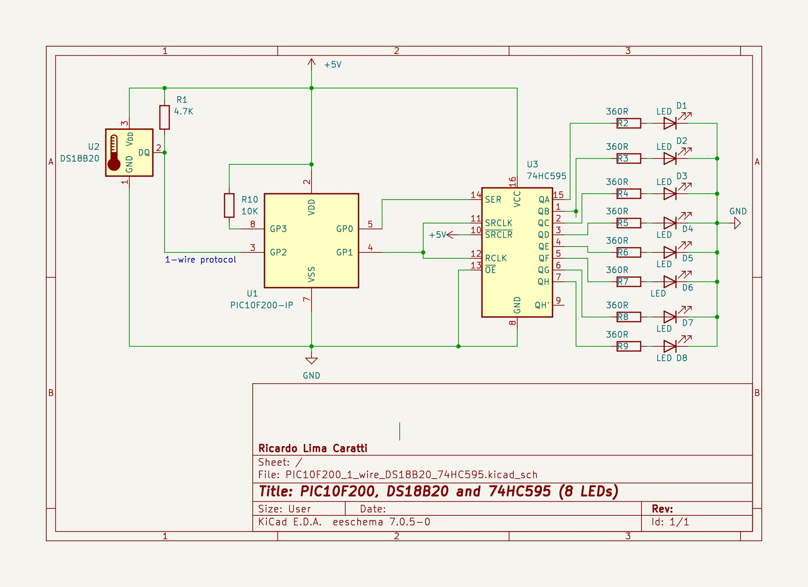
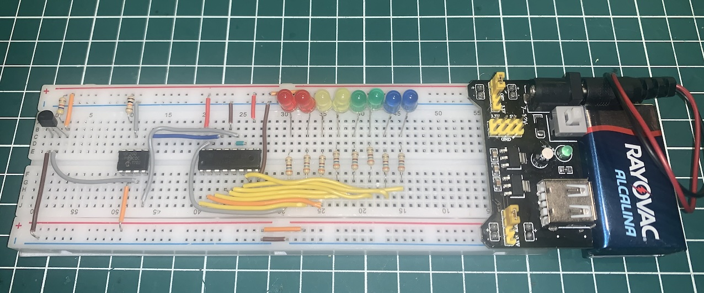

# PIC10F200 and 1-wire communication protocol with DS18B20


## Content

1. [PIC10F200 Limitations for 1-Wire Protocol and DS18B20 Application](#pic10f200-limitations-for-1-wire-protocol-and-ds18b20-application)
2. [PIC10F200 and DS18B20 schematic](#pic10f200-and-ds18b20-schematic)
    * [KiCad Schematic](./KiCad/)
3. [PIC10F200 PINOUT](#pic10f200-pinout)
4. [DS18B20 PINOUT](#ds18b20-pinout)
5. [PIC10F200 and DS18B20 prototype](#pic10f200-and-ds18b20-prototype)
6. [PIC10F200 and DS18B20 source code (Assembly)](#pic10f200-and-ds18b20-source-code-assembly)
7. [Comfort sensor with PIC10F200, DS18B20, 74HC595 and 8 LEDs](#comfort-sensor-with-pic10f200-ds18b20-74hc595-and-8-leds)
8. [Comfort Sensor Schematic](#comfort-sensor-schematic)
    * [KiCad Schematic](./KiCad/)
9. [Comfort Sensor Prototype](#comfort-sensor-prototype)
10. [Comfort Sensor Assembly](#confort-sensor-assembly-code)
11. [MPLAB X IDE project](./MPLAB_PROJECT/)
12. [Video showing this application ](#video-showing-this-application)
13. [References](#references)


## PIC10F200 Limitations for 1-Wire Protocol and DS18B20 Application

While the PIC10F200 is a popular microcontroller for learning and simple projects, it has certain limitations that might make it challenging to develop an application involving the 1-Wire protocol and DS18B20 temperature sensor.  Potential challenges:

**Memory:**

* **Limited Flash memory:** The DS18B20 communication protocol and temperature conversion algorithms require some code space. Depending on your application's complexity, you might struggle to fit everything within the PIC10F200's limited memory.

**I/O Pins:**

* **Limited number of I/O pins (4):** The 1-Wire protocol requires only one pin for communication, but additional pins might be needed for other functionalities in your application. With only 4 available pins, you might face limitations in peripheral integration.

**Clock Speed:**

* **Low clock speed (4MHz):** The 1-Wire protocol requires precise timing for data transmission and reception. While the PIC10F200 can handle it, higher clock speeds offer more flexibility and potentially faster communication.


**Conclusion:**

Developing an application with the 1-Wire protocol and DS18B20 sensor using the PIC10F200 might be possible, but the limitations mentioned above can create challenges. If your project requires more complex functionalities, higher performance, or easier development, considering a microcontroller with more resources is recommended.


## PIC10F200 and DS18B20 schematic


## PIC10F200 PINOUT


## DS18B20 PINOUT


## PIC10F200 and DS18B20 prototype


## PIC10F200 and DS18B20 source code (Assembly)

**IMPORTANT:** 

To assemble this code correctly, please follow the steps below:

1. Go to "Project Properties" in MPLAB X.
2. Select "Global Options" for the pic-as assembler/compiler.
3. In the "Additional Options" box, enter the following parameters: **-Wl,-pAsmCode=0h**

*** About this implementation *** 

1. The PIC10F200 is a verry basic microcontroler and it does not support the Open-Drain Output feature. Therefore, this application may not function with the desired precision in certain scenarios (circuit parts, board setup etc).
2. Given this, carefully review your implementation before deploying it in critical applications. Consider using another microcontroller for more critical  applications. 
3. This application is designed to work with temperatures above 0 degrees Celsius. For temperatures below 0, you will need to modify the code. See the DS18B20 Data Sheet for information on how to work with temperatures below 0.
4. This implementation round the temparature off if the fractional part is greater than or equal to 8 (0.5).
5. This implementation uses only one LED to indicate whether the temperature is above or below a given value.	


**IMPORTANT:** 

To assemble this code correctly, please follow the steps below:

1. Go to "Project Properties" in MPLAB X.
2. Select "Global Options" for the pic-as assembler/compiler.
3. In the "Additional Options" box, enter the following parameters: **-Wl,-pAsmCode=0h**


```asm

; UNDER CONSTRUCTION... One Wire implementation 
; My PIC Journey
; Author: Ricardo Lima Caratti
; Jan/2024
;
; IMPORTANT: To assemble this code correctly, please follow the steps below:
; 1. Go to "Project Properties" in MPLAB X.
; 2. Select "Global Options" for the pic-as assembler/compiler.
; 3. In the "Additional Options" box, enter the following parameters:
; -Wl,-pAsmCode=0h
;
; Please check the AsmCode reference in the "PSECT" directive below.
;          
; You will find good tips about the PIC10F200 here:
; https://www.circuitbread.com/tutorials/christmas-lights-special-microcontroller-basics-pic10f200

     
#include <xc.inc>

; CONFIG
  CONFIG  WDTE = OFF           ; Watchdog Timer (WDT disabled)
  CONFIG  CP = OFF             ; Code Protect (Code protection off)
  CONFIG  MCLRE = ON	       ; Master Clear Enable (GP3/MCLR pin function  is MCLR)

  
; ******* MACROS **********
   
; Sets the GP0 as output 
 SET_PIN_OUT MACRO
    clrw
    tris    GPIO
    ENDM
 
; Sets the GP0 as input  
SET_PIN_IN MACRO
    movlw   0x01
    tris    GPIO
ENDM
 

; Declare your variables here

value	    equ 0x11 
counter1    equ 0x12
counter2    equ	0x13  
counterM    equ	0x14    
aux	    equ 0x15
tempL	    equ 0x16	; LSB information of the temperature
tempH	    equ 0x17	; MSB information of the temperature    
frac	    equ 0x18	; fraction of the temperature		    
	    
	    
PSECT AsmCode, class=CODE, delta=2

MAIN:
    
    ; Wake-up on Pin Change bit  disabled
    ; Weak Pull-ups bit (GP0, GP1, GP3) diabled
    movlw   0B11000000 
    OPTION
    
    clrf    GPIO
    clrw    
    tris    GPIO	    ; Sets all GPIO as output

    bsf	    GPIO,1
    call    DELAY_600ms
    bcf	    GPIO,1
MainLoop:  
    ; SendS skip ROM command
    call    OW_START
    movlw   0xCC	    
    movwf   value	    
    call    OW_WRITE_BYTE
    ; Sends start conversion command
    ; The default resolution at power-up is 12-bit. 
    movlw   0x44	    
    movwf   value
    call    OW_WRITE_BYTE
    
    clrf    value
WaitForConvertion: 
    call    OW_READ_BYTE
    clrw    
    subwf   value, w
    btfsc   STATUS, 2		; Skip if value - wreg = 0
    goto    WaitForConvertion	; else goto WaitForConvertion
    goto    $+1
    goto    $+1
    goto    $+1
    
    call    OW_START
    movlw   0xCC	    ; Sends skip ROM command
    movwf   value	    
    call    OW_WRITE_BYTE
    movlw   0xBE	    ; Sends read command
    movwf   value
    call    OW_WRITE_BYTE  
    
    ; Suggestion:  
    ; The first 4 bits (LSB) represent the fractional part of the temperature. The fraction 
    ; is obtained by dividing this number by 16. Therefore, if the values are, 
    ; for example, 2, 4, 8, or 12, the fractional part of the temperature will be 
    ; respectively 0.125, 0.25, 0.5, and 0.75.
    ; That being said, instead of obtaining the maximum precision (resolution) of the DS18B20,
    ; this program will have a resolution of 0.5 degrees Celsius
    ; if the fractional part is greater than 8, 1 sould be added to the temperature 
    
    call    OW_READ_BYTE    ; LSB value of the temperature
    movf    value, w
    movwf   tempL
 
    call    OW_READ_BYTE    ; MSB value of the temperature
    movf    value, w
    movwf   tempH
    
    call    OW_START	    ; STOP reading 
  
    movf    tempL,w
    andlw   0B00001111	    ; Gets the firs 4 bits to know the fraction of the temperature
    movwf   frac	    ; if frac >= 8 then set it to 1 else set it to 0
    ; Round off if the fractional part is greater than or equal to 8 (0.5).
    movlw   8
    subwf   frac
    btfss   STATUS, 0
    goto    SetFracToZero
    goto    SetFracToOne
SetFracToZero:
    clrf    frac
    goto    CalcTemp
SetFracToOne:
    movlw   1
    movwf   frac
   
CalcTemp: 
    
    ; Shift 4 bits to right the MSB of the tempL   
    rrf	    tempL
    rrf	    tempL
    rrf	    tempL
    rrf	    tempL
    
    movf    tempL, w
    andlw   0B00001111	    ; clear the last 4 bits (4 MSB)
    movwf   tempL
    

   
    ; Shift to right the MSB of the tempH   
    rlf	    tempH
    rlf	    tempH
    rlf	    tempH
    rlf	    tempH    
    
    movf    tempH, w
    andlw   0B11110000
    iorwf   tempL,w	    ; tempL now has the temperature.
    movwf   tempL
    
    ; Round off the fractional part to final tempL value (add 0 or 1)
    movf    frac, w
    addwf   tempL	    ; tempL now has the temperature to be checked
    
    
    ; Process the temperature value (turn on or off the LEDs 
    
    movlw   28		    ; Turn the LED on if the temperatura is equal or above this value
    subwf   tempL
    btfss   STATUS, 0
    goto    TurnLedOff
    goto    TurnLedOn
TurnLedOff:
    bcf	    GPIO,1
    goto    MainLoopEnd
TurnLedOn:
    bsf	    GPIO, 1
    goto    MainLoopEnd  
MainLoopEnd: 
    movlw   100
    call    DELAY_Nx10us
    goto    MainLoop    

; ************************ Subroutines ************************************     
    
; *******************************************
; START COMMUNICATION      
; Initiates the 1-wire device communication  
; GP0 is the pin connected to the device    
OW_START: 

    clrf    value
    SET_PIN_OUT		
    bcf	    GPIO,0		; make the GP0 LOW for 480 us
    movlw   48
    call DELAY_Nx10us 
    bsf	    GPIO,0
    
    movlw   7			; 70us
    call DELAY_Nx10us 
    
    SET_PIN_IN
    
    movlw   1			; 10us
    call DELAY_Nx10us
    
    movlw   125			; Waiting for device response by checking 125 times if GP0 is low
    movwf   counter1
OW_START_DEVICE_RESPONSE:
    btfsc   GPIO, 0		; if not 0,  no device is present so far
    goto    OW_START_NO_DEVICE
    goto    OW_START_DEVICE_FOUND
OW_START_NO_DEVICE:
    decfsz  counter1, f
    goto    OW_START_DEVICE_RESPONSE ; check once again 
    ; goto    SYSTEM_ERROR		; Device not found - Exit/Halt
    retlw   0			
OW_START_DEVICE_FOUND:  
    movlw   60
    call    DELAY_Nx10us
    retlw   1			; Device found

    
; ******************************
; Writes a byte    
; Sends a byte to the device
; Parameter: value (byte value to be send)
OW_WRITE_BYTE: 
    movlw   8
    movwf   counter1
OW_WRITE_BIT: 	
    btfss   value, 0		; Check if LSB of value is HIGH or LOW (Assigns valuer LSB to GP0)  
    goto    OW_WRITE_BIT_0
    goto    OW_WRITE_BIT_1
OW_WRITE_BIT_0:
    bcf	    GPIO,0
    SET_PIN_OUT			; GP0 output setup
    goto    $+1			; Wait for a bit time
    nop
    bcf	    GPIO,0
    movlw   8			; 80us
    call    DELAY_Nx10us 
    SET_PIN_IN
    goto $+1
    nop
    goto    OW_WRITE_BIT_END
OW_WRITE_BIT_1: 
    bcf	    GPIO, 0		; turn bus low for
    SET_PIN_OUT			; GP0 output setup
    goto    $+1
    nop
    bsf	    GPIO, 0
    movlw   8			; 80us
    call    DELAY_Nx10us 	
    SET_PIN_IN
    goto $+1
    nop    
OW_WRITE_BIT_END:
    bcf	    STATUS, 0
    rrf	    value		; Right shift - writes the next bit
    decfsz  counter1, f
    goto    OW_WRITE_BIT
        
    retlw   0
    
   

; ******************************
; Reads a byte    
; Receives a byte from the device        
    
OW_READ_BYTE:
    
    clrf    value
    movlw   8
    movwf   counter1

OW_READ_BIT:  
    bcf	    GPIO,0
    SET_PIN_OUT
    goto    $+1	    ; Wait for 2us or a bit more
    nop
    SET_PIN_IN
    goto $+1
    goto $+1
    goto $+1
    nop

    ; Assigns 1 or 0 depending on the value of the first bit of the GPIO (GP0).
    btfss   GPIO, 0		 
    goto    OW_READ_BIT_0
    goto    OW_READ_BIT_1
OW_READ_BIT_0:
    bcf	    STATUS, 0
    rrf	    value
    goto    OW_READ_BIT_NEXT
OW_READ_BIT_1:
    bsf	    STATUS, 0
    rrf	    value
OW_READ_BIT_NEXT:  
    movlw   9		    ; 
    call    DELAY_Nx10us    ; 
    decfsz  counter1, f
    goto    OW_READ_BIT
    nop  
    retlw   0    


; Delay function    
; Takes (WREG * 10)us    
; Examples: if WREG=1 => 10us; WREG=7 => 70us; WREG=48 => 480us; and so on     
DELAY_Nx10us:
    movwf  counterM
    goto $ + 1		; 2 cycles +
    goto $ + 1		; 2 cycles +
    goto $ + 1		; 2 cycles +
    goto $ + 1		; 2 cycles = 8 cycles +
    decfsz counterM, f	; 1 cycle + 
    goto $ - 5		; 2 cycle = 11 cycles **** Fix it later
    retlw   0
    
    
    
; ***********************    
; It takes about 600ms 
DELAY_600ms:
  
    movlw   255
    movwf   counter1
DELAY_LOOP_01:
    movlw   255
    movwf   counter2
DELAY_LOOP_02: 
    goto $+1
    goto $+1
    goto $+1
    goto $+1
    decfsz  counter2, f
    goto    DELAY_LOOP_02
    decfsz  counter1, f
    goto    DELAY_LOOP_01
    
    retlw   0

; Endless loop due to system error (1-wire device not detected) 
SYSTEM_ERROR:
    bsf	    GPIO,1
    call    DELAY_600ms
    call    DELAY_600ms
    call    DELAY_600ms
    call    DELAY_600ms
   
    bcf	    GPIO,1
    call    DELAY_600ms

    goto    SYSTEM_ERROR

BLINK_LED:
    movlw   5
    movwf   counterM
BLINK_LED_LOOP:    
    bsf	    GPIO,1
    call    DELAY_600ms
    bcf	    GPIO,1
    call    DELAY_600ms
    decfsz  counterM, f
    goto    BLINK_LED_LOOP  
    retlw   0
    
END MAIN    

```


## Comfort sensor with PIC10F200, DS18B20, 74HC595 and 8 LEDs

This project uses a DS18B20 sensor, a PIC10F200 microcontroller, and a 74HC595 shift register to control 8 LEDs that indicate the ambient temperature based on the table below:
   
| Discomfort level | Celsius degree  |
| ---------------- | --------------- |    
|      COLD	       | less than  17   | 
|    MODERATE      | >= 17 and <= 30 |  
|       HOT        | greater than 30 |   

The eight LEDs utilized in this setup are organized into four pairs, each representing different temperature perceptions: Blue for cold, Green for comfortable, Yellow for mildly comfortable, and Red or hot. These LEDs will activate based on the ambient temperature, without taking into account humidity or other factors that may affect thermal sensation. 


## Comfort sensor schematic





## Comfort sensor prototype




## Confort sensor Assembly code

**IMPORTANT:** 

To assemble this code correctly, please follow the steps below:

1. Go to "Project Properties" in MPLAB X.
2. Select "Global Options" for the pic-as assembler/compiler.
3. In the "Additional Options" box, enter the following parameters: **-Wl,-pAsmCode=0h**


```asm

; This project uses a DS18B20 sensor, a PIC10F200 microcontroller, and a 74HC595 
; shift register to control 8 LEDs that indicate the ambient temperature based on
; the table below:
;    
; | Discomfort level | Celsius degree  |
; | ---------------- | --------------- |    
; |      COLD	     | less than  17   | 
; |    MODERATE      | >= 17 and <= 30 |  
; |       HOT        | greater than 30 |    
; 
; The eight LEDs utilized in this setup are organized into four pairs, each 
; representing different temperature perceptions: Blue for cold, Green for 
; comfortable, Yellow for mildly comfortable, and Red for hot. These LEDs will
; activate based on the ambient temperature, without taking into account humidity 
; or other factors that may affect thermal sensation.    
;    
; Author: Ricardo Lima Caratti
; Feb/2024
;
; IMPORTANT: To assemble this code correctly, please follow the steps below:
; 1. Go to "Project Properties" in MPLAB X.
; 2. Select "Global Options" for the pic-as assembler/compiler.
; 3. In the "Additional Options" box, enter the following parameters:
; -Wl,-pAsmCode=0h
;
; Please check the AsmCode reference in the "PSECT" directive below.
;
    
#include <xc.inc>

; CONFIG
  CONFIG  WDTE = OFF           ; Watchdog Timer (WDT disabled)
  CONFIG  CP = OFF             ; Code Protect (Code protection off)
  CONFIG  MCLRE = ON	       ; Master Clear Enable (GP3/MCLR pin function  is MCLR)


; ******* MACROS **********

#define   SR_DATA	0
#define   SR_CLOK	1
#define   DS18B20_DATA	2  
  
; Sets all PIC10F200 pins as output 
 SET_PIN_OUT MACRO
    clrw
    tris    GPIO
 ENDM
 
; Sets the PIC10F200 DS18B20_DATA pin as input  
SET_PIN_IN MACRO
    movlw  (0x01 << DS18B20_DATA)
    tris    GPIO
ENDM  
  

DOCLOCK MACRO
  bsf	    GPIO, SR_CLOK 	    
  goto	    $+1
  goto	    $+1
  bcf	    GPIO, SR_CLOK	    
  goto	    $+1
  goto	    $+1
ENDM  
  
; Declare your variables here

aux	    equ	0x10
oldTemp	    equ	0x11	    
paramValue  equ 0x12		; Initial value to be sent	
srValue	    equ 0x13		; shift register Current value to be sent to 74HC595
counter1    equ 0x14		
counter2    equ 0x15	
counterM    equ 0x16 
tempL	    equ	0x17
tempH	    equ 0x18	
frac	    equ	0x19	    
	    
	    
 
PSECT AsmCode, class=CODE, delta=2

MAIN:   
    
    ; Wake-up on Pin Change bit  disabled
    ; Weak Pull-ups bit (GP0, GP1, GP3) diabled
    movlw   0B11000000 
    OPTION    
    ; 74HC595 and PIC10F200 GPIO SETUP 
    ; GP0 -> Data   (SR_DATA)	    -> 74HC595 PIN 14 (SER); 
    ; GP1 -> Clock  (SR_CLOCK)	    -> 74HC595 PINs 11 and 12 (SRCLR and RCLK);
    ; DS18B20 and PIC10F200 GPIO setup
    ; GP2 -> DS18B20_DATA
    movlw   0B00000000	    ; All GPIO Pins as output		
    tris    GPIO  
    clrf    oldTemp
MainLoop:		    ; Endless loop
    ; SendS skip ROM command
    call    OW_START
    movlw   0xCC	    
    movwf   paramValue	    
    call    OW_WRITE_BYTE
    ; Sends start conversion command
    ; The default resolution at power-up is 12-bit. 
    movlw   0x44	    
    movwf   paramValue
    call    OW_WRITE_BYTE
    clrf    paramValue
WaitForConvertion: 
    call    OW_READ_BYTE
    clrw    
    subwf   paramValue, w
    btfsc   STATUS, 2		; Skip if value - wreg = 0
    goto    WaitForConvertion	; else goto WaitForConvertion
    goto    $+1
    goto    $+1
    goto    $+1    
    ; Start reading the temperature from the DS18B20
    call    OW_START
    movlw   0xCC	    ; Sends skip ROM command
    movwf   paramValue	    
    call    OW_WRITE_BYTE
    movlw   0xBE	    ; Sends read command
    movwf   paramValue
    call    OW_WRITE_BYTE

    call    OW_READ_BYTE    ; LSB value of the temperature
    movf    paramValue, w
    movwf   tempL
 
    call    OW_READ_BYTE    ; MSB value of the temperature
    movf    paramValue, w
    movwf   tempH

    call    OW_START	    ; STOP reading 
  
    btfss   tempH, 7	    ; Check if MSB  is 1
    goto    AboveZero	    ; Above Zero
    clrf    tempL	    ; Below Zero - Will show COLD
    clrf    tempH
AboveZero: 
    movf    tempL,w
    andlw   0B00001111	    ; Gets the firs 4 bits to know the fraction of the temperature
    movwf   frac	    ; if frac >= 8 then set it to 1 else set it to 0
    ; Round off if the fractional part is greater than or equal to 8 (0.5).
    movlw   8
    subwf   frac
    btfss   STATUS, 0
    goto    SetFracToZero
    goto    SetFracToOne
SetFracToZero:
    clrf    frac
    goto    CalcTemp
SetFracToOne:
    movlw   1
    movwf   frac
   
CalcTemp: 
    
    ; Shift 4 bits to right the MSB of the tempL   
    rrf	    tempL
    rrf	    tempL
    rrf	    tempL
    rrf	    tempL
    
    movf    tempL, w
    andlw   0B00001111	    ; clear the last 4 bits (4 MSB)
    movwf   tempL
    

   
    ; Shift to right the MSB of the tempH   
    rlf	    tempH
    rlf	    tempH
    rlf	    tempH
    rlf	    tempH    
    
    movf    tempH, w
    andlw   0B11110000
    iorwf   tempL,w	    ; tempL now has the temperature.
    movwf   tempL
    
    ; Round off the fractional part to final tempL value (add 0 or 1)
    movf    frac, w
    addwf   tempL   	    
    ; tempL now has the temperature to be shown
    ; COLD....: < 17 
    ; MODERATE: >= 17 and <= 30  
    ; HOT.....: > 30
    movlw   17			; 30 - 13
    subwf   tempL
    
    movf    tempL, w
    
    ;  Avoind LEDs refresh for the same value
    subwf   oldTemp, w
    btfsc   STATUS, 2		; (Z == 1)? - if current value = oldValue dont refresh
    goto    MainLoopEnd
    
    movf    tempL, w
    movwf   oldTemp		; save the new temperature value
    movwf   aux
    bcf	    STATUS, 0
    rrf	    aux			; aux / 2 => number of LEDs to be lit (from LSB to MSB)
    movf    aux, w
    movwf   counter1		; number o bits to shif to left
    clrf    aux 
    clrf    paramValue
    call    SendTo74HC595
ShowTemp:    
    bsf	    STATUS, 0		; Sets carry flag 1
    rlf	    aux			; Rotate bit to left
    movf    aux,w
    movwf   paramValue		; Value to be sent to the 74HC595
    call    SendTo74HC595 
    decfsz  counter1, f
    goto    ShowTemp
MainLoopEnd:
    call DELAY_600ms
    goto    MainLoop

    
; *********************************************************    
; Send the content of the paramValue to the 74HC595 device
; parameter: paramValue - Value to be sent to the 74HC595 device    
;    
SendTo74HC595: 
    movlw   8
    movwf   counterM
    movf    paramValue, w
PrepereToSend:  
    btfss   paramValue, 0  ; Check if less significant bit is 1
    goto    Send0	    ; if 0 turn GP0 low	
    goto    Send1	    ; if 1 turn GP0 high
Send0:
    bcf	    GPIO, SR_DATA	    ; turn the current 74HC595 pin off 
    goto    NextBit
Send1:     
    bsf	    GPIO, SR_DATA	    ; turn the current 74HC595 pin on
NextBit:    
    ; Clock 
    DOCLOCK
    ; Shift all bits of the srValue to the right and prepend a 0 to the most significant bit
    bcf	    STATUS, 0	    ; Clear cary flag before rotating 
    rrf	    paramValue, f
    decfsz counterM, f	    ; Decrement the counter1 and check if it becomes zero.
    goto PrepereToSend	    ; if not, keep prepering to send
    ; The data has been queued and can now be sent to the 74HC595 port
    DOCLOCK 
    
    retlw   0
    
  
; ******** DS18B20 **************************
    
; *******************************************
; START COMMUNICATION      
; Initiates the 1-wire device communication  
; GP0 is the pin connected to the device    
OW_START: 

    clrf    paramValue
    SET_PIN_OUT		
    bcf	    GPIO, DS18B20_DATA		; make the DS18B20_DATA LOW for 480 us
    movlw   48
    call DELAY_Nx10us 
    bsf	    GPIO, DS18B20_DATA
    
    movlw   7			; 70us
    call DELAY_Nx10us 
    
    SET_PIN_IN
    
    movlw   1			; 10us
    call DELAY_Nx10us
    
    movlw   125			; Waiting for device response by checking 125 times if GP0 is low
    movwf   counter1
OW_START_DEVICE_RESPONSE:
    btfsc   GPIO, DS18B20_DATA		; if not 0,  no device is present so far
    goto    OW_START_NO_DEVICE
    goto    OW_START_DEVICE_FOUND
OW_START_NO_DEVICE:
    decfsz  counter1, f
    goto    OW_START_DEVICE_RESPONSE	; check once again 
    goto    SYSTEM_ERROR		; Device not found - Exit/Halt
    retlw   0			
OW_START_DEVICE_FOUND:  
    movlw   60
    call    DELAY_Nx10us
    retlw   1			; Device found

    
; ******************************
; Writes a byte    
; Sends a byte to the device
; Parameter: value (byte value to be send)
OW_WRITE_BYTE: 
    movlw   8
    movwf   counter1
OW_WRITE_BIT: 	
    btfss   paramValue, 0		; Check if LSB of value is HIGH or LOW (Assigns valuer LSB to GP0)  
    goto    OW_WRITE_BIT_0
    goto    OW_WRITE_BIT_1
OW_WRITE_BIT_0:
    bcf	    GPIO, DS18B20_DATA
    SET_PIN_OUT			; GP0 output setup
    goto    $+1			; Wait for a bit time
    nop
    bcf	    GPIO, DS18B20_DATA
    movlw   8			; 80us
    call    DELAY_Nx10us 
    SET_PIN_IN
    goto $+1
    nop
    goto    OW_WRITE_BIT_END
OW_WRITE_BIT_1: 
    bcf	    GPIO, DS18B20_DATA	; turn bus low for
    SET_PIN_OUT			; GP0 output setup
    goto    $+1
    nop
    bsf	    GPIO, DS18B20_DATA
    movlw   8			; 80us
    call    DELAY_Nx10us 	
    SET_PIN_IN
    goto $+1
    nop    
OW_WRITE_BIT_END:
    bcf	    STATUS, 0
    rrf	    paramValue		; Right shift - writes the next bit
    decfsz  counter1, f
    goto    OW_WRITE_BIT
        
    retlw   0
    
   

; ******************************
; Reads a byte    
; Receives a byte from the device        
    
OW_READ_BYTE:
    
    clrf    paramValue
    movlw   8
    movwf   counter1

OW_READ_BIT:  
    bcf	    GPIO, DS18B20_DATA
    SET_PIN_OUT
    goto    $+1	    ; Wait for 2us or a bit more
    nop
    SET_PIN_IN
    goto $+1
    goto $+1
    goto $+1
    nop

    ; Assigns 1 or 0 depending on the value of the first bit of the GPIO (GP0).
    btfss   GPIO, DS18B20_DATA		 
    goto    OW_READ_BIT_0
    goto    OW_READ_BIT_1
OW_READ_BIT_0:
    bcf	    STATUS, 0
    rrf	    paramValue
    goto    OW_READ_BIT_NEXT
OW_READ_BIT_1:
    bsf	    STATUS, 0
    rrf	    paramValue
OW_READ_BIT_NEXT:  
    movlw   9		    ; 
    call    DELAY_Nx10us    ; 
    decfsz  counter1, f
    goto    OW_READ_BIT
    nop  
    retlw   0    


; *********** DELAY ************
; Delay function    
; Takes (WREG * 10)us    
; Examples: if WREG=1 => 10us; WREG=7 => 70us; WREG=48 => 480us; and so on     
DELAY_Nx10us:
    movwf  counterM
    goto $ + 1		; 2 cycles +
    goto $ + 1		; 2 cycles +
    goto $ + 1		; 2 cycles +
    goto $ + 1		; 2 cycles = 8 cycles +
    decfsz counterM, f	; 1 cycle + 
    goto $ - 5		; 2 cycle = 11 cycles **** Fix it later
    retlw   0
    
    
    
; ***********************    
; It takes about 600ms 
DELAY_600ms:
  
    movlw   255
    movwf   counter1
DELAY_LOOP_01:
    movlw   255
    movwf   counter2
DELAY_LOOP_02: 
    goto $+1
    goto $+1
    goto $+1
    goto $+1
    decfsz  counter2, f
    goto    DELAY_LOOP_02
    decfsz  counter1, f
    goto    DELAY_LOOP_01
    
    retlw   0

; Endless loop due to system error (1-wire device not detected) 
SYSTEM_ERROR:
    movlw   0B10101010
    movwf   paramValue
    call    SendTo74HC595
    call    DELAY_600ms
    movlw   0B01010101
    movwf   paramValue
    call    SendTo74HC595
    call    DELAY_600ms

    goto    SYSTEM_ERROR

    

    
END MAIN


```


## Video showing this application 

* [My PIC Journey: PIC10F200 and 1-wire protocol with DS18B20 - Assembly](https://youtu.be/mrNc1A-M_Pc?si=R6Dh4l-PH4szJY3d)


## Contribution

If you've found value in this repository, please consider contributing. Your support will assist me in acquiring new components and equipment, as well as maintaining the essential infrastructure for the development of future projects. [Click here](https://www.paypal.com/donate/?business=LLV4PHKTXC4JW&no_recurring=0&item_name=Your+support+will+assist+me+in++maintaining+the+essential+infrastructure+for+the+development+of+future+projects.+&currency_code=BRL) to make a donation or scan the QR code provided below. 


## REFERENCES

* [1-Wire ® Communication with PIC ® Microcontroller](https://ww1.microchip.com/downloads/en/appnotes/01199a.pdf)
* [The 1-Wire Communication Protocol](http://pic16f628a.blogspot.com/2009/09/1-wire-communication-protocol.html)
* [1-Wire Communication with a Microchip PICmicro Microcontroller](https://pdfserv.maximintegrated.com/en/an/AN2420.pdf)
* [1-wire slave emulator for PIC16 microcontroller – owslave](http://www.fabiszewski.net/1-wire-slave/)
* [Interface PIC MCU with DS18B20 sensor and SSD1306 | mikroC Projects](https://simple-circuit.com/pic-mcu-ds18b20-ssd1306-mikroc/)
* [PIC 1-Wire - Github](https://github.com/robvanbentem/pic-1wire/tree/master) 
* [Interfacing DS18B20 sensor with PIC microcontroller | MPLAB Projects](https://simple-circuit.com/mplab-xc8-ds18b20-pic-microcontroller/)
* [What is the 1-Wire protocol?](https://www.engineersgarage.com/what-is-the-1-wire-protocol/)


### Videos

* [1-Wire® Technology Overview](https://youtu.be/CjH-OztKe00?si=pAX-iU1oLr1Tuirv)
* [1-Wire® Technology Overview - Part 1](https://youtu.be/lsikcaA7q-c?si=Wmx4GoRT0IICpKza)
* [1-Wire® Technology Overview - Part 2](https://youtu.be/e6ORIDKA-QA?si=s8A--7CYRWxi0LlG)
* [1-Wire® Technology Overview - Part 3](https://youtu.be/WtifDKtRFQ4?si=R7ElFn5N9K81oF3Z)

