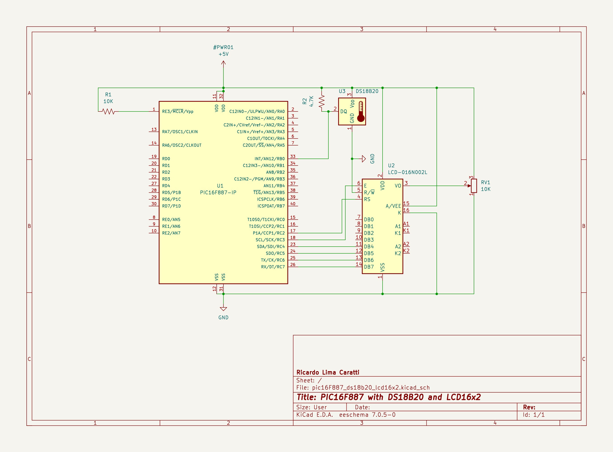
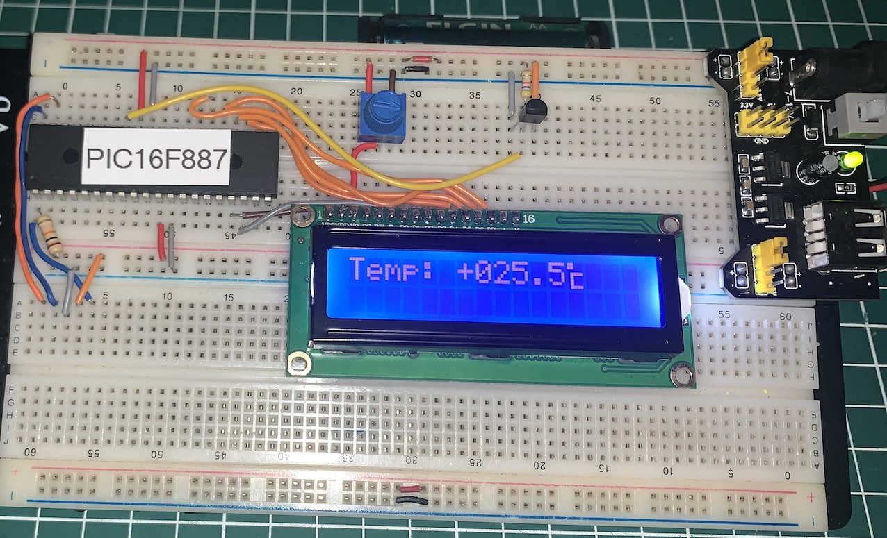

# DS18B20 and PIC16F877


## Content

1. [PIC16F877 and DS18B20 schematic](#pic16f877-and-ds18b20-schematic) 
    * [KiCad Schematic](./KiCad/)
2. [PIC16F877 PINOUT](#pic16f877-pinout)
3. [DS18B20 PINOUT](#ds18b20-pinout)
4. [DS18B20 and PIC16F877 prototype](#ds18b20-and-pic16f877-prototype)
5. [DS18B20 and PIC16F877  C example](#ds18b20-and-pic16f877-c-example)
5. [MPLAB X IDE project](./MPLAB_EXAMPLES/)
6. [References](#references)


## PIC16F877 and DS18B20 schematic




## PIC16F877 PINOUT


## DS18B20 PINOUT


## DS18B20 and PIC16F877 prototype





## DS18B20 and PIC16F877  C example

```cpp

/*
 * PIC16F887 and DS18B20 (1-wire protocol) 
 *
 * Author: Ricardo Lima Caratti
 * Created on February 14, 2024
 */

#include <xc.h>
#include "pic16flcd.h"

#pragma config FOSC = INTRC_NOCLKOUT
#pragma config WDTE = OFF       // Watchdog Timer disabled 
#pragma config PWRTE = OFF      // Power-up Timer disable
#pragma config MCLRE = ON       // MCLR pin function is digital input
#pragma config BOREN = OFF      // Brown-out Reset enabled
#pragma config LVP = OFF        // Low Voltage Programming disabled
#pragma config CPD = OFF        // Data EEPROM Memory Code Protection disabled
#pragma config CP = OFF         // Flash Program Memory Code Protection disabled

#define _XTAL_FREQ 4000000      // Frequency (Clock)


#define DS18B20_INTERFACE_PIN     RB0    // DS18B20 data pin interface    
#define DS18B20_INTERFACE_PIN_IO  TRISB0 // 0 is output and 1 is input
#define OUTPUT  0
#define INPUT   1


// Bitmap for Celsius degree symbol
unsigned char celsiusChar[8] = {
    0b11000, // **
    0b11000, // **  
    0b00000, //
    0b01111, //  ****
    0b01000, //  *
    0b01000, //  *
    0b01000, //  *
    0b01111 //  ****
};

/**
 * Initialize the DS18B20 device and wait for presence information. 
 * Returns 0 if the device is not present or not detected and 1 if the device is present. 
 */
unsigned char ds18b20ResetPresence() {

    DS18B20_INTERFACE_PIN = 0; // Sends reset pulse to the DS18B20 
    DS18B20_INTERFACE_PIN_IO = OUTPUT; // Configures DS18B20_INTERFACE_PIN pin as output
    __delay_us(480); // Waits for 48us
    DS18B20_INTERFACE_PIN_IO = INPUT; // Configures DS18B20_INTERFACE_PIN pin as input
    __delay_us(90); // Waits for 100us and than reads response in DS18B20_INTERFACE_PIN
    if (!DS18B20_INTERFACE_PIN) {
        __delay_us(390); //  
        return 1; // DS18B20 was detected
    }
    return 0; // DS18B20 was not detected
}


void ds18b20WriteByte(uint8_t value) {

    for (uint8_t i = 0; i < 8; i++) {
        uint8_t bitValue = (uint8_t) (value >> i);
        
        DS18B20_INTERFACE_PIN = 0;              
        DS18B20_INTERFACE_PIN_IO = OUTPUT;
        __delay_us(2); // Waits for 2us
        DS18B20_INTERFACE_PIN = (__bit) bitValue;
        __delay_us(70); // Waits 70us

        DS18B20_INTERFACE_PIN_IO = INPUT;
        __delay_us(2);
    }
}


/**
 * Reads a byte from DS18B20
 * @return the read byte
 */
uint8_t ds18b20ReadByte(void) {
    
    uint8_t byteValue = 0;
    uint8_t bitValue;

    for (uint8_t i = 0; i < 8; i++) { 
        DS18B20_INTERFACE_PIN = 0;
        DS18B20_INTERFACE_PIN_IO = OUTPUT; 
        __delay_us(2);
        DS18B20_INTERFACE_PIN_IO = INPUT; 
        __delay_us(6); 
        bitValue = DS18B20_INTERFACE_PIN; 
        __delay_us(90);             
        byteValue |= bitValue << i;
    }
    return byteValue;
}

/**
 * Gets the current temperature from the DS18B20 device
 * @param paramTemp
 * @return 1 if success and 0 if error.
 */
unsigned char ds18b20GetTemperature(uint16_t *paramTemp) {
    
    if (!ds18b20ResetPresence())    // Sends start pulse and gets presence
        return 0;                   // If 0, error (device is not detected)

    ds18b20WriteByte(0xCC);         // Skips ROM command (just one device here))
    ds18b20WriteByte(0x44);         // Sends start dialog command

    while (ds18b20ReadByte() == 0); // Waits for conversion process

    if (!ds18b20ResetPresence())    // Again..  sends start pulse and gets presence
        return 0;                   // Returns 0 if error or device is not detected

    ds18b20WriteByte(0xCC);         
    ds18b20WriteByte(0xBE);         // Sends read current temperature command

    // Gets two bytes from the DS18B20 build the raw temperature information     
    *paramTemp = ds18b20ReadByte();
    *paramTemp |= (uint16_t) (ds18b20ReadByte() << 8);

    return 1; 
}

/**
 * Converts a integer to an array of char
 * @param value     Integer value to be converted
 * @param strValue  point to char array
 * @param len       number of digits to be converted    
 */
void convertToChar(uint16_t value, char *strValue, uint8_t len) {
    char d;
    for (int i = (len - 1); i >= 0; i--) {
        d = value % 10;
        value = value / 10;
        strValue[i] = d + 48;
    }
    strValue[len] = '\0';
}


void main() {
    unsigned char i;
    char strTempValue[10];
    uint16_t ds18b20Temp;

    ANSELH = 0;

    // Define the LCD pin configuration for PIC16F887
    TRISC = 0; // You need to set this register as output
    Lcd_PinConfig lcd = {
        .port = &PORTC, // Assuming you're using PORTC for LCD on PIC16F887
        .rs_pin = 2, // RC2 for RS
        .en_pin = 3, // RC3 for EN
        .d4_pin = 4, // RC4 for D4
        .d5_pin = 5, // RC5 for D5
        .d6_pin = 6, // RC6 for D6
        .d7_pin = 7 // RC7 for D7
    };

    // Initialize the LCD
    Lcd_Init(&lcd);

    // Loading the custom character
    Lcd_CreateCustomChar(&lcd, 0, celsiusChar);

    Lcd_Clear(&lcd);

    // Display message
    Lcd_SetCursor(&lcd, 1, 1);
    Lcd_WriteString(&lcd, "PIC16F887 1-wire");
    Lcd_SetCursor(&lcd, 2, 1);
    Lcd_WriteString(&lcd, "with DS18B20");
    __delay_ms(5000);
    Lcd_Clear(&lcd);


    while (1) {
        
        if (ds18b20GetTemperature(&ds18b20Temp)) {
            if (ds18b20Temp & 0x8000) // check if the temperature is above 0
            {
                strTempValue[0] = '-';
                ds18b20Temp = (~ds18b20Temp) + 1;
            } else strTempValue[0] = '+';
        }
        // Ignore the fractional part and convert the temperature to a string
        convertToChar(ds18b20Temp >> 4, &strTempValue[1], 3);
        strTempValue[4] = '.';
        // Gets the fractional part (resolution: 0,5)        
        strTempValue[5] =  ( (ds18b20Temp & 0B1111 ) > 8)? '5': '0'; 
        strTempValue[6] = '\0';

        Lcd_SetCursor(&lcd, 1, 1);
        Lcd_WriteString(&lcd, "Temp: ");
        Lcd_SetCursor(&lcd, 1, 7);
        Lcd_WriteString(&lcd, strTempValue);
        Lcd_SetCursor(&lcd, 1, 13);
        Lcd_WriteCustomChar(&lcd, 0);

        __delay_ms(2000);
    }
}

```


## REFERENCES


* [1-Wire ® Communication with PIC ® Microcontroller](https://ww1.microchip.com/downloads/en/appnotes/01199a.pdf)
* [The 1-Wire Communication Protocol](http://pic16f628a.blogspot.com/2009/09/1-wire-communication-protocol.html)
* [1-Wire Communication with a Microchip PICmicro Microcontroller](https://pdfserv.maximintegrated.com/en/an/AN2420.pdf)
* [1-wire slave emulator for PIC16 microcontroller – owslave](http://www.fabiszewski.net/1-wire-slave/)
* [Interface PIC MCU with DS18B20 sensor and SSD1306 | mikroC Projects](https://simple-circuit.com/pic-mcu-ds18b20-ssd1306-mikroc/)
* [PIC 1-Wire - Github](https://github.com/robvanbentem/pic-1wire/tree/master) 
* [Interfacing DS18B20 sensor with PIC microcontroller | MPLAB Projects](https://simple-circuit.com/mplab-xc8-ds18b20-pic-microcontroller/)
* [What is the 1-Wire protocol?](https://www.engineersgarage.com/what-is-the-1-wire-protocol/)

### Videos

* [1-Wire® Technology Overview](https://youtu.be/CjH-OztKe00?si=pAX-iU1oLr1Tuirv)
* [1-Wire® Technology Overview - Part 1](https://youtu.be/lsikcaA7q-c?si=Wmx4GoRT0IICpKza)
* [1-Wire® Technology Overview - Part 2](https://youtu.be/e6ORIDKA-QA?si=s8A--7CYRWxi0LlG)
* [1-Wire® Technology Overview - Part 3](https://youtu.be/WtifDKtRFQ4?si=R7ElFn5N9K81oF3Z)

