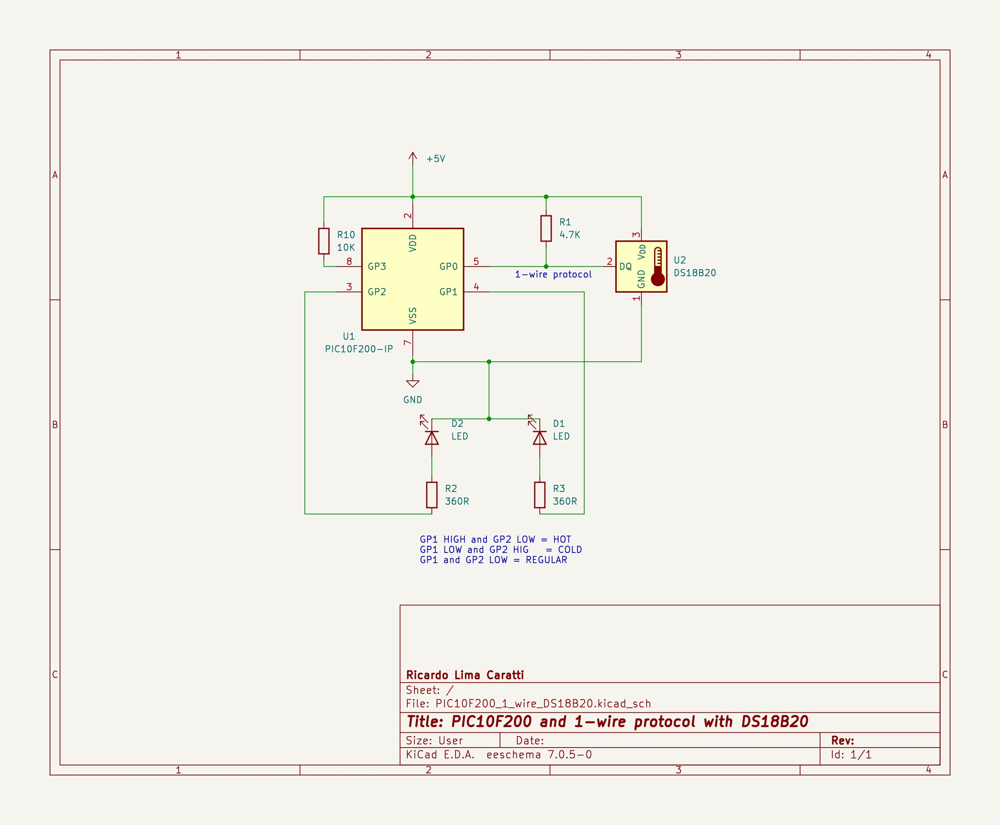
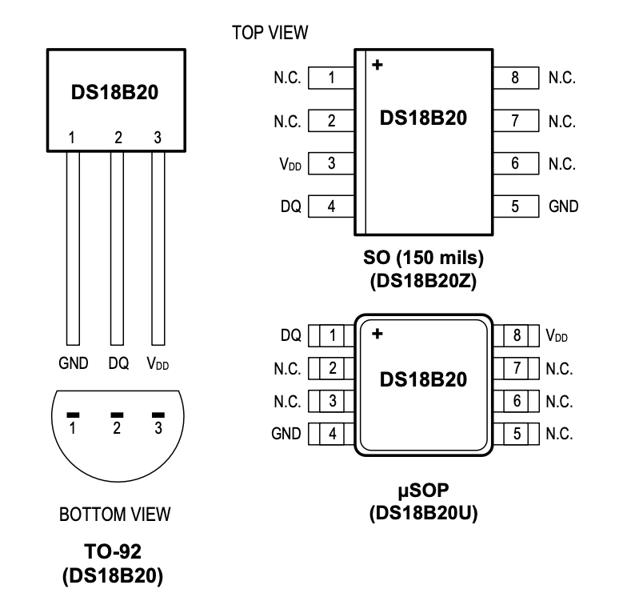

# PIC and 1-wire communication protocol

## UNDER CONSTRUCTION...

### PIC10F200 and DS18B20 schematic

### PIC10F200 PINOUT

### DS18B20 PINOUT

## REFERENCES

* [1-Wire ® Communication with PIC ® Microcontroller](https://ww1.microchip.com/downloads/en/appnotes/01199a.pdf)
* [The 1-Wire Communication Protocol](http://pic16f628a.blogspot.com/2009/09/1-wire-communication-protocol.html)
* [1-Wire Communication with a Microchip PICmicro Microcontroller](https://pdfserv.maximintegrated.com/en/an/AN2420.pdf)
* [1-wire slave emulator for PIC16 microcontroller – owslave](http://www.fabiszewski.net/1-wire-slave/)
* [Interface PIC MCU with DS18B20 sensor and SSD1306 | mikroC Projects](https://simple-circuit.com/pic-mcu-ds18b20-ssd1306-mikroc/)
* [PIC 1-Wire - Github](https://github.com/robvanbentem/pic-1wire/tree/master) 
* [Interfacing DS18B20 sensor with PIC microcontroller | MPLAB Projects](https://simple-circuit.com/mplab-xc8-ds18b20-pic-microcontroller/)

### Videos

* [1-Wire® Technology Overview](https://youtu.be/CjH-OztKe00?si=pAX-iU1oLr1Tuirv)
* [1-Wire® Technology Overview - Part 1](https://youtu.be/lsikcaA7q-c?si=Wmx4GoRT0IICpKza)
* [1-Wire® Technology Overview - Part 2](https://youtu.be/e6ORIDKA-QA?si=s8A--7CYRWxi0LlG)
* [1-Wire® Technology Overview - Part 3](https://youtu.be/WtifDKtRFQ4?si=R7ElFn5N9K81oF3Z)

