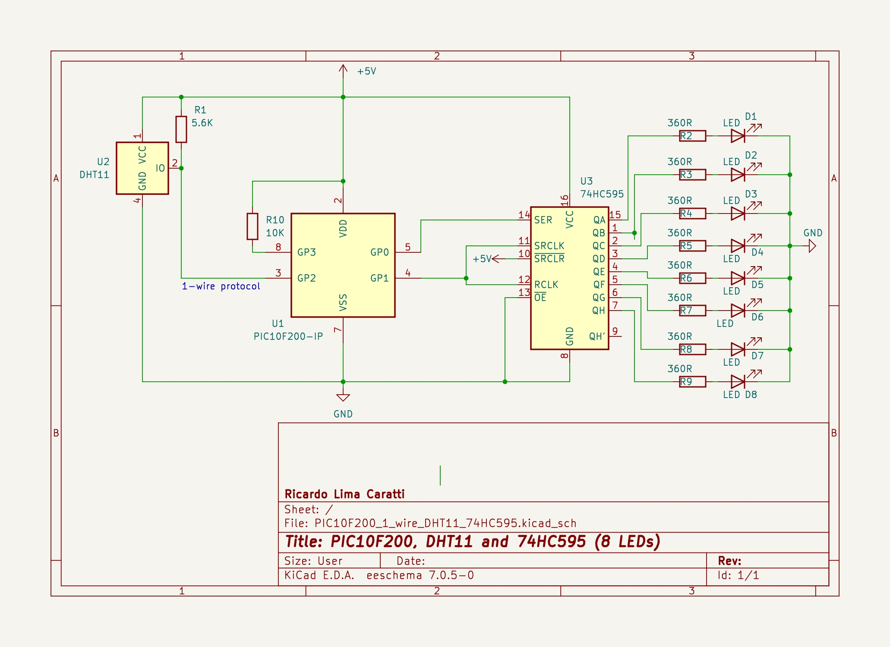

# PIC10F200 and DHT11 example

This foder presents the PIC10F200 working with DHT11 sensor

## Content

1. [Considerations to implement this single-wire protocol ](#considerations-to-implement-this-single-wire-protocol)
2. [Schematic](#pic10f200-and-dht11-schematic)
    * [KiCad schematic](./KiCad/)
3. [MPLAB X IDE project](./MPLAB_EXAMPLE/)    
3. [Referencesw](#references)

## Considerations to implement this single-wire protocol 

Developing the 'single-wire' protocol used by the DHT11 device on the PIC10F200 presents a challenge in several aspects:

* The memory limitation for data (only 16 bytes) complicates the development of a more robust implementation.
* The limited stack capacity, which is only capable of two levels, hampers the creation of more rational and readable code.
* Using the internal oscillator may not provide sufficient precision for time counting, which is a relatively critical feature for implementing this protocol.
* The absence of an 'Open-Drain' GPIO pin may require special attention in circuit design for more critical applications.

## PIC10F200 and DHT11 Schematic 

## References