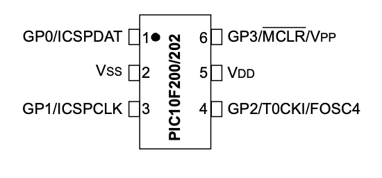
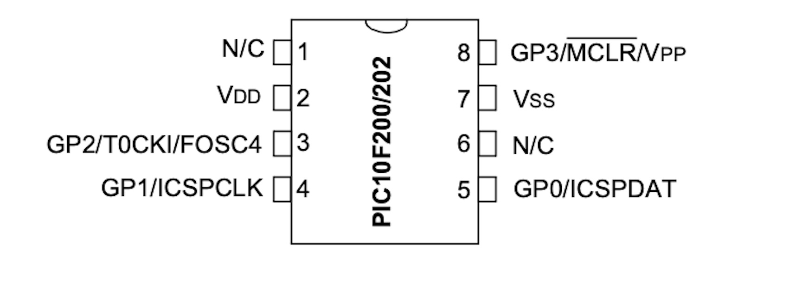
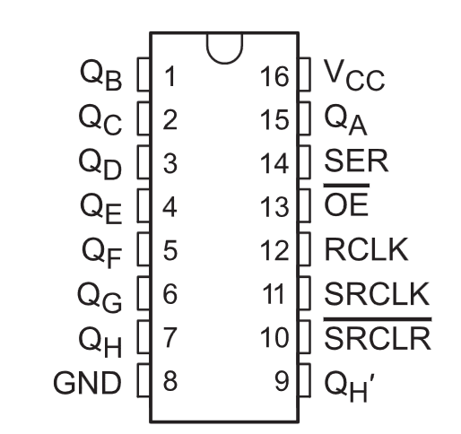

# PIC10F200 and DHT11 example

This project uses a DHT11 sensor to  measure humidity and temperature. This application with the PIC10F100 uses eight LEDs driven by the 74HC595 device to display temperature and humidity. Four LEDs indicate temperature ranges: cold, cool to comfortable, comfortable, and hot. The other four LEDs indicate humidity levels: Low, Moderate, Desirable, and HIGH.  


## Content

1. [Considerations to implement this single-wire protocol ](#considerations-to-implement-this-single-wire-protocol)
2. [Schematic](#pic10f200-and-dht11-schematic)
    * [KiCad schematic](./KiCad/)
3. [PIC10F200 PINOUT](#pic10f200-pinout)    
4. [PIC10F200 with  DHT11 and 74HC595 Assembly code](#pic10f200-with-dht11-and-74hc595-assembly-code)    
5. [MPLAB X IDE project](./MPLAB_EXAMPLE/)    
6. [References](#references)


## Considerations to implement this single-wire protocol 

Developing the 'single-wire' protocol used by the DHT11 device on the PIC10F200 presents a challenge in several aspects:

* The memory limitation for data (only 16 bytes) complicates the development of a more robust implementation.
* The limited stack capacity, which is only capable of two levels, hampers the creation of more rational and readable code.
* Using the internal oscillator may not provide sufficient precision for time counting, which is a relatively critical feature for implementing this protocol.
* The absence of an 'Open-Drain' GPIO pin may require special attention in circuit design for more critical applications.


## PIC10F200 and DHT11 Schematic 


## PIC10F200 PINOUT

### SMD (6-PIN SOT-23)



### 8-PIN PDIP




### 74HC595 PINOUT




## PIC10F200 with  DHT11 and 74HC595 Assembly code

**IMPORTANT:** To assemble this code correctly, please follow the steps below:
1. Go to "Project Properties" in MPLAB X.
2. Select "Global Options" for the pic-as assembler/compiler.
3. In the "Additional Options" box, enter the following parameters: **-Wl,-pAsmCode=0h**

```asm

```


## References