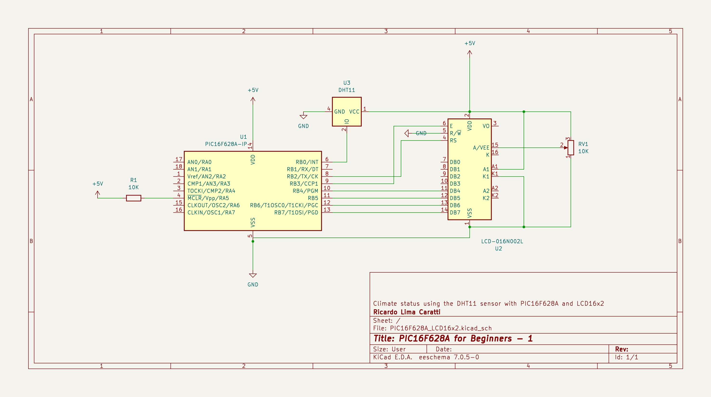
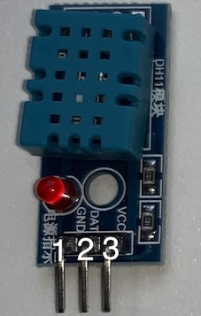

# PIC16F628A and DHT11 example

This project uses a DHT11 sensor to  measure humidity and temperature. This application with the PIC16F628A uses a LCD16x2 to show the current temperature and humidity. 

## Content

1. [Schematic](#pic16f628a-dht11-and-lcd16x2-schematic)
    * [KiCad schematic](./KiCad/)
2. [PIC16F628A PINOUT](#pic16f628a-pinout)    
3. [DHT11 PINOUT](#dht11-pinout)    
4. [MPLAB X IDE project](./MPLAB_EXAMPLE/)    
5. [References](#references)

## PIC16F628A, DHT11 and LCD16x2 Schematic

## PIC16F628A PINOUT

## DHT11 PINOUT 

| PIN # | DESCRIPTION | 
| ----- | ----------- | 
|   1   | GND (-)     | 
|   2   | DATA / SIGNAL | 
|   3   | VCC (+)     | 

## References 

