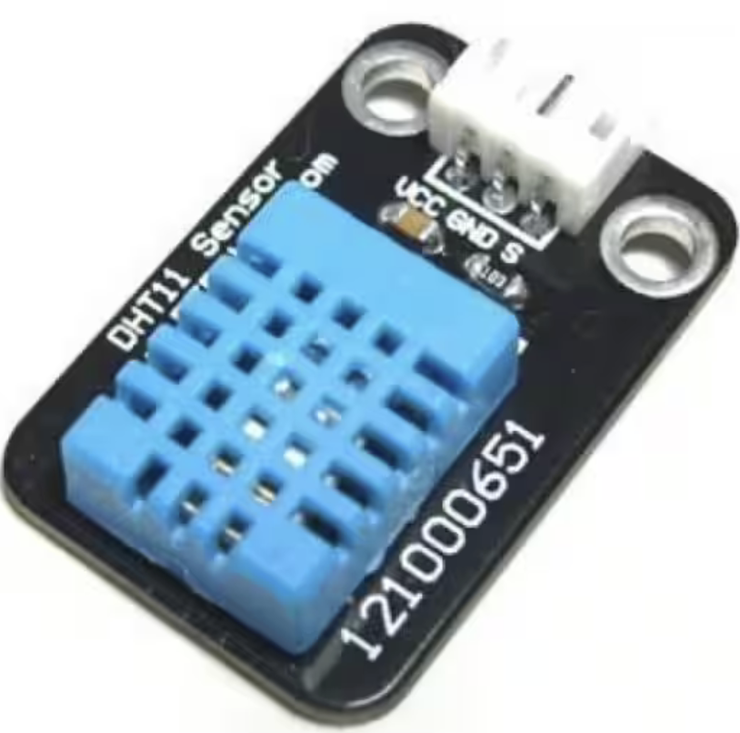

# PIC and DHT11 Interface

The DHT11 is a popular digital temperature and humidity sensor known for its simplicity and cost-effectiveness. It's widely used in hobbyist projects and consumer electronics for basic environmental monitoring. Here are the key features, protocol, interface with PIC microcontrollers, and technical specifications of the DHT11 device:

[Source: the data sheet](https://www.digikey.at/htmldatasheets/production/2071184/0/0/1/dht11-humidity-temp-sensor.html) 

### Features:
- **Integrated Temperature and Humidity Sensor**: Measures ambient temperature and humidity with a single device.
- **Digital Output**: Provides temperature and humidity readings directly as digital data, eliminating the need for analog-to-digital conversion.
- **Low Cost**: Affordable for hobbyists and mass-production applications.
- **Easy to Interface**: Requires only one digital pin for communication.

### Protocol:
The DHT11 uses a proprietary one-wire protocol (not to be confused with the Dallas/Maxim 1-Wire protocol) for communication, which requires precise timing to interpret the data:
- **Start Signal**: The microcontroller sends a start signal by pulling the data line low for at least 18 milliseconds and then high for 20-40 microseconds.
- **Response Signal**: The DHT11 responds with a low signal for 80 microseconds followed by a high signal for 80 microseconds.
- **Data Transmission**: The sensor sends 40 bits of data, including humidity integer and decimal parts, temperature integer and decimal parts, and a checksum. Each bit's duration is determined by the length of the high signal following a common low signal.

### Interface with PIC Microcontrollers:
- **Single Digital Pin**: Connect the DHT11 data pin to a digital I/O pin on the PIC microcontroller. A pull-up resistor (typically 4.7kΩ to 10kΩ) is recommended on the data line.
- **Timing Critical**: Since the DHT11's protocol is timing-sensitive, it's important to disable interrupts on the PIC microcontroller during data transmission to ensure accurate timing.
- **Software Implementation**: Write or use existing libraries that implement the DHT11 protocol, managing the precise timing and data decoding.

### Technical Specifications:
- **Humidity Range**: 20-80% RH with 5% RH accuracy.
- **Temperature Range**: 0-50°C with ±2°C accuracy.
- **Sampling Rate**: Not more than 1 Hz (once every second).
- **Power Supply**: 3 to 5.5V, making it compatible with most microcontrollers, including 3.3V and 5V systems.
- **Physical Size**: Small form factor, though larger than some more advanced sensors like the DHT22 or SHT series.

Overall, the DHT11 is a suitable choice for applications where moderate accuracy and low cost are more critical than precision or advanced features. Its simple interface with PIC and other microcontrollers makes it a popular choice for educational purposes, DIY projects, and simple climate control systems.

## References

1. [DHT11 Data Sheet](https://www.digikey.at/htmldatasheets/production/2071184/0/0/1/dht11-humidity-temp-sensor.html)

2. [PIC16F887 DHT-11 LCD Example Using XC8](https://aki-technical.blogspot.com/2023/12/pic16f887-dht-11-lcd-example-using-xc8.html) 
3. [How to Use a DHT11 with a PIC16F628A and LCD](https://www.allaboutcircuits.com/projects/how-to-use-a-dht11-with-a-pic16f628-and-lcd/)
4. [Interfacing DHT11 with PIC16F877A for Temperature and Humidity Measurement](https://circuitdigest.com/microcontroller-projects/interfacing-dht11-sensor-with-pic16f877a-microcontroller)

