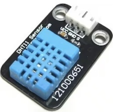

# PIC and DHT11 Interface

This folder presents some applications using PIC microcontrolers with DHT11 device. 

## Content

1. [About DHT11 device](#about-dht11-device)
    * [Features](#features)
    * [Protocol](#protocol)
    * [Interface with PIC Microcontrollers](#interface-with-pic-microcontrollers)
    * [Technical Specifications](#technical-specifications)
2. [About Humidity Levels and Their Effects on Humans](#about-humidity-levels-and-their-effects-on-humans)
3. [Heat Index and thermal Sensation](#heat-index-and-thermal-sensation)
    * [Heat Index](#heat-index)
    * [Thermal Sensation](#thermal-sensation)
    * [Interrelation and Importance](#interrelation-and-importance)
3. [PIC10F200 implementation](./PIC10F200/)
4. [PIC16F628A implementation](./PIC16F628A/)
9. [References](#references) 

## About DHT11 device

The DHT11 is a popular digital temperature and humidity sensor known for its simplicity and cost-effectiveness. It's widely used in hobbyist projects and consumer electronics for basic environmental monitoring. Here are the key features, protocol, interface with PIC microcontrollers, and technical specifications of the DHT11 device:

[Image source: the data sheet](https://www.digikey.at/htmldatasheets/production/2071184/0/0/1/dht11-humidity-temp-sensor.html) 

### Features
- **Integrated Temperature and Humidity Sensor**: Measures ambient temperature and humidity with a single device.
- **Digital Output**: Provides temperature and humidity readings directly as digital data, eliminating the need for analog-to-digital conversion.
- **Low Cost**: Affordable for hobbyists and mass-production applications.
- **Easy to Interface**: Requires only one digital pin for communication.

### Protocol
The DHT11 uses a proprietary one-wire protocol (not to be confused with the Dallas/Maxim 1-Wire protocol) for communication, which requires precise timing to interpret the data:
- **Start Signal**: The microcontroller sends a start signal by pulling the data line low for at least 18 milliseconds and then high for 20-40 microseconds.
- **Response Signal**: The DHT11 responds with a low signal for 80 microseconds followed by a high signal for 80 microseconds.
- **Data Transmission**: The sensor sends 40 bits of data, including humidity integer and decimal parts, temperature integer and decimal parts, and a checksum. Each bit's duration is determined by the length of the high signal following a common low signal.

### Interface with PIC Microcontrollers
- **Single Digital Pin**: Connect the DHT11 data pin to a digital I/O pin on the PIC microcontroller. A pull-up resistor (typically 4.7kΩ to 10kΩ) is recommended on the data line.
- **Timing Critical**: Since the DHT11's protocol is timing-sensitive, it's important to disable interrupts on the PIC microcontroller during data transmission to ensure accurate timing.
- **Software Implementation**: Write or use existing libraries that implement the DHT11 protocol, managing the precise timing and data decoding.

### Technical Specifications
- **Humidity Range**: 20-80% RH with 5% RH accuracy.
- **Temperature Range**: 0-50°C with ±2°C accuracy.
- **Sampling Rate**: Not more than 1 Hz (once every second).
- **Power Supply**: 3 to 5.5V, making it compatible with most microcontrollers, including 3.3V and 5V systems.
- **Physical Size**: Small form factor, though larger than some more advanced sensors like the DHT22 or SHT series.

Overall, the DHT11 is a suitable choice for applications where moderate accuracy and low cost are more critical than precision or advanced features. Its simple interface with PIC and other microcontrollers makes it a popular choice for educational purposes, DIY projects, and simple climate control systems.

## About Humidity Levels and Their Effects on Humans

**Relative Humidity Ranges:**

* **Very Low (below 20%)**:
    * **Effects:** Dry skin, mucosae and eyes, respiratory irritation, increased static electricity, fatigue and difficulty concentrating.
    * **Recommendations:** Humidify the environment with humidifiers, use nasal and eye saline, drink plenty of water and avoid intense physical activity.
* **Low (20% to 30%)**:
    * **Effects:** Increased risk of respiratory diseases, dry mucosae, eye and throat irritation.
    * **Recommendations:** Humidify the environment, drink plenty of water and wash your hands frequently.
* **Moderate (30% to 60%)**:
    * **Effects:** Ideal level for human comfort and health.
    * **Recommendations:** Keep the environment clean and properly ventilated.
* **Desirable (50% to 60%)**:
    * **Effects:** Ideal level for well-being and respiratory health.
    * **Recommendations:** Keep the humidity within this range, especially in environments with air conditioning or heating.
* **High (60% to 70%)**:
    * **Effects:** Discomfort, excessive sweating, fungal and bacterial growth, condensation on walls and furniture.
    * **Recommendations:** Dehumidify the environment with dehumidifiers, ventilate the environment frequently and prevent fungal growth.
* **Very High (above 70%)**:
    * **Effects:** Risk of respiratory diseases, fungal and bacterial growth, deterioration of materials and structures.
    * **Recommendations:** Dehumidify the environment urgently, ventilate the environment frequently and prevent fungal growth.

**Notes:**

* Ideal humidity levels may vary slightly depending on the ambient temperature and individual health.
* It is important to monitor the humidity of the environment with a hygrometer to ensure that it is within the desired levels.
* People with respiratory problems or other health conditions may be more sensitive to humidity levels.

## Heat Index and thermal Sensation

The concept of the "Heat Index" and "Thermal Sensation" plays a crucial role in understanding how humans perceive temperature and the overall impact of environmental heat on the human body. These terms, though closely related, offer distinct perspectives on the interaction between atmospheric conditions and human comfort, health, and behavior.

### Heat Index

The Heat Index, often referred to as the "apparent temperature," is a measure that combines air temperature and relative humidity to determine the human-perceived equivalent temperature. In essence, it attempts to quantify the 'feels-like' temperature, or how hot it really feels to the human body. The rationale behind this measurement is that high humidity levels inhibit the evaporation of sweat, the body's primary mechanism of cooling itself, thereby increasing the perceived temperature.

Developed by George Winterling in 1978 and later refined by the National Weather Service in the United States, the Heat Index uses formulas that approximate the human body's response to varying humidity levels at different temperatures. A higher Heat Index indicates a higher risk of heat-related illnesses, such as heat stroke or heat exhaustion, especially during physical activity or exposure to direct sunlight.

### Thermal Sensation

Thermal Sensation, on the other hand, is a subjective measure of how individuals perceive their thermal environment. It is influenced by a variety of factors, including air temperature, humidity, airflow, clothing insulation, and metabolic heat production. Thermal sensation is often categorized within a range from cold to hot, with descriptors such as "slightly cool," "neutral," "comfortable," "slightly warm," and "hot." The aim is to understand and quantify the subjective experience of thermal comfort or discomfort.

Researchers and environmental psychologists study thermal sensation to design better climate control systems in buildings, improve outdoor urban spaces, and enhance clothing design for various environmental conditions. The Predicted Mean Vote (PMV) model, developed by P.O. Fanger in the 1970s, is a widely used standard to predict the average thermal sensation of a large group of people under specific conditions.

### Interrelation and Importance

The interplay between the Heat Index and Thermal Sensation is pivotal in environmental science, occupational health, urban planning, and climate research. While the Heat Index provides a standardized measure of heat stress on the human body, Thermal Sensation delves into the subjective experience of temperature, offering insights into human comfort levels and preferences.

Understanding both concepts is essential for developing strategies to mitigate heat-related health risks, enhance personal comfort, and inform public health advisories during heatwaves. Moreover, as global temperatures rise due to climate change, the significance of accurately assessing and responding to heat stress and thermal comfort becomes increasingly critical for sustaining human health and well-being in changing environments.

## References

1. [DHT11 Data Sheet](https://www.digikey.at/htmldatasheets/production/2071184/0/0/1/dht11-humidity-temp-sensor.html)

2. [PIC16F887 DHT-11 LCD Example Using XC8](https://aki-technical.blogspot.com/2023/12/pic16f887-dht-11-lcd-example-using-xc8.html) 
3. [How to Use a DHT11 with a PIC16F628A and LCD](https://www.allaboutcircuits.com/projects/how-to-use-a-dht11-with-a-pic16f628-and-lcd/)
4. [Interfacing DHT11 with PIC16F877A for Temperature and Humidity Measurement](https://circuitdigest.com/microcontroller-projects/interfacing-dht11-sensor-with-pic16f877a-microcontroller)

