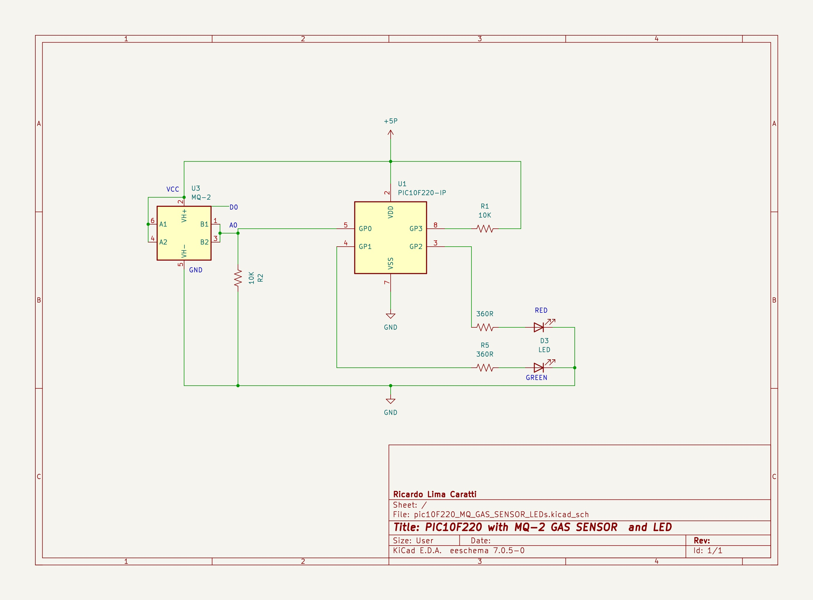

# PIC10F220 and Analog input with MQ-X Gas sensor

When it comes to applications requiring analog input, the PIC10F220 emerges as a superior alternative to the PIC10F200. While inheriting the core features of the PIC10F200, the PIC10F220 distinguishes itself with the inclusion of an Analog-to-Digital Converter (ADC) interface. This addition significantly enhances the PIC10F220's functionality, enabling it to directly read analog signals. Such a capability is crucial for applications where monitoring or measuring analog parameters is essential. 


## Content

1. [PIC10F220 and MQ-X Gas sensor Schematic](#pic10f220-and-mq-x-gas-sensor-schematic)
    * [KiCad Schematic](./KiCad/)
2. [PIC10F220 PINOUT](#pic10f220-pinout)
3. [MQ-X GAS SENSOR PINOUT](#mq-x-gas-sensor-pinout)
4. [ADC with MQ-2 Sensor - example in C](#example-in-c)
5. [ADC with MQ-2 Sensor - example in Assembly](#example-in-assembly)
6. [MPLAB X Assembly and C examples](./MPLAB_EXAMPLES/)
7. [References](#references)


## PIC10F220 and MQ-X Gas sensor SchematiC




## PIC10F220 PINOUT


## MQ-X GAS SENSOR PINOUT


| # | Pin/Part | Description |
|---|---|---|
| 1 | VCC | Power supply (5V) |
| 2 | GND | Ground |
| 3 | Dout (optional) | Digital output (optional) |
| 4 | Aout | Analog output |
| 5 | LED  | Gas indicator | 
| 6 | LED  | Power Supply | 
| 7 | Trim-pot | Tune the sensitivity | 


## Example in C


```cpp
/**
* My PIC Journey  - MQ-2 Gas sensor and PIC10F220
* 
* This application displays three possible situations to represent the gas level: a lit red LED means danger, 
* a blinking green and red LED at the same time means caution or alert, and a lit green LED means safe.    
* 
* ATTENTION: This experiment is solely intended to demonstrate the interfacing of an MQ series gas sensor 
* with PIC microcontrollers. The gas concentration values and thresholds used in the example programs have 
* been arbitrarily set to illustrate high, medium, or low gas concentration levels. However, it is crucial 
* to emphasize that these values may not accurately reflect the real concentrations that pose a health risk. 
* Therefore, if you plan to use the examples provided, it is strongly recommended to consult the gas sensor's Datasheet. 
* This is essential to ascertain the exact values that define dangerous, tolerable, or low gas concentrations.  
* Author: Ricardo Lima Caratti
* Feb/2022
*/
// CONFIG
#pragma config IOSCFS = 4MHZ    // Internal Oscillator Frequency Select bit (4 MHz)
#pragma config MCPU = OFF       // Master Clear Pull-up Enable bit (Pull-up disabled)
#pragma config WDTE = OFF       // Watchdog Timer Enable bit (WDT disabled)
#pragma config CP = OFF         // Code protection bit (Code protection off)
#pragma config MCLRE = OFF      // GP3/MCLR Pin Function Select bit (GP3/MCLR pin function is digital I/O, MCLR internally tied to VDD)

#define _XTAL_FREQ  4000000

#include <xc.h>


void DelayMS(uint8_t param) 
{
    for (uint8_t i = 0; i < param; i ++) {
         for (uint8_t j = 0; j < 255; j ++) {
             asm("nop");
         }
    }
}


uint8_t readADC() {
    ADCON0bits.GO = 1;              // Start conversion
    while (ADCON0bits.GO_nDONE);    // Wait for conversion to finish
    return ADRES;                   // return the ADC 8 bit integer value 255 ~= 5V, 127 ~= 2.5V, ... 0 = 0V
}

void main(void) {

    // bit 7 - ANS1: 0 = GP1/AN1 configured as digital I/O
    // bit 6 - ANS0: 1 = GP0/AN0 configured as an analog input
    // bit 5 - Unimplemented
    // bit 4 - Unimplemented
    // bit 3:2 - CHS<1:0>: ADC Channel Select bits - 00 = Channel00(GP0/AN0)
    // bit 1 - 1 = ADC conversion in progress. Setting this bit starts an ADC conversion cycle.
    // bit 0 - 1 = ADC module is operating
    ADCON0 = 0B01000011;    // See DS41270E-page 30 of the datasheet
    OPTION = 0B10011111;    // See DS40001239F-page 16 of the datasheet
    TRIS = 0B00000001;      // Set GP1 and GP2 as output        

  
    GP1 = 1;  // Green
    GP2 = 0;  // Red  
    while (1) {
        uint8_t gasLevel = readADC();
        if (gasLevel > 210) {
            GP2 = 1;
            GP1 = 0;
        } else if (gasLevel > 127) {
            GP1 = GP2 = 1;
            DelayMS(100);  
            GP1 = GP2 = 0;
        } else {    
            GP2 = 0;
            GP1 = 1;        
        } 
        DelayMS(100);
    }
}

```


## Example in Assembly


```asm

; My PIC Journey  - MQ-2 Gas sensor and PIC10F220
; 
; This application displays three possible situations to represent the gas level: a lit red LED means danger, 
; a blinking green and red LED at the same time means caution or alert, and a lit green LED means safe.    
; 
; ATTENTION: This experiment is solely intended to demonstrate the interfacing of an MQ series gas sensor 
; with PIC microcontrollers. The gas concentration values and thresholds used in the example programs have 
; been arbitrarily set to illustrate high, medium, or low gas concentration levels. However, it is crucial 
; to emphasize that these values may not accurately reflect the real concentrations that pose a health risk. 
; Therefore, if you plan to use the examples provided, it is strongly recommended to consult the gas sensor's Datasheet. 
; This is essential to ascertain the exact values that define dangerous, tolerable, or low gas concentrations.  
; Author: Ricardo Lima Caratti
; Feb/2022  
; IMPORTANT: If you are using the PIC10F220, to assemble this code correctly, please follow the steps below:
; 1. Go to "Project Properties" in MPLAB X.
; 2. Select "Global Options" for the pic-as assembler/compiler.
; 3. In the "Additional Options" box, enter the following parameters:
; -Wl,-pAsmCode=0h
    
#include <xc.inc>
  
; CONFIG
  CONFIG  IOSCFS = 4MHZ         ; Internal Oscillator Frequency Select bit (4 MHz)
  CONFIG  MCPU = OFF            ; Master Clear Pull-up Enable bit (Pull-up disabled)
  CONFIG  WDTE = OFF            ; Watchdog Timer Enable bit (WDT disabled)
  CONFIG  CP = OFF              ; Code protection bit (Code protection off)
  CONFIG  MCLRE = ON            ; GP3/MCLR Pin Function Select bit (GP3/MCLR pin function is MCLR)

; Declare your variables here

counter1	equ	0x10
counter2	equ	0x11
adcValue	equ	0x12	
	
	 
PSECT AsmCode, class=CODE, delta=2

MAIN:
    ; ADCON0 register setup 
    ; bit 7 - ANS1: 0 = GP1/AN1 configured as digital I/O
    ; bit 6 - ANS0: 1 = GP0/AN0 configured as an analog input
    ; bit 5 - Unimplemented
    ; bit 4 - Unimplemented
    ; bit 3:2 - CHS<1:0>: ADC Channel Select bits - 00 = Channel00(GP0/AN0)
    ; bit 1 - 1 = ADC conversion in progress. Setting this bit starts an ADC conversion cycle.
    ; bit 0 - 1 = ADC module is operating
    movlw   0B01000011
    movwf   ADCON0	; See DS41270E-page 30 datasheet 
    
    ; OPTION register setup 
    ; Prescaler Rate: 256
    ; Prescaler assigned to the WDT
    ; Increment on high-to-low transition on the T0CKI pin
    ; Transition on internal instruction cycle clock, FOSC/4
    ; GPPU disbled 
    ; GPWU disabled
    movlw   0B10011111	    	 
    OPTION		; See DS40001239F-page 16 datasheet 
    
    ; GP0 is input, GP1, GP2 are output
    movlw   0B00000001
    TRIS    GPIO
MainLoop:		    ; Endless loop
    call    AdcRead
    movlw   210		    ; If > 210, Dangerous
    subwf   adcValue, w
    btfss   STATUS, 0
    goto    CheckAttention
Dangerous:
    bsf	    GPIO, 2
    bcf	    GPIO, 1
    goto    MainLoopContinue
CheckAttention: 
    movlw   127		    ; If > 127 and < 210, Attention
    subwf   adcValue, w
    btfss   STATUS, 0
    goto    Safe
    call    BlinkAttention  ; Blink green and red LEDs at the same time  
    goto    MainLoop
Safe: 
    bsf	    GPIO, 1
    bcf	    GPIO, 2
MainLoopContinue: 
   movlw    255 
   call	    DelayMS  
   goto	    MainLoop
    
 
   
; ******** ADC Read ************
; Read the analog value from GP0
; Return the value in adcValue   
AdcRead: 
    bsf	  ADCON0, 1		; Start convertion  (set bit 1 to high)
WaitConvertionFinish:		; do while the bit 1 of ADCON0 is 1 
    btfsc  ADCON0, 1		; Bit Test, Skip if Clear - If bit 1 in ADCON0 is '1', the next instruction is executed.
    goto   WaitConvertionFinish 
    
    movf  ADRES, w		
    movwf adcValue		; 
    retlw 0
    
; ******* BLINK ATTENTION
;     
BlinkAttention: 
    bsf	    GPIO, 1
    bsf	    GPIO, 2
    movlw   100
    call    DelayMS
    bcf	    GPIO, 1
    bcf	    GPIO, 2    
    movlw   100
    call    DelayMS  
    retlw   0
   
    
; ***********************    
; It takes about WREG * 255us
DelayMS:
    movwf   counter1
DelayMS_01:
    movlw   255
    movwf   counter2
DelayMS_02: 
    goto $+1
    goto $+1
    goto $+1
    goto $+1
    decfsz  counter2, f
    goto    DelayMS_02
    decfsz  counter1, f
    goto    DelayMS_01
    
    retlw   0    
        
    
END MAIN

```


## Contribution

If you've found value in this repository, please consider contributing. Your support will assist me in acquiring new components and equipment, as well as maintaining the essential infrastructure for the development of future projects. [Click here](https://www.paypal.com/donate/?business=LLV4PHKTXC4JW&no_recurring=0&item_name=Your+support+will+assist+me+in++maintaining+the+essential+infrastructure+for+the+development+of+future+projects.+&currency_code=BRL) to make a donation or scan the QR code provided below. 


## REFERENCES

* [PIC10F220/222 Data Sheet](https://ww1.microchip.com/downloads/en/DeviceDoc/41270E.pdf)