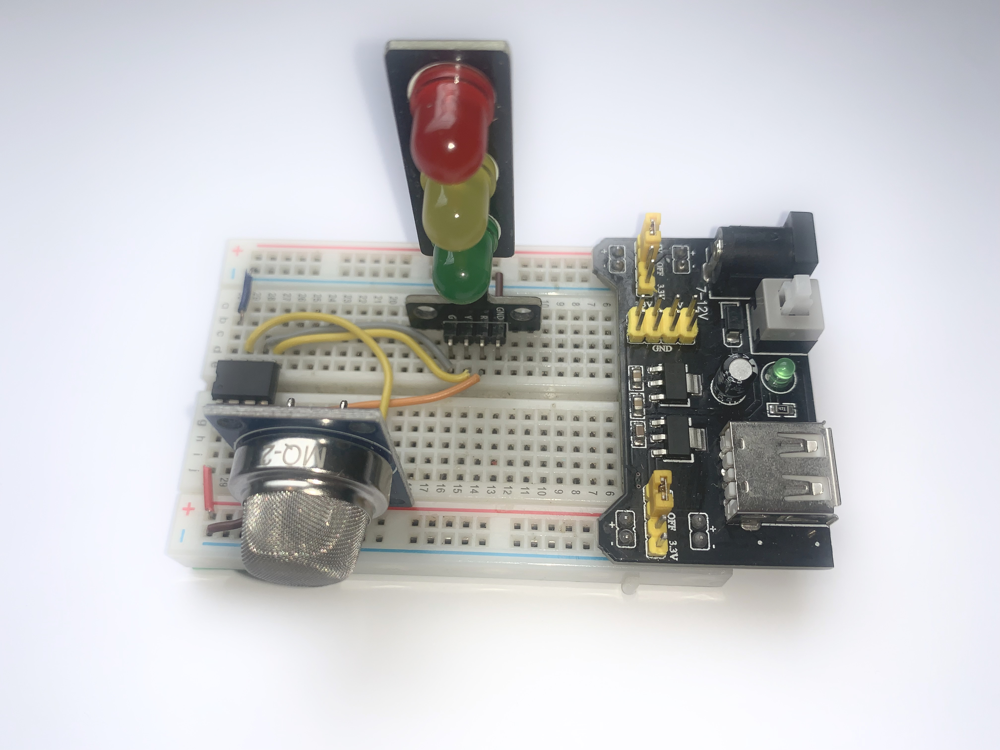

# PIC12F675 GAS SENSOR EXAMPLE

The utilization of the PIC12F675 microcontroller, designed by Microchip Technology, in conjunction with gas sensors from the MQ series, is a strategic choice for several reasons. This microcontroller is particularly well-suited for experiments and projects involving gas detection due to its integrated analog interfaces—specifically, its analog-to-digital converter (ADC) pins. These features make it an ideal candidate for interfacing with MQ gas sensors, which output analog signals correlating to gas concentrations.

Additionally, the PIC12F675's low power consumption makes it an excellent choice for battery-operated or energy-efficient designs. This is a significant advantage in portable gas detection devices or in situations where power availability is limited. Its ability to operate in a power-saving mode extends the battery life of the device, making it more reliable and practical for long-term monitoring tasks.

## Content

1. [PIC12F675, MQ-2 gas sensor and LED schematic](#pic12f675-mq-2-gas-sensor-and-led-schematic)
    * [KiCad Schematic](./KiCad/)
2. [PIC12F675 PINOUT](#pic12f675-pinout)
3. [Prototype](#pic12f675-mq-2-gas-sensor-and-led-prototype)
4. [MQ-2 PINOUT](#mq-2-pinout)
5. [MPLAB PROJECT](./MPLAB_EXAMPLES/)
6. [Video](https://youtu.be/x1buKJnA5Jw?si=tq8vAmBw3GzhiSSb)
7. [References](#references)

**ATTENTION:** This experiment is solely intended to demonstrate the interfacing of an MQ series gas sensor with PIC microcontrollers. The gas concentration values and thresholds used in the example programs have been arbitrarily set to illustrate high, medium, or low gas concentration levels. However, it is crucial to emphasize that these values may not accurately reflect the real concentrations that pose a health risk. Therefore, if you plan to use the examples provided, it is strongly recommended to consult the gas sensor's Datasheet. This is essential to ascertain the exact values that define dangerous, tolerable, or low gas concentrations.

## PIC12F675, MQ-2 gas sensor and LED schematic

## PIC12F675 PINOUT

## MQ-2 PINOUT

| # | Pin/Part | Description |
|---|---|---|
| 1 | VCC | Power supply (5V) |
| 2 | GND | Ground |
| 3 | Dout (optional) | Digital output (optional) |
| 4 | Aout | Analog output |
| 5 | LED  | Gas indicator | 
| 6 | LED  | Power Supply | 
| 7 | Trim-pot | Tune the sensitivity | 

## PIC12F675, MQ-2 gas sensor and LED prototype

## References

* [Introduction to Gas Sensors: Construction Types and Working ](https://components101.com/articles/introduction-to-gas-sensors-types-working-and-applications)
* [What is a Gas Sensor: Working and Types](https://wiki.dfrobot.com/What_is_a_Gas_Sensor)
* [Gas detector](https://en.wikipedia.org/wiki/Gas_detector)

