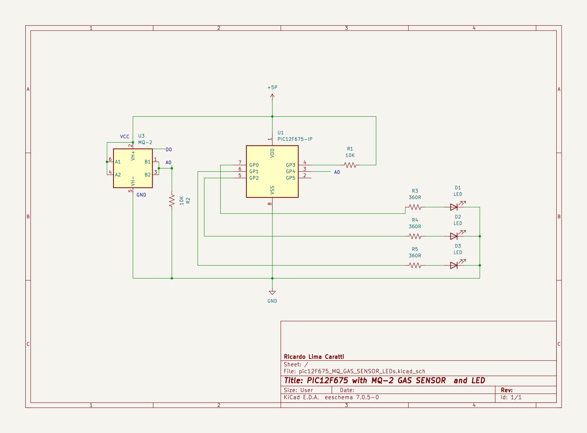

# PIC12F675 GAS SENSOR EXAMPLE

UNDER CONSTRUCTION...

## PIC12F675, MQ-2 gas sensor and LED schematic

## PIC12F675 PINOUT

## MQ-2 PINOUT

| # | Pin/Part | Description |
|---|---|---|
| 1 | VCC | Power supply (5V) |
| 2 | GND | Ground |
| 3 | Dout (optional) | Digital output (optional) |
| 4 | Aout | Analog output |
| 5 | LED  | Gas indicator | 
| 6 | LED  | Power Supply | 
| 7 | Trim-pot | Tune the sensitivity | 

