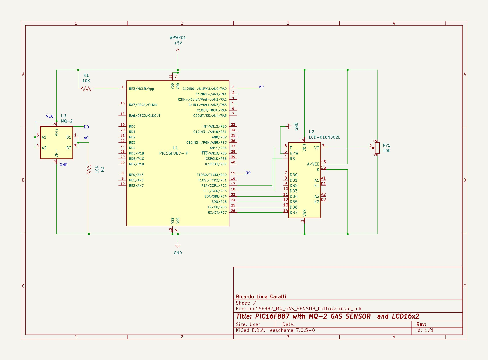
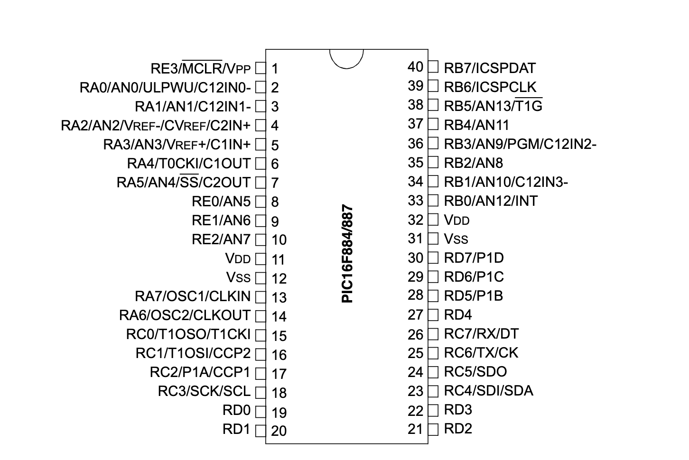
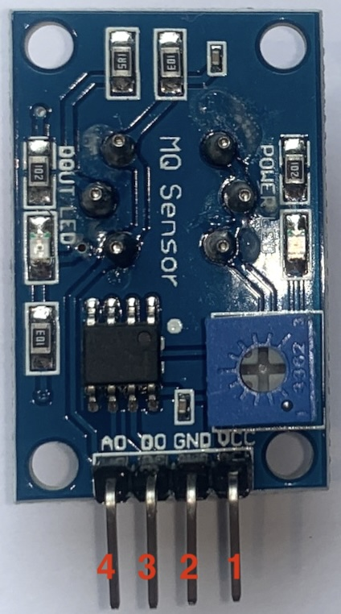
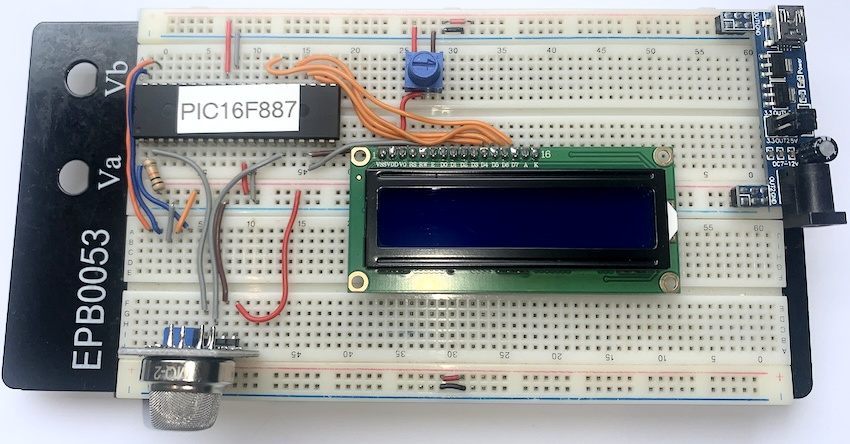

# PIC16F887 GAS SENSOR

## Content

1. [PIC16F877 and MQ-2 schematic](#pic16f877-and-mq-2-schematic) 
    * [KiCad Schematic](./KiCad/)
2. [PIC16F877 PINOUT](#pic16f877-pinout)
3. [Prototype](#prototype---pic16f887-mq-2-gas-sensor-and-lcd16x2)
5. [MPLAB X IDE project](./MPLAB_EXAMPLE/)
6. [References](#references)

## PIC16F877 and MQ-2 schematic

## PIC16F877 PINOUT

## MQ-2 PINOUT

| # | Pin/Part | Description |
|---|---|---|
| 1 | VCC | Power supply (5V) |
| 2 | GND | Ground |
| 3 | Dout (optional) | Digital output (optional) |
| 4 | Aout | Analog output |
| 5 | LED  | Gas indicator | 
| 6 | LED  | Power Supply | 
| 7 | Trim-pot | Tune the sensitivity | 

## Prototype - PIC16F887, MQ-2 gas sensor and LCD16x2

## References

* [Introduction to Gas Sensors: Construction Types and Working ](https://components101.com/articles/introduction-to-gas-sensors-types-working-and-applications)
* [What is a Gas Sensor: Working and Types](https://wiki.dfrobot.com/What_is_a_Gas_Sensor)
* [Gas detector](https://en.wikipedia.org/wiki/Gas_detector)
