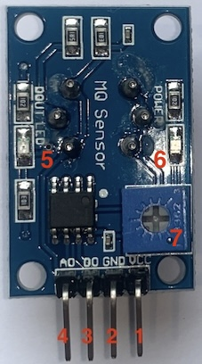

# PIC16F887 GAS SENSOR

## Content

1. [PIC16F877 and DS18B20 schematic](#pic16f877-and-ds18b20-schematic) 
    * [KiCad Schematic](./KiCad/)
2. [PIC16F877 PINOUT](#pic16f877-pinout)
5. [MPLAB X IDE project](./MPLAB_EXAMPLE/)
6. [References](#references)

## PIC16F877 and DS18B20 schematic

## PIC16F877 PINOUT

## MQ-2 PINOUT

| # | Pin/Part | Description |
|---|---|---|
| 1 | VCC | Power supply (5V) |
| 2 | GND | Ground |
| 3 | Dout (optional) | Digital output (optional) |
| 4 | Aout | Analog output |
| 5 | LED  | Gas indicator | 
| 6 | LED  | Power Supply | 
| 7 | Trim-pot | Tune the sensitivity | 

## References
