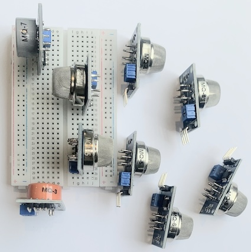

# PIC interface with MQ series of gas sensor

The projects presented in this folder involve the use of MQ series gas sensors. Most of these sensors have a digital and analog interface with the microcontroller. For this reason, to get the most out of these sensors, it is recommended that the microcontroller have digital and analog pins.

## Content

1. [How MQ Series Gas Sensors Work](#how-mq-series-gas-sensors-work)
    * [Main MQ series of sensors](#main-mq-series-of-sensors)
    * [PINOUT and interface](#pinout-and-interface)
    * [Interfacing](#interfacing)
2. [PIC10F]()
3. [PIC12F]()
3. [PIC16F887]()     
3. [References](#references)

## How MQ Series Gas Sensors Work

MQ series gas sensors are a type of metal oxide semiconductor (MOS) gas sensor. They work by detecting changes in the conductivity of a metal oxide semiconductor layer when exposed to certain gases.

The sensor consists of a sensing element, a heater, and a load resistor. The sensing element is made of a metal oxide semiconductor material, such as tin dioxide (SnO2). The heater is used to heat the sensing element to a specific temperature, typically around 200°C. When the sensor is exposed to a gas, the gas molecules react with the oxygen ions on the surface of the sensing element. This reaction changes the conductivity of the sensing element, which is measured by the load resistor.

The change in conductivity is proportional to the concentration of the gas present in the air. The higher the concentration of the gas, the greater the change in conductivity. The output voltage of the sensor is also proportional to the concentration of the gas.

MQ series gas sensors can be used to detect a wide variety of gases, including:

* **Liquefied petroleum gas (LPG)**
* **Methane**
* **Hydrogen**
* **Carbon monoxide**
* **Alcohol**
* **Ozone**
* **Ammonia**

These sensors are commonly used in various applications, including:

* **Gas leak detection**
* **Air quality monitoring**
* **Industrial safety**
* **Environmental monitoring**

**Advantages of MQ series gas sensors:**

* Low cost
* Easy to use
* Wide range of gas detection
* High sensitivity

**Disadvantages of MQ series gas sensors:**

* Cross-sensitivity to other gases
* Affected by temperature and humidity
* Limited lifespan

###  Main MQ series of sensors

| Sensor | Function |
|---|---|
| MQ-2 | Liquefied petroleum gas (LPG), methane, hydrogen, smoke |
| MQ-3 | Alcohol |
| MQ-4 | Methane, butane |
| MQ-5 | LPG, propane, butane, natural gas |
| MQ-6 | LPG, propane, butane |
| MQ-7 | Carbon monoxide |
| MQ-8 | Hydrogen |
| MQ-9 | Carbon monoxide |
| MQ-131 | Ozone |
| MQ-135 | Ammonia, benzene, ethylenediamine |
| MQ-137  | Ammonia |
| MG-811  | Carbon Dioxide | 

While these sensors are advertised for specific gases, they often have some cross-sensitivity to other gases. This means they might react to the presence of a gas other than their target gas as well, which can lead to inaccurate readings. It's crucial to consider this limitation when using these sensors and interpret the results with caution.

Additionally, some manufacturers might offer other sensors in the MQ series with different functionalities. It's best to check the datasheet of the specific sensor you are using to confirm its intended purpose and operating characteristics.

### PINOUT and interface

The interface and pinout of the MQ series gas sensors are generally the same across all models. Here's a breakdown:

**Pins:**

* **VCC:** Power supply pin (**5V**)
* **GND:** Ground pin ( **GND**)
* **Aout:** Analog output pin, provides an analog voltage signal that varies depending on the gas concentration. This pin is typically connected to an analog input pin of your microcontroller.
* **Dout (optional):** Digital output pin (not present on all models), provides a digital signal (high or low) indicating the presence or absence of gas exceeding a certain threshold. This pin can be connected to a digital input pin of your microcontroller for simpler detection scenarios.

## Pinout Summarizing 

| # | Pin/Part | Description |
|---|---|---|
| 1 | VCC | Power supply (5V) |
| 2 | GND | Ground |
| 3 | Dout (optional) | Digital output (optional) |
| 4 | Aout | Analog output |
| 5 | LED  | Gas indicator | 
| 6 | LED  | Power Supply | 
| 7 | Trim-pot | Tune the sensitivity | 

### Interfacing

These sensors are generally easy to interface with microcontrollers like Arduino. Here's a basic connection guide:

1. Connect the **VCC** pin of the sensor to the **5V**.
2. Connect the **GND** pin of the sensor to the **GND**.
3. Connect the **Aout** pin of the sensor to an analog input pin.
4. If your sensor has a **Dout** pin and you want to use it, connect it to a digital input pin.

## References

* [Introduction to Gas Sensors: Construction Types and Working ](https://components101.com/articles/introduction-to-gas-sensors-types-working-and-applications)
* [What is a Gas Sensor: Working and Types](https://wiki.dfrobot.com/What_is_a_Gas_Sensor)
* [Gas detector](https://en.wikipedia.org/wiki/Gas_detector)
