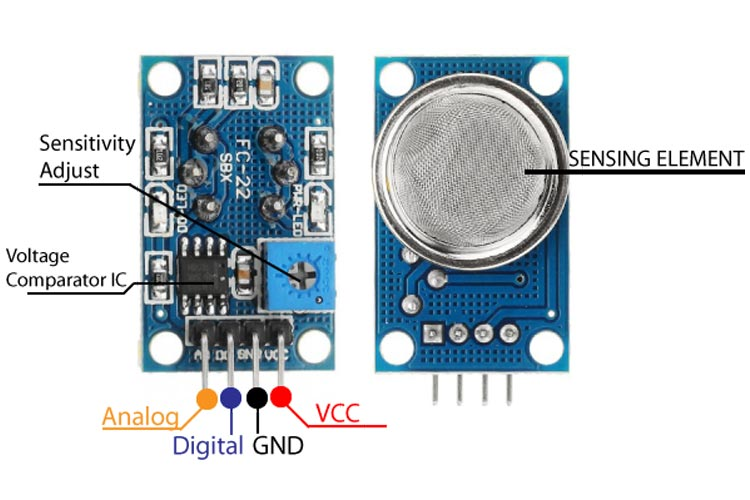

# PIC interface with MQ series of gas sensor

| Sensor | Function |
|---|---|
| MQ-2 | Liquefied petroleum gas (LPG), methane, hydrogen, smoke |
| MQ-3 | Alcohol |
| MQ-4 | Methane, butane |
| MQ-5 | LPG, propane, butane, natural gas |
| MQ-6 | LPG, propane, butane |
| MQ-7 | Carbon monoxide |
| MQ-8 | Hydrogen |
| MQ-9 | Carbon monoxide |
| MQ-131 | Ozone |
| MQ-135 | Ammonia, benzene, ethylenediamine |

While these sensors are advertised for specific gases, they often have some cross-sensitivity to other gases. This means they might react to the presence of a gas other than their target gas as well, which can lead to inaccurate readings. It's crucial to consider this limitation when using these sensors and interpret the results with caution.

Additionally, some manufacturers might offer other sensors in the MQ series with different functionalities. It's best to check the datasheet of the specific sensor you are using to confirm its intended purpose and operating characteristics.

# PINOUT and interface

[source: https://components101.com/sensors/mq8-hydrogen-gas-sensor-pinout-features-datasheet-working-alternative-application](https://components101.com/sensors/mq8-hydrogen-gas-sensor-pinout-features-datasheet-working-alternative-application)

The interface and pinout of the MQ series gas sensors are generally the same across all models. Here's a breakdown:

**Pins:**

* **VCC:** Power supply pin, typically connected to the **5V** pin of your microcontroller (e.g., Arduino).
* **GND:** Ground pin, connected to the **GND** pin of your microcontroller.
* **Aout:** Analog output pin, provides an analog voltage signal that varies depending on the gas concentration. This pin is typically connected to an analog input pin of your microcontroller.
* **Dout (optional):** Digital output pin (not present on all models), provides a digital signal (high or low) indicating the presence or absence of gas exceeding a certain threshold. This pin can be connected to a digital input pin of your microcontroller for simpler detection scenarios.

## Pinout Summarizing 

| Pin | Description |
|---|---|
| VCC | Power supply (5V) |
| GND | Ground |
| Aout | Analog output |
| Dout (optional) | Digital output (optional) |

**Image of MQ gas sensor pinout:**

## Interfacing

These sensors are generally easy to interface with microcontrollers like Arduino. Here's a basic connection guide:

1. Connect the **VCC** pin of the sensor to the **5V**.
2. Connect the **GND** pin of the sensor to the **GND**.
3. Connect the **Aout** pin of the sensor to an analog input pin.
4. If your sensor has a **Dout** pin and you want to use it, connect it to a digital input pin.

