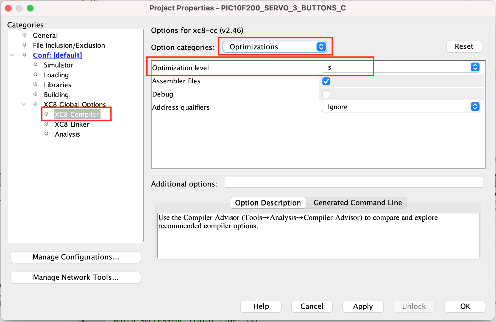

# IMPORTANT: 

In most of the C implementations carried out in this repository, the optimization option used was 's' (Os). The following figure illustrates how to configure this option in MPLAB X. It is important to note that, in rare situations, the optimization option may improperly alter the program's behavior, leading to an unexpected result. However, the 's' (Os)  option proved to be stable in all experiments in this repository.

## C/XC8 optimization levels

In the MPLAB X environment by Microchip, used for developing applications for PIC microcontrollers among others, the C compiler offers different optimization levels that adjust how code is compiled to enhance performance or reduce code size. These optimization levels are specified by numbers (0, 1, 2, 3) and a letter ('s'), each with its own characteristics and purposes. Here's a summary of each optimization level:

### Level 0 (O0)
* **Description**: This is the default optimization level when optimization is turned off.
* **Characteristics**: The compiler performs a quick compilation without focusing on optimization, resulting in code that is easier to debug because the structure of the generated code closely matches the source code.

### Level 1 (O1)
* **Description**: This level seeks a balance between compilation time and optimization, applying optimizations that do not require significant compilation time.
* **Characteristics**: It carries out basic code optimizations to improve speed and/or reduce code size without significantly increasing compilation time. This level may include optimizations such as dead code elimination and loop optimization.

### Level 2 (O2)
* **Description**: At this level, the compiler applies more aggressive optimizations that can increase compilation time but aim for better code performance at the expense of compilation time.
* **Characteristics**: Includes all optimizations from level O1, plus more advanced ones like function call optimizations, better register allocation, and pipeline optimizations, aiming for faster program execution.

### Level 3 (O3)
* **Description**: O3 is the highest level of optimization, focused on maximizing program speed.
* **Characteristics**: Besides the optimizations from level O2, this level may restructure loops, unroll loops, and use more complex algorithms for optimizations. Code size may increase as a result of these optimizations.

### Level 's' (Os)
* **Description**: This level is specific to size optimization, aiming to reduce the code size as much as possible.
* **Characteristics**: The focus is on minimizing the final code size, which can be crucial for devices with limited memory. This might include aggressive dead code elimination, merging of similar functions, and other size reduction techniques.

Each optimization level serves a specific purpose, and the choice of the appropriate level depends on the project goals, whether to maximize speed, minimize code size, or find a balance between both. Adjusting the optimization level can significantly impact the performance and size of the code generated by the compiler.
